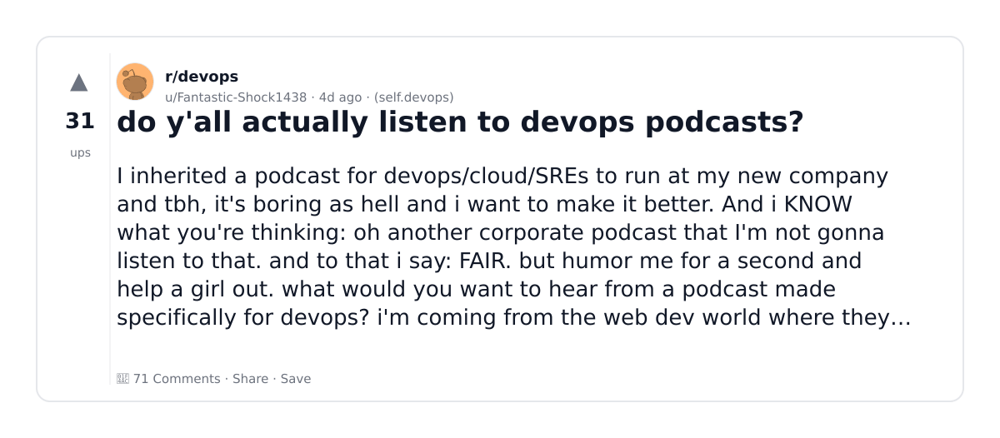
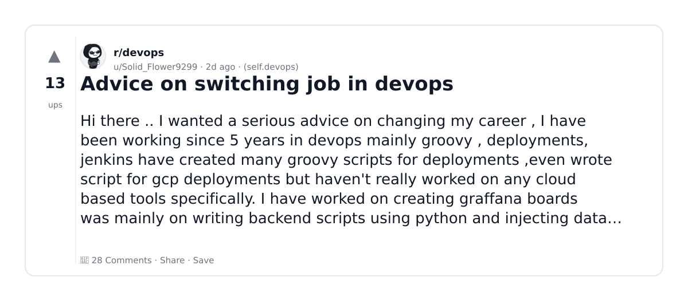
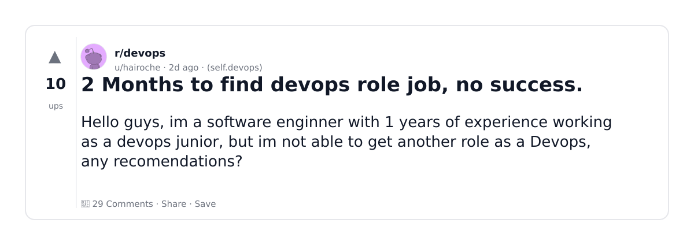
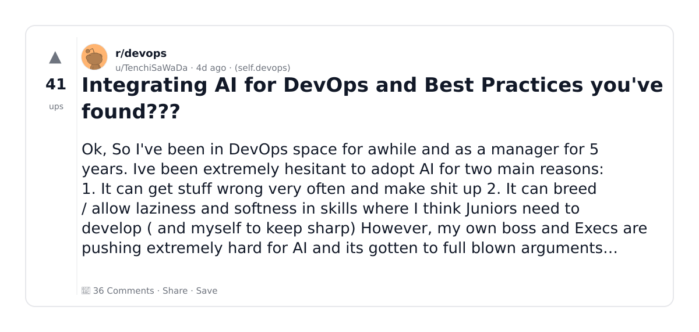
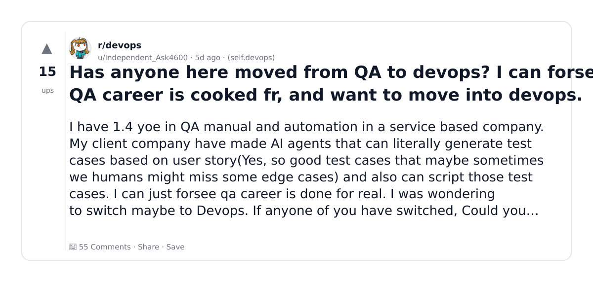
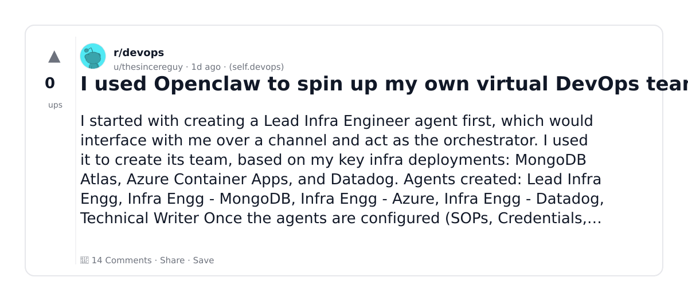
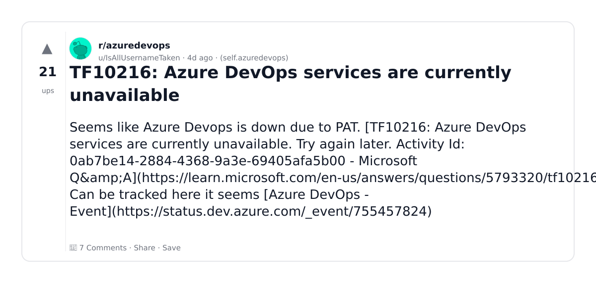
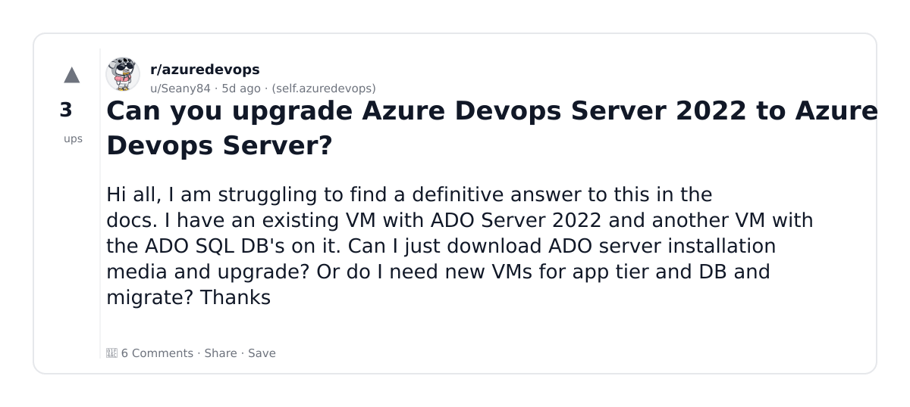
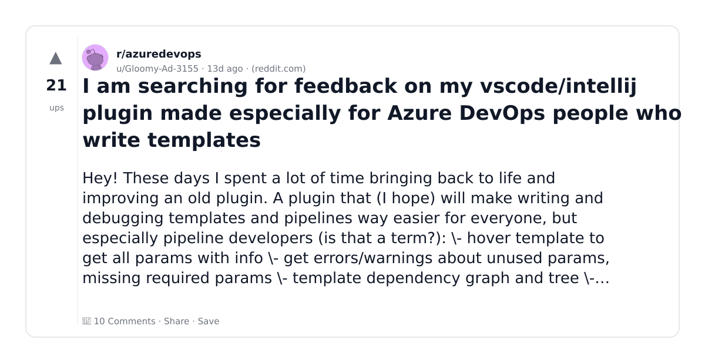
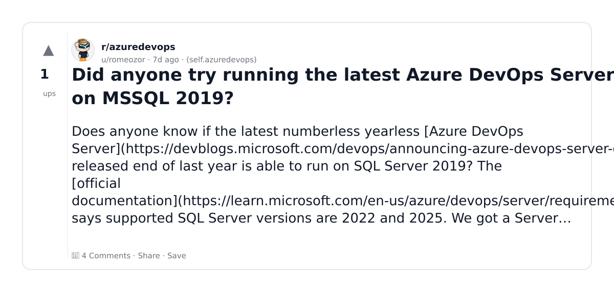

# Reddit Scout — AI and DevOps

Run: 2026-03-06T10-24-05-059Z
Started: 2026-03-06T10:24:05.059Z
Output dir: /home/ubuntu/.openclaw/workspace/reddit-scout/ai-and-devops/runs/2026-03-06T10-24-05-059Z

Config: topN=10 | subLimit=8 | kinds=top,hot,rising | time=week | limitPerListing=25
Search: AI and DevOps (sort=top t=auto)

## Top terms (from titles + top comments)

- devops (24)
- azure (11)
- what (11)
- more (10)
- have (9)
- server (7)
- code (7)
- work (6)
- years (6)
- will (6)
- learn (6)
- want (5)
- people (5)
- write (5)
- when (5)
- cloud (5)
- same (5)
- experience (5)

## Viral content ideas (derived from these posts)

**1. Personal story → timeline + receipts**
- Hook: Hook with 1 line, then a 5-step timeline; end with the lesson and what you would do differently.

**2. My devops got automated: what I automated back (tools + workflow)**
- Hook: Turn it into a before/after workflow post. Include exact tool stack + steps.

**3. Checklist: how to stay valuable when azure hits your team**
- Hook: A numbered checklist (10 items). Make it practical: skills, portfolio, outreach, proof-of-work.

**4. Hot take: what isn't the problem — more is**
- Hook: Contrarian framing. Back it with 2 examples from the top posts and 1 counterexample.

**5. Debunk thread: "AI will replace have" vs what's actually happening**
- Hook: Use 3 claims → 3 rebuttals. Cite specific post patterns: layoffs, hiring freezes, role shifts.

**6. Salary/market reality: server vs code roles in 2026 (Reddit signals)**
- Hook: Summarize demand signals from comments: who is struggling, who is fine, why.

**7. "What would you do in 30 days?" layoff recovery plan (day-by-day)**
- Hook: 30-day plan: portfolio, interview loops, networking, mental health. Include a downloadable checklist.

**8. Mini-case study: 1 resume bullet → 1 proof project using work**
- Hook: Show how to convert a vague resume claim into a measurable project + writeup.

**9. Community question: which tasks should *never* be delegated to AI?**
- Hook: Ask + give your own top 5. Encourage replies; add a poll if your platform supports it.

**10. Template post: "I used AI to do X, got Y result, here's the exact prompt"**
- Hook: Make it reproducible: prompt, inputs, outputs, gotchas.

**11. Data post: a quick scorecard of the top threads (ups, comments, ratio) + what it signals**
- Hook: Table or bullets; then 3 takeaways.

**12. Meme angle (if relevant): years vs will — job search edition**
- Hook: If your niche is not memes, skip memes; otherwise caption the pattern you saw in comments.

## Top posts (10) + cards

### 1) do y'all actually listen to devops podcasts?
- Subreddit: r/devops
- Viral score: 2 | Ups: 31 | Comments: 71 | Upvote ratio: 74%
- Link: https://www.reddit.com/r/devops/comments/1rj5izi/do_yall_actually_listen_to_devops_podcasts/
- Card (local): ./cards/1rj5izi.png

### 2) Advice on switching job in devops
- Subreddit: r/devops
- Viral score: 2 | Ups: 13 | Comments: 28 | Upvote ratio: 81%
- Link: https://www.reddit.com/r/devops/comments/1rkoqav/advice_on_switching_job_in_devops/
- Card (local): ./cards/1rkoqav.png

### 3) 2 Months to find devops role job, no success.
- Subreddit: r/devops
- Viral score: 2 | Ups: 10 | Comments: 29 | Upvote ratio: 61%
- Link: https://www.reddit.com/r/devops/comments/1rknzse/2_months_to_find_devops_role_job_no_success/
- Card (local): ./cards/1rknzse.png

### 4) Integrating AI for DevOps and Best Practices you've found???
- Subreddit: r/devops
- Viral score: 1 | Ups: 41 | Comments: 36 | Upvote ratio: 83%
- Link: https://www.reddit.com/r/devops/comments/1rijpmf/integrating_ai_for_devops_and_best_practices/
- Card (local): ./cards/1rijpmf.png

### 5) Has anyone here moved from QA to devops? I can forsee QA career is cooked fr, and want to move into devops.
- Subreddit: r/devops
- Viral score: 1 | Ups: 15 | Comments: 55 | Upvote ratio: 61%
- Link: https://www.reddit.com/r/devops/comments/1ri0cwk/has_anyone_here_moved_from_qa_to_devops_i_can/
- Card (local): ./cards/1ri0cwk.png

### 6) I used Openclaw to spin up my own virtual DevOps team.
- Subreddit: r/devops
- Viral score: 1 | Ups: 0 | Comments: 14 | Upvote ratio: 22%
- Link: https://www.reddit.com/r/devops/comments/1rldz0m/i_used_openclaw_to_spin_up_my_own_virtual_devops/
- Card (local): ./cards/1rldz0m.png

### 7) TF10216: Azure DevOps services are currently unavailable
- Subreddit: r/azuredevops
- Viral score: 0 | Ups: 21 | Comments: 7 | Upvote ratio: 94%
- Link: https://www.reddit.com/r/azuredevops/comments/1rihs91/tf10216_azure_devops_services_are_currently/
- Card (local): ./cards/1rihs91.png

### 8) Can you upgrade Azure Devops Server 2022 to Azure Devops Server?
- Subreddit: r/azuredevops
- Viral score: 0 | Ups: 3 | Comments: 6 | Upvote ratio: 81%
- Link: https://www.reddit.com/r/azuredevops/comments/1ri5lqa/can_you_upgrade_azure_devops_server_2022_to_azure/
- Card (local): ./cards/1ri5lqa.png

### 9) I am searching for feedback on my vscode/intellij plugin made especially for Azure DevOps people who write templates
- Subreddit: r/azuredevops
- Viral score: 0 | Ups: 21 | Comments: 10 | Upvote ratio: 96%
- Link: https://www.reddit.com/r/azuredevops/comments/1rb3qrg/i_am_searching_for_feedback_on_my_vscodeintellij/
- Card (local): ./cards/1rb3qrg.png

### 10) Did anyone try running the latest Azure DevOps Server on MSSQL 2019?
- Subreddit: r/azuredevops
- Viral score: 0 | Ups: 1 | Comments: 4 | Upvote ratio: 100%
- Link: https://www.reddit.com/r/azuredevops/comments/1rg98a6/did_anyone_try_running_the_latest_azure_devops/
- Card (local): ./cards/1rg98a6.png

