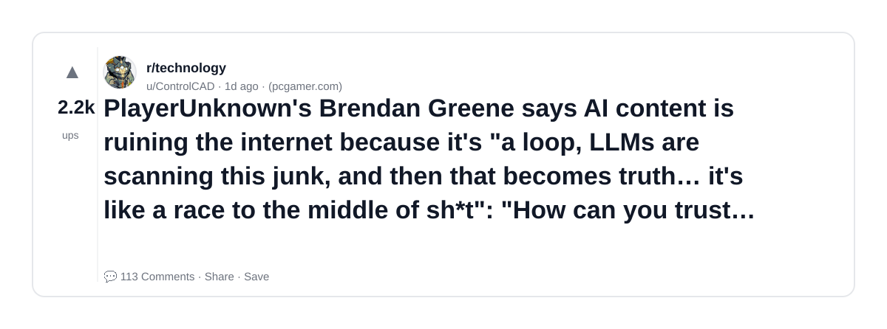
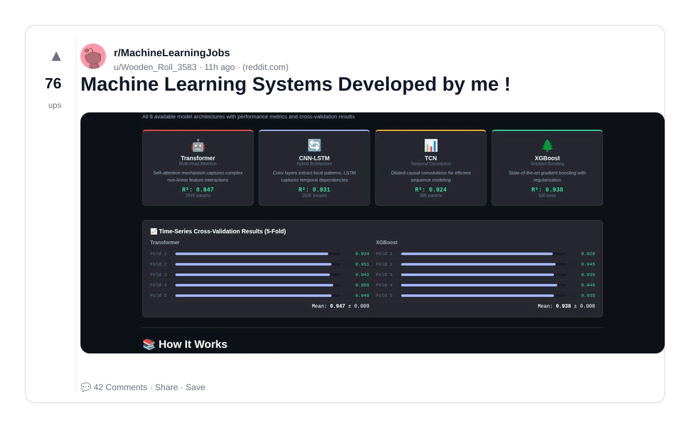
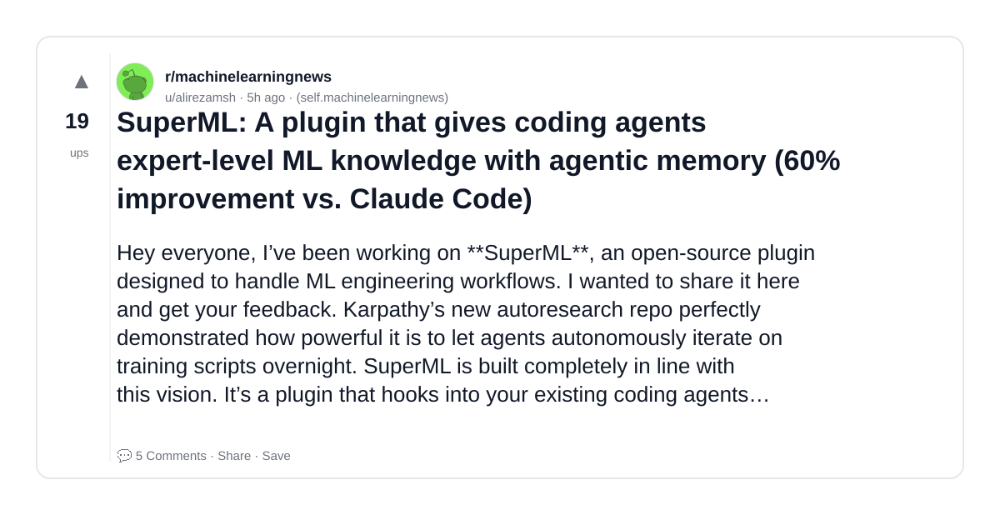
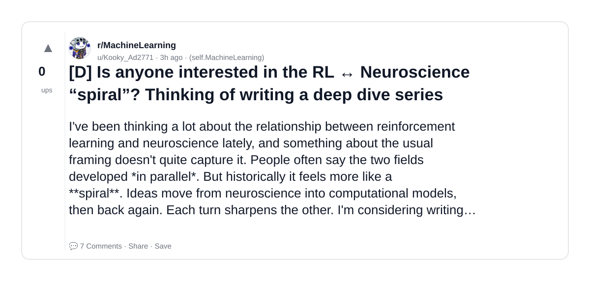
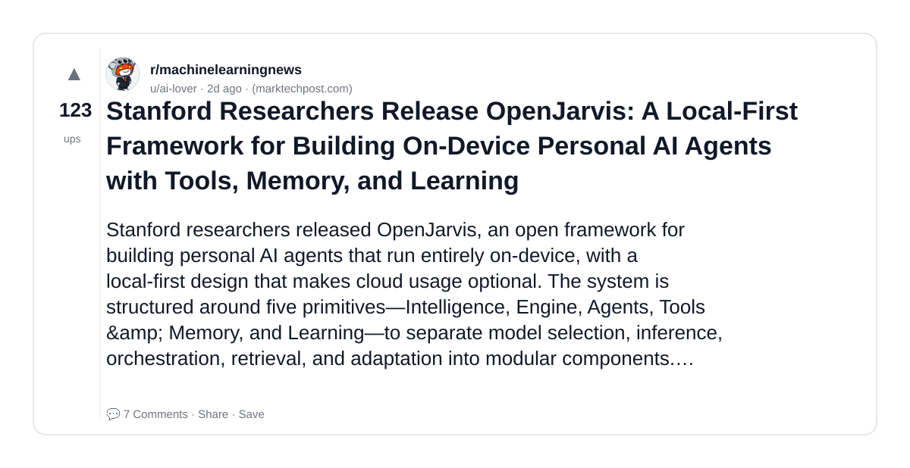
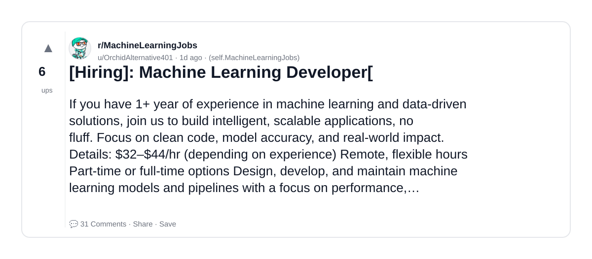
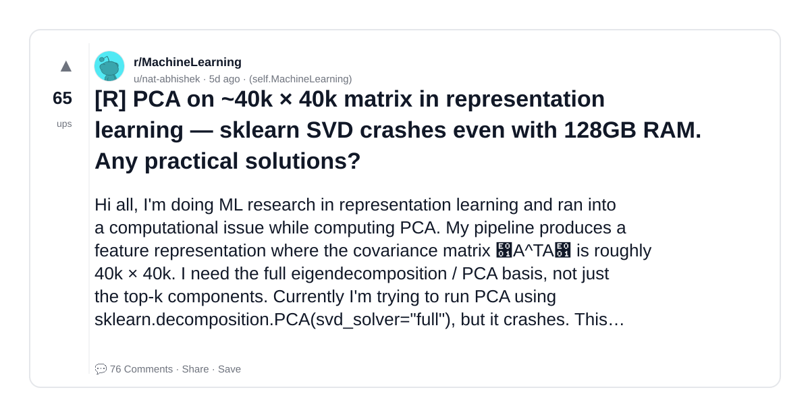
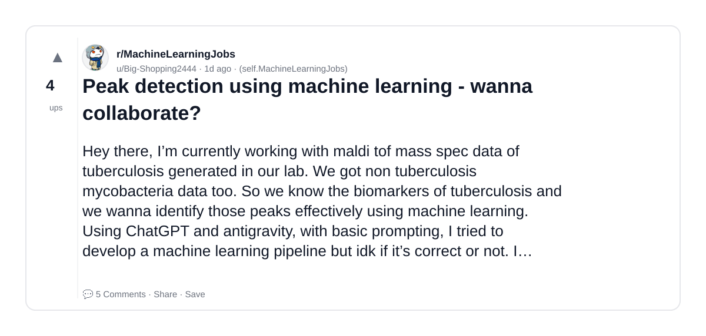
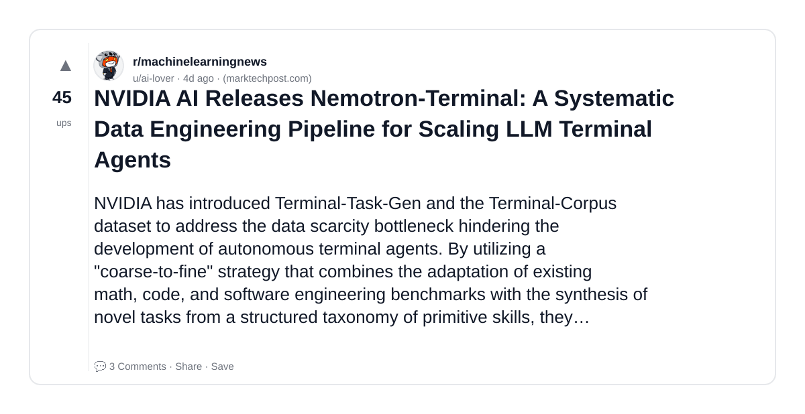
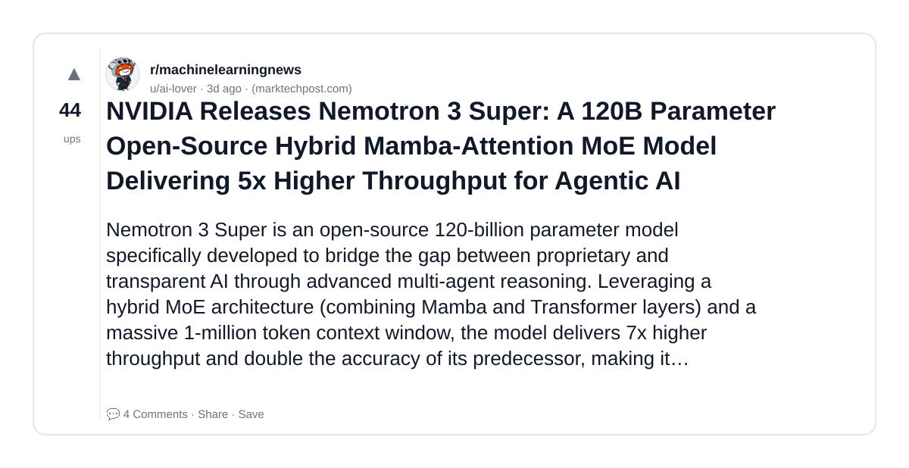

# Reddit Scout — AI and ML Agentic AI LLMs ML Engineering Deep Learning

Run: 2026-03-14T20-36-06-945Z
Started: 2026-03-14T20:36:06.945Z
Output dir: /home/ubuntu/.openclaw/workspace/reddit-scout/ai-and-ml-agentic-ai-llms-ml-engineering-deep-learning/runs/2026-03-14T20-36-06-945Z

Config: topN=10 | subLimit=8 | kinds=top,hot,rising | time=week | limitPerListing=25
Search: AI and ML Agentic AI LLMs ML Engineering Deep Learning (sort=top t=auto)

## Top terms (from titles + top comments)

- learning (10)
- like (7)
- machine (6)
- post (6)
- interested (5)
- agents (4)
- hiring (4)
- matrix (4)
- data (4)
- want (4)
- what (4)
- have (4)
- into (4)
- also (4)
- prachub (4)
- about (4)
- some (4)
- please (4)

## Viral content ideas (derived from these posts)

**1. Personal story → timeline + receipts**
- Hook: Hook with 1 line, then a 5-step timeline; end with the lesson and what you would do differently.

**2. My learning got automated: what I automated back (tools + workflow)**
- Hook: Turn it into a before/after workflow post. Include exact tool stack + steps.

**3. Checklist: how to stay valuable when like hits your team**
- Hook: A numbered checklist (10 items). Make it practical: skills, portfolio, outreach, proof-of-work.

**4. Hot take: machine isn't the problem — post is**
- Hook: Contrarian framing. Back it with 2 examples from the top posts and 1 counterexample.

**5. Debunk thread: "AI will replace interested" vs what's actually happening**
- Hook: Use 3 claims → 3 rebuttals. Cite specific post patterns: layoffs, hiring freezes, role shifts.

**6. Salary/market reality: agents vs hiring roles in 2026 (Reddit signals)**
- Hook: Summarize demand signals from comments: who is struggling, who is fine, why.

**7. "What would you do in 30 days?" layoff recovery plan (day-by-day)**
- Hook: 30-day plan: portfolio, interview loops, networking, mental health. Include a downloadable checklist.

**8. Mini-case study: 1 resume bullet → 1 proof project using matrix**
- Hook: Show how to convert a vague resume claim into a measurable project + writeup.

**9. Community question: which tasks should *never* be delegated to AI?**
- Hook: Ask + give your own top 5. Encourage replies; add a poll if your platform supports it.

**10. Template post: "I used AI to do X, got Y result, here's the exact prompt"**
- Hook: Make it reproducible: prompt, inputs, outputs, gotchas.

**11. Data post: a quick scorecard of the top threads (ups, comments, ratio) + what it signals**
- Hook: Table or bullets; then 3 takeaways.

**12. Meme angle (if relevant): data vs want — job search edition**
- Hook: If your niche is not memes, skip memes; otherwise caption the pattern you saw in comments.

## Top posts (10) + cards

### 1) PlayerUnknown's Brendan Greene says AI content is ruining the internet because it's "a loop, LLMs are scanning this junk, and then that becomes truth… it's like a race to the middle of sh*t": "How can you trust stuff that says at the bottom you need to fact-check all the answers I'm giving you?"
- Subreddit: r/technology
- Viral score: 180 | Ups: 2151 | Comments: 113 | Upvote ratio: 97%
- Link: https://www.reddit.com/r/technology/comments/1rsms7s/playerunknowns_brendan_greene_says_ai_content_is/
- Card (local): ./cards/1rsms7s.png

### 2) Machine Learning Systems Developed by me !
- Subreddit: r/MachineLearningJobs
- Viral score: 32 | Ups: 76 | Comments: 42 | Upvote ratio: 95%
- Link: https://www.reddit.com/r/MachineLearningJobs/comments/1rtffee/machine_learning_systems_developed_by_me/
- Card (local): ./cards/1rtffee.png

### 3) SuperML: A plugin that gives coding agents expert-level ML knowledge with agentic memory (60% improvement vs. Claude Code)
- Subreddit: r/machinelearningnews
- Viral score: 8 | Ups: 19 | Comments: 5 | Upvote ratio: 95%
- Link: https://www.reddit.com/r/machinelearningnews/comments/1rtlxbx/superml_a_plugin_that_gives_coding_agents/
- Card (local): ./cards/1rtlxbx.png

### 4) [D] Is anyone interested in the RL ↔ Neuroscience “spiral”? Thinking of writing a deep dive series
- Subreddit: r/MachineLearning
- Viral score: 4 | Ups: 0 | Comments: 7 | Upvote ratio: 50%
- Link: https://www.reddit.com/r/MachineLearning/comments/1rtouwo/d_is_anyone_interested_in_the_rl_neuroscience/
- Card (local): ./cards/1rtouwo.png

### 5) Stanford Researchers Release OpenJarvis: A Local-First Framework for Building On-Device Personal AI Agents with Tools, Memory, and Learning
- Subreddit: r/machinelearningnews
- Viral score: 3 | Ups: 123 | Comments: 7 | Upvote ratio: 100%
- Link: https://www.reddit.com/r/machinelearningnews/comments/1rs3ypd/stanford_researchers_release_openjarvis_a/
- Card (local): ./cards/1rs3ypd.png

### 6) [Hiring]: Machine Learning Developer[
- Subreddit: r/MachineLearningJobs
- Viral score: 3 | Ups: 6 | Comments: 31 | Upvote ratio: 80%
- Link: https://www.reddit.com/r/MachineLearningJobs/comments/1rsnmvq/hiring_machine_learning_developer/
- Card (local): ./cards/1rsnmvq.png

### 7) [R] PCA on ~40k × 40k matrix in representation learning — sklearn SVD crashes even with 128GB RAM. Any practical solutions?
- Subreddit: r/MachineLearning
- Viral score: 2 | Ups: 65 | Comments: 76 | Upvote ratio: 92%
- Link: https://www.reddit.com/r/MachineLearning/comments/1rp2pcv/r_pca_on_40k_40k_matrix_in_representation/
- Card (local): ./cards/1rp2pcv.png

### 8) Peak detection using machine learning - wanna collaborate?
- Subreddit: r/MachineLearningJobs
- Viral score: 1 | Ups: 4 | Comments: 5 | Upvote ratio: 84%
- Link: https://www.reddit.com/r/MachineLearningJobs/comments/1rsy09h/peak_detection_using_machine_learning_wanna/
- Card (local): ./cards/1rsy09h.png

### 9) NVIDIA AI Releases Nemotron-Terminal: A Systematic Data Engineering Pipeline for Scaling LLM Terminal Agents
- Subreddit: r/machinelearningnews
- Viral score: 1 | Ups: 45 | Comments: 3 | Upvote ratio: 97%
- Link: https://www.reddit.com/r/machinelearningnews/comments/1rq8a2e/nvidia_ai_releases_nemotronterminal_a_systematic/
- Card (local): ./cards/1rq8a2e.png

### 10) NVIDIA Releases Nemotron 3 Super: A 120B Parameter Open-Source Hybrid Mamba-Attention MoE Model Delivering 5x Higher Throughput for Agentic AI
- Subreddit: r/machinelearningnews
- Viral score: 1 | Ups: 44 | Comments: 4 | Upvote ratio: 99%
- Link: https://www.reddit.com/r/machinelearningnews/comments/1rr28oj/nvidia_releases_nemotron_3_super_a_120b_parameter/
- Card (local): ./cards/1rr28oj.png

