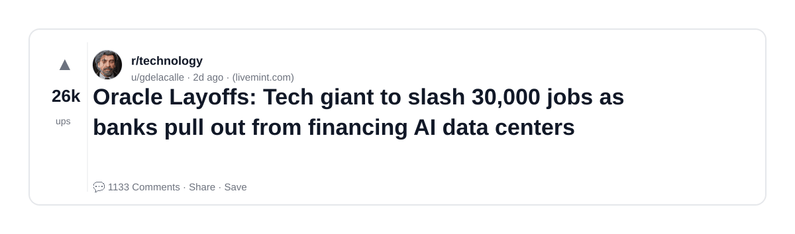
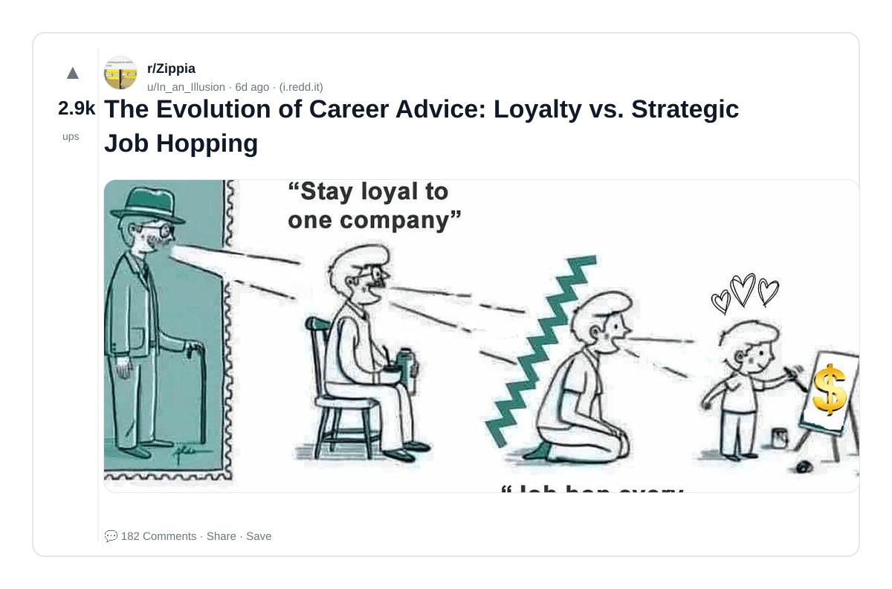
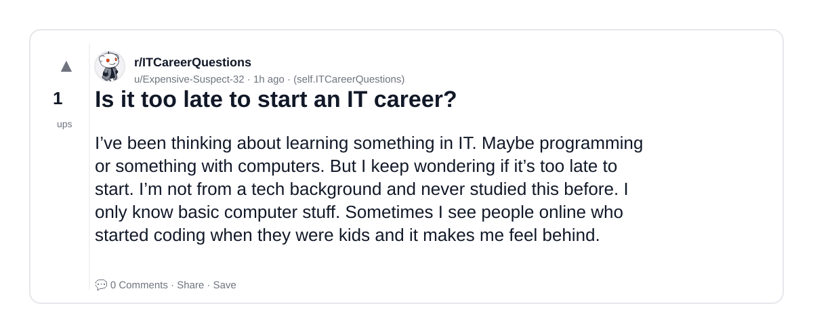
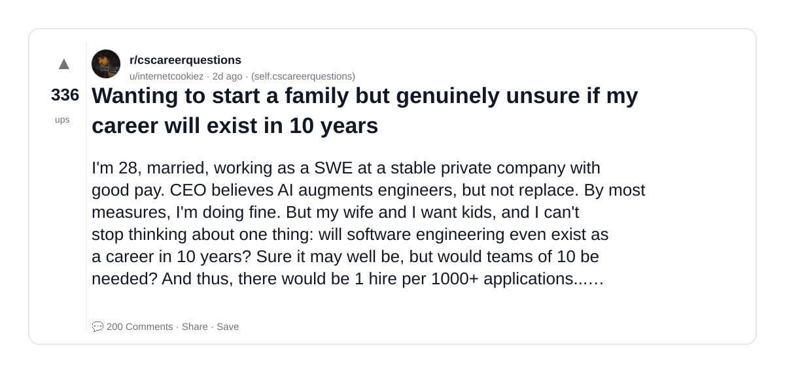
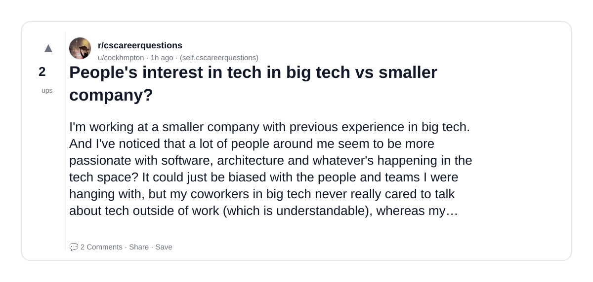
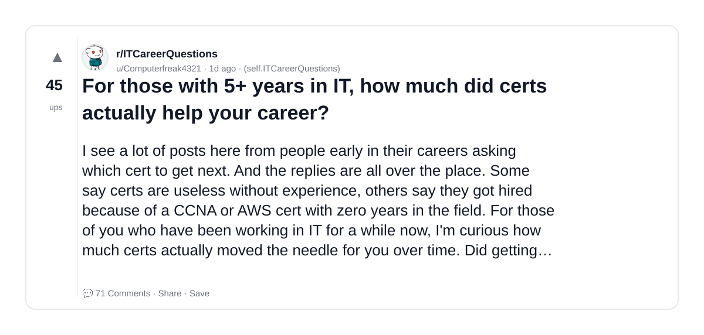
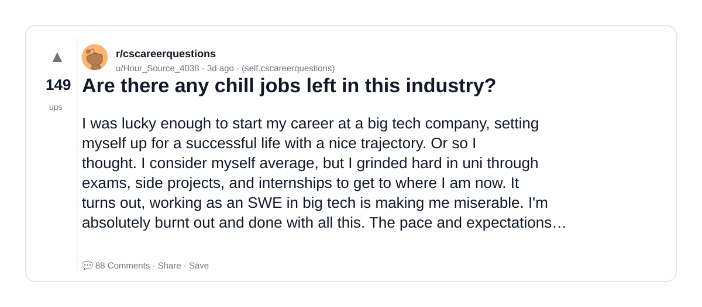
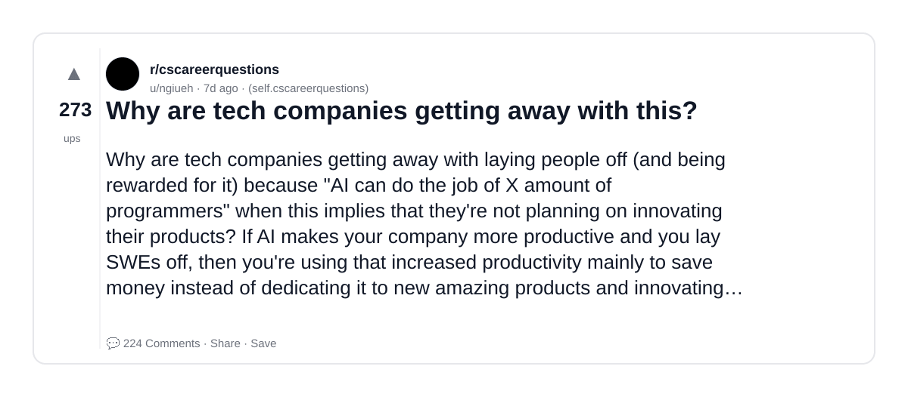
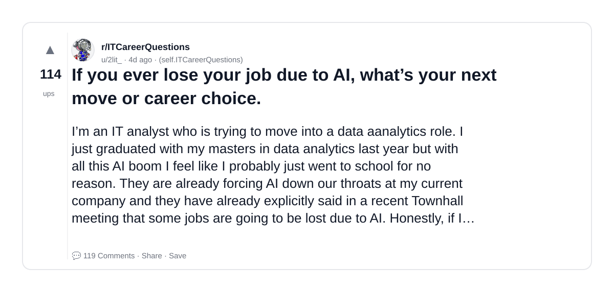
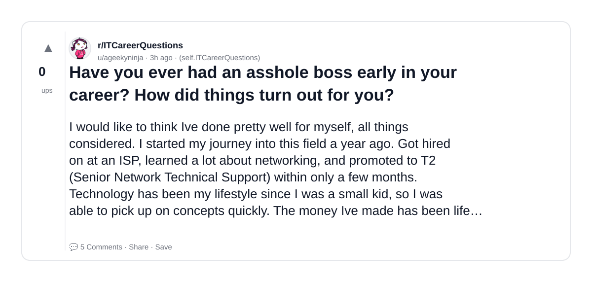

# Reddit Scout — AI career building AI-proof career tech jobs

Run: 2026-03-10T16-48-37-943Z
Started: 2026-03-10T16:48:37.943Z
Output dir: /home/ubuntu/.openclaw/workspace/reddit-scout/ai-career-building-ai-proof-career-tech-jobs/runs/2026-03-10T16-48-37-943Z

Config: topN=10 | subLimit=8 | kinds=top,hot,rising | time=week | limitPerListing=25
Search: AI career building AI-proof career tech jobs (sort=top t=auto)

## Top terms (from titles + top comments)

- have (14)
- will (12)
- career (9)
- there (9)
- more (9)
- tech (8)
- years (8)
- much (8)
- what (8)
- into (8)
- think (8)
- work (8)
- money (7)
- like (7)
- people (6)
- about (6)
- make (6)
- year (6)

## Viral content ideas (derived from these posts)

**1. "I got laid off" story → what happened next (timeline + receipts)**
- Hook: Hook with 1 line, then a 5-step timeline; end with the lesson and what you would do differently.

**2. My have got automated: what I automated back (tools + workflow)**
- Hook: Turn it into a before/after workflow post. Include exact tool stack + steps.

**3. Checklist: how to stay valuable when will hits your team**
- Hook: A numbered checklist (10 items). Make it practical: skills, portfolio, outreach, proof-of-work.

**4. Hot take: career isn't the problem — there is**
- Hook: Contrarian framing. Back it with 2 examples from the top posts and 1 counterexample.

**5. Debunk thread: "AI will replace more" vs what's actually happening**
- Hook: Use 3 claims → 3 rebuttals. Cite specific post patterns: layoffs, hiring freezes, role shifts.

**6. Salary/market reality: tech vs years roles in 2026 (Reddit signals)**
- Hook: Summarize demand signals from comments: who is struggling, who is fine, why.

**7. "What would you do in 30 days?" layoff recovery plan (day-by-day)**
- Hook: 30-day plan: portfolio, interview loops, networking, mental health. Include a downloadable checklist.

**8. Mini-case study: 1 resume bullet → 1 proof project using much**
- Hook: Show how to convert a vague resume claim into a measurable project + writeup.

**9. Community question: which tasks should *never* be delegated to AI?**
- Hook: Ask + give your own top 5. Encourage replies; add a poll if your platform supports it.

**10. Template post: "I used AI to do X, got Y result, here's the exact prompt"**
- Hook: Make it reproducible: prompt, inputs, outputs, gotchas.

**11. Data post: a quick scorecard of the top threads (ups, comments, ratio) + what it signals**
- Hook: Table or bullets; then 3 takeaways.

**12. Meme angle (if relevant): what vs into — job search edition**
- Hook: If your niche is not memes, skip memes; otherwise caption the pattern you saw in comments.

## Top posts (10) + cards

### 1) Oracle Layoffs: Tech giant to slash 30,000 jobs as banks pull out from financing AI data centers
- Subreddit: r/technology
- Viral score: 1521 | Ups: 26315 | Comments: 1133 | Upvote ratio: 92%
- Link: https://www.reddit.com/r/technology/comments/1ro15xl/oracle_layoffs_tech_giant_to_slash_30000_jobs_as/
- Card (local): ./cards/1ro15xl.png

### 2) The Evolution of Career Advice: Loyalty vs. Strategic Job Hopping
- Subreddit: r/Zippia
- Viral score: 49 | Ups: 2886 | Comments: 182 | Upvote ratio: 99%
- Link: https://www.reddit.com/r/Zippia/comments/1rkrpho/the_evolution_of_career_advice_loyalty_vs/
- Card (local): ./cards/1rkrpho.png

### 3) Is it too late to start an IT career?
- Subreddit: r/ITCareerQuestions
- Viral score: 36 | Ups: 1 | Comments: 0 | Upvote ratio: 100%
- Link: https://www.reddit.com/r/ITCareerQuestions/comments/1rq23oa/is_it_too_late_to_start_an_it_career/
- Card (local): ./cards/1rq23oa.png

### 4) Wanting to start a family but genuinely unsure if my career will exist in 10 years
- Subreddit: r/cscareerquestions
- Viral score: 35 | Ups: 336 | Comments: 200 | Upvote ratio: 86%
- Link: https://www.reddit.com/r/cscareerquestions/comments/1roq8t3/wanting_to_start_a_family_but_genuinely_unsure_if/
- Card (local): ./cards/1roq8t3.png

### 5) People's interest in tech in big tech vs smaller company?
- Subreddit: r/cscareerquestions
- Viral score: 17 | Ups: 2 | Comments: 2 | Upvote ratio: 100%
- Link: https://www.reddit.com/r/cscareerquestions/comments/1rq14gh/peoples_interest_in_tech_in_big_tech_vs_smaller/
- Card (local): ./cards/1rq14gh.png

### 6) For those with 5+ years in IT, how much did certs actually help your career?
- Subreddit: r/ITCareerQuestions
- Viral score: 10 | Ups: 45 | Comments: 71 | Upvote ratio: 94%
- Link: https://www.reddit.com/r/ITCareerQuestions/comments/1rowfsy/for_those_with_5_years_in_it_how_much_did_certs/
- Card (local): ./cards/1rowfsy.png

### 7) Are there any chill jobs left in this industry?
- Subreddit: r/cscareerquestions
- Viral score: 7 | Ups: 149 | Comments: 88 | Upvote ratio: 92%
- Link: https://www.reddit.com/r/cscareerquestions/comments/1rnky1p/are_there_any_chill_jobs_left_in_this_industry/
- Card (local): ./cards/1rnky1p.png

### 8) Why are tech companies getting away with this?
- Subreddit: r/cscareerquestions
- Viral score: 6 | Ups: 273 | Comments: 224 | Upvote ratio: 85%
- Link: https://www.reddit.com/r/cscareerquestions/comments/1rk2dsx/why_are_tech_companies_getting_away_with_this/
- Card (local): ./cards/1rk2dsx.png

### 9) If you ever lose your job due to AI, what’s your next move or career choice.
- Subreddit: r/ITCareerQuestions
- Viral score: 5 | Ups: 114 | Comments: 119 | Upvote ratio: 91%
- Link: https://www.reddit.com/r/ITCareerQuestions/comments/1rmuf0y/if_you_ever_lose_your_job_due_to_ai_whats_your/
- Card (local): ./cards/1rmuf0y.png

### 10) Have you ever had an asshole boss early in your career? How did things turn out for you?
- Subreddit: r/ITCareerQuestions
- Viral score: 3 | Ups: 0 | Comments: 5 | Upvote ratio: 50%
- Link: https://www.reddit.com/r/ITCareerQuestions/comments/1rpws96/have_you_ever_had_an_asshole_boss_early_in_your/
- Card (local): ./cards/1rpws96.png

