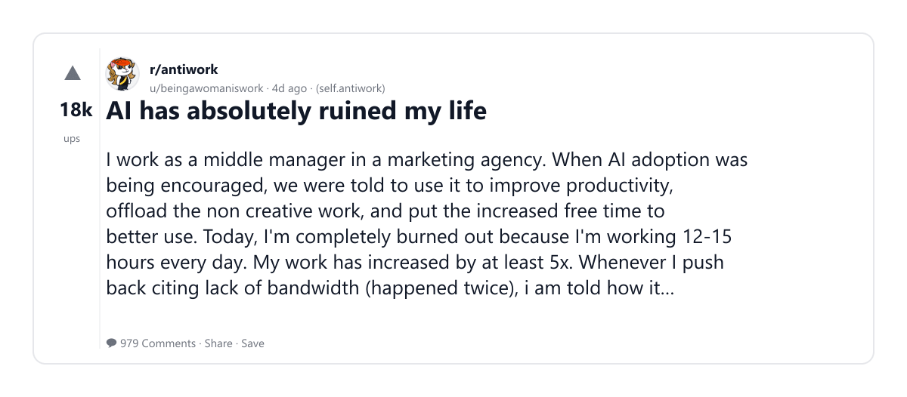
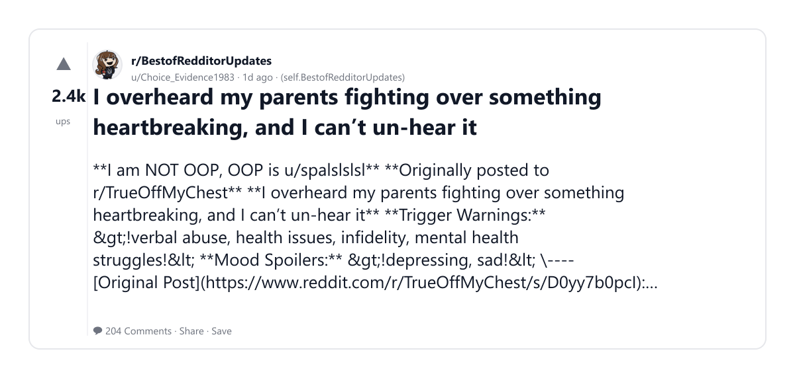
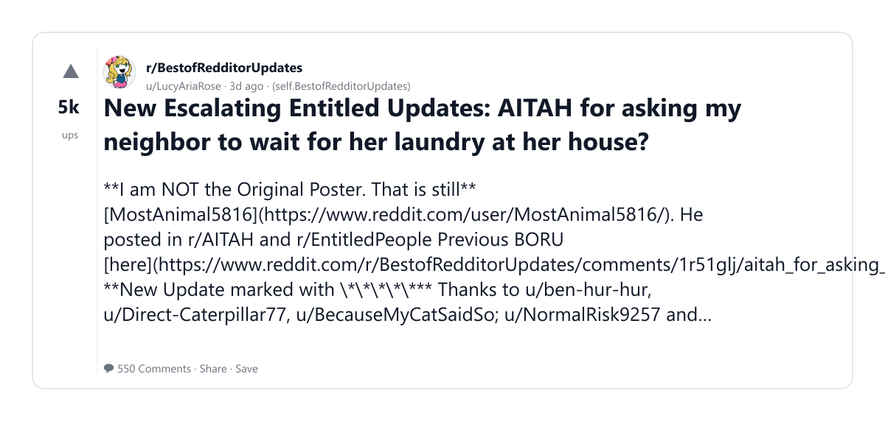
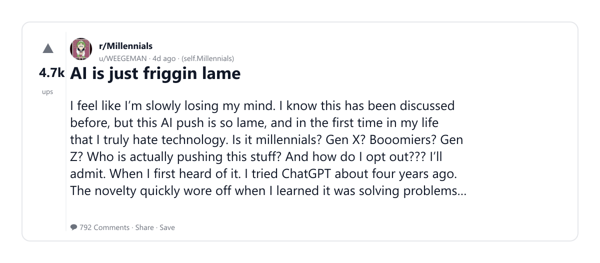
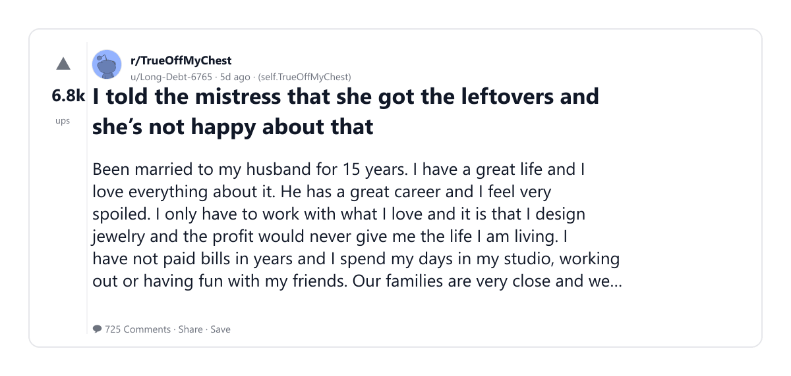
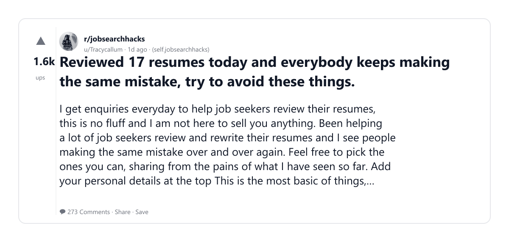
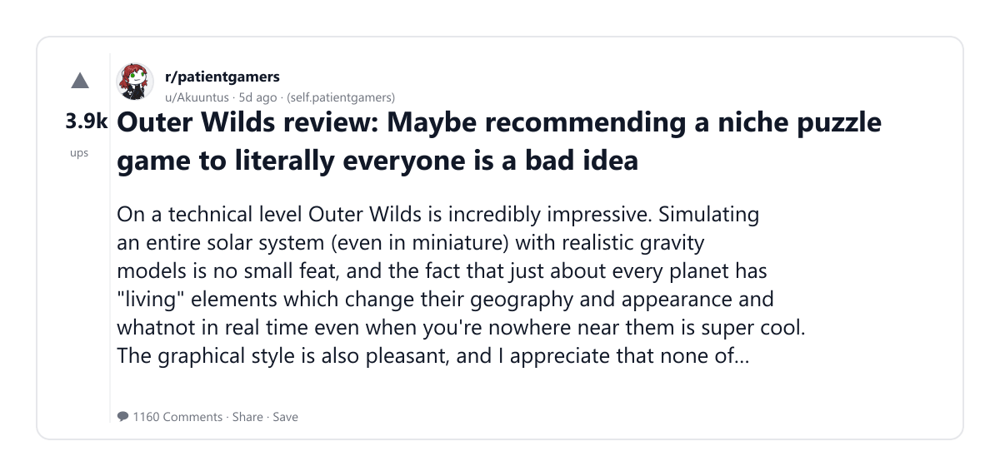
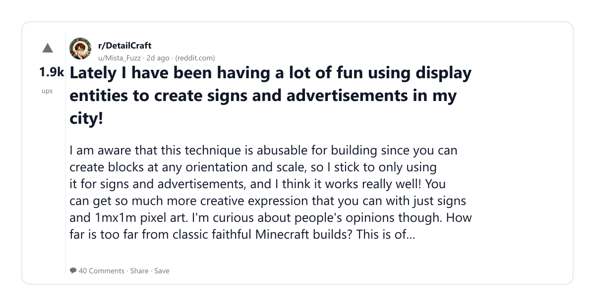

# Reddit Scout — AI impact creative work design writing art

Run: 2026-03-04T08-28-21-031Z
Started: 2026-03-04T08:28:21.038Z
Output dir: C:\Users\syash\.openclaw\workspace\reddit-scout\ai-impact-creative-work-design-writing-art\runs\2026-03-04T08-28-21-031Z

Config: topN=10 | subLimit=8 | kinds=top,hot,rising | time=week | limitPerListing=25
Search: AI impact creative work design writing art (sort=top t=auto)

## Top terms (from titles + top comments)

- have (14)
- memory (12)
- claude (11)
- people (11)
- chatgpt (10)
- about (10)
- like (10)
- what (10)
- more (9)
- switching (8)
- them (8)
- game (7)
- well (7)
- will (7)
- same (6)
- outer (5)
- wilds (5)
- anthropic (5)

## Viral content ideas (derived from these posts)

**1. Personal story → timeline + receipts**
- Hook: Hook with 1 line, then a 5-step timeline; end with the lesson and what you would do differently.

**2. My have got automated: what I automated back (tools + workflow)**
- Hook: Turn it into a before/after workflow post. Include exact tool stack + steps.

**3. Checklist: how to stay valuable when memory hits your team**
- Hook: A numbered checklist (10 items). Make it practical: skills, portfolio, outreach, proof-of-work.

**4. Hot take: claude isn't the problem — people is**
- Hook: Contrarian framing. Back it with 2 examples from the top posts and 1 counterexample.

**5. Debunk thread: "AI will replace chatgpt" vs what's actually happening**
- Hook: Use 3 claims → 3 rebuttals. Cite specific post patterns: layoffs, hiring freezes, role shifts.

**6. Salary/market reality: about vs like roles in 2026 (Reddit signals)**
- Hook: Summarize demand signals from comments: who is struggling, who is fine, why.

**7. "What would you do in 30 days?" layoff recovery plan (day-by-day)**
- Hook: 30-day plan: portfolio, interview loops, networking, mental health. Include a downloadable checklist.

**8. Mini-case study: 1 resume bullet → 1 proof project using what**
- Hook: Show how to convert a vague resume claim into a measurable project + writeup.

**9. Community question: which tasks should *never* be delegated to AI?**
- Hook: Ask + give your own top 5. Encourage replies; add a poll if your platform supports it.

**10. Template post: "I used AI to do X, got Y result, here's the exact prompt"**
- Hook: Make it reproducible: prompt, inputs, outputs, gotchas.

**11. Data post: a quick scorecard of the top threads (ups, comments, ratio) + what it signals**
- Hook: Table or bullets; then 3 takeaways.

**12. Meme angle (if relevant): more vs switching — job search edition**
- Hook: If your niche is not memes, skip memes; otherwise caption the pattern you saw in comments.

## Top posts (10) + cards

### 1) Cancel your ChatGPT Plus, burn their compute on the way out, and switch to Claude
- Subreddit: r/ChatGPT
- Viral score: 1048 | Ups: 29263 | Comments: 1901 | Upvote ratio: 89%
- Link: https://www.reddit.com/r/ChatGPT/comments/1rh60py/cancel_your_chatgpt_plus_burn_their_compute_on/
- Card (local): ./cards/1rh60py.png

### 2) AI has absolutely ruined my life
- Subreddit: r/antiwork
- Viral score: 603 | Ups: 18258 | Comments: 979 | Upvote ratio: 94%
- Link: https://www.reddit.com/r/antiwork/comments/1rh20lc/ai_has_absolutely_ruined_my_life/
- Card (local): ./cards/1rh20lc.png

### 3) I overheard my parents fighting over something heartbreaking, and I can’t un-hear it
- Subreddit: r/BestofRedditorUpdates
- Viral score: 254 | Ups: 2390 | Comments: 204 | Upvote ratio: 93%
- Link: https://www.reddit.com/r/BestofRedditorUpdates/comments/1rjgdmx/i_overheard_my_parents_fighting_over_something/
- Card (local): ./cards/1rjgdmx.png

### 4) New Escalating Entitled Updates: AITAH for asking my neighbor to wait for her laundry at her house?
- Subreddit: r/BestofRedditorUpdates
- Viral score: 209 | Ups: 5044 | Comments: 550 | Upvote ratio: 98%
- Link: https://www.reddit.com/r/BestofRedditorUpdates/comments/1rhoesf/new_escalating_entitled_updates_aitah_for_asking/
- Card (local): ./cards/1rhoesf.png

### 5) AI is just friggin lame
- Subreddit: r/Millennials
- Viral score: 168 | Ups: 4699 | Comments: 792 | Upvote ratio: 93%
- Link: https://www.reddit.com/r/Millennials/comments/1rh2qsd/ai_is_just_friggin_lame/
- Card (local): ./cards/1rh2qsd.png

### 6) I told the mistress that she got the leftovers and she’s not happy about that
- Subreddit: r/TrueOffMyChest
- Viral score: 155 | Ups: 6785 | Comments: 725 | Upvote ratio: 96%
- Link: https://www.reddit.com/r/TrueOffMyChest/comments/1rfn1ef/i_told_the_mistress_that_she_got_the_leftovers/
- Card (local): ./cards/1rfn1ef.png

### 7) Reviewed 17 resumes today and everybody keeps making the same mistake, try to avoid these things.
- Subreddit: r/jobsearchhacks
- Viral score: 142 | Ups: 1567 | Comments: 273 | Upvote ratio: 84%
- Link: https://www.reddit.com/r/jobsearchhacks/comments/1rj8an7/reviewed_17_resumes_today_and_everybody_keeps/
- Card (local): ./cards/1rj8an7.png

### 8) Outer Wilds review: Maybe recommending a niche puzzle game to literally everyone is a bad idea
- Subreddit: r/patientgamers
- Viral score: 122 | Ups: 3942 | Comments: 1160 | Upvote ratio: 87%
- Link: https://www.reddit.com/r/patientgamers/comments/1rga2th/outer_wilds_review_maybe_recommending_a_niche/
- Card (local): ./cards/1rga2th.png

### 9) Lately I have been having a lot of fun using display entities to create signs and advertisements in my city!
- Subreddit: r/DetailCraft
- Viral score: 78 | Ups: 1876 | Comments: 40 | Upvote ratio: 99%
- Link: https://www.reddit.com/r/DetailCraft/comments/1riked7/lately_i_have_been_having_a_lot_of_fun_using/
- Card (local): ./cards/1riked7.png

### 10) BREAKING: Anthropic Just Let Claude Users Import All Their ChatGPT Memories Directly as the Cancel ChatGPT Movement Hits Its Peak 🤖🔥
- Subreddit: r/InterstellarKinetics
- Viral score: 73 | Ups: 1645 | Comments: 13 | Upvote ratio: 100%
- Link: https://www.reddit.com/r/InterstellarKinetics/comments/1rixwoe/breaking_anthropic_just_let_claude_users_import/
- Card (local): ./cards/1rixwoe.png

