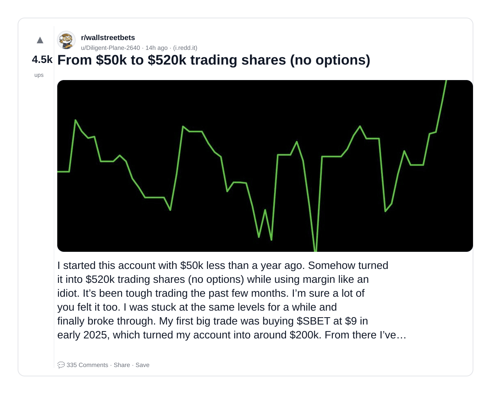
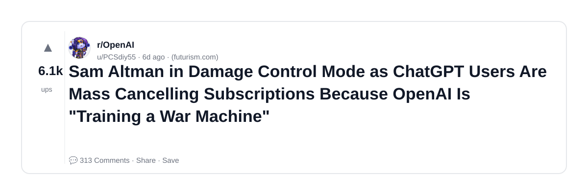
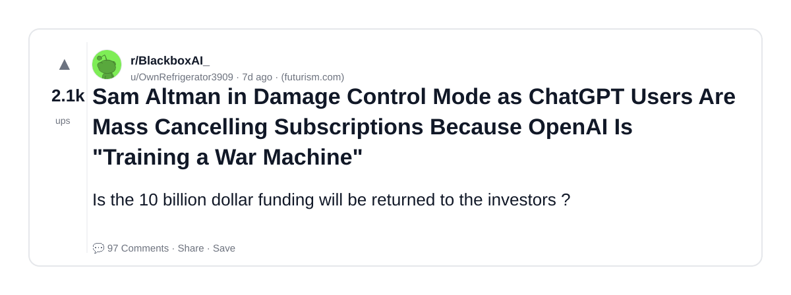
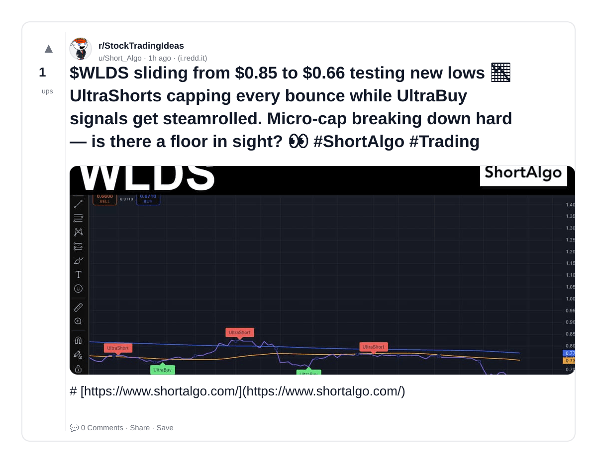
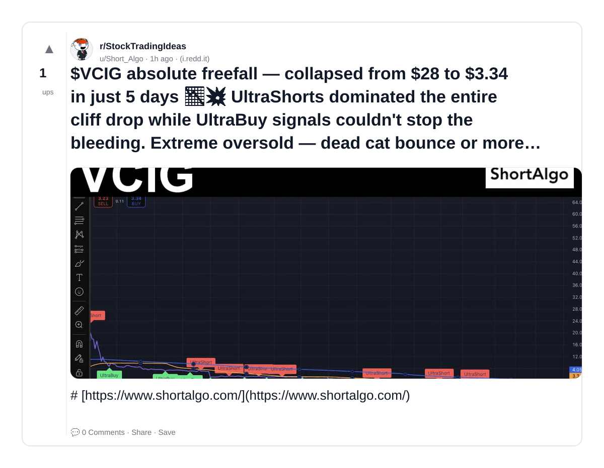
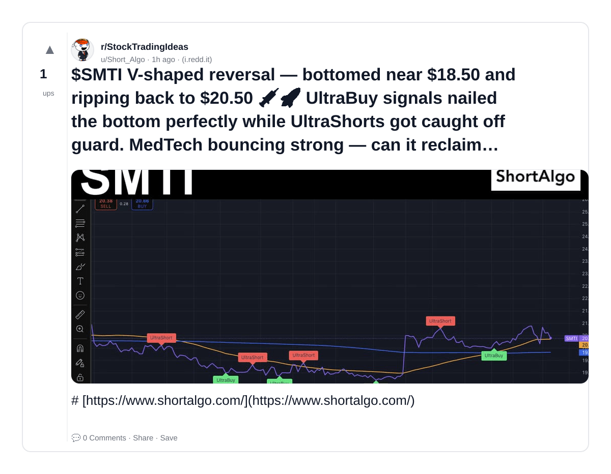
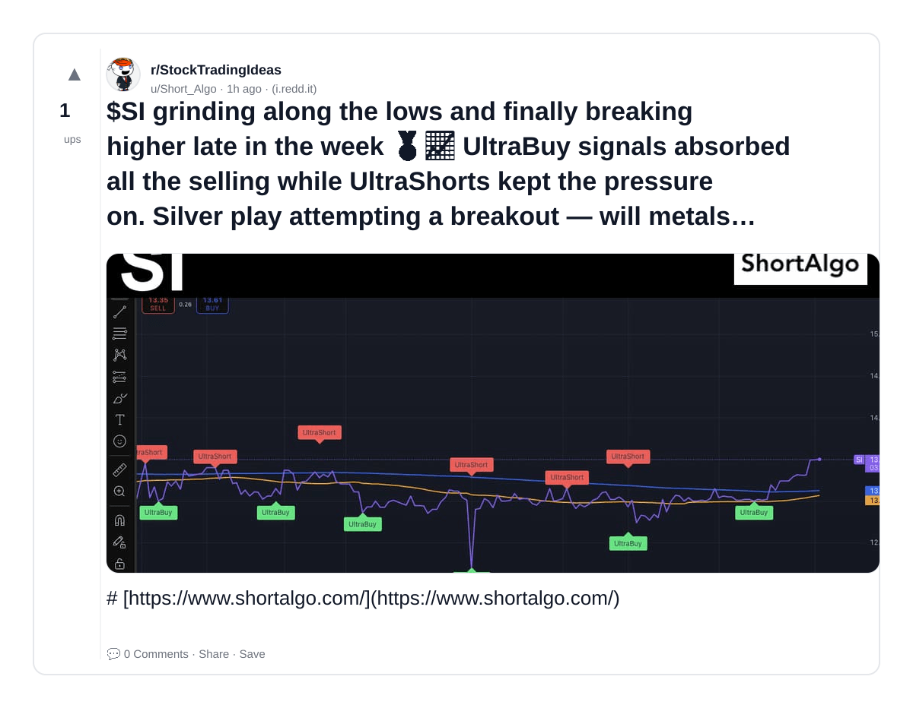
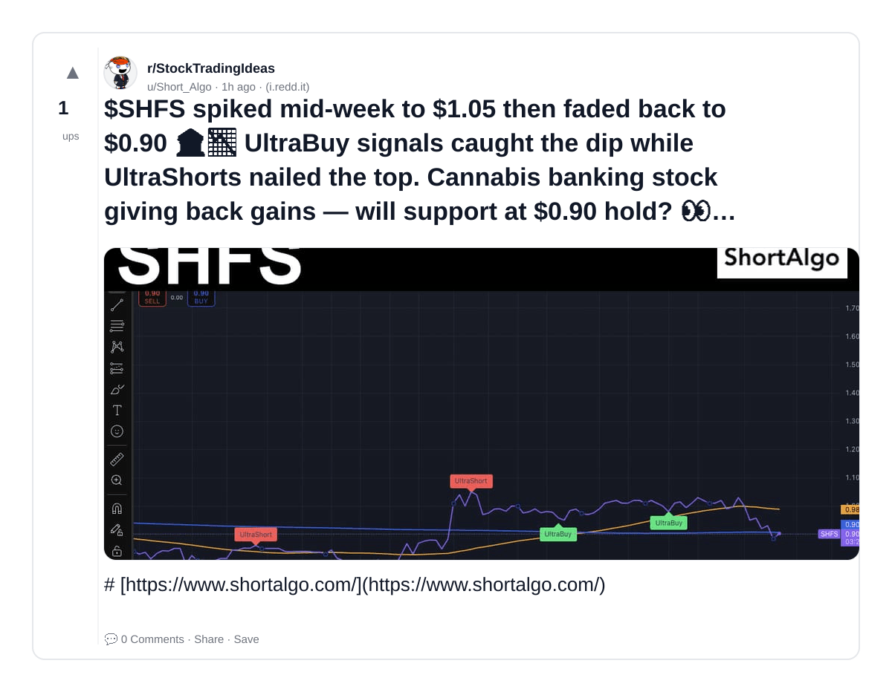
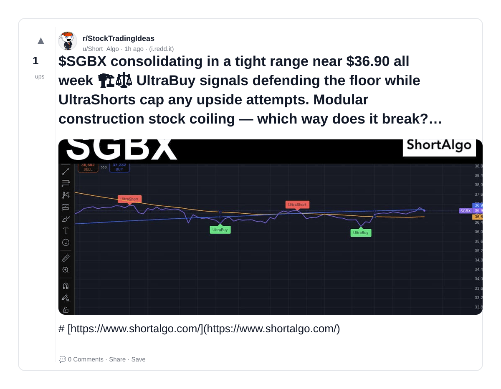
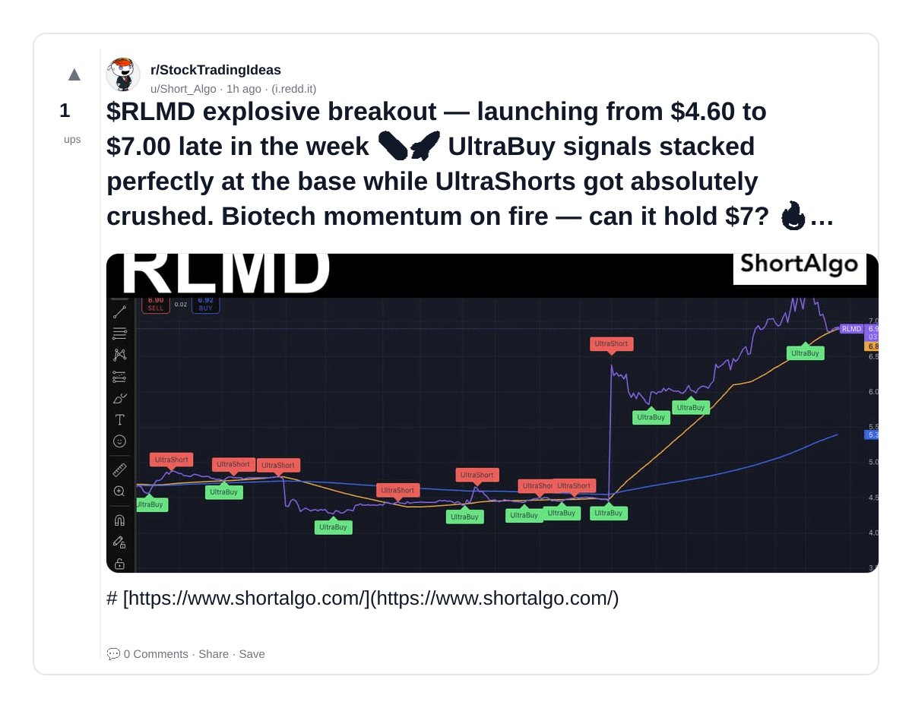

# Reddit Scout — AI in Stock Trading Machine Learning Engineering Applied AI

Run: 2026-03-10T16-11-11-734Z
Started: 2026-03-10T16:11:11.735Z
Output dir: /home/ubuntu/.openclaw/workspace/reddit-scout/ai-in-stock-trading-machine-learning-engineering-applied-ai/runs/2026-03-10T16-11-11-734Z

Config: topN=10 | subLimit=8 | kinds=top,hot,rising | time=week | limitPerListing=25
Search: AI in Stock Trading Machine Learning Engineering Applied AI (sort=top t=auto)

## Top terms (from titles + top comments)

- trading (8)
- ultrashorts (7)
- while (7)
- ultrabuy (7)
- signals (7)
- shortalgo (7)
- week (4)
- back (3)
- government (3)
- what (3)
- options (2)
- altman (2)
- damage (2)
- control (2)
- mode (2)
- chatgpt (2)
- users (2)
- mass (2)

## Viral content ideas (derived from these posts)

**1. Personal story → timeline + receipts**
- Hook: Hook with 1 line, then a 5-step timeline; end with the lesson and what you would do differently.

**2. My trading got automated: what I automated back (tools + workflow)**
- Hook: Turn it into a before/after workflow post. Include exact tool stack + steps.

**3. Checklist: how to stay valuable when ultrashorts hits your team**
- Hook: A numbered checklist (10 items). Make it practical: skills, portfolio, outreach, proof-of-work.

**4. Hot take: while isn't the problem — ultrabuy is**
- Hook: Contrarian framing. Back it with 2 examples from the top posts and 1 counterexample.

**5. Debunk thread: "AI will replace signals" vs what's actually happening**
- Hook: Use 3 claims → 3 rebuttals. Cite specific post patterns: layoffs, hiring freezes, role shifts.

**6. Salary/market reality: shortalgo vs week roles in 2026 (Reddit signals)**
- Hook: Summarize demand signals from comments: who is struggling, who is fine, why.

**7. "What would you do in 30 days?" layoff recovery plan (day-by-day)**
- Hook: 30-day plan: portfolio, interview loops, networking, mental health. Include a downloadable checklist.

**8. Mini-case study: 1 resume bullet → 1 proof project using back**
- Hook: Show how to convert a vague resume claim into a measurable project + writeup.

**9. Community question: which tasks should *never* be delegated to AI?**
- Hook: Ask + give your own top 5. Encourage replies; add a poll if your platform supports it.

**10. Template post: "I used AI to do X, got Y result, here's the exact prompt"**
- Hook: Make it reproducible: prompt, inputs, outputs, gotchas.

**11. Data post: a quick scorecard of the top threads (ups, comments, ratio) + what it signals**
- Hook: Table or bullets; then 3 takeaways.

**12. Meme angle (if relevant): government vs what — job search edition**
- Hook: If your niche is not memes, skip memes; otherwise caption the pattern you saw in comments.

## Top posts (10) + cards

### 1) From $50k to $520k trading shares (no options)
- Subreddit: r/wallstreetbets
- Viral score: 1084 | Ups: 4543 | Comments: 335 | Upvote ratio: 93%
- Link: https://www.reddit.com/r/wallstreetbets/comments/1rpkkha/from_50k_to_520k_trading_shares_no_options/
- Card (local): ./cards/1rpkkha.png

### 2) Sam Altman in Damage Control Mode as ChatGPT Users Are Mass Cancelling Subscriptions Because OpenAI Is "Training a War Machine"
- Subreddit: r/OpenAI
- Viral score: 111 | Ups: 6121 | Comments: 313 | Upvote ratio: 98%
- Link: https://www.reddit.com/r/OpenAI/comments/1rkqf2m/sam_altman_in_damage_control_mode_as_chatgpt/
- Card (local): ./cards/1rkqf2m.png

### 3) Sam Altman in Damage Control Mode as ChatGPT Users Are Mass Cancelling Subscriptions Because OpenAI Is "Training a War Machine"
- Subreddit: r/BlackboxAI_
- Viral score: 26 | Ups: 2075 | Comments: 97 | Upvote ratio: 99%
- Link: https://www.reddit.com/r/BlackboxAI_/comments/1rjo29f/sam_altman_in_damage_control_mode_as_chatgpt/
- Card (local): ./cards/1rjo29f.png

### 4) $WLDS sliding from $0.85 to $0.66 testing new lows 📉 UltraShorts capping every bounce while UltraBuy signals get steamrolled. Micro-cap breaking down hard — is there a floor in sight? 👀 #ShortAlgo #Trading
- Subreddit: r/StockTradingIdeas
- Viral score: 2 | Ups: 1 | Comments: 0 | Upvote ratio: 100%
- Link: https://www.reddit.com/r/StockTradingIdeas/comments/1rq01bt/wlds_sliding_from_085_to_066_testing_new_lows/
- Card (local): ./cards/1rq01bt.png

### 5) $VCIG absolute freefall — collapsed from $28 to $3.34 in just 5 days 📉💥 UltraShorts dominated the entire cliff drop while UltraBuy signals couldn't stop the bleeding. Extreme oversold — dead cat bounce or more pain? 😬 #ShortAlgo #Trading
- Subreddit: r/StockTradingIdeas
- Viral score: 2 | Ups: 1 | Comments: 0 | Upvote ratio: 100%
- Link: https://www.reddit.com/r/StockTradingIdeas/comments/1rq010k/vcig_absolute_freefall_collapsed_from_28_to_334/
- Card (local): ./cards/1rq010k.png

### 6) $SMTI V-shaped reversal — bottomed near $18.50 and ripping back to $20.50 💉🚀 UltraBuy signals nailed the bottom perfectly while UltraShorts got caught off guard. MedTech bouncing strong — can it reclaim all-time highs? 🔥 #ShortAlgo #Trading
- Subreddit: r/StockTradingIdeas
- Viral score: 2 | Ups: 1 | Comments: 0 | Upvote ratio: 100%
- Link: https://www.reddit.com/r/StockTradingIdeas/comments/1rq00oq/smti_vshaped_reversal_bottomed_near_1850_and/
- Card (local): ./cards/1rq00oq.png

### 7) $SI grinding along the lows and finally breaking higher late in the week 🥈📈 UltraBuy signals absorbed all the selling while UltraShorts kept the pressure on. Silver play attempting a breakout — will metals momentum fuel the move? 🔥 #ShortAlgo #Trading
- Subreddit: r/StockTradingIdeas
- Viral score: 2 | Ups: 1 | Comments: 0 | Upvote ratio: 100%
- Link: https://www.reddit.com/r/StockTradingIdeas/comments/1rpzzau/si_grinding_along_the_lows_and_finally_breaking/
- Card (local): ./cards/1rpzzau.png

### 8) $SHFS spiked mid-week to $1.05 then faded back to $0.90 🏦📉 UltraBuy signals caught the dip while UltraShorts nailed the top. Cannabis banking stock giving back gains — will support at $0.90 hold? 👀 #ShortAlgo #Trading
- Subreddit: r/StockTradingIdeas
- Viral score: 2 | Ups: 1 | Comments: 0 | Upvote ratio: 100%
- Link: https://www.reddit.com/r/StockTradingIdeas/comments/1rpzyox/shfs_spiked_midweek_to_105_then_faded_back_to_090/
- Card (local): ./cards/1rpzyox.png

### 9) $SGBX consolidating in a tight range near $36.90 all week 🏗️⚖️ UltraBuy signals defending the floor while UltraShorts cap any upside attempts. Modular construction stock coiling — which way does it break? 👀 #ShortAlgo #Trading
- Subreddit: r/StockTradingIdeas
- Viral score: 2 | Ups: 1 | Comments: 0 | Upvote ratio: 100%
- Link: https://www.reddit.com/r/StockTradingIdeas/comments/1rpzxvu/sgbx_consolidating_in_a_tight_range_near_3690_all/
- Card (local): ./cards/1rpzxvu.png

### 10) $RLMD explosive breakout — launching from $4.60 to $7.00 late in the week 💊🚀 UltraBuy signals stacked perfectly at the base while UltraShorts got absolutely crushed. Biotech momentum on fire — can it hold $7? 🔥 #ShortAlgo #Trading
- Subreddit: r/StockTradingIdeas
- Viral score: 2 | Ups: 1 | Comments: 0 | Upvote ratio: 100%
- Link: https://www.reddit.com/r/StockTradingIdeas/comments/1rpzw8q/rlmd_explosive_breakout_launching_from_460_to_700/
- Card (local): ./cards/1rpzw8q.png

