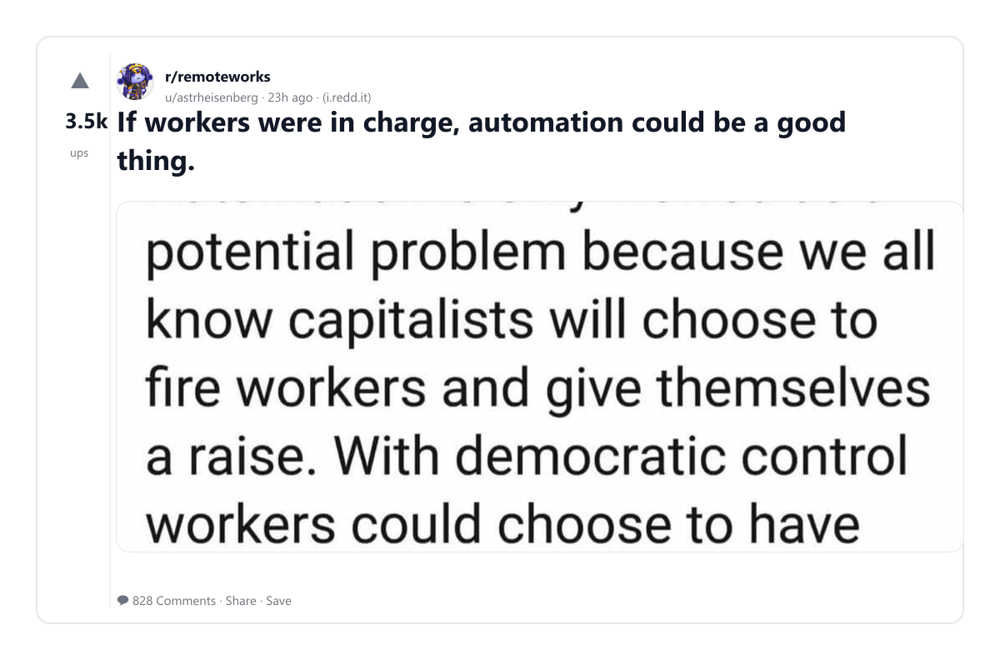
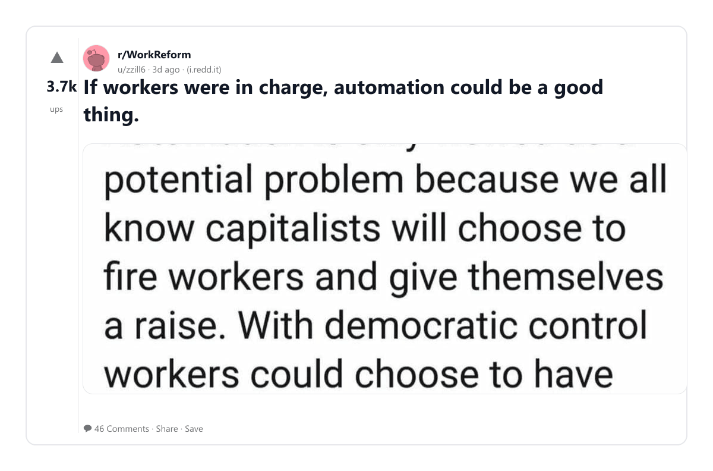
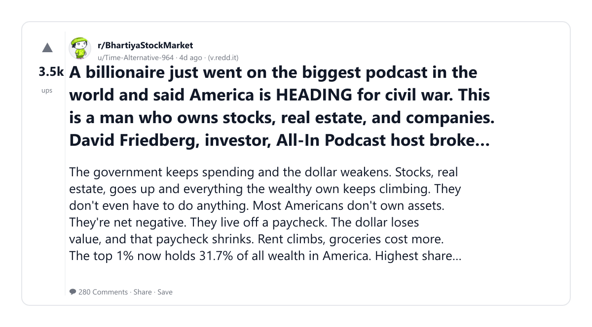
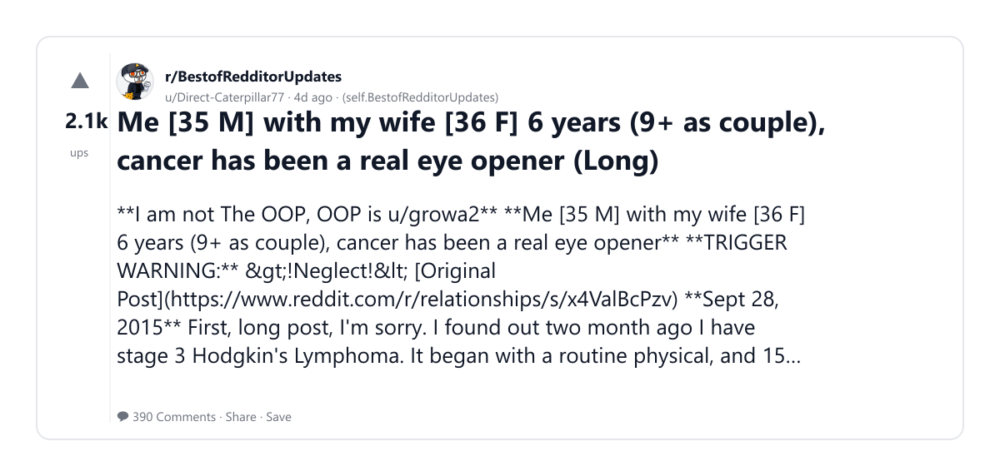
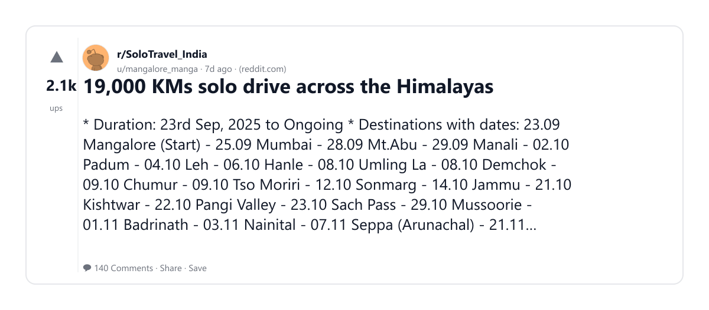
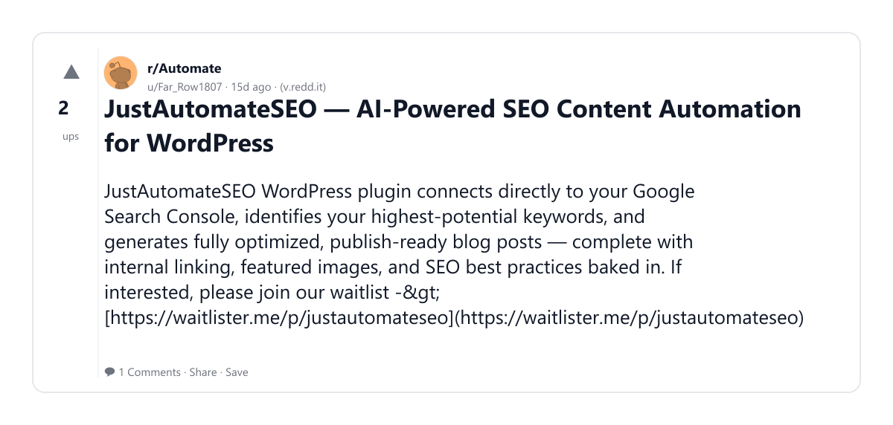
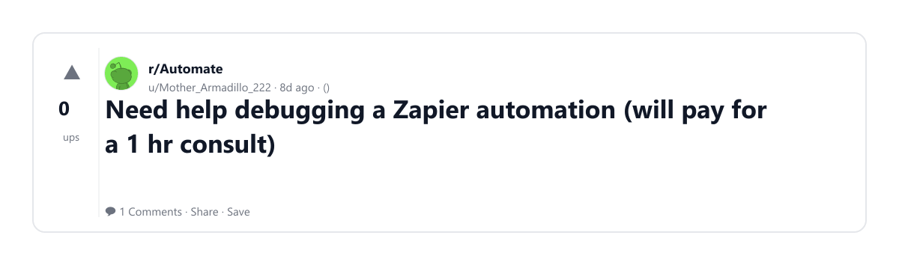
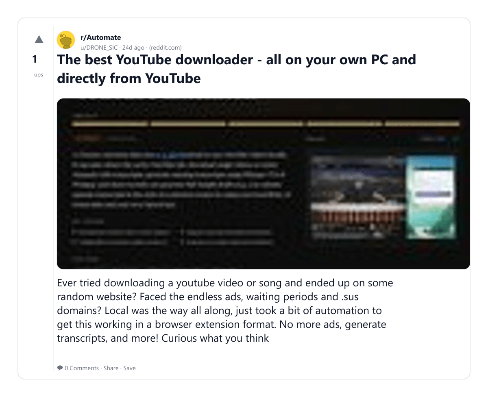

# Reddit Scout — AI job displacement fears automation

Run: 2026-03-04T03-26-44-013Z
Started: 2026-03-04T03:26:44.015Z
Output dir: C:\Users\syash\.openclaw\workspace\reddit-scout\ai-job-displacement-fears-automation\runs\2026-03-04T03-26-44-013Z

Config: topN=10 | subLimit=8 | kinds=top,hot,rising | time=week | limitPerListing=25
Search: AI job displacement fears automation (sort=top t=auto)

## Top terms (from titles + top comments)

- automation (8)
- like (8)
- workers (4)
- good (4)
- thing (4)
- podcast (4)
- help (4)
- need (4)
- means (4)
- production (4)
- real (3)
- some (3)
- which (3)
- work (3)
- less (3)
- have (3)
- about (3)
- charge (2)

## Viral content ideas (derived from these posts)

**1. Personal story → timeline + receipts**
- Hook: Hook with 1 line, then a 5-step timeline; end with the lesson and what you would do differently.

**2. My automation got automated: what I automated back (tools + workflow)**
- Hook: Turn it into a before/after workflow post. Include exact tool stack + steps.

**3. Checklist: how to stay valuable when like hits your team**
- Hook: A numbered checklist (10 items). Make it practical: skills, portfolio, outreach, proof-of-work.

**4. Hot take: workers isn't the problem — good is**
- Hook: Contrarian framing. Back it with 2 examples from the top posts and 1 counterexample.

**5. Debunk thread: "AI will replace thing" vs what's actually happening**
- Hook: Use 3 claims → 3 rebuttals. Cite specific post patterns: layoffs, hiring freezes, role shifts.

**6. Salary/market reality: podcast vs help roles in 2026 (Reddit signals)**
- Hook: Summarize demand signals from comments: who is struggling, who is fine, why.

**7. "What would you do in 30 days?" layoff recovery plan (day-by-day)**
- Hook: 30-day plan: portfolio, interview loops, networking, mental health. Include a downloadable checklist.

**8. Mini-case study: 1 resume bullet → 1 proof project using need**
- Hook: Show how to convert a vague resume claim into a measurable project + writeup.

**9. Community question: which tasks should *never* be delegated to AI?**
- Hook: Ask + give your own top 5. Encourage replies; add a poll if your platform supports it.

**10. Template post: "I used AI to do X, got Y result, here's the exact prompt"**
- Hook: Make it reproducible: prompt, inputs, outputs, gotchas.

**11. Data post: a quick scorecard of the top threads (ups, comments, ratio) + what it signals**
- Hook: Table or bullets; then 3 takeaways.

**12. Meme angle (if relevant): means vs production — job search edition**
- Hook: If your niche is not memes, skip memes; otherwise caption the pattern you saw in comments.

## Top posts (10) + cards

### 1) If workers were in charge, automation could be a good thing.
- Subreddit: r/remoteworks
- Viral score: 648 | Ups: 3535 | Comments: 828 | Upvote ratio: 95%
- Link: https://www.reddit.com/r/remoteworks/comments/1rjg9wm/if_workers_were_in_charge_automation_could_be_a/
- Card (local): ./cards/1rjg9wm.png

### 2) If workers were in charge, automation could be a good thing.
- Subreddit: r/WorkReform
- Viral score: 127 | Ups: 3699 | Comments: 46 | Upvote ratio: 99%
- Link: https://www.reddit.com/r/WorkReform/comments/1rhysd3/if_workers_were_in_charge_automation_could_be_a/
- Card (local): ./cards/1rhysd3.png

### 3) A billionaire just went on the biggest podcast in the world and said America is HEADING for civil war. This is a man who owns stocks, real estate, and companies. David Friedberg, investor, All-In Podcast host broke down how de-dollarization is gutting the middle class in real time.
- Subreddit: r/BhartiyaStockMarket
- Viral score: 101 | Ups: 3478 | Comments: 280 | Upvote ratio: 98%
- Link: https://www.reddit.com/r/BhartiyaStockMarket/comments/1rgtme1/a_billionaire_just_went_on_the_biggest_podcast_in/
- Card (local): ./cards/1rgtme1.png

### 4) Me [35 M] with my wife [36 F] 6 years (9+ as couple), cancer has been a real eye opener (Long)
- Subreddit: r/BestofRedditorUpdates
- Viral score: 67 | Ups: 2065 | Comments: 390 | Upvote ratio: 95%
- Link: https://www.reddit.com/r/BestofRedditorUpdates/comments/1rgtqc2/me_35_m_with_my_wife_36_f_6_years_9_as_couple/
- Card (local): ./cards/1rgtqc2.png

### 5) 19,000 KMs solo drive across the Himalayas
- Subreddit: r/SoloTravel_India
- Viral score: 31 | Ups: 2082 | Comments: 140 | Upvote ratio: 100%
- Link: https://www.reddit.com/r/SoloTravel_India/comments/1reauqh/19000_kms_solo_drive_across_the_himalayas/
- Card (local): ./cards/1reauqh.png

### 6) Utilizing AI Agents/Automation for a non technical person
- Subreddit: r/Automate
- Viral score: 0 | Ups: 1 | Comments: 1 | Upvote ratio: 100%
- Link: https://www.reddit.com/r/Automate/comments/1rcymgs/utilizing_ai_agentsautomation_for_a_non_technical/
- Card (local): ./cards/1rcymgs.png

### 7) JustAutomateSEO — AI-Powered SEO Content Automation for WordPress
- Subreddit: r/Automate
- Viral score: 0 | Ups: 2 | Comments: 1 | Upvote ratio: 58%
- Link: https://www.reddit.com/r/Automate/comments/1r73r2c/justautomateseo_aipowered_seo_content_automation/
- Card (local): ./cards/1r73r2c.png

### 8) Help me in Automation | Non Tech to learn
- Subreddit: r/Automate
- Viral score: 0 | Ups: 3 | Comments: 2 | Upvote ratio: 100%
- Link: https://www.reddit.com/r/Automate/comments/1qvv5a0/help_me_in_automation_non_tech_to_learn/
- Card (local): ./cards/1qvv5a0.png

### 9) Need help debugging a Zapier automation (will pay for a 1 hr consult)
- Subreddit: r/Automate
- Viral score: 0 | Ups: 0 | Comments: 1 | Upvote ratio: 50%
- Link: https://www.reddit.com/r/Automate/comments/1rdagvr/need_help_debugging_a_zapier_automation_will_pay/
- Card (local): ./cards/1rdagvr.png

### 10) The best YouTube downloader - all on your own PC and directly from YouTube
- Subreddit: r/Automate
- Viral score: 0 | Ups: 1 | Comments: 0 | Upvote ratio: 54%
- Link: https://www.reddit.com/r/Automate/comments/1qyo8ro/the_best_youtube_downloader_all_on_your_own_pc/
- Card (local): ./cards/1qyo8ro.png

