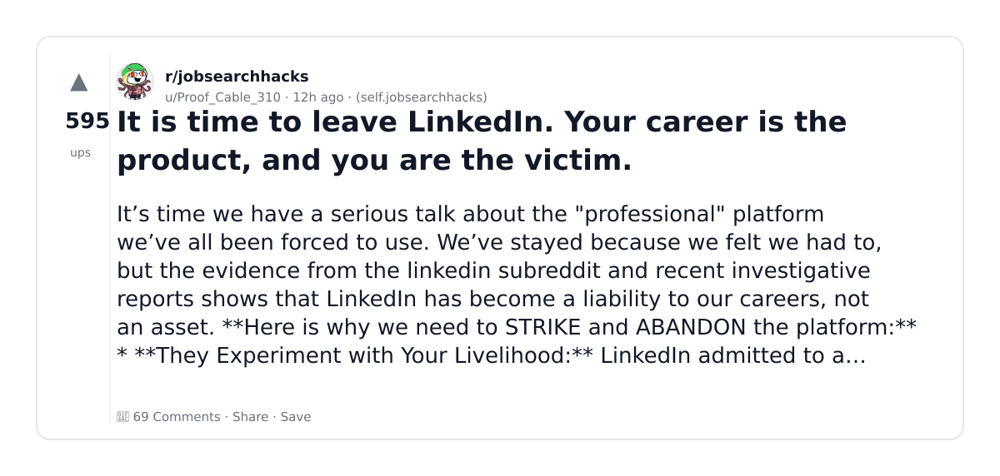
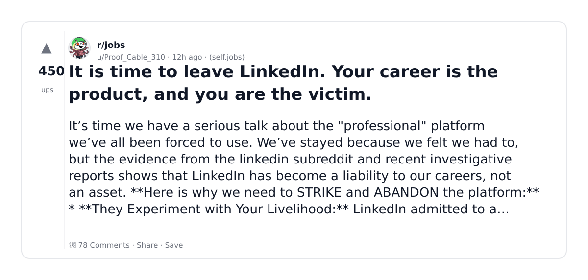
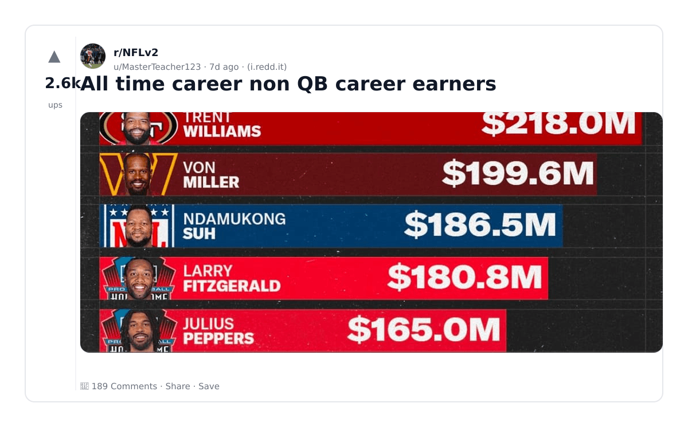
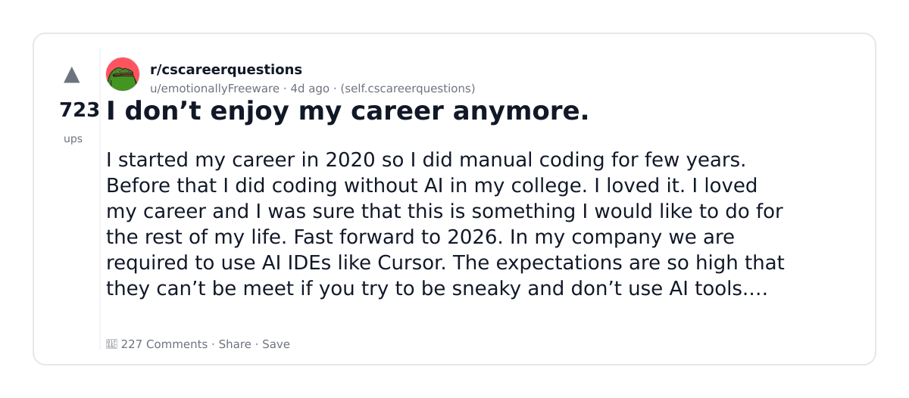
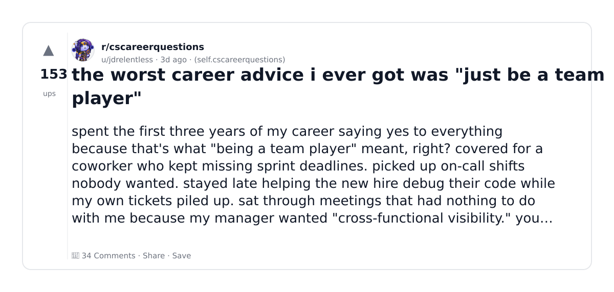
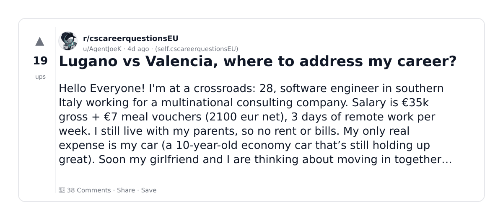
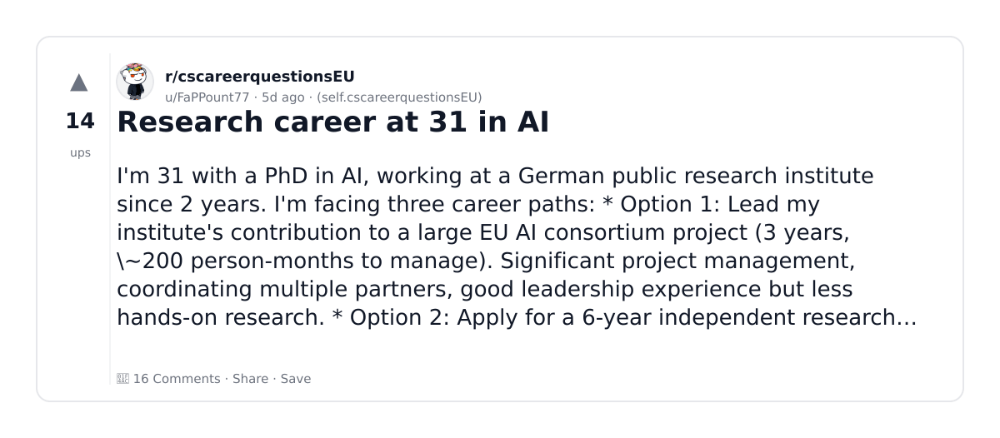
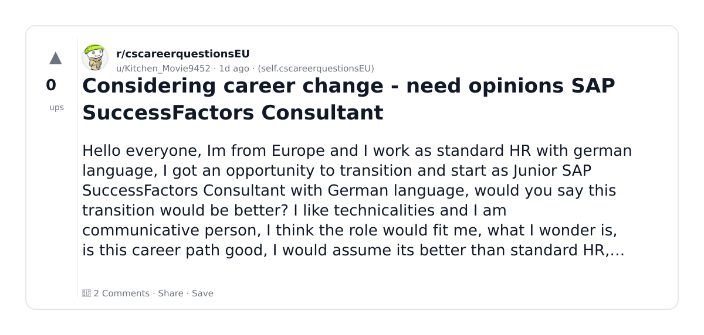
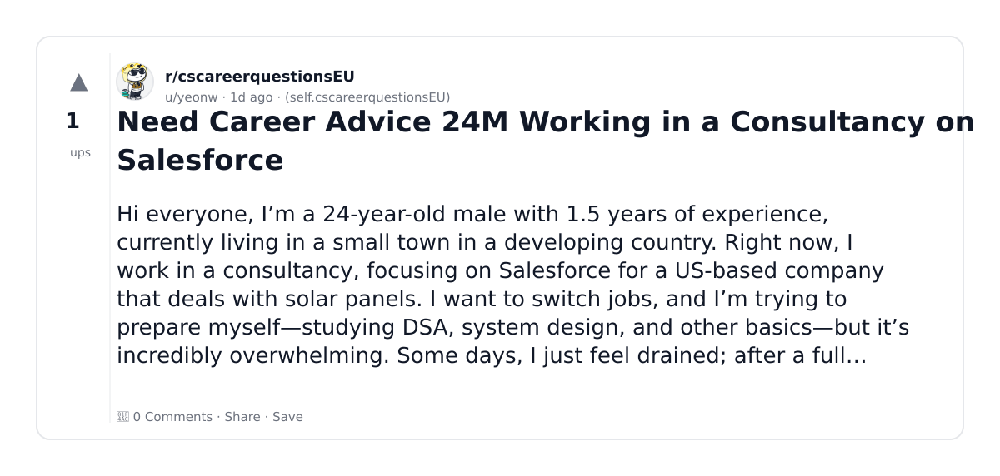

# Reddit Scout — ai ml career

Run: 2026-03-05T17-38-37-222Z
Started: 2026-03-05T17:38:37.223Z
Output dir: /home/ubuntu/.openclaw/workspace/reddit-scout/ai-ml-career/runs/2026-03-05T17-38-37-222Z

Config: topN=10 | subLimit=8 | kinds=top,hot,rising | time=week | limitPerListing=25
Search: ai ml career (sort=top t=auto)

## Top terms (from titles + top comments)

- career (10)
- more (9)
- need (7)
- switzerland (7)
- linkedin (5)
- where (5)
- when (5)
- code (5)
- spain (5)
- salary (5)
- time (4)
- team (4)
- there (4)
- people (4)
- like (4)
- here (4)
- player (3)
- valencia (3)

## Viral content ideas (derived from these posts)

**1. Personal story → timeline + receipts**
- Hook: Hook with 1 line, then a 5-step timeline; end with the lesson and what you would do differently.

**2. My career got automated: what I automated back (tools + workflow)**
- Hook: Turn it into a before/after workflow post. Include exact tool stack + steps.

**3. Checklist: how to stay valuable when more hits your team**
- Hook: A numbered checklist (10 items). Make it practical: skills, portfolio, outreach, proof-of-work.

**4. Hot take: need isn't the problem — switzerland is**
- Hook: Contrarian framing. Back it with 2 examples from the top posts and 1 counterexample.

**5. Debunk thread: "AI will replace linkedin" vs what's actually happening**
- Hook: Use 3 claims → 3 rebuttals. Cite specific post patterns: layoffs, hiring freezes, role shifts.

**6. Salary/market reality: where vs when roles in 2026 (Reddit signals)**
- Hook: Summarize demand signals from comments: who is struggling, who is fine, why.

**7. "What would you do in 30 days?" layoff recovery plan (day-by-day)**
- Hook: 30-day plan: portfolio, interview loops, networking, mental health. Include a downloadable checklist.

**8. Mini-case study: 1 resume bullet → 1 proof project using code**
- Hook: Show how to convert a vague resume claim into a measurable project + writeup.

**9. Community question: which tasks should *never* be delegated to AI?**
- Hook: Ask + give your own top 5. Encourage replies; add a poll if your platform supports it.

**10. Template post: "I used AI to do X, got Y result, here's the exact prompt"**
- Hook: Make it reproducible: prompt, inputs, outputs, gotchas.

**11. Data post: a quick scorecard of the top threads (ups, comments, ratio) + what it signals**
- Hook: Table or bullets; then 3 takeaways.

**12. Meme angle (if relevant): spain vs salary — job search edition**
- Hook: If your niche is not memes, skip memes; otherwise caption the pattern you saw in comments.

## Top posts (9) + cards

### 1) It is time to leave LinkedIn. Your career is the product, and you are the victim.
- Subreddit: r/jobsearchhacks
- Viral score: 131 | Ups: 595 | Comments: 69 | Upvote ratio: 85%
- Link: https://www.reddit.com/r/jobsearchhacks/comments/1rl98g6/it_is_time_to_leave_linkedin_your_career_is_the/
- Card (local): ./cards/1rl98g6.png

### 2) It is time to leave LinkedIn. Your career is the product, and you are the victim.
- Subreddit: r/jobs
- Viral score: 111 | Ups: 450 | Comments: 78 | Upvote ratio: 90%
- Link: https://www.reddit.com/r/jobs/comments/1rl992w/it_is_time_to_leave_linkedin_your_career_is_the/
- Card (local): ./cards/1rl992w.png

### 3) All time career non QB career earners
- Subreddit: r/NFLv2
- Viral score: 37 | Ups: 2591 | Comments: 189 | Upvote ratio: 99%
- Link: https://www.reddit.com/r/NFLv2/comments/1rfdhdj/all_time_career_non_qb_career_earners/
- Card (local): ./cards/1rfdhdj.png

### 4) I don’t enjoy my career anymore.
- Subreddit: r/cscareerquestions
- Viral score: 25 | Ups: 723 | Comments: 227 | Upvote ratio: 90%
- Link: https://www.reddit.com/r/cscareerquestions/comments/1rifn5j/i_dont_enjoy_my_career_anymore/
- Card (local): ./cards/1rifn5j.png

### 5) the worst career advice i ever got was "just be a team player"
- Subreddit: r/cscareerquestions
- Viral score: 5 | Ups: 153 | Comments: 34 | Upvote ratio: 85%
- Link: https://www.reddit.com/r/cscareerquestions/comments/1rje0pe/the_worst_career_advice_i_ever_got_was_just_be_a/
- Card (local): ./cards/1rje0pe.png

### 6) Lugano vs Valencia, where to address my career?
- Subreddit: r/cscareerquestionsEU
- Viral score: 1 | Ups: 19 | Comments: 38 | Upvote ratio: 74%
- Link: https://www.reddit.com/r/cscareerquestionsEU/comments/1rhsfuc/lugano_vs_valencia_where_to_address_my_career/
- Card (local): ./cards/1rhsfuc.png

### 7) Research career at 31 in AI
- Subreddit: r/cscareerquestionsEU
- Viral score: 0 | Ups: 14 | Comments: 16 | Upvote ratio: 82%
- Link: https://www.reddit.com/r/cscareerquestionsEU/comments/1rh2l21/research_career_at_31_in_ai/
- Card (local): ./cards/1rh2l21.png

### 8) Considering career change - need opinions SAP SuccessFactors Consultant
- Subreddit: r/cscareerquestionsEU
- Viral score: 0 | Ups: 0 | Comments: 2 | Upvote ratio: 50%
- Link: https://www.reddit.com/r/cscareerquestionsEU/comments/1rkh2tw/considering_career_change_need_opinions_sap/
- Card (local): ./cards/1rkh2tw.png

### 9) Need Career Advice 24M Working in a Consultancy on Salesforce
- Subreddit: r/cscareerquestionsEU
- Viral score: 0 | Ups: 1 | Comments: 0 | Upvote ratio: 100%
- Link: https://www.reddit.com/r/cscareerquestionsEU/comments/1rksd4k/need_career_advice_24m_working_in_a_consultancy/
- Card (local): ./cards/1rksd4k.png

