# Reddit Scout — AI/ML Roadmap + Career in AI

Run: 2026-03-02T14-08-28-780Z
Started: 2026-03-02T14:08:28.791Z
Output dir: C:\Users\syash\.openclaw\workspace\reddit-scout\ai-ml-roadmap-career-in-ai\runs\2026-03-02T14-08-28-780Z

Config: topN=15 | subLimit=12 | kinds=top,hot,rising | time=all | limitPerListing=25
Search: AI/ML Roadmap + Career in AI (sort=top t=auto)

## Top terms (from titles + top comments)

- have (12)
- code (11)
- https (10)
- symbolica (9)
- courses (8)
- like (8)
- roadmap (7)
- what (7)
- evaluator (7)
- developersindia (7)
- want (6)
- learn (6)
- expression (6)
- please (6)
- projects (5)
- learning (5)
- into (5)
- thanks (5)

## Viral content ideas (derived from these posts)

**1. Personal story → timeline + receipts**
- Hook: Hook with 1 line, then a 5-step timeline; end with the lesson and what you would do differently.

**2. My have got automated: what I automated back (tools + workflow)**
- Hook: Turn it into a before/after workflow post. Include exact tool stack + steps.

**3. Checklist: how to stay valuable when code hits your team**
- Hook: A numbered checklist (10 items). Make it practical: skills, portfolio, outreach, proof-of-work.

**4. Hot take: https isn't the problem — symbolica is**
- Hook: Contrarian framing. Back it with 2 examples from the top posts and 1 counterexample.

**5. Debunk thread: "AI will replace courses" vs what's actually happening**
- Hook: Use 3 claims → 3 rebuttals. Cite specific post patterns: layoffs, hiring freezes, role shifts.

**6. Salary/market reality: like vs roadmap roles in 2026 (Reddit signals)**
- Hook: Summarize demand signals from comments: who is struggling, who is fine, why.

**7. "What would you do in 30 days?" layoff recovery plan (day-by-day)**
- Hook: 30-day plan: portfolio, interview loops, networking, mental health. Include a downloadable checklist.

**8. Mini-case study: 1 resume bullet → 1 proof project using what**
- Hook: Show how to convert a vague resume claim into a measurable project + writeup.

**9. Community question: which tasks should *never* be delegated to AI?**
- Hook: Ask + give your own top 5. Encourage replies; add a poll if your platform supports it.

**10. Template post: "I used AI to do X, got Y result, here's the exact prompt"**
- Hook: Make it reproducible: prompt, inputs, outputs, gotchas.

**11. Data post: a quick scorecard of the top threads (ups, comments, ratio) + what it signals**
- Hook: Table or bullets; then 3 takeaways.

**12. Meme angle (if relevant): evaluator vs developersindia — job search edition**
- Hook: If your niche is not memes, skip memes; otherwise caption the pattern you saw in comments.

## Top posts (15) + cards

### 1) From Software Developer to AI Engineer: The Exact Roadmap I Followed (Projects + Interviews)
- Subreddit: r/learnmachinelearning
- Viral score: 0 | Ups: 396 | Comments: 50 | Upvote ratio: 95%
- Link: https://www.reddit.com/r/learnmachinelearning/comments/1pzcw2y/from_software_developer_to_ai_engineer_the_exact/
- Card (local): ./cards/1pzcw2y.png

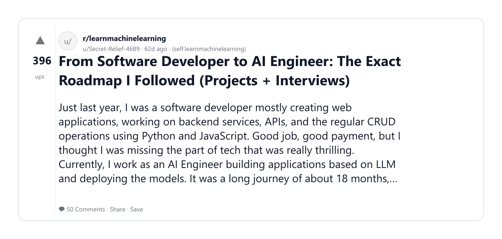

### 2) My Roadmap for ML/AI as an Applied Scientist in FAANG
- Subreddit: r/Btechtards
- Viral score: 0 | Ups: 210 | Comments: 54 | Upvote ratio: 97%
- Link: https://www.reddit.com/r/Btechtards/comments/1o3xftk/my_roadmap_for_mlai_as_an_applied_scientist_in/
- Card (local): ./cards/1o3xftk.png

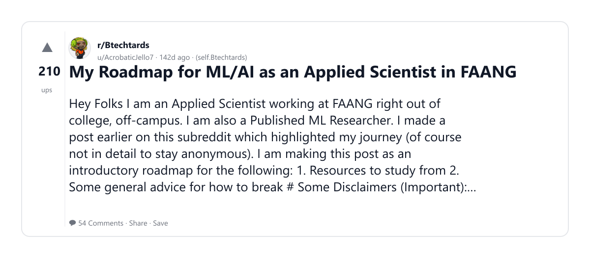

### 3) [Release] SymbAnaFis v0.8.0 - High-Performance Symbolic Math in Rust
- Subreddit: r/rust
- Viral score: 0 | Ups: 12 | Comments: 14 | Upvote ratio: 75%
- Link: https://www.reddit.com/r/rust/comments/1r0oty4/release_symbanafis_v080_highperformance_symbolic/
- Card (local): ./cards/1r0oty4.png

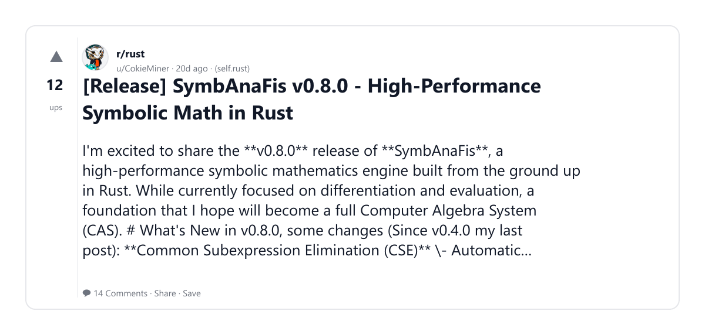

### 4) Need help
- Subreddit: r/Btechtards
- Viral score: 0 | Ups: 30 | Comments: 10 | Upvote ratio: 100%
- Link: https://www.reddit.com/r/Btechtards/comments/1qk1j5h/need_help/
- Card (local): ./cards/1qk1j5h.png

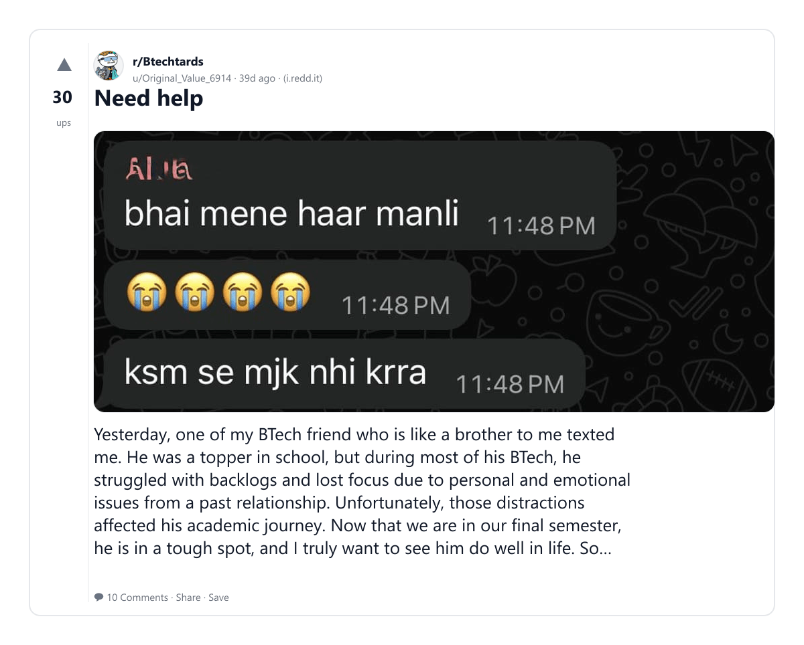

### 5) If you want to learn AI, I found the only learning roadmap you'll ever need (Get a $100K+ Job or be an AI entrepreneur)
- Subreddit: r/learnAIAgents
- Viral score: 0 | Ups: 140 | Comments: 24 | Upvote ratio: 94%
- Link: https://www.reddit.com/r/learnAIAgents/comments/1n9kqd5/if_you_want_to_learn_ai_i_found_the_only_learning/
- Card (local): ./cards/1n9kqd5.png

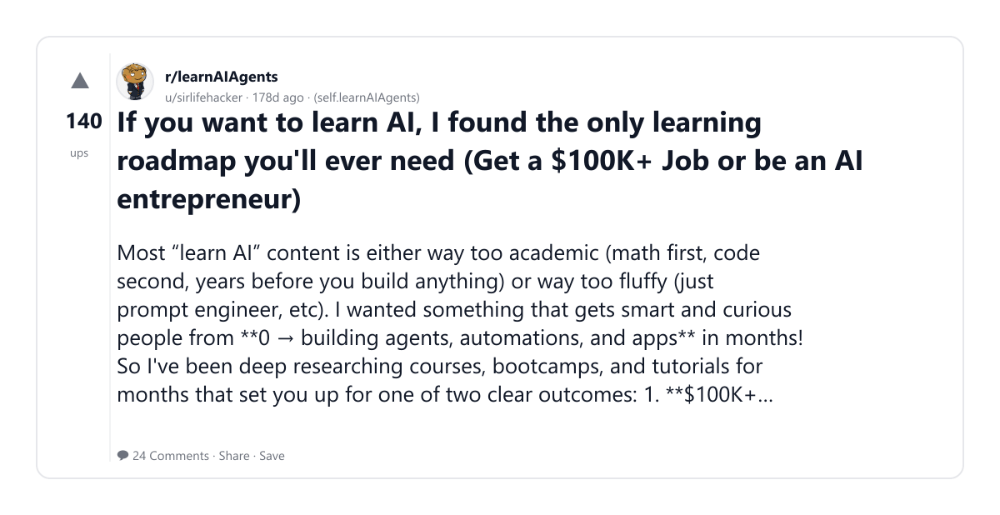

### 6) Switch from SDE (AI/ML role but no real exp) to DS/DA/BA/ML role in 3-4 months??
- Subreddit: r/developersIndia
- Viral score: 0 | Ups: 13 | Comments: 8 | Upvote ratio: 94%
- Link: https://www.reddit.com/r/developersIndia/comments/1qvqyu0/switch_from_sde_aiml_role_but_no_real_exp_to/
- Card (local): ./cards/1qvqyu0.png

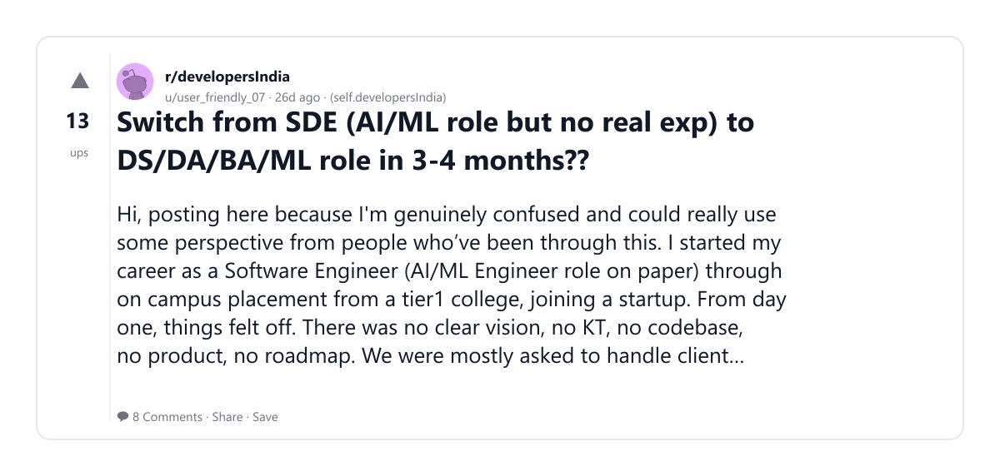

### 7) Transition SWE to AI/ML Engineer in 2025
- Subreddit: r/freshersinfo
- Viral score: 0 | Ups: 113 | Comments: 8 | Upvote ratio: 98%
- Link: https://www.reddit.com/r/freshersinfo/comments/1n2jlzq/transition_swe_to_aiml_engineer_in_2025/
- Card (local): ./cards/1n2jlzq.png

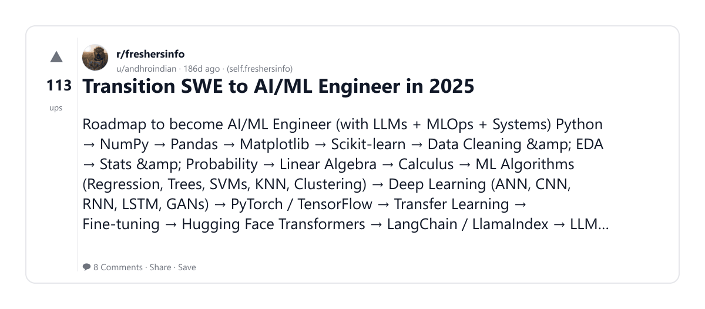

### 8) List of FREE and Best Selling Discounted Courses
- Subreddit: r/udemyfreeebies
- Viral score: 0 | Ups: 14 | Comments: 3 | Upvote ratio: 100%
- Link: https://www.reddit.com/r/udemyfreeebies/comments/1qt8r9y/list_of_free_and_best_selling_discounted_courses/
- Card (local): ./cards/1qt8r9y.png

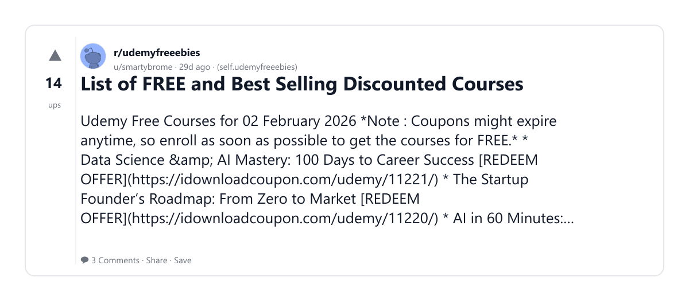

### 9) Udemy Free Courses for 06 February 2026
- Subreddit: r/udemyfreebies
- Viral score: 0 | Ups: 15 | Comments: 1 | Upvote ratio: 100%
- Link: https://www.reddit.com/r/udemyfreebies/comments/1qxcm7z/udemy_free_courses_for_06_february_2026/
- Card (local): ./cards/1qxcm7z.png

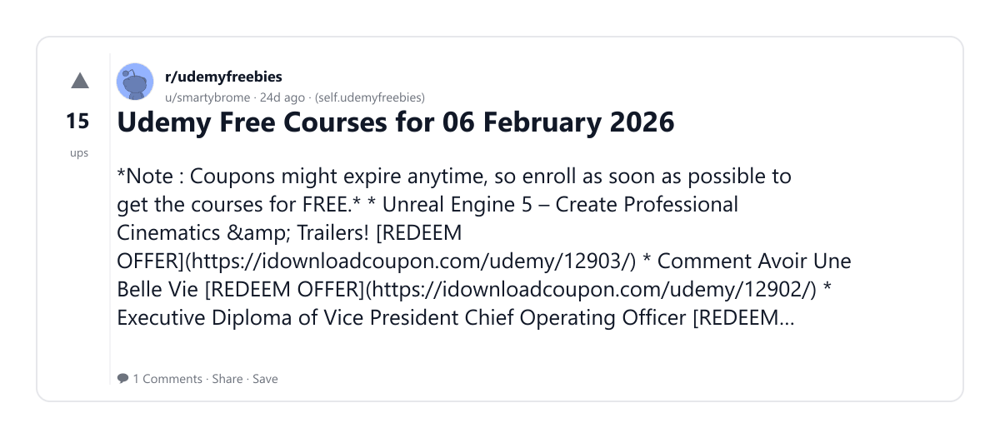

### 10) Unsolicited perspective from a SRE interviewer
- Subreddit: r/ITCareerQuestions
- Viral score: 0 | Ups: 367 | Comments: 50 | Upvote ratio: 97%
- Link: https://www.reddit.com/r/ITCareerQuestions/comments/1346wln/unsolicited_perspective_from_a_sre_interviewer/
- Card (local): ./cards/1346wln.png

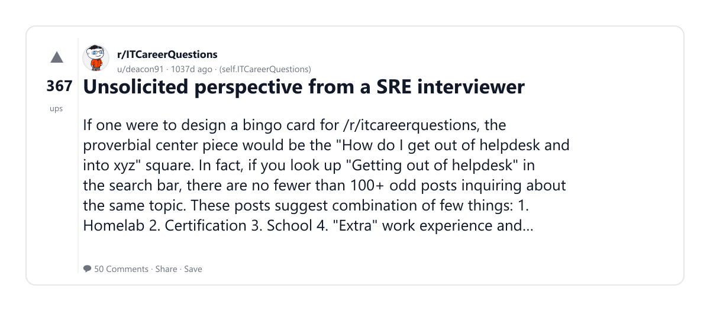

### 11) Udemy Free Courses for 10 February 2026
- Subreddit: r/udemyfreeebies
- Viral score: 0 | Ups: 13 | Comments: 0 | Upvote ratio: 100%
- Link: https://www.reddit.com/r/udemyfreeebies/comments/1r0vrww/udemy_free_courses_for_10_february_2026/
- Card (local): ./cards/1r0vrww.png

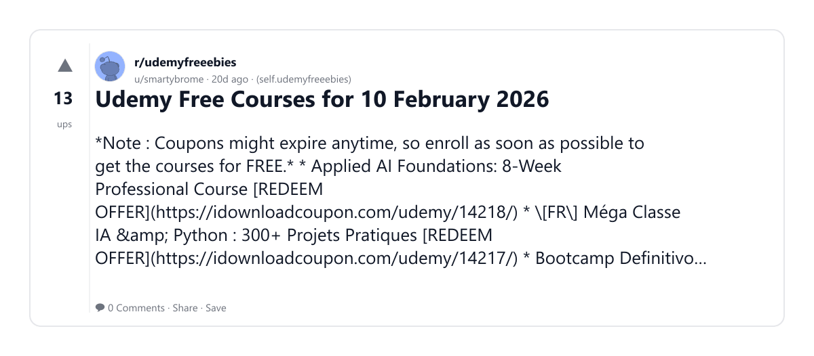

### 12) A clear roadmap to completely learning AI &amp; getting a job by the end of 2025
- Subreddit: r/AgentsOfAI
- Viral score: 0 | Ups: 54 | Comments: 6 | Upvote ratio: 97%
- Link: https://www.reddit.com/r/AgentsOfAI/comments/1n9rzhe/a_clear_roadmap_to_completely_learning_ai_getting/
- Card (local): ./cards/1n9rzhe.png

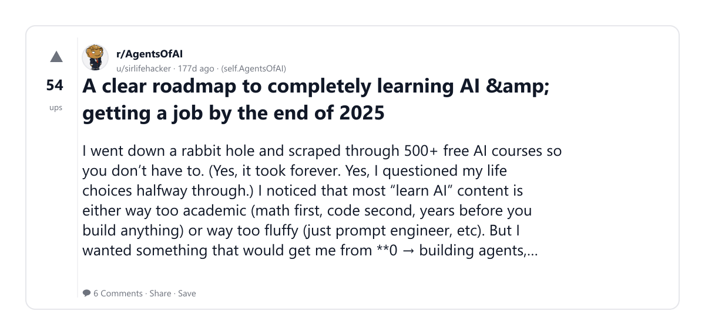

### 13) From a non-IT postdoc to an AI developer: my 10-year journey learning to code
- Subreddit: r/postdoc
- Viral score: 0 | Ups: 32 | Comments: 7 | Upvote ratio: 94%
- Link: https://www.reddit.com/r/postdoc/comments/1o51oiv/from_a_nonit_postdoc_to_an_ai_developer_my_10year/
- Card (local): ./cards/1o51oiv.png

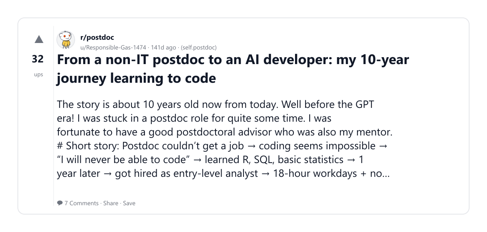

### 14) Getting Into SaaS Sales -Starters Guide (Long Post)
- Subreddit: r/sales
- Viral score: 0 | Ups: 180 | Comments: 40 | Upvote ratio: 97%
- Link: https://www.reddit.com/r/sales/comments/10vdifp/getting_into_saas_sales_starters_guide_long_post/
- Card (local): ./cards/10vdifp.png

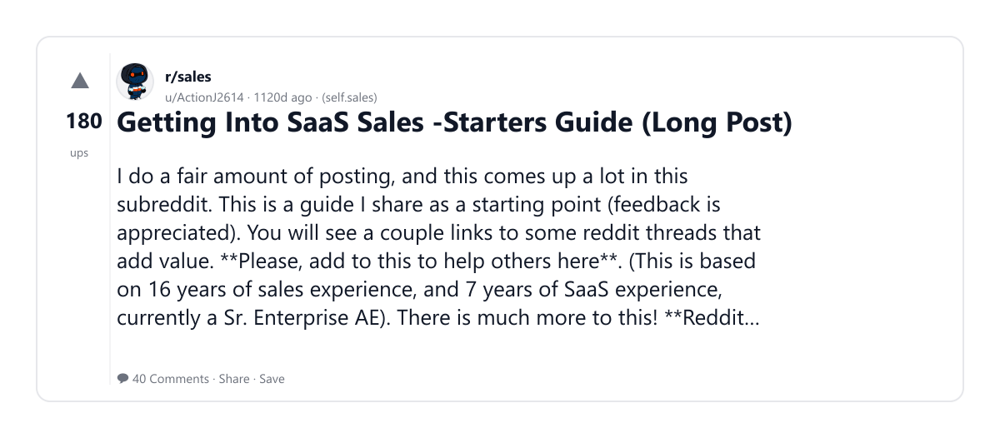

### 15) All Zero To Mastery Courses Are Now 2026-Ready (500+ Lecture Updates)
- Subreddit: r/zerotomasteryio
- Viral score: 0 | Ups: 11 | Comments: 1 | Upvote ratio: 93%
- Link: https://www.reddit.com/r/zerotomasteryio/comments/1q4yst4/all_zero_to_mastery_courses_are_now_2026ready_500/
- Card (local): ./cards/1q4yst4.png

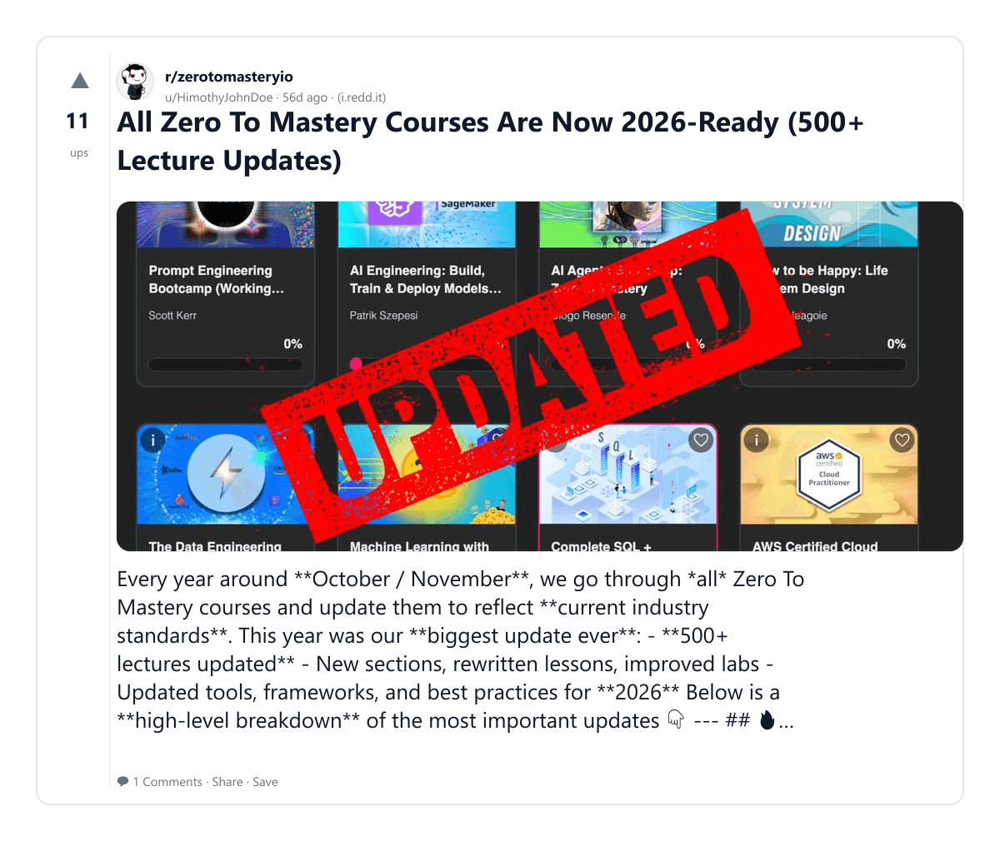
