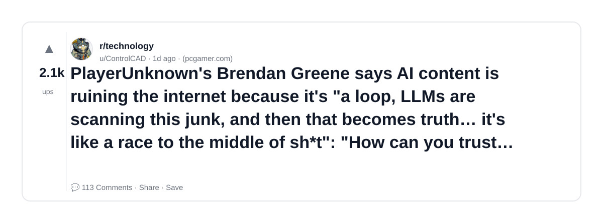

# Reddit Scout — AI Research Papers Agentic AI LLMs ML Engineering

Run: 2026-03-14T20-24-04-463Z
Started: 2026-03-14T20:24:04.464Z
Output dir: /home/ubuntu/.openclaw/workspace/reddit-scout/ai-research-papers-agentic-ai-llms-ml-engineering/runs/2026-03-14T20-24-04-463Z

Config: topN=10 | subLimit=8 | kinds=top,hot,rising | time=week | limitPerListing=25
Search: AI Research Papers Agentic AI LLMs ML Engineering (sort=top t=auto)

## Top terms (from titles + top comments)

- says (2)
- internet (2)
- trust (2)
- answers (2)
- giving (2)
- playerunknown (1)
- brendan (1)
- greene (1)
- content (1)
- ruining (1)
- loop (1)
- llms (1)
- scanning (1)
- junk (1)
- becomes (1)
- truth (1)
- like (1)
- race (1)

## Viral content ideas (derived from these posts)

**1. Personal story → timeline + receipts**
- Hook: Hook with 1 line, then a 5-step timeline; end with the lesson and what you would do differently.

**2. My says got automated: what I automated back (tools + workflow)**
- Hook: Turn it into a before/after workflow post. Include exact tool stack + steps.

**3. Checklist: how to stay valuable when internet hits your team**
- Hook: A numbered checklist (10 items). Make it practical: skills, portfolio, outreach, proof-of-work.

**4. Hot take: trust isn't the problem — answers is**
- Hook: Contrarian framing. Back it with 2 examples from the top posts and 1 counterexample.

**5. Debunk thread: "AI will replace giving" vs what's actually happening**
- Hook: Use 3 claims → 3 rebuttals. Cite specific post patterns: layoffs, hiring freezes, role shifts.

**6. Salary/market reality: playerunknown vs brendan roles in 2026 (Reddit signals)**
- Hook: Summarize demand signals from comments: who is struggling, who is fine, why.

**7. "What would you do in 30 days?" layoff recovery plan (day-by-day)**
- Hook: 30-day plan: portfolio, interview loops, networking, mental health. Include a downloadable checklist.

**8. Mini-case study: 1 resume bullet → 1 proof project using greene**
- Hook: Show how to convert a vague resume claim into a measurable project + writeup.

**9. Community question: which tasks should *never* be delegated to AI?**
- Hook: Ask + give your own top 5. Encourage replies; add a poll if your platform supports it.

**10. Template post: "I used AI to do X, got Y result, here's the exact prompt"**
- Hook: Make it reproducible: prompt, inputs, outputs, gotchas.

**11. Data post: a quick scorecard of the top threads (ups, comments, ratio) + what it signals**
- Hook: Table or bullets; then 3 takeaways.

**12. Meme angle (if relevant): content vs ruining — job search edition**
- Hook: If your niche is not memes, skip memes; otherwise caption the pattern you saw in comments.

## Top posts (1) + cards

### 1) PlayerUnknown's Brendan Greene says AI content is ruining the internet because it's "a loop, LLMs are scanning this junk, and then that becomes truth… it's like a race to the middle of sh*t": "How can you trust stuff that says at the bottom you need to fact-check all the answers I'm giving you?"
- Subreddit: r/technology
- Viral score: 181 | Ups: 2149 | Comments: 113 | Upvote ratio: 97%
- Link: https://www.reddit.com/r/technology/comments/1rsms7s/playerunknowns_brendan_greene_says_ai_content_is/
- Card (local): ./cards/1rsms7s.png

