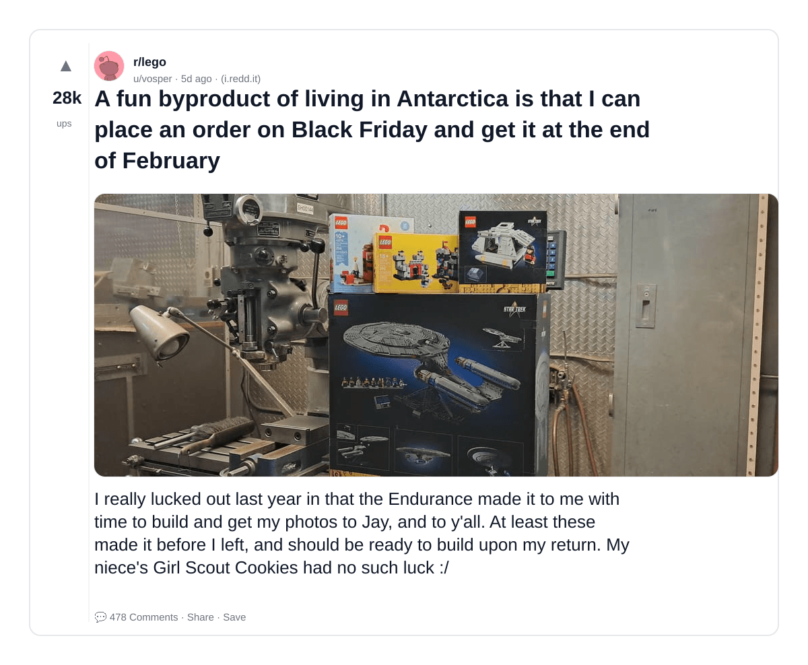
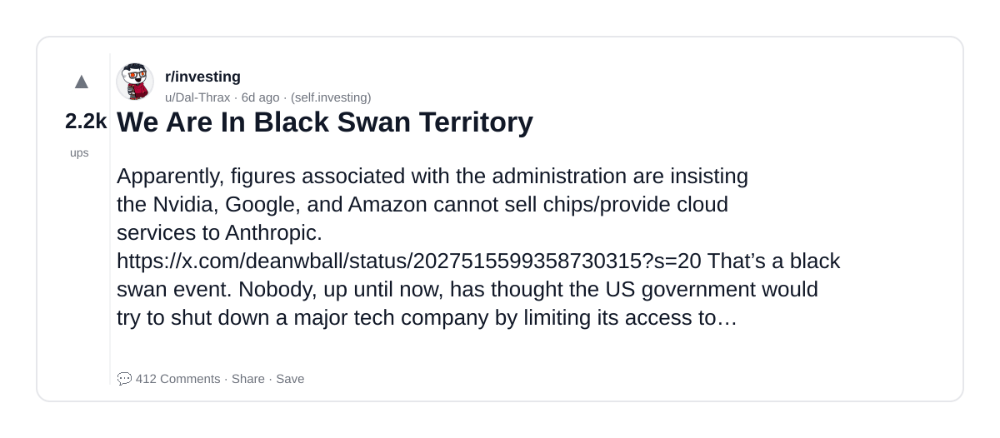
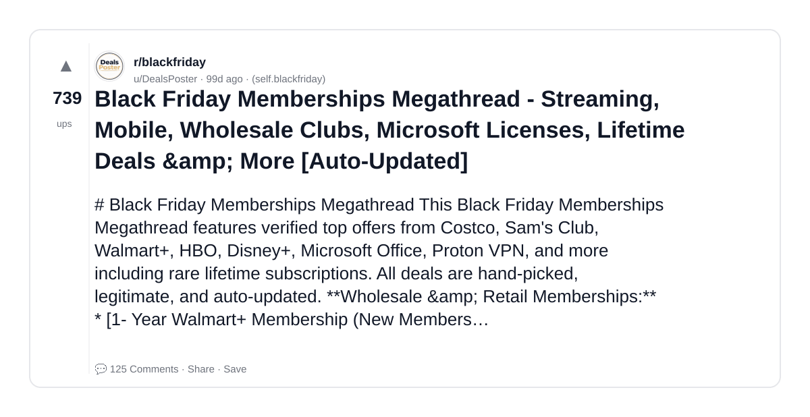
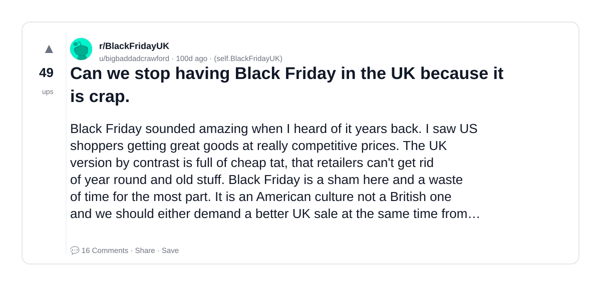
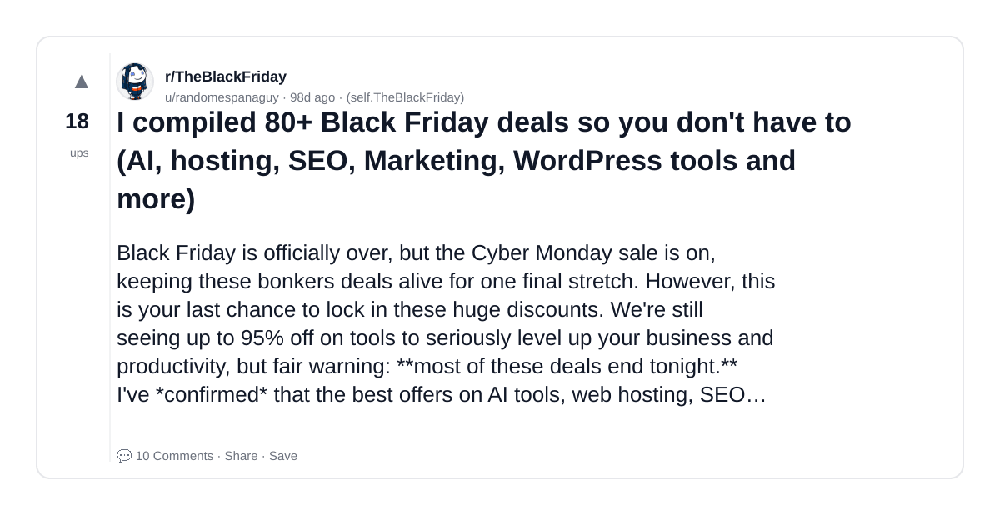
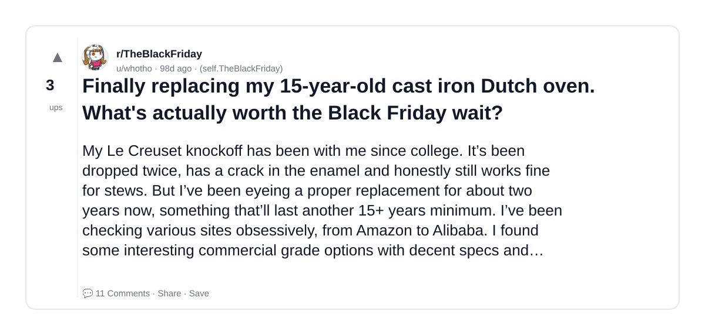
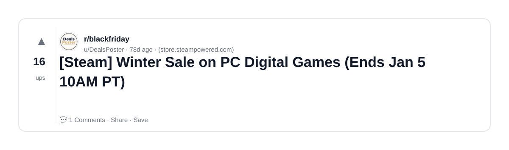
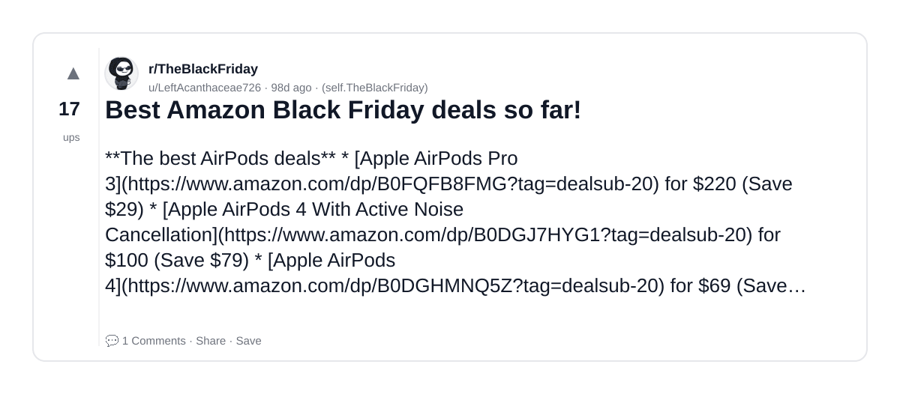
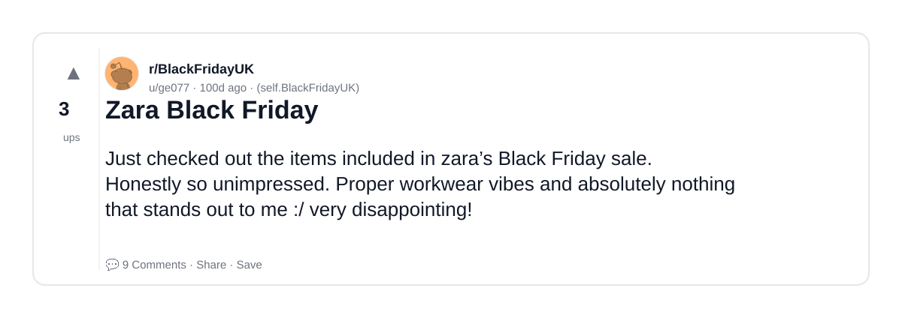
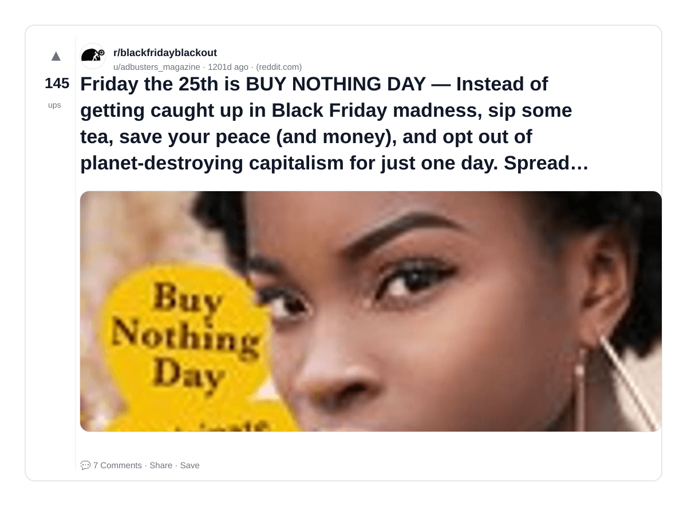

# Reddit Scout — Black Friday Sale and AI

Run: 2026-03-06T12-47-31-858Z
Started: 2026-03-06T12:47:31.858Z
Output dir: /home/ubuntu/.openclaw/workspace/reddit-scout/black-friday-sale-and-ai/runs/2026-03-06T12-47-31-858Z

Config: topN=10 | subLimit=8 | kinds=top,hot,rising | time=week | limitPerListing=25
Search: Black Friday Sale and AI (sort=top t=auto)

## Top terms (from titles + top comments)

- deal (14)
- black (13)
- friday (13)
- please (12)
- expired (10)
- price (10)
- theblackfriday (8)
- moderators (8)
- have (7)
- deals (6)
- sale (6)
- will (6)
- before (6)
- sold (6)
- automatically (6)
- immediately (5)
- reply (5)
- comment (5)

## Viral content ideas (derived from these posts)

**1. Personal story → timeline + receipts**
- Hook: Hook with 1 line, then a 5-step timeline; end with the lesson and what you would do differently.

**2. My deal got automated: what I automated back (tools + workflow)**
- Hook: Turn it into a before/after workflow post. Include exact tool stack + steps.

**3. Checklist: how to stay valuable when black hits your team**
- Hook: A numbered checklist (10 items). Make it practical: skills, portfolio, outreach, proof-of-work.

**4. Hot take: friday isn't the problem — please is**
- Hook: Contrarian framing. Back it with 2 examples from the top posts and 1 counterexample.

**5. Debunk thread: "AI will replace expired" vs what's actually happening**
- Hook: Use 3 claims → 3 rebuttals. Cite specific post patterns: layoffs, hiring freezes, role shifts.

**6. Salary/market reality: price vs theblackfriday roles in 2026 (Reddit signals)**
- Hook: Summarize demand signals from comments: who is struggling, who is fine, why.

**7. "What would you do in 30 days?" layoff recovery plan (day-by-day)**
- Hook: 30-day plan: portfolio, interview loops, networking, mental health. Include a downloadable checklist.

**8. Mini-case study: 1 resume bullet → 1 proof project using moderators**
- Hook: Show how to convert a vague resume claim into a measurable project + writeup.

**9. Community question: which tasks should *never* be delegated to AI?**
- Hook: Ask + give your own top 5. Encourage replies; add a poll if your platform supports it.

**10. Template post: "I used AI to do X, got Y result, here's the exact prompt"**
- Hook: Make it reproducible: prompt, inputs, outputs, gotchas.

**11. Data post: a quick scorecard of the top threads (ups, comments, ratio) + what it signals**
- Hook: Table or bullets; then 3 takeaways.

**12. Meme angle (if relevant): have vs deals — job search edition**
- Hook: If your niche is not memes, skip memes; otherwise caption the pattern you saw in comments.

## Top posts (10) + cards

### 1) A fun byproduct of living in Antarctica is that I can place an order on Black Friday and get it at the end of February
- Subreddit: r/lego
- Viral score: 564 | Ups: 27644 | Comments: 478 | Upvote ratio: 97%
- Link: https://www.reddit.com/r/lego/comments/1rhlrs9/a_fun_byproduct_of_living_in_antarctica_is_that_i/
- Card (local): ./cards/1rhlrs9.png

### 2) We Are In Black Swan Territory
- Subreddit: r/investing
- Viral score: 40 | Ups: 2226 | Comments: 412 | Upvote ratio: 88%
- Link: https://www.reddit.com/r/investing/comments/1rgryhf/we_are_in_black_swan_territory/
- Card (local): ./cards/1rgryhf.png

### 3) Black Friday Memberships Megathread - Streaming, Mobile, Wholesale Clubs, Microsoft Licenses, Lifetime Deals &amp; More [Auto-Updated]
- Subreddit: r/blackfriday
- Viral score: 0 | Ups: 739 | Comments: 125 | Upvote ratio: 99%
- Link: https://www.reddit.com/r/blackfriday/comments/1p88h1d/black_friday_memberships_megathread_streaming/
- Card (local): ./cards/1p88h1d.png

### 4) Can we stop having Black Friday in the UK because it is crap.
- Subreddit: r/BlackFridayUK
- Viral score: 0 | Ups: 49 | Comments: 16 | Upvote ratio: 95%
- Link: https://www.reddit.com/r/BlackFridayUK/comments/1p75dcz/can_we_stop_having_black_friday_in_the_uk_because/
- Card (local): ./cards/1p75dcz.png

### 5) I compiled 80+ Black Friday deals so you don't have to (AI, hosting, SEO, Marketing, WordPress tools and more)
- Subreddit: r/TheBlackFriday
- Viral score: 0 | Ups: 18 | Comments: 10 | Upvote ratio: 100%
- Link: https://www.reddit.com/r/TheBlackFriday/comments/1p8oea5/i_compiled_80_black_friday_deals_so_you_dont_have/
- Card (local): ./cards/1p8oea5.png

### 6) Finally replacing my 15-year-old cast iron Dutch oven. What's actually worth the Black Friday wait?
- Subreddit: r/TheBlackFriday
- Viral score: 0 | Ups: 3 | Comments: 11 | Upvote ratio: 81%
- Link: https://www.reddit.com/r/TheBlackFriday/comments/1p95t86/finally_replacing_my_15yearold_cast_iron_dutch/
- Card (local): ./cards/1p95t86.png

### 7) [Steam] Winter Sale on PC Digital Games (Ends Jan 5 10AM PT)
- Subreddit: r/blackfriday
- Viral score: 0 | Ups: 16 | Comments: 1 | Upvote ratio: 91%
- Link: https://www.reddit.com/r/blackfriday/comments/1pq69lc/steam_winter_sale_on_pc_digital_games_ends_jan_5/
- Card (local): ./cards/1pq69lc.png

### 8) Best Amazon Black Friday deals so far!
- Subreddit: r/TheBlackFriday
- Viral score: 0 | Ups: 17 | Comments: 1 | Upvote ratio: 95%
- Link: https://www.reddit.com/r/TheBlackFriday/comments/1p8y4zc/best_amazon_black_friday_deals_so_far/
- Card (local): ./cards/1p8y4zc.png

### 9) Zara Black Friday
- Subreddit: r/BlackFridayUK
- Viral score: 0 | Ups: 3 | Comments: 9 | Upvote ratio: 100%
- Link: https://www.reddit.com/r/BlackFridayUK/comments/1p7kepo/zara_black_friday/
- Card (local): ./cards/1p7kepo.png

### 10) Friday the 25th is BUY NOTHING DAY — Instead of getting caught up in Black Friday madness, sip some tea, save your peace (and money), and opt out of planet-destroying capitalism for just one day. Spread the word (and the memes).
- Subreddit: r/blackfridayblackout
- Viral score: 0 | Ups: 145 | Comments: 7 | Upvote ratio: 97%
- Link: https://www.reddit.com/r/blackfridayblackout/comments/z1fznp/friday_the_25th_is_buy_nothing_day_instead_of/
- Card (local): ./cards/z1fznp.png

