# Reddit Scout — Epstein Island

Run: 2026-02-28T03-13-58-169Z
Started: 2026-02-28T03:13:58.170Z
Output dir: C:\Users\syash\.openclaw\workspace\reddit-scout\epstein-island\runs\2026-02-28T03-13-58-169Z

Config: topN=15 | subLimit=10 | kinds=top,hot,rising | time=all | limitPerListing=25
Search: epstein island list ghislaine maxwell flight logs (sort=top t=year)

## Top terms (from titles + top comments)

- epstein (32)
- files (23)
- against (17)
- about (16)
- crimes (13)
- trump (10)
- some (9)
- attia (9)
- more (9)
- like (9)
- news (8)
- humanity (8)
- have (8)
- said (8)
- justice (7)
- department (7)
- 4chan (7)
- death (7)

## Viral content ideas (derived from these posts)

**1. Personal story → timeline + receipts**
- Hook: Hook with 1 line, then a 5-step timeline; end with the lesson and what you would do differently.

**2. My epstein got automated: what I automated back (tools + workflow)**
- Hook: Turn it into a before/after workflow post. Include exact tool stack + steps.

**3. Checklist: how to stay valuable when files hits your team**
- Hook: A numbered checklist (10 items). Make it practical: skills, portfolio, outreach, proof-of-work.

**4. Hot take: against isn't the problem — about is**
- Hook: Contrarian framing. Back it with 2 examples from the top posts and 1 counterexample.

**5. Debunk thread: "AI will replace crimes" vs what's actually happening**
- Hook: Use 3 claims → 3 rebuttals. Cite specific post patterns: layoffs, hiring freezes, role shifts.

**6. Salary/market reality: trump vs some roles in 2026 (Reddit signals)**
- Hook: Summarize demand signals from comments: who is struggling, who is fine, why.

**7. "What would you do in 30 days?" layoff recovery plan (day-by-day)**
- Hook: 30-day plan: portfolio, interview loops, networking, mental health. Include a downloadable checklist.

**8. Mini-case study: 1 resume bullet → 1 proof project using attia**
- Hook: Show how to convert a vague resume claim into a measurable project + writeup.

**9. Community question: which tasks should *never* be delegated to AI?**
- Hook: Ask + give your own top 5. Encourage replies; add a poll if your platform supports it.

**10. Template post: "I used AI to do X, got Y result, here's the exact prompt"**
- Hook: Make it reproducible: prompt, inputs, outputs, gotchas.

**11. Data post: a quick scorecard of the top threads (ups, comments, ratio) + what it signals**
- Hook: Table or bullets; then 3 takeaways.

**12. Meme angle (if relevant): more vs like — job search edition**
- Hook: If your niche is not memes, skip memes; otherwise caption the pattern you saw in comments.

## Top posts (15) + cards

### 1) DOJ reposts purported photo of Howard Lutnick on Epstein's island
- Subreddit: r/news
- Viral score: 3279 | Ups: 8021 | Comments: 196 | Upvote ratio: 98%
- Link: https://www.reddit.com/r/news/comments/1rgew44/doj_reposts_purported_photo_of_howard_lutnick_on/
- Card (local): ./cards/1rgew44.png

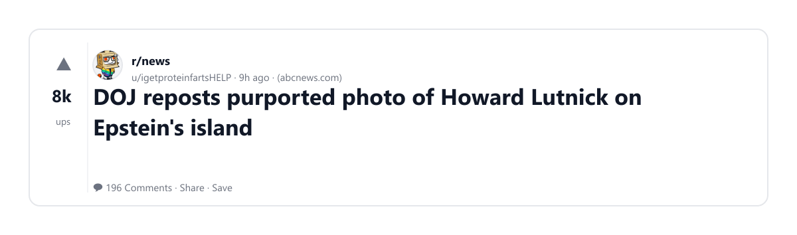

### 2) Chuck Schumer: "There is a Massive Cover-up going on in the Justice Department to protect Donal Trump and people associated with Jeffrey Epstein" | Feb 26, 2026
- Subreddit: r/Epstein
- Viral score: 2453 | Ups: 18529 | Comments: 809 | Upvote ratio: 97%
- Link: https://www.reddit.com/r/Epstein/comments/1rfp0na/chuck_schumer_there_is_a_massive_coverup_going_on/
- Card (local): ./cards/1rfp0na.png

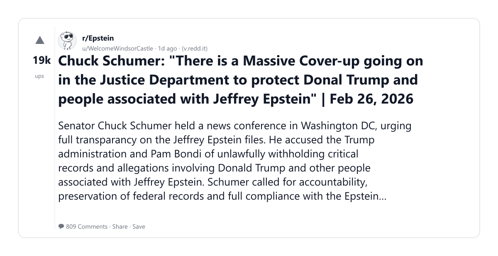

### 3) NPR IS REPORTING THAT DOJ HAS BEEN WITHOLDING FILES RELATED TO TRUMP SEXUALLY ASSAULTING MINORS
- Subreddit: r/Epstein
- Viral score: 1320 | Ups: 35347 | Comments: 1372 | Upvote ratio: 96%
- Link: https://www.reddit.com/r/Epstein/comments/1rdhzjv/npr_is_reporting_that_doj_has_been_witholding/
- Card (local): ./cards/1rdhzjv.png

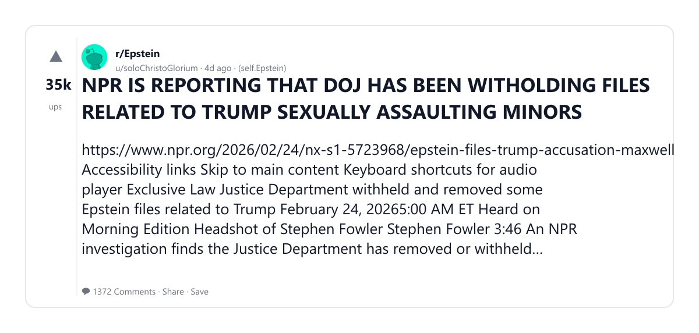

### 4) 4Chan knew about Jeffrey Epstein's death 38 minutes before the rest of the world. The FBI tried to figure out how.
- Subreddit: r/Epstein
- Viral score: 1053 | Ups: 12916 | Comments: 525 | Upvote ratio: 97%
- Link: https://www.reddit.com/r/Epstein/comments/1rfcsg2/4chan_knew_about_jeffrey_epsteins_death_38/
- Card (local): ./cards/1rfcsg2.png

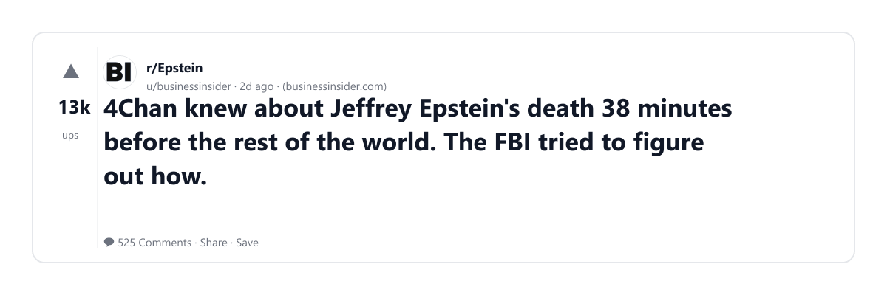

### 5) Nancy Mace Introduces Death Penalty Bill for Child Rapists
- Subreddit: r/Epstein
- Viral score: 991 | Ups: 3346 | Comments: 425 | Upvote ratio: 97%
- Link: https://www.reddit.com/r/Epstein/comments/1rg6dem/nancy_mace_introduces_death_penalty_bill_for/
- Card (local): ./cards/1rg6dem.png

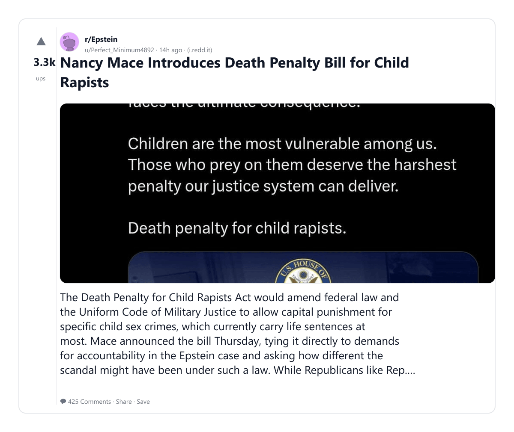

### 6) Justice Department withheld and removed some Epstein files related to Trump
- Subreddit: r/news
- Viral score: 919 | Ups: 28315 | Comments: 736 | Upvote ratio: 98%
- Link: https://www.reddit.com/r/news/comments/1rdgzy4/justice_department_withheld_and_removed_some/
- Card (local): ./cards/1rdgzy4.png

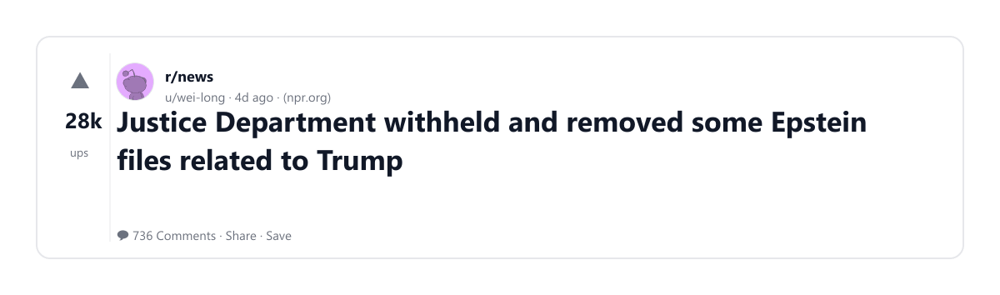

### 7) Gunman shot dead in Mar-a-Lago was ‘fixated on Epstein files’ and avid Trump supporter, friends say | The Independent
- Subreddit: r/news
- Viral score: 892 | Ups: 34765 | Comments: 1166 | Upvote ratio: 96%
- Link: https://www.reddit.com/r/news/comments/1rchbpy/gunman_shot_dead_in_maralago_was_fixated_on/
- Card (local): ./cards/1rchbpy.png

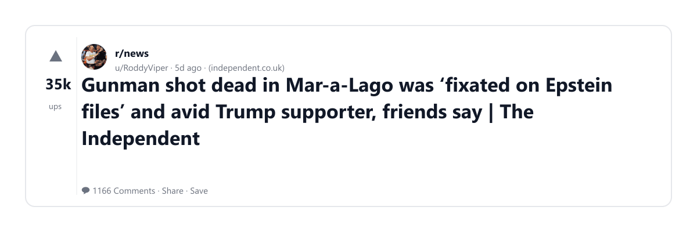

### 8) Found the woman Bill Clinton was swimming with.
- Subreddit: r/Epstein
- Viral score: 820 | Ups: 2976 | Comments: 463 | Upvote ratio: 97%
- Link: https://www.reddit.com/r/Epstein/comments/1rg4kio/found_the_woman_bill_clinton_was_swimming_with/
- Card (local): ./cards/1rg4kio.png

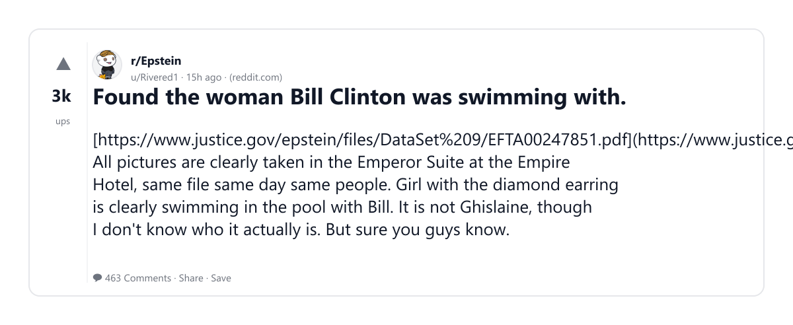

### 9) WHY ARE POSTS AND COMMENTS BEING AGGRESSIVELY REMOVED BY MODERATORS? WE NEED ANSWERS NOW!
- Subreddit: r/Epstein
- Viral score: 707 | Ups: 315 | Comments: 101 | Upvote ratio: 91%
- Link: https://www.reddit.com/r/Epstein/comments/1rgopfr/why_are_posts_and_comments_being_aggressively/
- Card (local): ./cards/1rgopfr.png

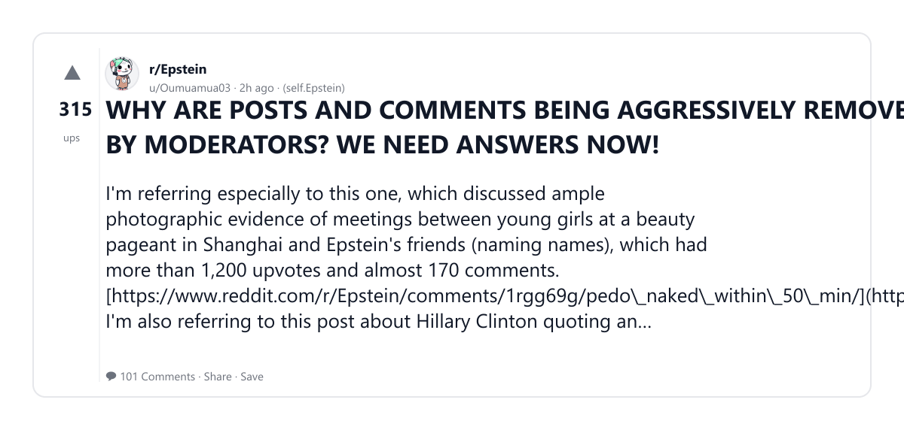

### 10) Epstein Files Reveal Former US Ambassador to Mexico Impregnated an 11-Year-Old | IBTimes UK
- Subreddit: r/Epstein
- Viral score: 632 | Ups: 22232 | Comments: 798 | Upvote ratio: 98%
- Link: https://www.reddit.com/r/Epstein/comments/1rd0pni/epstein_files_reveal_former_us_ambassador_to/
- Card (local): ./cards/1rd0pni.png

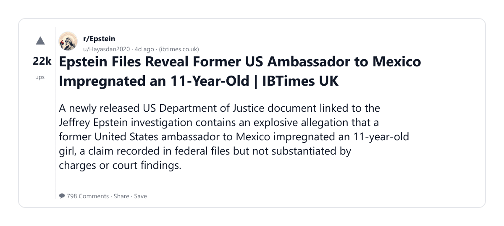

### 11) The FBI's NYC office was "hacked" in 2023, the night of the Superbowl, "erasing" some 100TB of data from evidence due to the intrusion.
- Subreddit: r/Epstein
- Viral score: 618 | Ups: 980 | Comments: 91 | Upvote ratio: 99%
- Link: https://www.reddit.com/r/Epstein/comments/1rgjgwc/the_fbis_nyc_office_was_hacked_in_2023_the_night/
- Card (local): ./cards/1rgjgwc.png

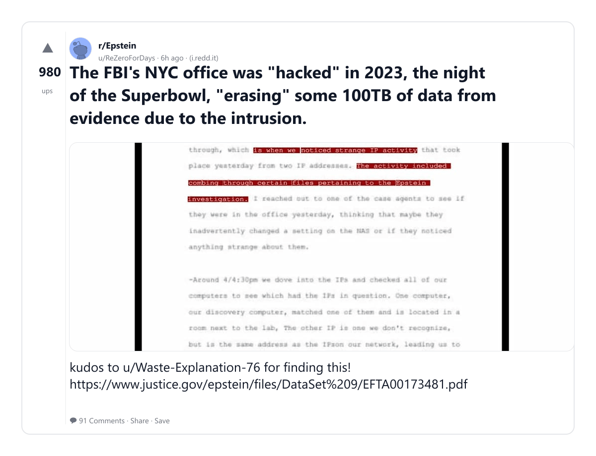

### 12) Federal statement on Jeffrey Epstein's death dated day before he was found dead
- Subreddit: r/news
- Viral score: 536 | Ups: 99089 | Comments: 2789 | Upvote ratio: 96%
- Link: https://www.reddit.com/r/news/comments/1qzf47y/federal_statement_on_jeffrey_epsteins_death_dated/
- Card (local): ./cards/1qzf47y.png

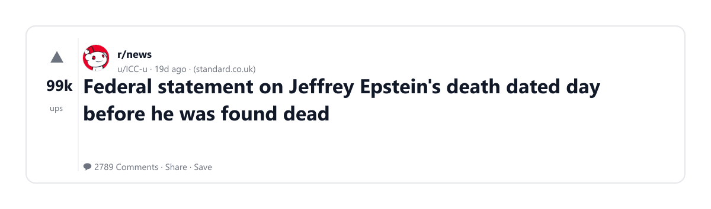

### 13) Peter Attia resigns from CBS News following Epstein backlash
- Subreddit: r/news
- Viral score: 528 | Ups: 20056 | Comments: 417 | Upvote ratio: 98%
- Link: https://www.reddit.com/r/news/comments/1rd2m4z/peter_attia_resigns_from_cbs_news_following/
- Card (local): ./cards/1rd2m4z.png

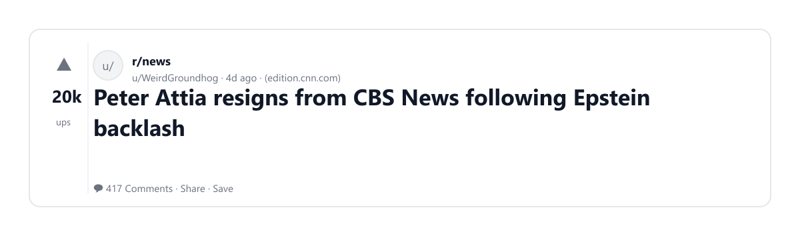

### 14) Epstein files suggest acts that may amount to crimes against humanity, say UN experts
- Subreddit: r/news
- Viral score: 528 | Ups: 50218 | Comments: 1112 | Upvote ratio: 98%
- Link: https://www.reddit.com/r/news/comments/1r7wxqh/epstein_files_suggest_acts_that_may_amount_to/
- Card (local): ./cards/1r7wxqh.png

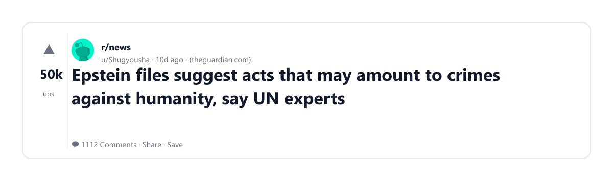

### 15) Rothschild: The name that appears 12,000 times in the Epstein files and no one wants to say
- Subreddit: r/Epstein
- Viral score: 504 | Ups: 10089 | Comments: 617 | Upvote ratio: 97%
- Link: https://www.reddit.com/r/Epstein/comments/1rej4rn/rothschild_the_name_that_appears_12000_times_in/
- Card (local): ./cards/1rej4rn.png

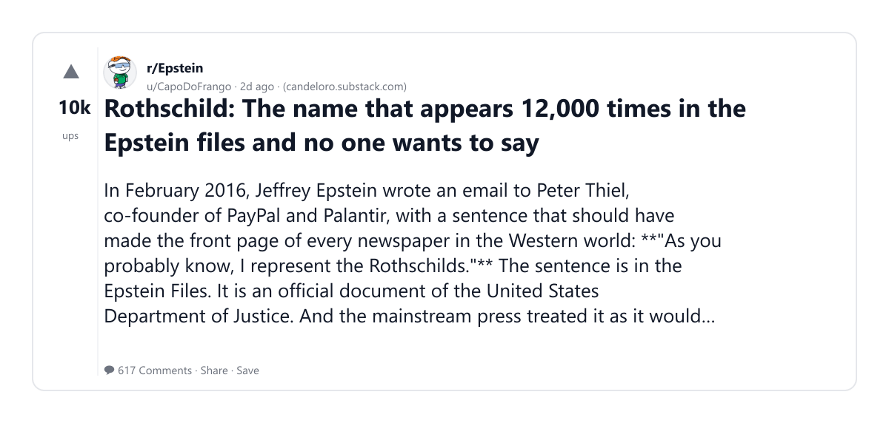
