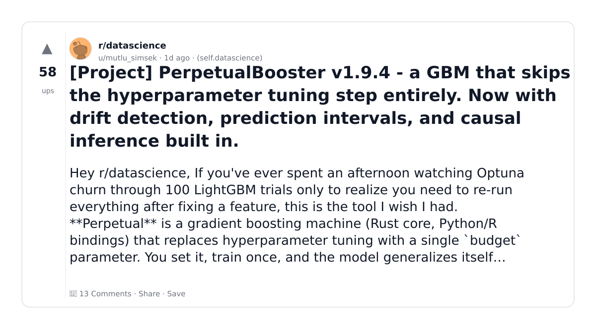
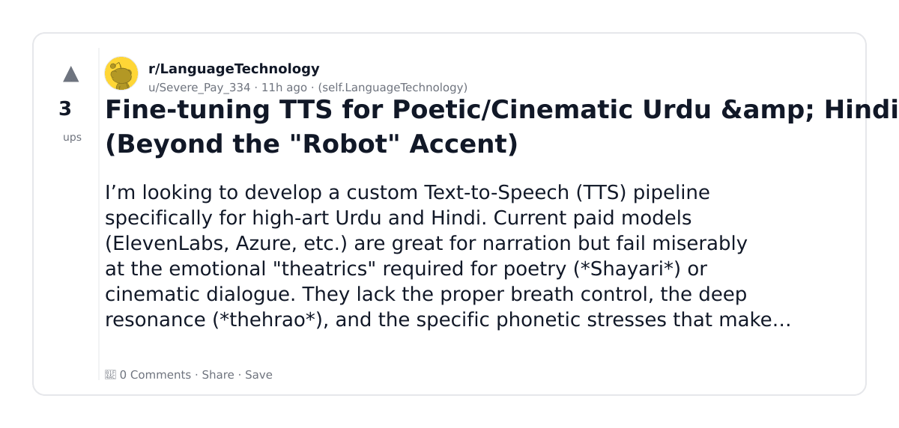

# Reddit Scout — Fine Tuning of LLM

Run: 2026-03-05T20-48-28-840Z
Started: 2026-03-05T20:48:28.841Z
Output dir: /home/ubuntu/.openclaw/workspace/reddit-scout/fine-tuning-of-llm/runs/2026-03-05T20-48-28-840Z

Config: topN=10 | subLimit=15 | kinds=top,hot | time=month | limitPerListing=25
Search: fine tuning LLM language model training (sort=top t=auto)

## Top terms (from titles + top comments)

- tuning (3)
- hyperparameter (2)
- drift (2)
- prediction (2)
- model (2)
- part (2)
- project (1)
- perpetualbooster (1)
- skips (1)
- step (1)
- entirely (1)
- detection (1)
- intervals (1)
- causal (1)
- inference (1)
- built (1)
- fine (1)
- poetic (1)

## Viral content ideas (derived from these posts)

**1. Personal story → timeline + receipts**
- Hook: Hook with 1 line, then a 5-step timeline; end with the lesson and what you would do differently.

**2. My tuning got automated: what I automated back (tools + workflow)**
- Hook: Turn it into a before/after workflow post. Include exact tool stack + steps.

**3. Checklist: how to stay valuable when hyperparameter hits your team**
- Hook: A numbered checklist (10 items). Make it practical: skills, portfolio, outreach, proof-of-work.

**4. Hot take: drift isn't the problem — prediction is**
- Hook: Contrarian framing. Back it with 2 examples from the top posts and 1 counterexample.

**5. Debunk thread: "AI will replace model" vs what's actually happening**
- Hook: Use 3 claims → 3 rebuttals. Cite specific post patterns: layoffs, hiring freezes, role shifts.

**6. Salary/market reality: part vs project roles in 2026 (Reddit signals)**
- Hook: Summarize demand signals from comments: who is struggling, who is fine, why.

**7. "What would you do in 30 days?" layoff recovery plan (day-by-day)**
- Hook: 30-day plan: portfolio, interview loops, networking, mental health. Include a downloadable checklist.

**8. Mini-case study: 1 resume bullet → 1 proof project using perpetualbooster**
- Hook: Show how to convert a vague resume claim into a measurable project + writeup.

**9. Community question: which tasks should *never* be delegated to AI?**
- Hook: Ask + give your own top 5. Encourage replies; add a poll if your platform supports it.

**10. Template post: "I used AI to do X, got Y result, here's the exact prompt"**
- Hook: Make it reproducible: prompt, inputs, outputs, gotchas.

**11. Data post: a quick scorecard of the top threads (ups, comments, ratio) + what it signals**
- Hook: Table or bullets; then 3 takeaways.

**12. Meme angle (if relevant): skips vs step — job search edition**
- Hook: If your niche is not memes, skip memes; otherwise caption the pattern you saw in comments.

## Top posts (2) + cards

### 1) [Project] PerpetualBooster v1.9.4 - a GBM that skips the hyperparameter tuning step entirely. Now with drift detection, prediction intervals, and causal inference built in.
- Subreddit: r/datascience
- Viral score: 4 | Ups: 58 | Comments: 13 | Upvote ratio: 99%
- Link: https://www.reddit.com/r/datascience/comments/1rklzpd/project_perpetualbooster_v194_a_gbm_that_skips/
- Card (local): ./cards/1rklzpd.png

### 2) Fine-tuning TTS for Poetic/Cinematic Urdu &amp; Hindi (Beyond the "Robot" Accent)
- Subreddit: r/LanguageTechnology
- Viral score: 0 | Ups: 3 | Comments: 0 | Upvote ratio: 100%
- Link: https://www.reddit.com/r/LanguageTechnology/comments/1rldptw/finetuning_tts_for_poeticcinematic_urdu_hindi/
- Card (local): ./cards/1rldptw.png

