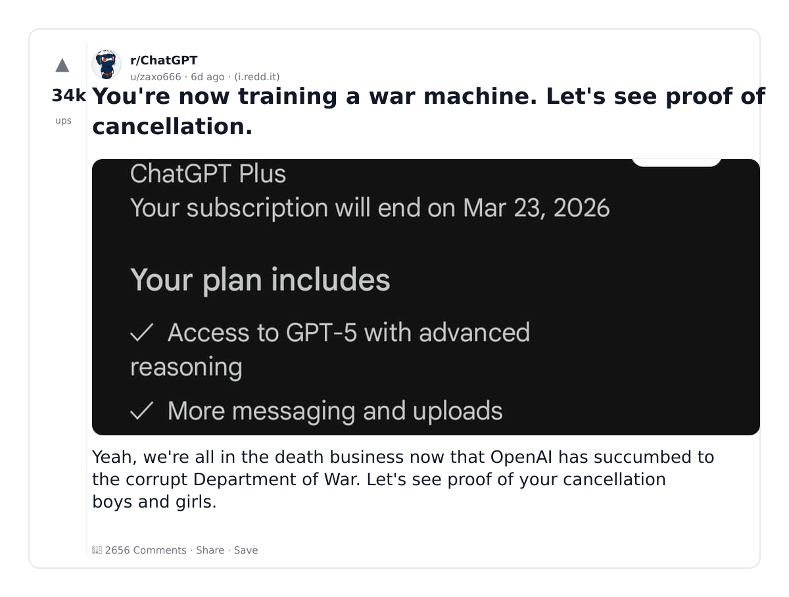
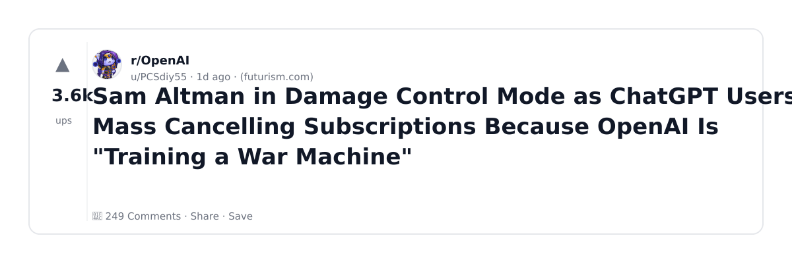
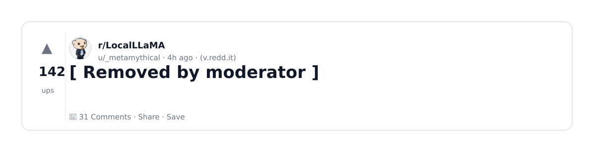
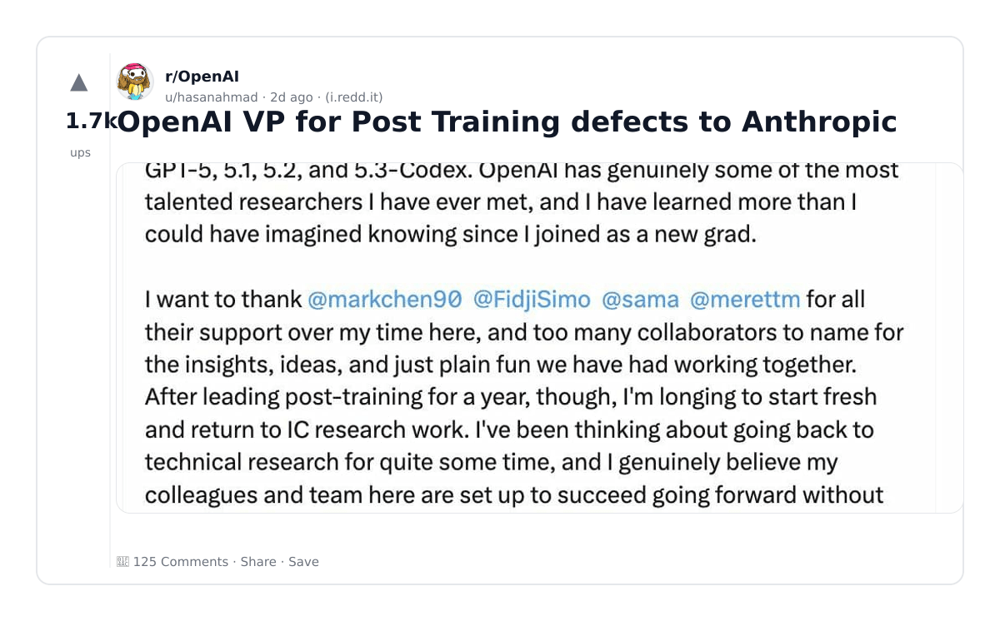
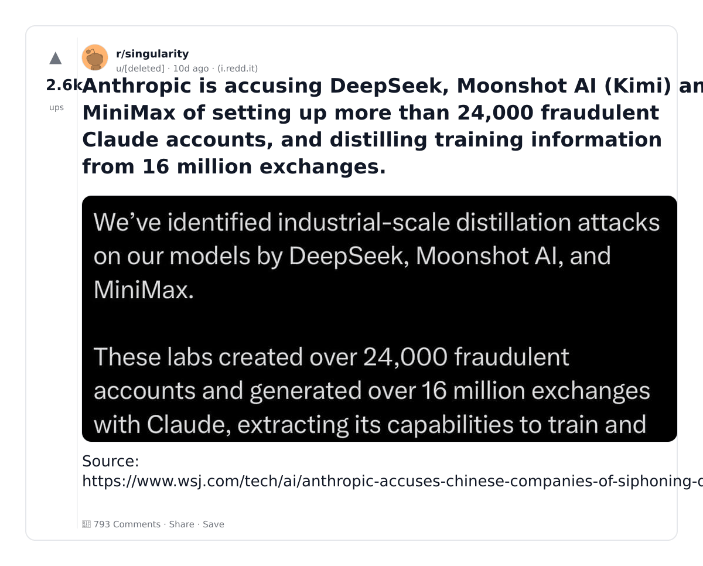
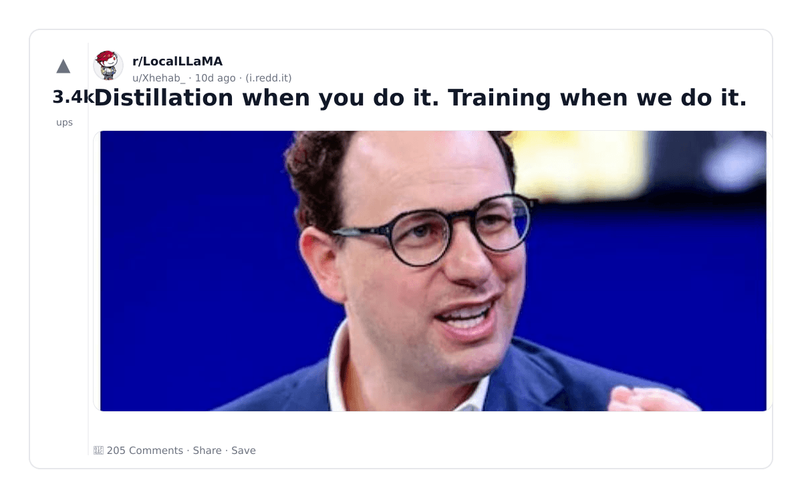
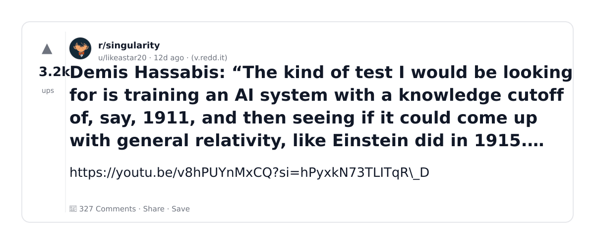
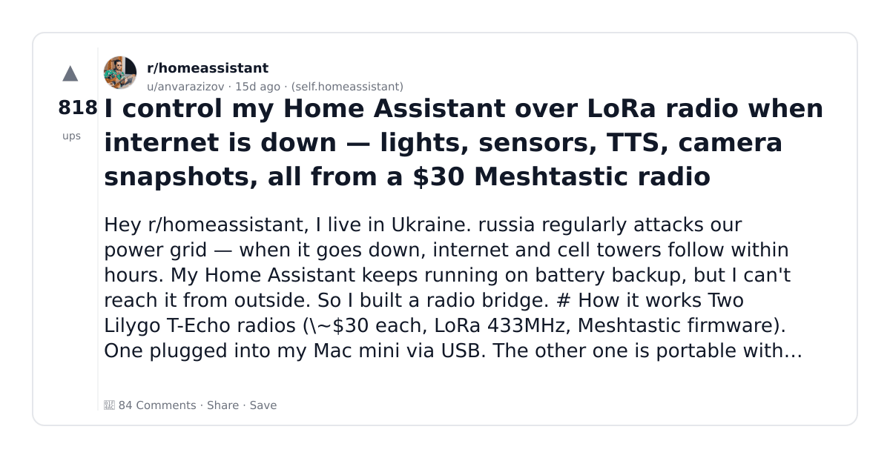

# Reddit Scout — Fine Tuning of LLM

Run: 2026-03-05T20-51-34-391Z
Started: 2026-03-05T20:51:34.391Z
Output dir: /home/ubuntu/.openclaw/workspace/reddit-scout/fine-tuning-of-llm/runs/2026-03-05T20-51-34-391Z

Config: topN=10 | subLimit=13 | kinds=top,hot | time=month | limitPerListing=25
Search: fine tuning LLM LoRA training model (sort=top t=auto)

## Top terms (from titles + top comments)

- training (9)
- have (8)
- anthropic (7)
- openai (6)
- like (6)
- post (5)
- when (5)
- model (5)
- models (5)
- lying (4)
- https (4)
- trump (4)
- them (4)
- machine (3)
- control (3)
- chatgpt (3)
- million (3)
- kind (3)

## Viral content ideas (derived from these posts)

**1. Personal story → timeline + receipts**
- Hook: Hook with 1 line, then a 5-step timeline; end with the lesson and what you would do differently.

**2. My training got automated: what I automated back (tools + workflow)**
- Hook: Turn it into a before/after workflow post. Include exact tool stack + steps.

**3. Checklist: how to stay valuable when have hits your team**
- Hook: A numbered checklist (10 items). Make it practical: skills, portfolio, outreach, proof-of-work.

**4. Hot take: anthropic isn't the problem — openai is**
- Hook: Contrarian framing. Back it with 2 examples from the top posts and 1 counterexample.

**5. Debunk thread: "AI will replace like" vs what's actually happening**
- Hook: Use 3 claims → 3 rebuttals. Cite specific post patterns: layoffs, hiring freezes, role shifts.

**6. Salary/market reality: post vs when roles in 2026 (Reddit signals)**
- Hook: Summarize demand signals from comments: who is struggling, who is fine, why.

**7. "What would you do in 30 days?" layoff recovery plan (day-by-day)**
- Hook: 30-day plan: portfolio, interview loops, networking, mental health. Include a downloadable checklist.

**8. Mini-case study: 1 resume bullet → 1 proof project using model**
- Hook: Show how to convert a vague resume claim into a measurable project + writeup.

**9. Community question: which tasks should *never* be delegated to AI?**
- Hook: Ask + give your own top 5. Encourage replies; add a poll if your platform supports it.

**10. Template post: "I used AI to do X, got Y result, here's the exact prompt"**
- Hook: Make it reproducible: prompt, inputs, outputs, gotchas.

**11. Data post: a quick scorecard of the top threads (ups, comments, ratio) + what it signals**
- Hook: Table or bullets; then 3 takeaways.

**12. Meme angle (if relevant): models vs lying — job search edition**
- Hook: If your niche is not memes, skip memes; otherwise caption the pattern you saw in comments.

## Top posts (10) + cards

### 1) You're now training a war machine. Let's see proof of cancellation.
- Subreddit: r/ChatGPT
- Viral score: 718 | Ups: 34285 | Comments: 2656 | Upvote ratio: 91%
- Link: https://www.reddit.com/r/ChatGPT/comments/1rgseae/youre_now_training_a_war_machine_lets_see_proof/
- Card (local): ./cards/1rgseae.png

### 2) Sam Altman in Damage Control Mode as ChatGPT Users Are Mass Cancelling Subscriptions Because OpenAI Is "Training a War Machine"
- Subreddit: r/OpenAI
- Viral score: 380 | Ups: 3635 | Comments: 249 | Upvote ratio: 96%
- Link: https://www.reddit.com/r/OpenAI/comments/1rkqf2m/sam_altman_in_damage_control_mode_as_chatgpt/
- Card (local): ./cards/1rkqf2m.png

### 3) The L in "LLM" Stands for Lying
- Subreddit: r/technology
- Viral score: 361 | Ups: 535 | Comments: 110 | Upvote ratio: 84%
- Link: https://www.reddit.com/r/technology/comments/1rll4f4/the_l_in_llm_stands_for_lying/
- Card (local): ./cards/1rll4f4.png

### 4) [ Removed by moderator ]
- Subreddit: r/LocalLLaMA
- Viral score: 106 | Ups: 142 | Comments: 31 | Upvote ratio: 90%
- Link: https://www.reddit.com/r/LocalLLaMA/comments/1rlmja5/chinese_llm_farms/
- Card (local): ./cards/1rlmja5.png

### 5) OpenAI VP for Post Training defects to Anthropic
- Subreddit: r/OpenAI
- Viral score: 89 | Ups: 1658 | Comments: 125 | Upvote ratio: 97%
- Link: https://www.reddit.com/r/OpenAI/comments/1rk6xnw/openai_vp_for_post_training_defects_to_anthropic/
- Card (local): ./cards/1rk6xnw.png

### 6) Anthropic is accusing DeepSeek, Moonshot AI (Kimi) and MiniMax of setting up more than 24,000 fraudulent Claude accounts, and distilling training information from 16 million exchanges.
- Subreddit: r/singularity
- Viral score: 31 | Ups: 2595 | Comments: 793 | Upvote ratio: 95%
- Link: https://www.reddit.com/r/singularity/comments/1rcpdwz/anthropic_is_accusing_deepseek_moonshot_ai_kimi/
- Card (local): ./cards/1rcpdwz.png

### 7) Distillation when you do it. Training when we do it.
- Subreddit: r/LocalLLaMA
- Viral score: 30 | Ups: 3415 | Comments: 205 | Upvote ratio: 97%
- Link: https://www.reddit.com/r/LocalLLaMA/comments/1rcvimv/distillation_when_you_do_it_training_when_we_do_it/
- Card (local): ./cards/1rcvimv.png

### 8) Demis Hassabis: “The kind of test I would be looking for is training an AI system with a knowledge cutoff of, say, 1911, and then seeing if it could come up with general relativity, like Einstein did in 1915. That’s the kind of test I think is a true test of whether we have a full AGI system”
- Subreddit: r/singularity
- Viral score: 25 | Ups: 3187 | Comments: 327 | Upvote ratio: 97%
- Link: https://www.reddit.com/r/singularity/comments/1rb3awd/demis_hassabis_the_kind_of_test_i_would_be/
- Card (local): ./cards/1rb3awd.png

### 9) I control my Home Assistant over LoRa radio when internet is down — lights, sensors, TTS, camera snapshots, all from a $30 Meshtastic radio
- Subreddit: r/homeassistant
- Viral score: 5 | Ups: 818 | Comments: 84 | Upvote ratio: 99%
- Link: https://www.reddit.com/r/homeassistant/comments/1r8ftc0/i_control_my_home_assistant_over_lora_radio_when/
- Card (local): ./cards/1r8ftc0.png

### 10) Wrote a detailed walkthrough on LLM inference system design with RAG, for anyone prepping for MLOps interviews
- Subreddit: r/mlops
- Viral score: 1 | Ups: 29 | Comments: 2 | Upvote ratio: 98%
- Link: https://www.reddit.com/r/mlops/comments/1rkij9r/wrote_a_detailed_walkthrough_on_llm_inference/
- Card (local): ./cards/1rkij9r.png

