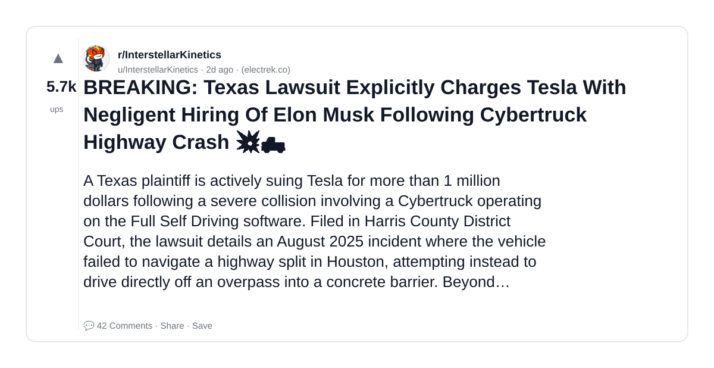

# Reddit Scout — invisible engineer career visibility personal brand hiring linkedin

Run: 2026-03-14T13-01-19-245Z
Started: 2026-03-14T13:01:19.246Z
Output dir: /home/ubuntu/.openclaw/workspace/reddit-scout/invisible-engineer-career-visibility-personal-brand-hiring-l/runs/2026-03-14T13-01-19-245Z

Config: topN=10 | subLimit=8 | kinds=top,hot,rising | time=week | limitPerListing=25
Search: invisible engineer career visibility personal brand hiring linkedin (sort=top t=auto)

## Top terms (from titles + top comments)

- tesla (4)
- musk (3)
- decision (3)
- will (3)
- texas (2)
- lawsuit (2)
- negligent (2)
- highway (2)
- legal (2)
- executive (2)
- force (2)
- internal (2)
- court (2)
- lidar (2)
- human (2)
- have (2)
- breaking (1)
- explicitly (1)

## Viral content ideas (derived from these posts)

**1. Personal story → timeline + receipts**
- Hook: Hook with 1 line, then a 5-step timeline; end with the lesson and what you would do differently.

**2. My tesla got automated: what I automated back (tools + workflow)**
- Hook: Turn it into a before/after workflow post. Include exact tool stack + steps.

**3. Checklist: how to stay valuable when musk hits your team**
- Hook: A numbered checklist (10 items). Make it practical: skills, portfolio, outreach, proof-of-work.

**4. Hot take: decision isn't the problem — will is**
- Hook: Contrarian framing. Back it with 2 examples from the top posts and 1 counterexample.

**5. Debunk thread: "AI will replace texas" vs what's actually happening**
- Hook: Use 3 claims → 3 rebuttals. Cite specific post patterns: layoffs, hiring freezes, role shifts.

**6. Salary/market reality: lawsuit vs negligent roles in 2026 (Reddit signals)**
- Hook: Summarize demand signals from comments: who is struggling, who is fine, why.

**7. "What would you do in 30 days?" layoff recovery plan (day-by-day)**
- Hook: 30-day plan: portfolio, interview loops, networking, mental health. Include a downloadable checklist.

**8. Mini-case study: 1 resume bullet → 1 proof project using highway**
- Hook: Show how to convert a vague resume claim into a measurable project + writeup.

**9. Community question: which tasks should *never* be delegated to AI?**
- Hook: Ask + give your own top 5. Encourage replies; add a poll if your platform supports it.

**10. Template post: "I used AI to do X, got Y result, here's the exact prompt"**
- Hook: Make it reproducible: prompt, inputs, outputs, gotchas.

**11. Data post: a quick scorecard of the top threads (ups, comments, ratio) + what it signals**
- Hook: Table or bullets; then 3 takeaways.

**12. Meme angle (if relevant): legal vs executive — job search edition**
- Hook: If your niche is not memes, skip memes; otherwise caption the pattern you saw in comments.

## Top posts (1) + cards

### 1) BREAKING: Texas Lawsuit Explicitly Charges Tesla With Negligent Hiring Of Elon Musk Following Cybertruck Highway Crash 💥🛻
- Subreddit: r/InterstellarKinetics
- Viral score: 260 | Ups: 5729 | Comments: 42 | Upvote ratio: 99%
- Link: https://www.reddit.com/r/InterstellarKinetics/comments/1rrs9hc/breaking_texas_lawsuit_explicitly_charges_tesla/
- Card (local): ./cards/1rrs9hc.png

