# Reddit Scout — Iran israel war

Run: 2026-03-09T15-39-05-838Z
Started: 2026-03-09T15:39:05.839Z
Output dir: /home/ubuntu/.openclaw/workspace/reddit-scout/iran-israel-war/runs/2026-03-09T15-39-05-838Z

Config: topN=15 | subLimit=10 | kinds=top,hot,rising | time=all | limitPerListing=25
Search: Iran israel war (sort=top t=auto)

## Top terms (from titles + top comments)

- iran (50)
- israel (40)
- have (21)
- china (20)
- will (15)
- https (13)
- about (12)
- people (12)
- think (12)
- want (11)
- world (11)
- countries (10)
- good (10)
- what (9)
- like (8)
- there (8)
- when (8)
- even (8)

## Viral content ideas (derived from these posts)

**1. Personal story → timeline + receipts**
- Hook: Hook with 1 line, then a 5-step timeline; end with the lesson and what you would do differently.

**2. My iran got automated: what I automated back (tools + workflow)**
- Hook: Turn it into a before/after workflow post. Include exact tool stack + steps.

**3. Checklist: how to stay valuable when israel hits your team**
- Hook: A numbered checklist (10 items). Make it practical: skills, portfolio, outreach, proof-of-work.

**4. Hot take: have isn't the problem — china is**
- Hook: Contrarian framing. Back it with 2 examples from the top posts and 1 counterexample.

**5. Debunk thread: "AI will replace will" vs what's actually happening**
- Hook: Use 3 claims → 3 rebuttals. Cite specific post patterns: layoffs, hiring freezes, role shifts.

**6. Salary/market reality: https vs about roles in 2026 (Reddit signals)**
- Hook: Summarize demand signals from comments: who is struggling, who is fine, why.

**7. "What would you do in 30 days?" layoff recovery plan (day-by-day)**
- Hook: 30-day plan: portfolio, interview loops, networking, mental health. Include a downloadable checklist.

**8. Mini-case study: 1 resume bullet → 1 proof project using people**
- Hook: Show how to convert a vague resume claim into a measurable project + writeup.

**9. Community question: which tasks should *never* be delegated to AI?**
- Hook: Ask + give your own top 5. Encourage replies; add a poll if your platform supports it.

**10. Template post: "I used AI to do X, got Y result, here's the exact prompt"**
- Hook: Make it reproducible: prompt, inputs, outputs, gotchas.

**11. Data post: a quick scorecard of the top threads (ups, comments, ratio) + what it signals**
- Hook: Table or bullets; then 3 takeaways.

**12. Meme angle (if relevant): think vs want — job search edition**
- Hook: If your niche is not memes, skip memes; otherwise caption the pattern you saw in comments.

## Top posts (15) + cards

### 1) Marjorie Taylor Greene: And just like that we are no longer a nation divided by left and right, we are now a nation divided be those who want to fight wars for Israel and those who just want peace and to be able to afford their bills and health insurance.
- Subreddit: r/UnderReportedNews
- Viral score: 1222 | Ups: 66215 | Comments: 2474 | Upvote ratio: 93%
- Link: https://www.reddit.com/r/UnderReportedNews/comments/1rj01dn/marjorie_taylor_greene_and_just_like_that_we_are/
- Card (local): ./cards/1rj01dn.png

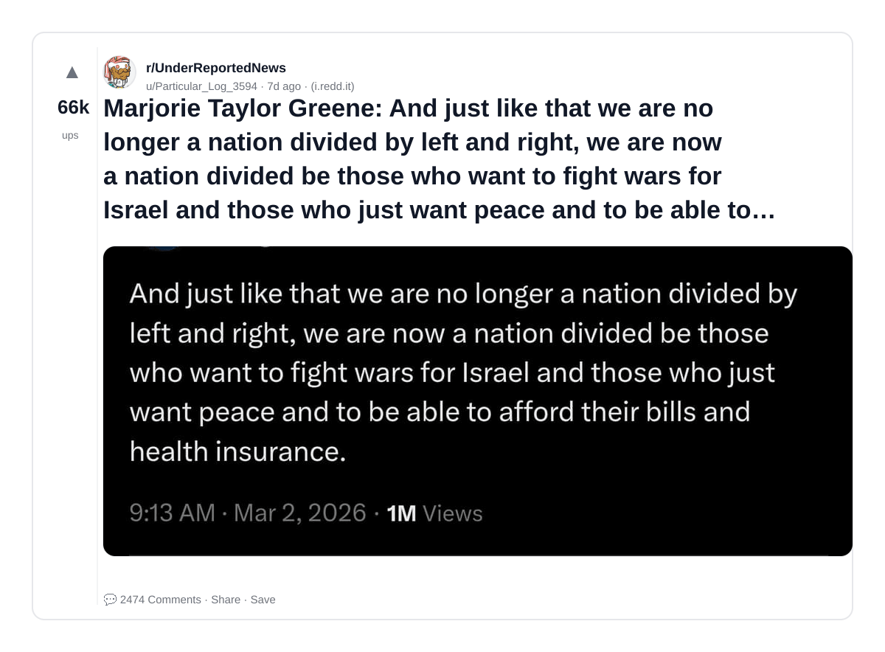

### 2) Former Marine Sergeant dragged out of Congress for protesting war with Iran [OC]
- Subreddit: r/comics
- Viral score: 1216 | Ups: 50335 | Comments: 454 | Upvote ratio: 95%
- Link: https://www.reddit.com/r/comics/comments/1rl65gp/former_marine_sergeant_dragged_out_of_congress/
- Card (local): ./cards/1rl65gp.png

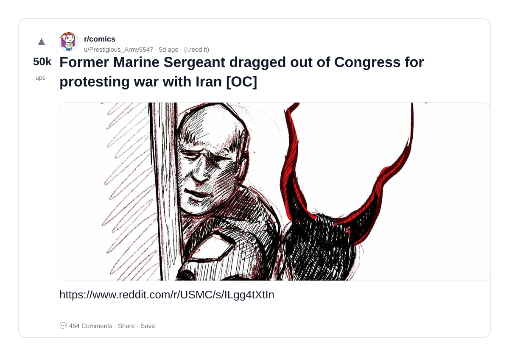

### 3) Reporter: You told us Israel was going to strike Iran and that’s why we needed to get involved. / Rubio: No. Your statement is false. Were you there yesterday? / Reporter: YES, I asked you the question.
- Subreddit: r/UnderReportedNews
- Viral score: 1187 | Ups: 53678 | Comments: 1272 | Upvote ratio: 98%
- Link: https://www.reddit.com/r/UnderReportedNews/comments/1rk74l2/reporter_you_told_us_israel_was_going_to_strike/
- Card (local): ./cards/1rk74l2.png

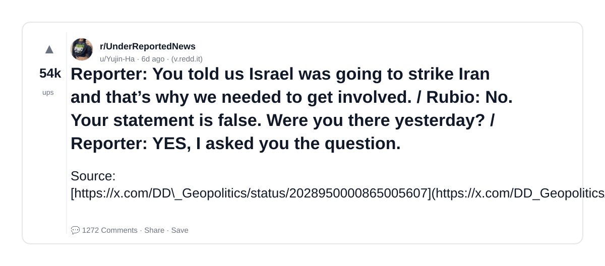

### 4) A now deleted video of Donald Trump in 2011 talking about how President Obama will start a war with Iran because he has no ability to negotiate and is weak and ineffective
- Subreddit: r/UnderReportedNews
- Viral score: 616 | Ups: 58221 | Comments: 759 | Upvote ratio: 98%
- Link: https://www.reddit.com/r/UnderReportedNews/comments/1rh8spa/a_now_deleted_video_of_donald_trump_in_2011/
- Card (local): ./cards/1rh8spa.png

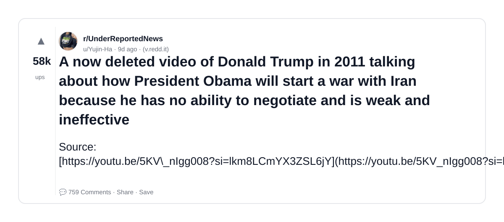

### 5) Supporters of the war with Iran: Does this conflict make Israelis safer?
- Subreddit: r/IsraelPalestine
- Viral score: 156 | Ups: 6 | Comments: 137 | Upvote ratio: 71%
- Link: https://www.reddit.com/r/IsraelPalestine/comments/1roy49p/supporters_of_the_war_with_iran_does_this/
- Card (local): ./cards/1roy49p.png

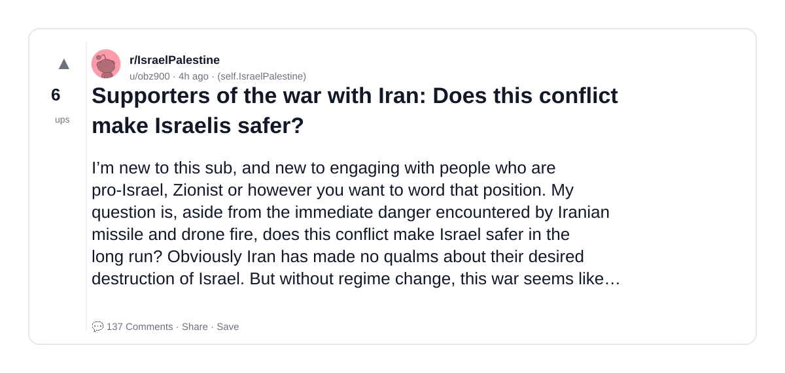

### 6) Map of Israel for the foreign reporter
- Subreddit: r/Israel
- Viral score: 68 | Ups: 1445 | Comments: 59 | Upvote ratio: 96%
- Link: https://www.reddit.com/r/Israel/comments/1rn6p7d/map_of_israel_for_the_foreign_reporter/
- Card (local): ./cards/1rn6p7d.png

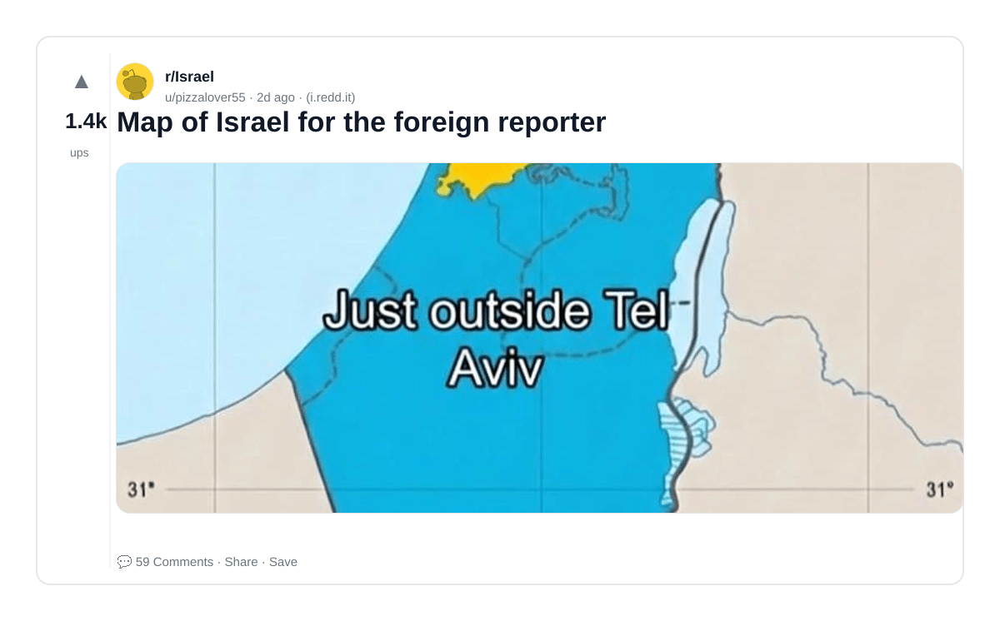

### 7) Anti Israel derangement has become so absurd and cartoonish…the pendulum will swing back
- Subreddit: r/Israel
- Viral score: 53 | Ups: 315 | Comments: 111 | Upvote ratio: 84%
- Link: https://www.reddit.com/r/Israel/comments/1rob8sq/anti_israel_derangement_has_become_so_absurd_and/
- Card (local): ./cards/1rob8sq.png

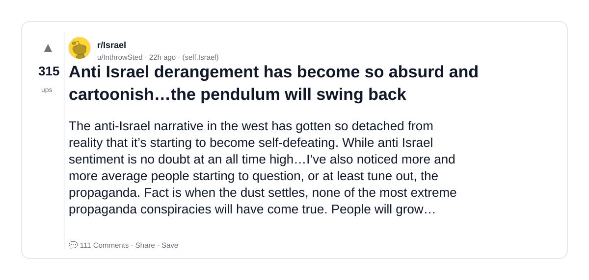

### 8) Minab schoolchildren killed by US/Israel
- Subreddit: r/iran
- Viral score: 44 | Ups: 642 | Comments: 61 | Upvote ratio: 90%
- Link: https://www.reddit.com/r/iran/comments/1rnr6l7/minab_schoolchildren_killed_by_usisrael/
- Card (local): ./cards/1rnr6l7.png

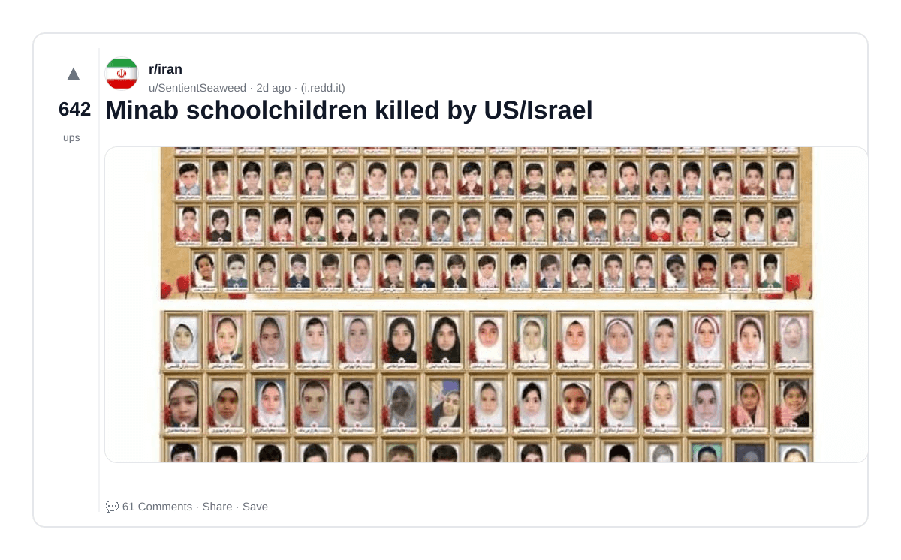

### 9) The U.S. bombed a school in Iran, antisemites are lost.
- Subreddit: r/IsraelPalestine
- Viral score: 33 | Ups: 27 | Comments: 576 | Upvote ratio: 56%
- Link: https://www.reddit.com/r/IsraelPalestine/comments/1rnesld/the_us_bombed_a_school_in_iran_antisemites_are/
- Card (local): ./cards/1rnesld.png

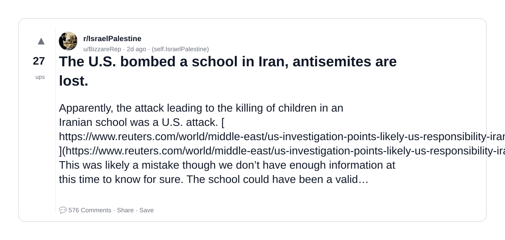

### 10) israel is destroying surveillance cameras in order to censor Iran missile strikes
- Subreddit: r/iranian
- Viral score: 28 | Ups: 40 | Comments: 4 | Upvote ratio: 92%
- Link: https://www.reddit.com/r/iranian/comments/1roz28i/israel_is_destroying_surveillance_cameras_in/
- Card (local): ./cards/1roz28i.png

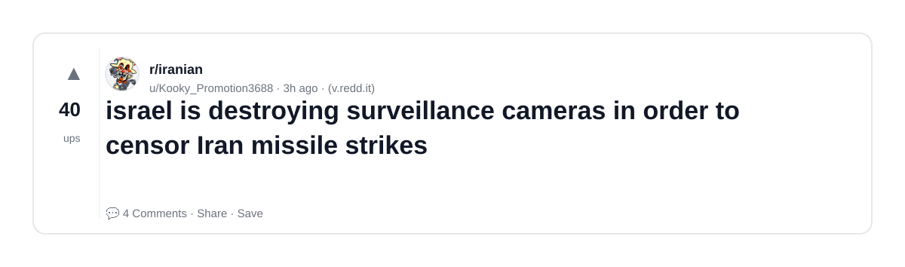

### 11) Iranian protesters have created a tracker which shows which countries stood with them against the Islamist Regime in Tehran and which countries didn't. Israel is ranked #1
- Subreddit: r/Israel
- Viral score: 20 | Ups: 1623 | Comments: 97 | Upvote ratio: 95%
- Link: https://www.reddit.com/r/Israel/comments/1rj7ohz/iranian_protesters_have_created_a_tracker_which/
- Card (local): ./cards/1rj7ohz.png

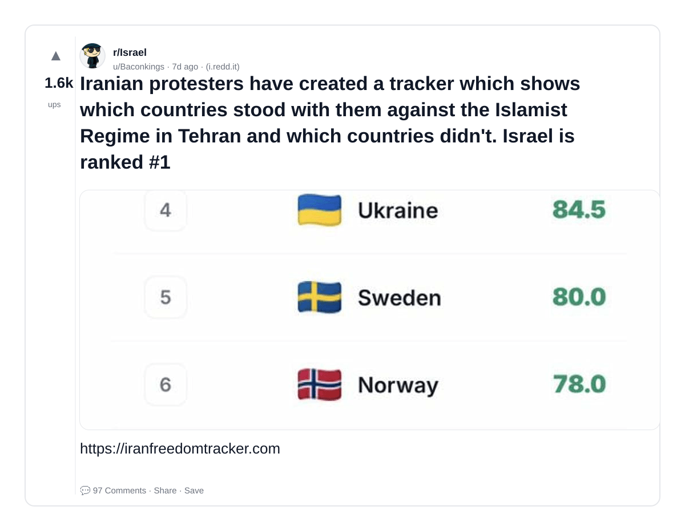

### 12) 170 graves for schoolgirls murdered by Israel
- Subreddit: r/iran
- Viral score: 20 | Ups: 1445 | Comments: 166 | Upvote ratio: 89%
- Link: https://www.reddit.com/r/iran/comments/1rjcxvx/170_graves_for_schoolgirls_murdered_by_israel/
- Card (local): ./cards/1rjcxvx.png

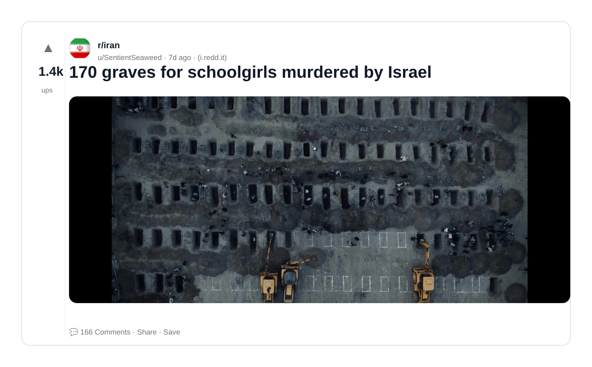

### 13) Iran's Khamenei was killed in Israeli strike earlier on Saturday, Israeli officials confirm
- Subreddit: r/Israel
- Viral score: 19 | Ups: 2200 | Comments: 216 | Upvote ratio: 94%
- Link: https://www.reddit.com/r/Israel/comments/1rhce6b/irans_khamenei_was_killed_in_israeli_strike/
- Card (local): ./cards/1rhce6b.png

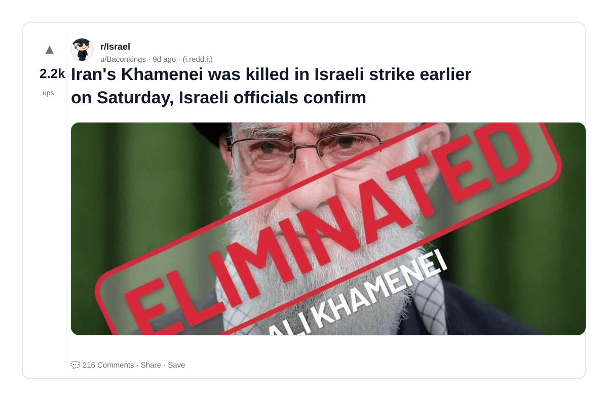

### 14) US applauds Israel: 'We knew they were good, but we didn’t know how good'
- Subreddit: r/Israel
- Viral score: 18 | Ups: 467 | Comments: 53 | Upvote ratio: 90%
- Link: https://www.reddit.com/r/Israel/comments/1rn5sr9/us_applauds_israel_we_knew_they_were_good_but_we/
- Card (local): ./cards/1rn5sr9.png

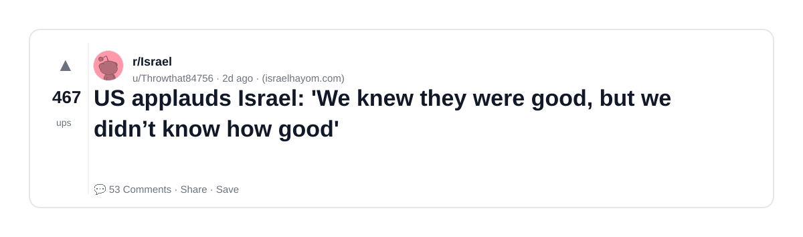

### 15) Israel Is Using Its Genocidal Gaza Playbook on Iran. Just as in Palestine, the Israeli government is framing its latest conflict as a holy war of extermination. (READ LINKED ARTICLE)
- Subreddit: r/iran
- Viral score: 17 | Ups: 159 | Comments: 11 | Upvote ratio: 86%
- Link: https://www.reddit.com/r/iran/comments/1rogp2e/israel_is_using_its_genocidal_gaza_playbook_on/
- Card (local): ./cards/1rogp2e.png

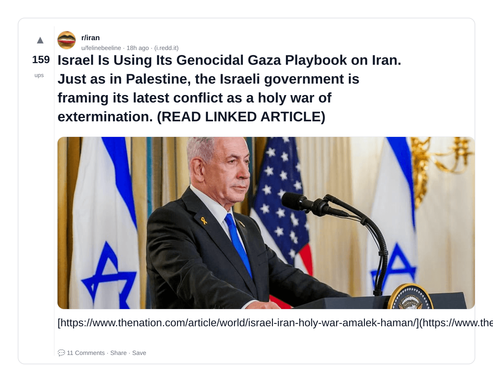
