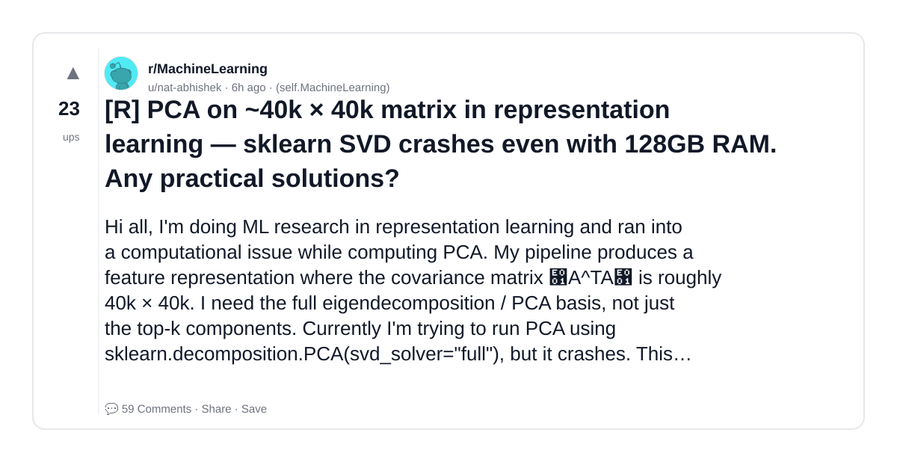
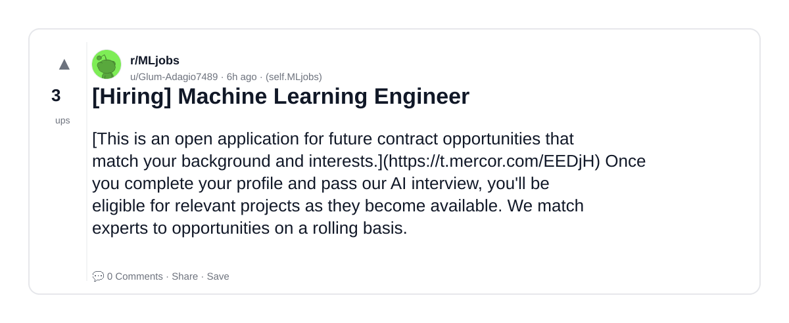
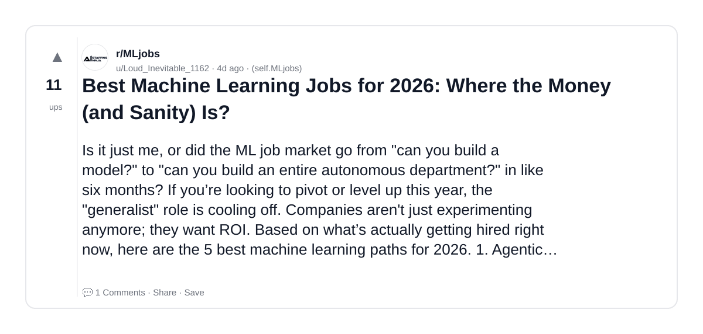
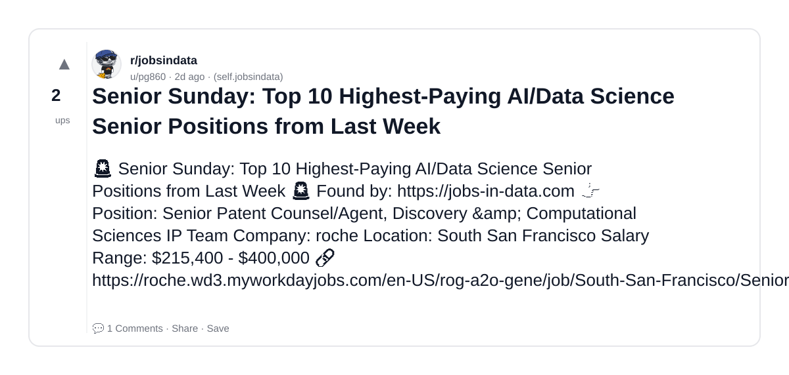
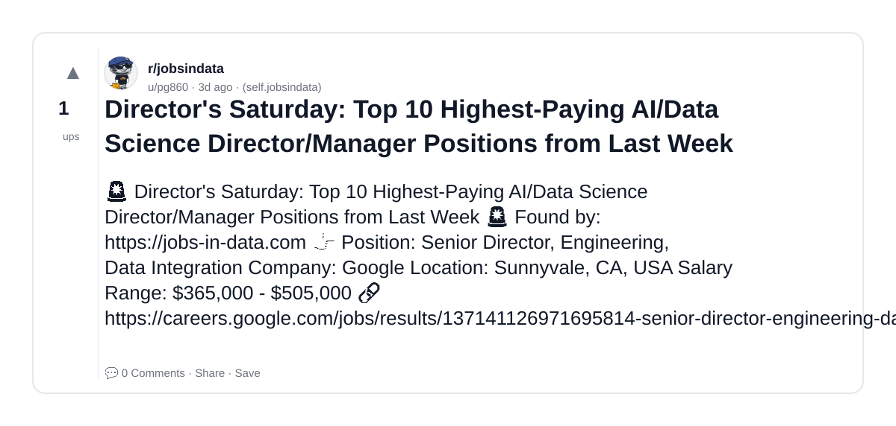
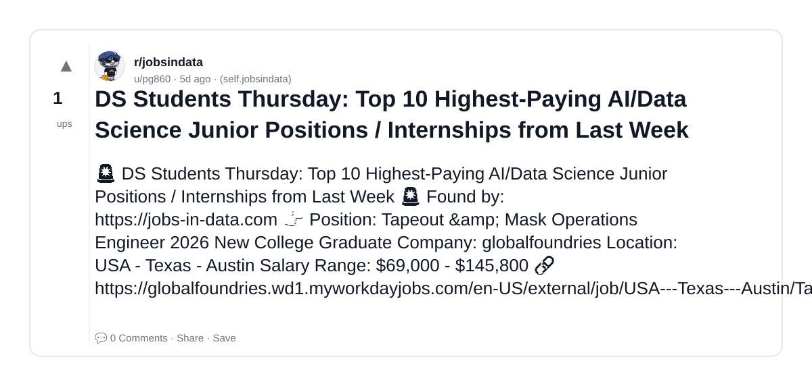
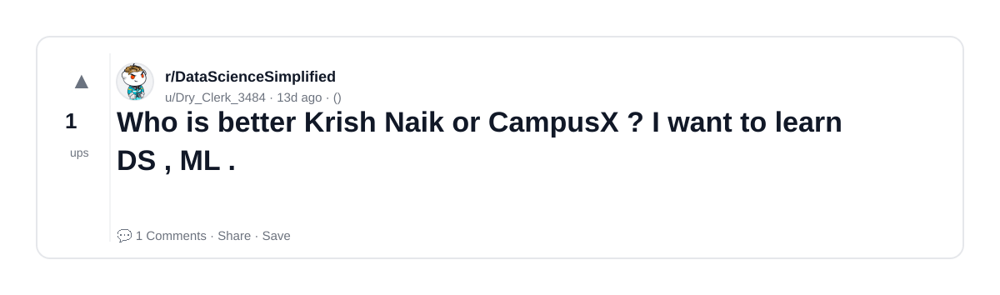
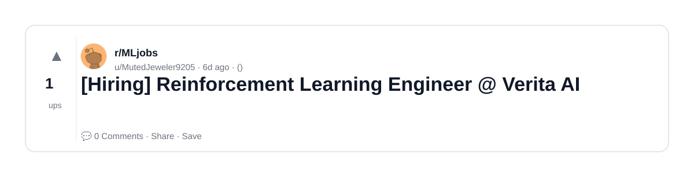
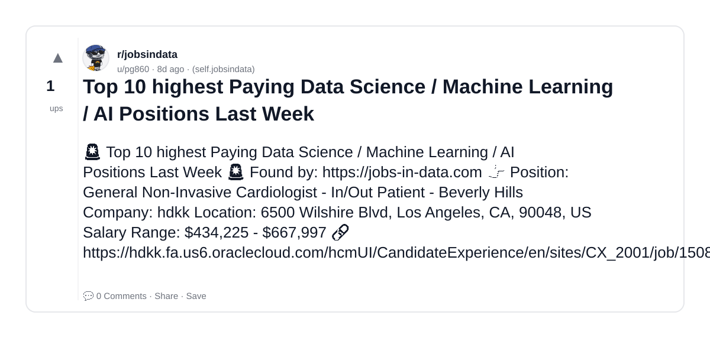
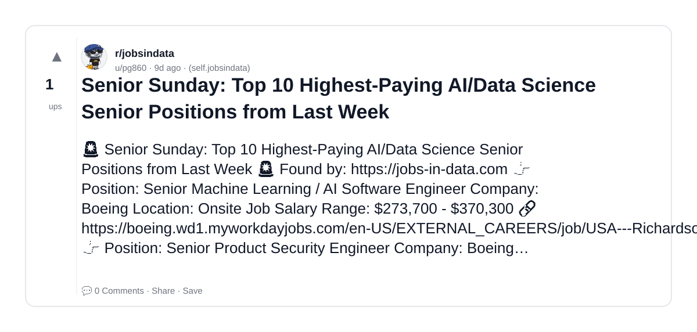

# Reddit Scout — Krish Naik AI YouTube data science machine learning

Run: 2026-03-09T20-47-49-916Z
Started: 2026-03-09T20:47:49.916Z
Output dir: /home/ubuntu/.openclaw/workspace/reddit-scout/krish-naik-ai-youtube-data-science-machine-learning/runs/2026-03-09T20-47-49-916Z

Config: topN=10 | subLimit=8 | kinds=top,hot,rising | time=week | limitPerListing=25
Search: Krish Naik AI YouTube data science machine learning (sort=top t=auto)

## Top terms (from titles + top comments)

- data (6)
- learning (5)
- senior (5)
- highest (5)
- paying (5)
- science (5)
- positions (5)
- last (5)
- week (5)
- matrix (4)
- skerch (4)
- hiring (3)
- machine (3)
- https (3)
- even (2)
- practical (2)
- engineer (2)
- where (2)

## Viral content ideas (derived from these posts)

**1. Personal story → timeline + receipts**
- Hook: Hook with 1 line, then a 5-step timeline; end with the lesson and what you would do differently.

**2. My data got automated: what I automated back (tools + workflow)**
- Hook: Turn it into a before/after workflow post. Include exact tool stack + steps.

**3. Checklist: how to stay valuable when learning hits your team**
- Hook: A numbered checklist (10 items). Make it practical: skills, portfolio, outreach, proof-of-work.

**4. Hot take: senior isn't the problem — highest is**
- Hook: Contrarian framing. Back it with 2 examples from the top posts and 1 counterexample.

**5. Debunk thread: "AI will replace paying" vs what's actually happening**
- Hook: Use 3 claims → 3 rebuttals. Cite specific post patterns: layoffs, hiring freezes, role shifts.

**6. Salary/market reality: science vs positions roles in 2026 (Reddit signals)**
- Hook: Summarize demand signals from comments: who is struggling, who is fine, why.

**7. "What would you do in 30 days?" layoff recovery plan (day-by-day)**
- Hook: 30-day plan: portfolio, interview loops, networking, mental health. Include a downloadable checklist.

**8. Mini-case study: 1 resume bullet → 1 proof project using last**
- Hook: Show how to convert a vague resume claim into a measurable project + writeup.

**9. Community question: which tasks should *never* be delegated to AI?**
- Hook: Ask + give your own top 5. Encourage replies; add a poll if your platform supports it.

**10. Template post: "I used AI to do X, got Y result, here's the exact prompt"**
- Hook: Make it reproducible: prompt, inputs, outputs, gotchas.

**11. Data post: a quick scorecard of the top threads (ups, comments, ratio) + what it signals**
- Hook: Table or bullets; then 3 takeaways.

**12. Meme angle (if relevant): week vs matrix — job search edition**
- Hook: If your niche is not memes, skip memes; otherwise caption the pattern you saw in comments.

## Top posts (10) + cards

### 1) [R] PCA on ~40k × 40k matrix in representation learning — sklearn SVD crashes even with 128GB RAM. Any practical solutions?
- Subreddit: r/MachineLearning
- Viral score: 49 | Ups: 23 | Comments: 59 | Upvote ratio: 87%
- Link: https://www.reddit.com/r/MachineLearning/comments/1rp2pcv/r_pca_on_40k_40k_matrix_in_representation/
- Card (local): ./cards/1rp2pcv.png

### 2) [Hiring] Machine Learning Engineer
- Subreddit: r/MLjobs
- Viral score: 1 | Ups: 3 | Comments: 0 | Upvote ratio: 100%
- Link: https://www.reddit.com/r/MLjobs/comments/1rp1qsb/hiring_machine_learning_engineer/
- Card (local): ./cards/1rp1qsb.png

### 3) Best Machine Learning Jobs for 2026: Where the Money (and Sanity) Is?
- Subreddit: r/MLjobs
- Viral score: 0 | Ups: 11 | Comments: 1 | Upvote ratio: 93%
- Link: https://www.reddit.com/r/MLjobs/comments/1rld49y/best_machine_learning_jobs_for_2026_where_the/
- Card (local): ./cards/1rld49y.png

### 4) Senior Sunday: Top 10 Highest-Paying AI/Data Science Senior Positions from Last Week
- Subreddit: r/jobsindata
- Viral score: 0 | Ups: 2 | Comments: 1 | Upvote ratio: 100%
- Link: https://www.reddit.com/r/jobsindata/comments/1rny5mo/senior_sunday_top_10_highestpaying_aidata_science/
- Card (local): ./cards/1rny5mo.png

### 5) Director's Saturday: Top 10 Highest-Paying AI/Data Science Director/Manager Positions from Last Week
- Subreddit: r/jobsindata
- Viral score: 0 | Ups: 1 | Comments: 0 | Upvote ratio: 100%
- Link: https://www.reddit.com/r/jobsindata/comments/1rn3cfl/directors_saturday_top_10_highestpaying_aidata/
- Card (local): ./cards/1rn3cfl.png

### 6) DS Students Thursday: Top 10 Highest-Paying AI/Data Science Junior Positions / Internships from Last Week
- Subreddit: r/jobsindata
- Viral score: 0 | Ups: 1 | Comments: 0 | Upvote ratio: 100%
- Link: https://www.reddit.com/r/jobsindata/comments/1rlawe9/ds_students_thursday_top_10_highestpaying_aidata/
- Card (local): ./cards/1rlawe9.png

### 7) Who is better Krish Naik or CampusX ? I want to learn DS , ML .
- Subreddit: r/DataScienceSimplified
- Viral score: 0 | Ups: 1 | Comments: 1 | Upvote ratio: 100%
- Link: https://www.reddit.com/r/DataScienceSimplified/comments/1rdnvr6/who_is_better_krish_naik_or_campusx_i_want_to/
- Card (local): ./cards/1rdnvr6.png

### 8) [Hiring] Reinforcement Learning Engineer @ Verita AI
- Subreddit: r/MLjobs
- Viral score: 0 | Ups: 1 | Comments: 0 | Upvote ratio: 100%
- Link: https://www.reddit.com/r/MLjobs/comments/1rjq989/hiring_reinforcement_learning_engineer_verita_ai/
- Card (local): ./cards/1rjq989.png

### 9) Top 10 highest Paying Data Science / Machine Learning / AI Positions Last Week
- Subreddit: r/jobsindata
- Viral score: 0 | Ups: 1 | Comments: 0 | Upvote ratio: 100%
- Link: https://www.reddit.com/r/jobsindata/comments/1rim2vv/top_10_highest_paying_data_science_machine/
- Card (local): ./cards/1rim2vv.png

### 10) Senior Sunday: Top 10 Highest-Paying AI/Data Science Senior Positions from Last Week
- Subreddit: r/jobsindata
- Viral score: 0 | Ups: 1 | Comments: 0 | Upvote ratio: 100%
- Link: https://www.reddit.com/r/jobsindata/comments/1rhqouz/senior_sunday_top_10_highestpaying_aidata_science/
- Card (local): ./cards/1rhqouz.png

