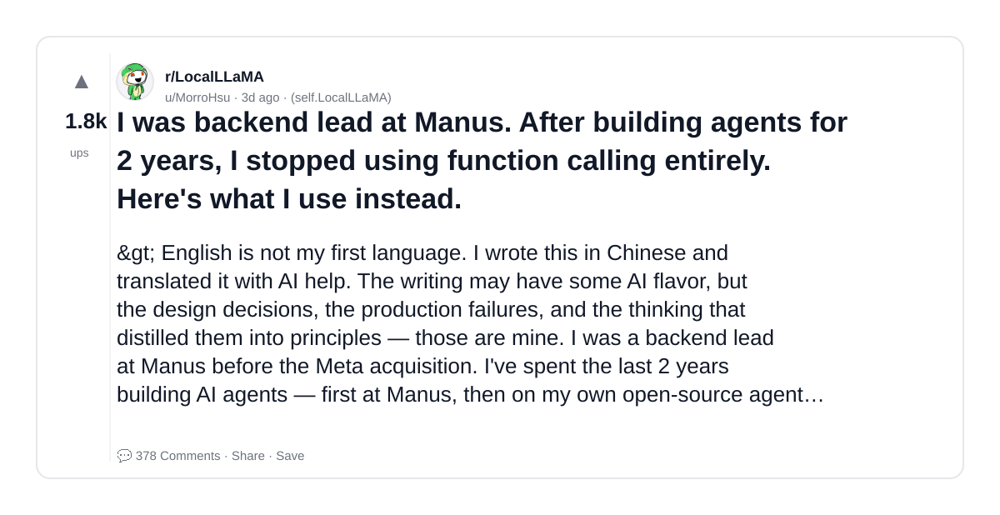
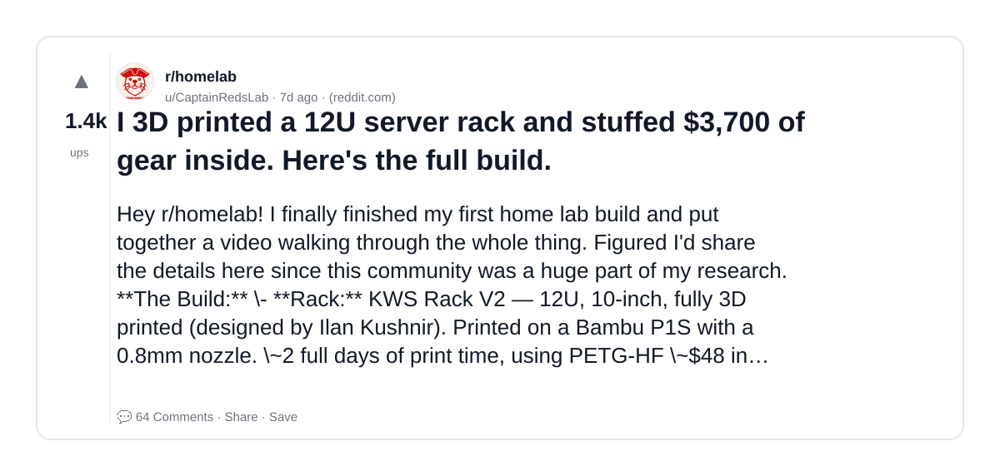
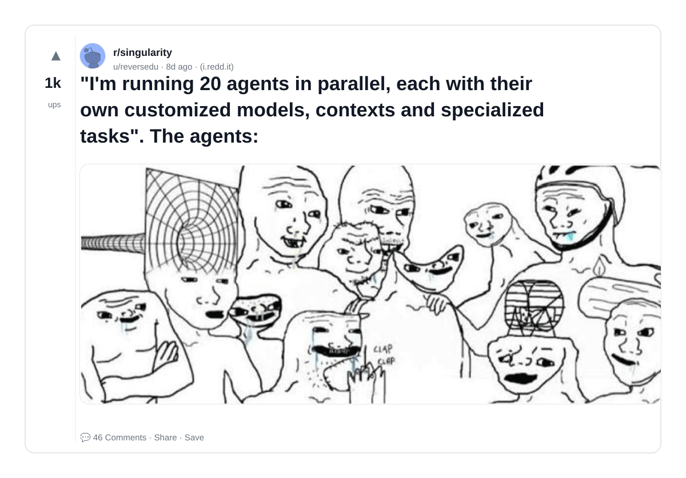
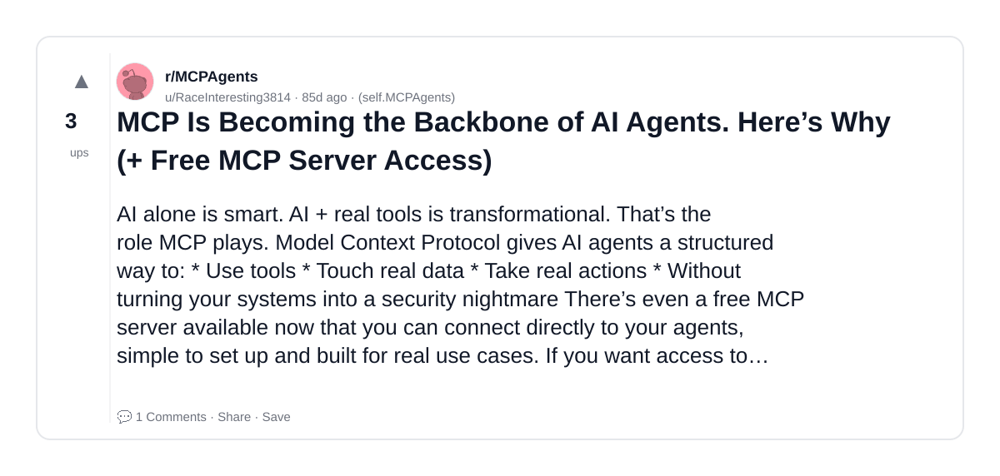
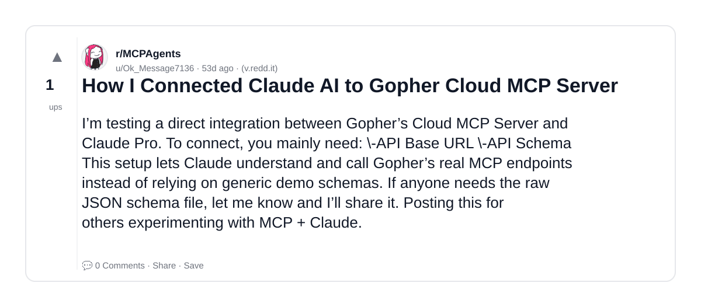
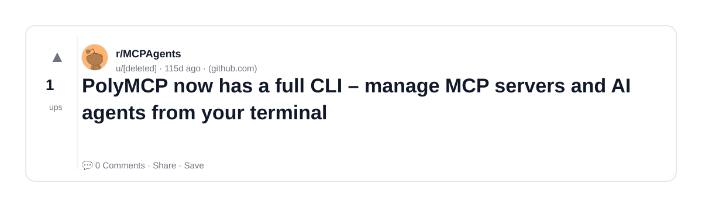
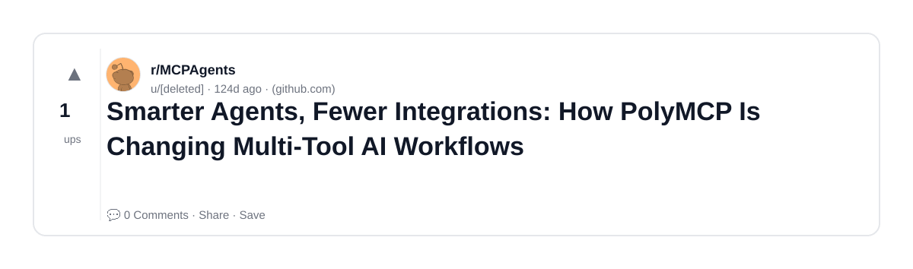
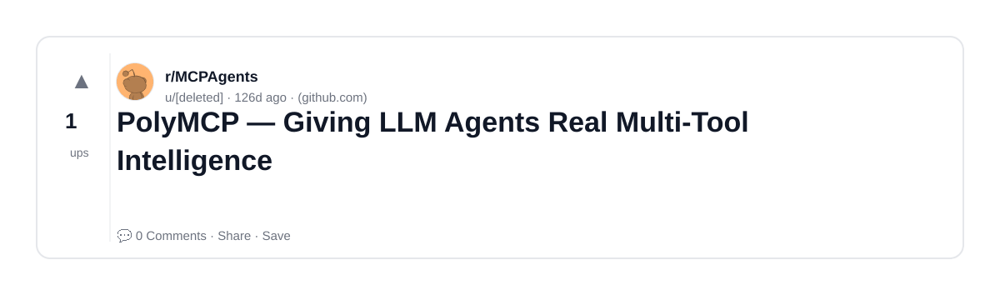
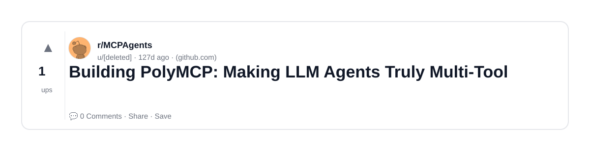
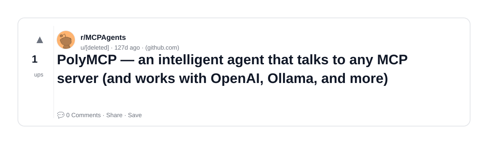

# Reddit Scout — MCP server AI Model Context Protocol LLM agents

Run: 2026-03-14T20-32-18-135Z
Started: 2026-03-14T20:32:18.136Z
Output dir: /home/ubuntu/.openclaw/workspace/reddit-scout/mcp-server-ai-model-context-protocol-llm-agents/runs/2026-03-14T20-32-18-135Z

Config: topN=10 | subLimit=8 | kinds=top,hot,rising | time=week | limitPerListing=25
Search: MCP server AI Model Context Protocol LLM agents (sort=top t=auto)

## Top terms (from titles + top comments)

- agents (8)
- polymcp (5)
- server (4)
- tool (4)
- here (3)
- gear (3)
- full (3)
- multi (3)
- homelab (3)
- badge (3)
- building (2)
- what (2)
- printed (2)
- rack (2)
- build (2)
- terminal (2)
- agent (2)
- python (2)

## Viral content ideas (derived from these posts)

**1. Personal story → timeline + receipts**
- Hook: Hook with 1 line, then a 5-step timeline; end with the lesson and what you would do differently.

**2. My agents got automated: what I automated back (tools + workflow)**
- Hook: Turn it into a before/after workflow post. Include exact tool stack + steps.

**3. Checklist: how to stay valuable when polymcp hits your team**
- Hook: A numbered checklist (10 items). Make it practical: skills, portfolio, outreach, proof-of-work.

**4. Hot take: server isn't the problem — tool is**
- Hook: Contrarian framing. Back it with 2 examples from the top posts and 1 counterexample.

**5. Debunk thread: "AI will replace here" vs what's actually happening**
- Hook: Use 3 claims → 3 rebuttals. Cite specific post patterns: layoffs, hiring freezes, role shifts.

**6. Salary/market reality: gear vs full roles in 2026 (Reddit signals)**
- Hook: Summarize demand signals from comments: who is struggling, who is fine, why.

**7. "What would you do in 30 days?" layoff recovery plan (day-by-day)**
- Hook: 30-day plan: portfolio, interview loops, networking, mental health. Include a downloadable checklist.

**8. Mini-case study: 1 resume bullet → 1 proof project using multi**
- Hook: Show how to convert a vague resume claim into a measurable project + writeup.

**9. Community question: which tasks should *never* be delegated to AI?**
- Hook: Ask + give your own top 5. Encourage replies; add a poll if your platform supports it.

**10. Template post: "I used AI to do X, got Y result, here's the exact prompt"**
- Hook: Make it reproducible: prompt, inputs, outputs, gotchas.

**11. Data post: a quick scorecard of the top threads (ups, comments, ratio) + what it signals**
- Hook: Table or bullets; then 3 takeaways.

**12. Meme angle (if relevant): homelab vs badge — job search edition**
- Hook: If your niche is not memes, skip memes; otherwise caption the pattern you saw in comments.

## Top posts (10) + cards

### 1) I was backend lead at Manus. After building agents for 2 years, I stopped using function calling entirely. Here's what I use instead.
- Subreddit: r/LocalLLaMA
- Viral score: 94 | Ups: 1767 | Comments: 378 | Upvote ratio: 96%
- Link: https://www.reddit.com/r/LocalLLaMA/comments/1rrisqn/i_was_backend_lead_at_manus_after_building_agents/
- Card (local): ./cards/1rrisqn.png

### 2) I 3D printed a 12U server rack and stuffed $3,700 of gear inside. Here's the full build.
- Subreddit: r/homelab
- Viral score: 17 | Ups: 1437 | Comments: 64 | Upvote ratio: 98%
- Link: https://www.reddit.com/r/homelab/comments/1rncjv3/i_3d_printed_a_12u_server_rack_and_stuffed_3700/
- Card (local): ./cards/1rncjv3.png

### 3) "I'm running 20 agents in parallel, each with their own customized models, contexts and specialized tasks". The agents:
- Subreddit: r/singularity
- Viral score: 10 | Ups: 1016 | Comments: 46 | Upvote ratio: 93%
- Link: https://www.reddit.com/r/singularity/comments/1rn4j58/im_running_20_agents_in_parallel_each_with_their/
- Card (local): ./cards/1rn4j58.png

### 4) MCP Is Becoming the Backbone of AI Agents. Here’s Why (+ Free MCP Server Access)
- Subreddit: r/MCPAgents
- Viral score: 0 | Ups: 3 | Comments: 1 | Upvote ratio: 100%
- Link: https://www.reddit.com/r/MCPAgents/comments/1pqjco1/mcp_is_becoming_the_backbone_of_ai_agents_heres/
- Card (local): ./cards/1pqjco1.png

### 5) How I Connected Claude AI to Gopher Cloud MCP Server
- Subreddit: r/MCPAgents
- Viral score: 0 | Ups: 1 | Comments: 0 | Upvote ratio: 100%
- Link: https://www.reddit.com/r/MCPAgents/comments/1qi5sxf/how_i_connected_claude_ai_to_gopher_cloud_mcp/
- Card (local): ./cards/1qi5sxf.png

### 6) PolyMCP now has a full CLI – manage MCP servers and AI agents from your terminal
- Subreddit: r/MCPAgents
- Viral score: 0 | Ups: 1 | Comments: 0 | Upvote ratio: 100%
- Link: https://www.reddit.com/r/MCPAgents/comments/1p1lxel/polymcp_now_has_a_full_cli_manage_mcp_servers_and/
- Card (local): ./cards/1p1lxel.png

### 7) Smarter Agents, Fewer Integrations: How PolyMCP Is Changing Multi-Tool AI Workflows
- Subreddit: r/MCPAgents
- Viral score: 0 | Ups: 1 | Comments: 0 | Upvote ratio: 100%
- Link: https://www.reddit.com/r/MCPAgents/comments/1ou2ia2/smarter_agents_fewer_integrations_how_polymcp_is/
- Card (local): ./cards/1ou2ia2.png

### 8) PolyMCP — Giving LLM Agents Real Multi-Tool Intelligence
- Subreddit: r/MCPAgents
- Viral score: 0 | Ups: 1 | Comments: 0 | Upvote ratio: 100%
- Link: https://www.reddit.com/r/MCPAgents/comments/1os200v/polymcp_giving_llm_agents_real_multitool/
- Card (local): ./cards/1os200v.png

### 9) Building PolyMCP: Making LLM Agents Truly Multi-Tool
- Subreddit: r/MCPAgents
- Viral score: 0 | Ups: 1 | Comments: 0 | Upvote ratio: 100%
- Link: https://www.reddit.com/r/MCPAgents/comments/1or93c4/building_polymcp_making_llm_agents_truly_multitool/
- Card (local): ./cards/1or93c4.png

### 10) PolyMCP — an intelligent agent that talks to any MCP server (and works with OpenAI, Ollama, and more)
- Subreddit: r/MCPAgents
- Viral score: 0 | Ups: 1 | Comments: 0 | Upvote ratio: 100%
- Link: https://www.reddit.com/r/MCPAgents/comments/1oqqwf8/polymcp_an_intelligent_agent_that_talks_to_any/
- Card (local): ./cards/1oqqwf8.png

