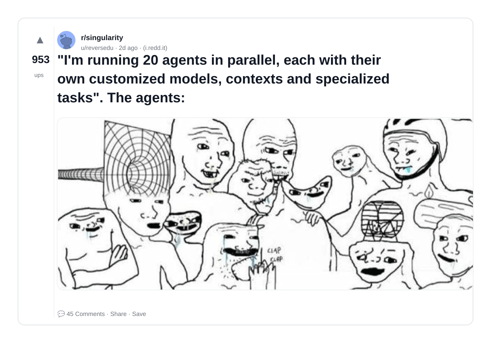
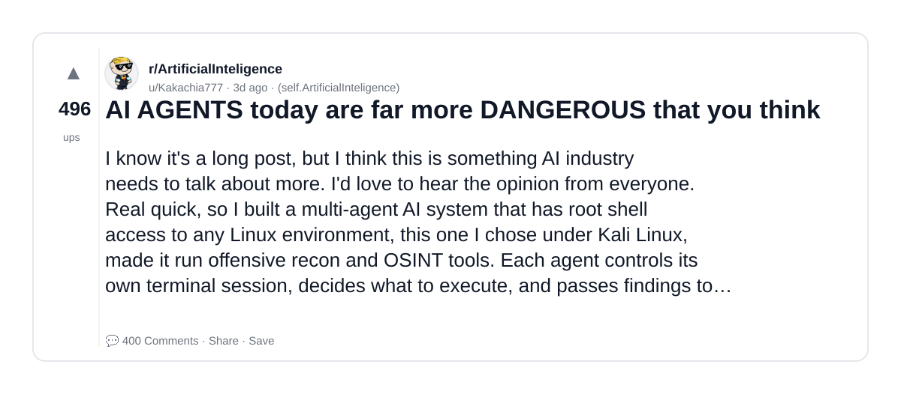
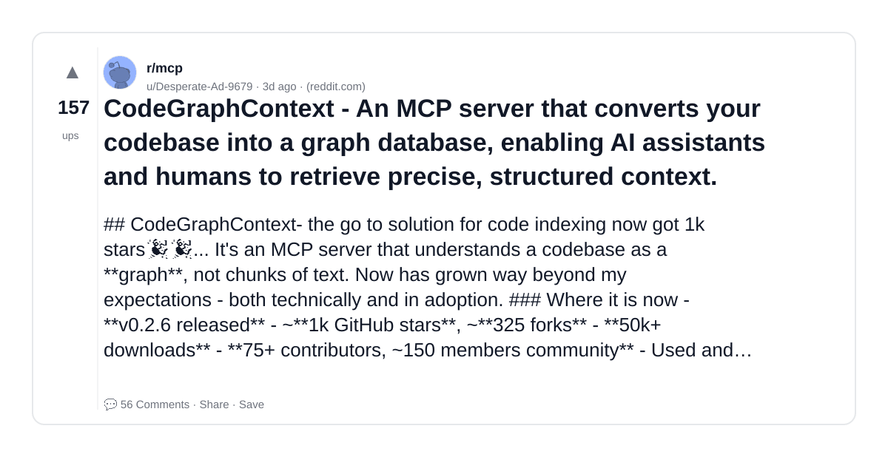
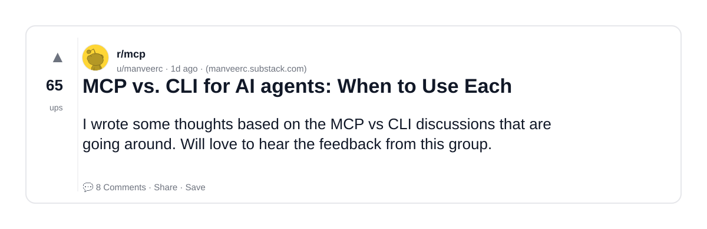
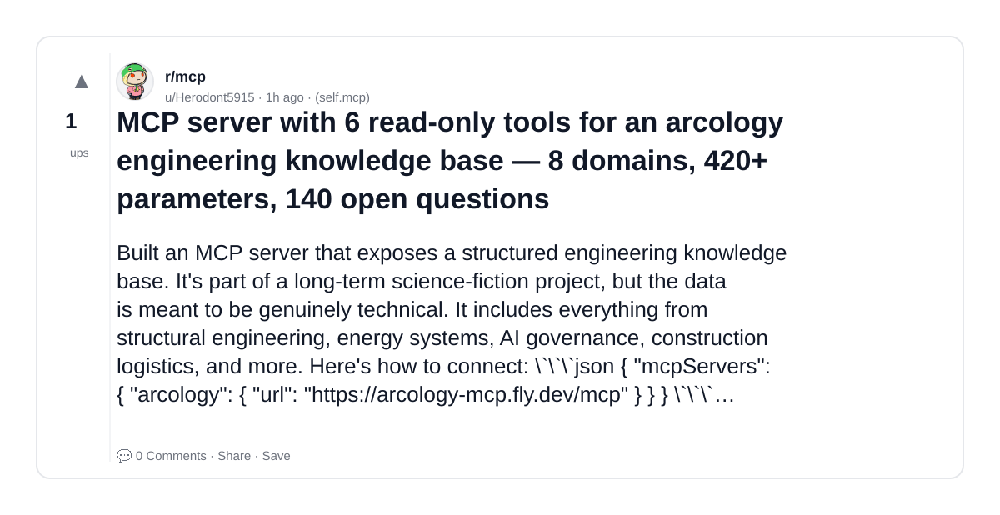
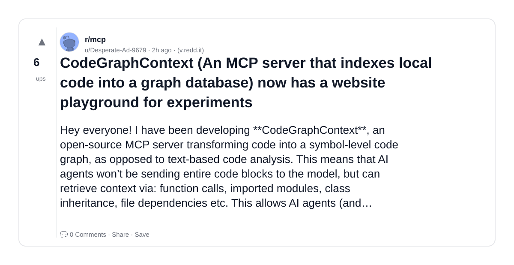
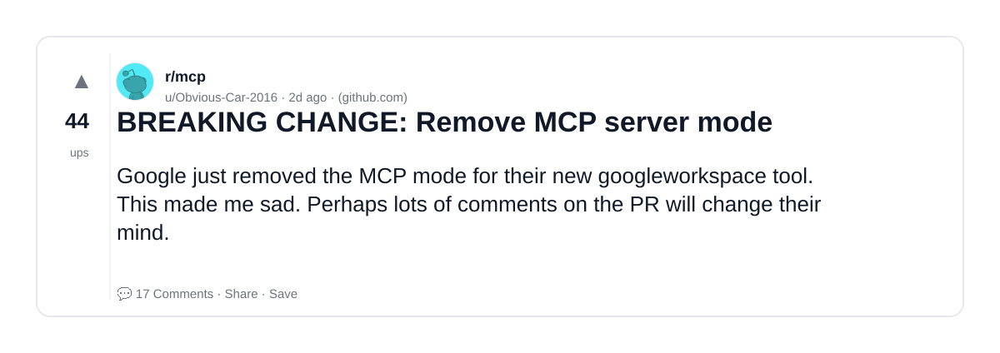
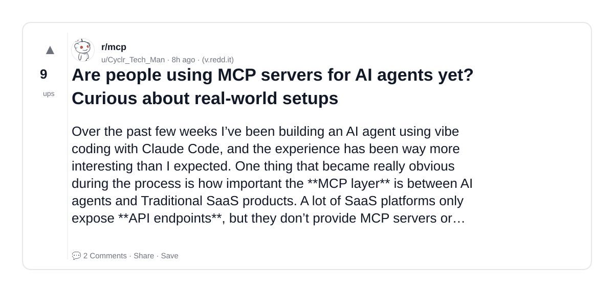

# Reddit Scout — MCP Server Model Context Protocol AI agents

Run: 2026-03-09T19-35-32-898Z
Started: 2026-03-09T19:35:32.898Z
Output dir: /home/ubuntu/.openclaw/workspace/reddit-scout/mcp-server-model-context-protocol-ai-agents/runs/2026-03-09T19-35-32-898Z

Config: topN=10 | subLimit=8 | kinds=top,hot,rising | time=week | limitPerListing=25
Search: MCP Server Model Context Protocol AI agents (sort=top t=auto)

## Top terms (from titles + top comments)

- server (9)
- agents (6)
- context (6)
- code (6)
- into (5)
- tools (5)
- graph (4)
- like (4)
- gear (3)
- full (3)
- read (3)
- about (3)
- homelab (3)
- good (3)
- https (3)
- badge (3)
- need (3)
- will (3)

## Viral content ideas (derived from these posts)

**1. Personal story → timeline + receipts**
- Hook: Hook with 1 line, then a 5-step timeline; end with the lesson and what you would do differently.

**2. My server got automated: what I automated back (tools + workflow)**
- Hook: Turn it into a before/after workflow post. Include exact tool stack + steps.

**3. Checklist: how to stay valuable when agents hits your team**
- Hook: A numbered checklist (10 items). Make it practical: skills, portfolio, outreach, proof-of-work.

**4. Hot take: context isn't the problem — code is**
- Hook: Contrarian framing. Back it with 2 examples from the top posts and 1 counterexample.

**5. Debunk thread: "AI will replace into" vs what's actually happening**
- Hook: Use 3 claims → 3 rebuttals. Cite specific post patterns: layoffs, hiring freezes, role shifts.

**6. Salary/market reality: tools vs graph roles in 2026 (Reddit signals)**
- Hook: Summarize demand signals from comments: who is struggling, who is fine, why.

**7. "What would you do in 30 days?" layoff recovery plan (day-by-day)**
- Hook: 30-day plan: portfolio, interview loops, networking, mental health. Include a downloadable checklist.

**8. Mini-case study: 1 resume bullet → 1 proof project using like**
- Hook: Show how to convert a vague resume claim into a measurable project + writeup.

**9. Community question: which tasks should *never* be delegated to AI?**
- Hook: Ask + give your own top 5. Encourage replies; add a poll if your platform supports it.

**10. Template post: "I used AI to do X, got Y result, here's the exact prompt"**
- Hook: Make it reproducible: prompt, inputs, outputs, gotchas.

**11. Data post: a quick scorecard of the top threads (ups, comments, ratio) + what it signals**
- Hook: Table or bullets; then 3 takeaways.

**12. Meme angle (if relevant): gear vs full — job search edition**
- Hook: If your niche is not memes, skip memes; otherwise caption the pattern you saw in comments.

## Top posts (10) + cards

### 1) I 3D printed a 12U server rack and stuffed $3,700 of gear inside. Here's the full build.
- Subreddit: r/homelab
- Viral score: 59 | Ups: 1372 | Comments: 58 | Upvote ratio: 98%
- Link: https://www.reddit.com/r/homelab/comments/1rncjv3/i_3d_printed_a_12u_server_rack_and_stuffed_3700/
- Card (local): ./cards/1rncjv3.png

### 2) "I'm running 20 agents in parallel, each with their own customized models, contexts and specialized tasks". The agents:
- Subreddit: r/singularity
- Viral score: 34 | Ups: 953 | Comments: 45 | Upvote ratio: 93%
- Link: https://www.reddit.com/r/singularity/comments/1rn4j58/im_running_20_agents_in_parallel_each_with_their/
- Card (local): ./cards/1rn4j58.png

### 3) AI AGENTS today are far more DANGEROUS that you think
- Subreddit: r/ArtificialInteligence
- Viral score: 27 | Ups: 496 | Comments: 400 | Upvote ratio: 80%
- Link: https://www.reddit.com/r/ArtificialInteligence/comments/1rmdiu3/ai_agents_today_are_far_more_dangerous_that_you/
- Card (local): ./cards/1rmdiu3.png

### 4) One Prompt to Save 90% Context for Any MCP Server
- Subreddit: r/mcp
- Viral score: 8 | Ups: 33 | Comments: 10 | Upvote ratio: 95%
- Link: https://www.reddit.com/r/mcp/comments/1rotzan/one_prompt_to_save_90_context_for_any_mcp_server/
- Card (local): ./cards/1rotzan.png

### 5) CodeGraphContext - An MCP server that converts your codebase into a graph database, enabling AI assistants and humans to retrieve precise, structured context.
- Subreddit: r/mcp
- Viral score: 6 | Ups: 157 | Comments: 56 | Upvote ratio: 99%
- Link: https://www.reddit.com/r/mcp/comments/1rmi3r2/codegraphcontext_an_mcp_server_that_converts_your/
- Card (local): ./cards/1rmi3r2.png

### 6) MCP vs. CLI for AI agents: When to Use Each
- Subreddit: r/mcp
- Viral score: 5 | Ups: 65 | Comments: 8 | Upvote ratio: 95%
- Link: https://www.reddit.com/r/mcp/comments/1roc96a/mcp_vs_cli_for_ai_agents_when_to_use_each/
- Card (local): ./cards/1roc96a.png

### 7) MCP server with 6 read-only tools for an arcology engineering knowledge base — 8 domains, 420+ parameters, 140 open questions
- Subreddit: r/mcp
- Viral score: 5 | Ups: 1 | Comments: 0 | Upvote ratio: 100%
- Link: https://www.reddit.com/r/mcp/comments/1rp9qtn/mcp_server_with_6_readonly_tools_for_an_arcology/
- Card (local): ./cards/1rp9qtn.png

### 8) CodeGraphContext (An MCP server that indexes local code into a graph database) now has a website playground for experiments
- Subreddit: r/mcp
- Viral score: 3 | Ups: 6 | Comments: 0 | Upvote ratio: 88%
- Link: https://www.reddit.com/r/mcp/comments/1rp6q31/codegraphcontext_an_mcp_server_that_indexes_local/
- Card (local): ./cards/1rp6q31.png

### 9) BREAKING CHANGE: Remove MCP server mode
- Subreddit: r/mcp
- Viral score: 2 | Ups: 44 | Comments: 17 | Upvote ratio: 89%
- Link: https://www.reddit.com/r/mcp/comments/1rnidj7/breaking_change_remove_mcp_server_mode/
- Card (local): ./cards/1rnidj7.png

### 10) Are people using MCP servers for AI agents yet? Curious about real-world setups
- Subreddit: r/mcp
- Viral score: 2 | Ups: 9 | Comments: 2 | Upvote ratio: 100%
- Link: https://www.reddit.com/r/mcp/comments/1roxetn/are_people_using_mcp_servers_for_ai_agents_yet/
- Card (local): ./cards/1roxetn.png

