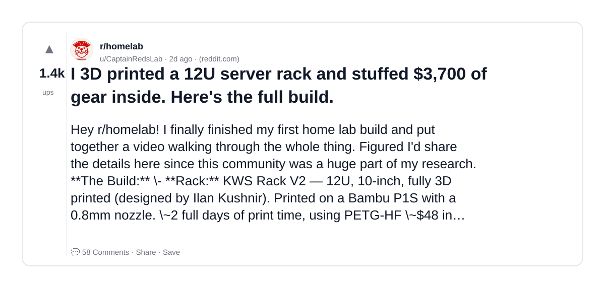
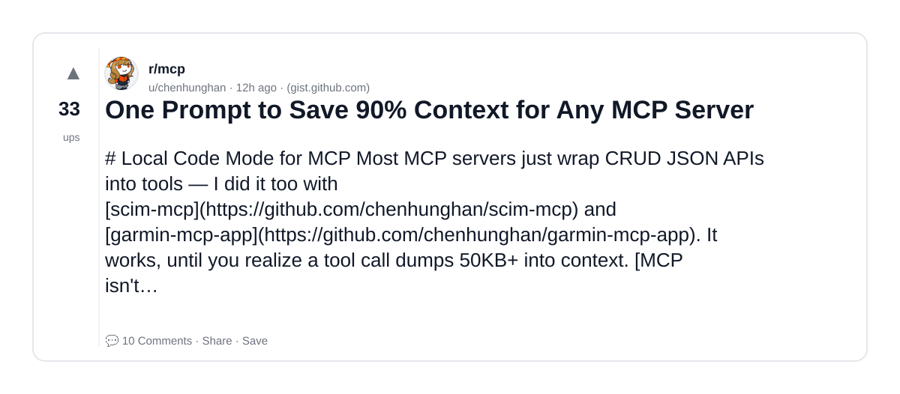
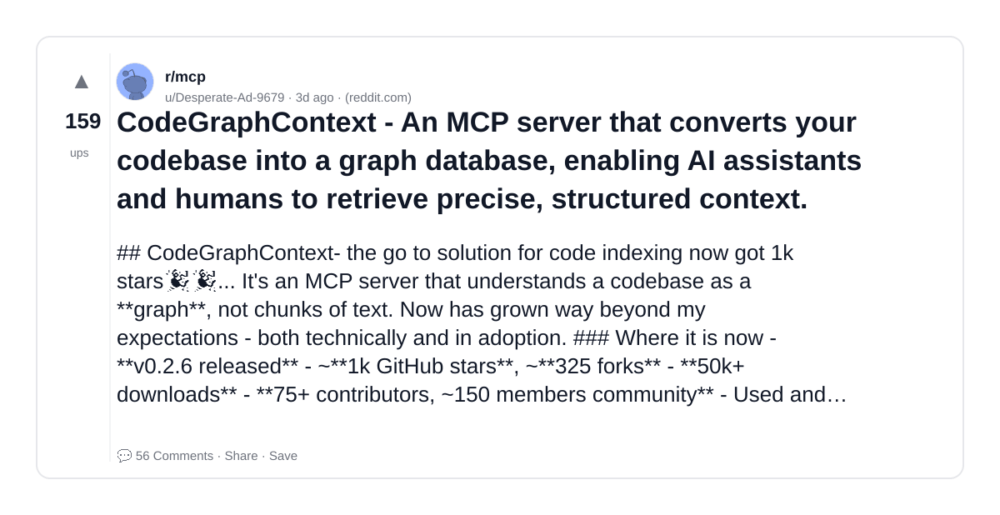
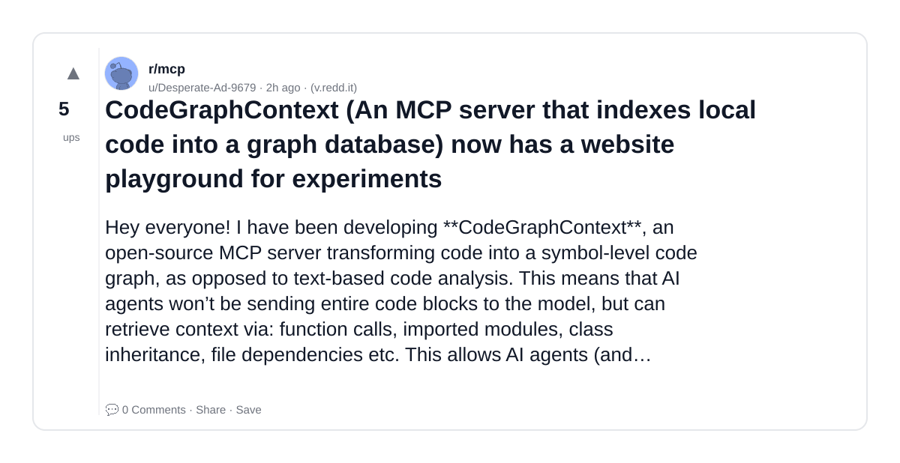
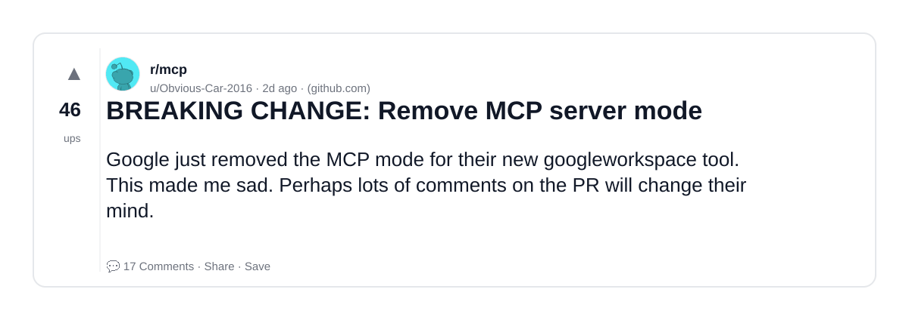
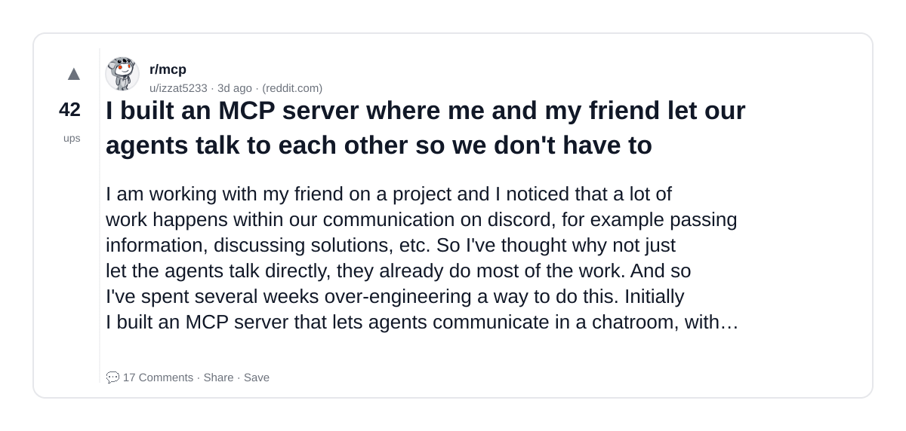
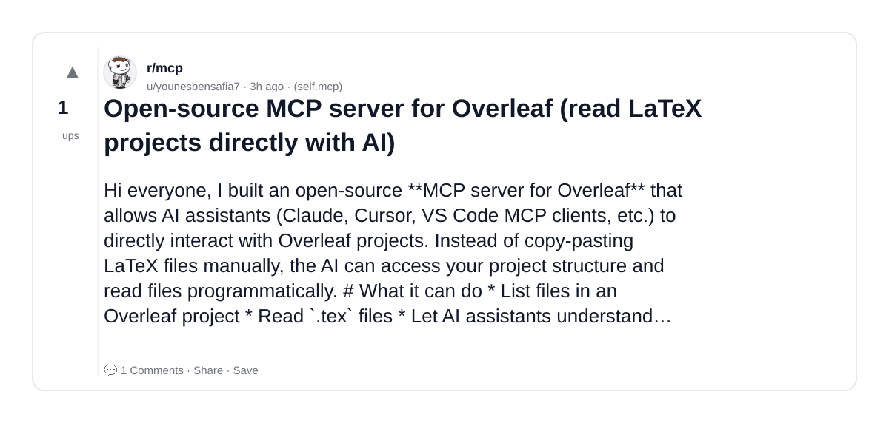
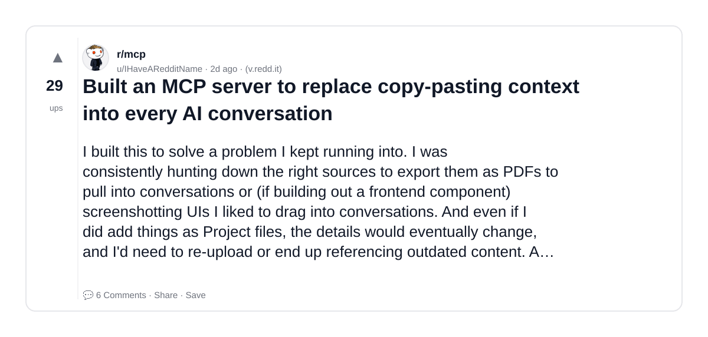
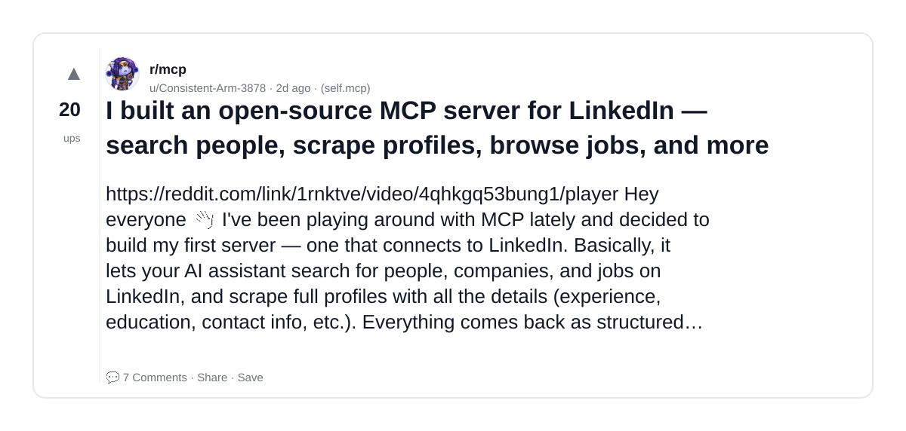

# Reddit Scout — MCP Server Model Context Protocol AI

Run: 2026-03-09T19-23-14-483Z
Started: 2026-03-09T19:23:14.483Z
Output dir: /home/ubuntu/.openclaw/workspace/reddit-scout/mcp-server-model-context-protocol-ai/runs/2026-03-09T19-23-14-483Z

Config: topN=10 | subLimit=8 | kinds=top,hot,rising | time=week | limitPerListing=25
Search: MCP Server Model Context Protocol AI (sort=top t=auto)

## Top terms (from titles + top comments)

- server (12)
- context (6)
- into (6)
- open (5)
- code (5)
- source (5)
- knowledge (4)
- graph (4)
- built (4)
- https (4)
- model (4)
- like (4)
- gear (3)
- full (3)
- base (3)
- database (3)
- linkedin (3)
- homelab (3)

## Viral content ideas (derived from these posts)

**1. Personal story → timeline + receipts**
- Hook: Hook with 1 line, then a 5-step timeline; end with the lesson and what you would do differently.

**2. My server got automated: what I automated back (tools + workflow)**
- Hook: Turn it into a before/after workflow post. Include exact tool stack + steps.

**3. Checklist: how to stay valuable when context hits your team**
- Hook: A numbered checklist (10 items). Make it practical: skills, portfolio, outreach, proof-of-work.

**4. Hot take: into isn't the problem — open is**
- Hook: Contrarian framing. Back it with 2 examples from the top posts and 1 counterexample.

**5. Debunk thread: "AI will replace code" vs what's actually happening**
- Hook: Use 3 claims → 3 rebuttals. Cite specific post patterns: layoffs, hiring freezes, role shifts.

**6. Salary/market reality: source vs knowledge roles in 2026 (Reddit signals)**
- Hook: Summarize demand signals from comments: who is struggling, who is fine, why.

**7. "What would you do in 30 days?" layoff recovery plan (day-by-day)**
- Hook: 30-day plan: portfolio, interview loops, networking, mental health. Include a downloadable checklist.

**8. Mini-case study: 1 resume bullet → 1 proof project using graph**
- Hook: Show how to convert a vague resume claim into a measurable project + writeup.

**9. Community question: which tasks should *never* be delegated to AI?**
- Hook: Ask + give your own top 5. Encourage replies; add a poll if your platform supports it.

**10. Template post: "I used AI to do X, got Y result, here's the exact prompt"**
- Hook: Make it reproducible: prompt, inputs, outputs, gotchas.

**11. Data post: a quick scorecard of the top threads (ups, comments, ratio) + what it signals**
- Hook: Table or bullets; then 3 takeaways.

**12. Meme angle (if relevant): built vs https — job search edition**
- Hook: If your niche is not memes, skip memes; otherwise caption the pattern you saw in comments.

## Top posts (10) + cards

### 1) I 3D printed a 12U server rack and stuffed $3,700 of gear inside. Here's the full build.
- Subreddit: r/homelab
- Viral score: 59 | Ups: 1368 | Comments: 58 | Upvote ratio: 98%
- Link: https://www.reddit.com/r/homelab/comments/1rncjv3/i_3d_printed_a_12u_server_rack_and_stuffed_3700/
- Card (local): ./cards/1rncjv3.png

### 2) MCP server with 6 read-only tools for an arcology engineering knowledge base — 8 domains, 420+ parameters, 140 open questions
- Subreddit: r/mcp
- Viral score: 18 | Ups: 1 | Comments: 0 | Upvote ratio: 100%
- Link: https://www.reddit.com/r/mcp/comments/1rp9qtn/mcp_server_with_6_readonly_tools_for_an_arcology/
- Card (local): ./cards/1rp9qtn.png

### 3) One Prompt to Save 90% Context for Any MCP Server
- Subreddit: r/mcp
- Viral score: 8 | Ups: 33 | Comments: 10 | Upvote ratio: 95%
- Link: https://www.reddit.com/r/mcp/comments/1rotzan/one_prompt_to_save_90_context_for_any_mcp_server/
- Card (local): ./cards/1rotzan.png

### 4) CodeGraphContext - An MCP server that converts your codebase into a graph database, enabling AI assistants and humans to retrieve precise, structured context.
- Subreddit: r/mcp
- Viral score: 6 | Ups: 159 | Comments: 56 | Upvote ratio: 99%
- Link: https://www.reddit.com/r/mcp/comments/1rmi3r2/codegraphcontext_an_mcp_server_that_converts_your/
- Card (local): ./cards/1rmi3r2.png

### 5) CodeGraphContext (An MCP server that indexes local code into a graph database) now has a website playground for experiments
- Subreddit: r/mcp
- Viral score: 2 | Ups: 5 | Comments: 0 | Upvote ratio: 86%
- Link: https://www.reddit.com/r/mcp/comments/1rp6q31/codegraphcontext_an_mcp_server_that_indexes_local/
- Card (local): ./cards/1rp6q31.png

### 6) BREAKING CHANGE: Remove MCP server mode
- Subreddit: r/mcp
- Viral score: 2 | Ups: 46 | Comments: 17 | Upvote ratio: 88%
- Link: https://www.reddit.com/r/mcp/comments/1rnidj7/breaking_change_remove_mcp_server_mode/
- Card (local): ./cards/1rnidj7.png

### 7) I built an MCP server where me and my friend let our agents talk to each other so we don't have to
- Subreddit: r/mcp
- Viral score: 1 | Ups: 42 | Comments: 17 | Upvote ratio: 94%
- Link: https://www.reddit.com/r/mcp/comments/1rmq4ww/i_built_an_mcp_server_where_me_and_my_friend_let/
- Card (local): ./cards/1rmq4ww.png

### 8) Open-source MCP server for Overleaf (read LaTeX projects directly with AI)
- Subreddit: r/mcp
- Viral score: 1 | Ups: 1 | Comments: 1 | Upvote ratio: 100%
- Link: https://www.reddit.com/r/mcp/comments/1rp4hyv/opensource_mcp_server_for_overleaf_read_latex/
- Card (local): ./cards/1rp4hyv.png

### 9) Built an MCP server to replace copy-pasting context into every AI conversation
- Subreddit: r/mcp
- Viral score: 1 | Ups: 29 | Comments: 6 | Upvote ratio: 97%
- Link: https://www.reddit.com/r/mcp/comments/1rnahdh/built_an_mcp_server_to_replace_copypasting/
- Card (local): ./cards/1rnahdh.png

### 10) I built an open-source MCP server for LinkedIn — search people, scrape profiles, browse jobs, and more
- Subreddit: r/mcp
- Viral score: 1 | Ups: 20 | Comments: 7 | Upvote ratio: 96%
- Link: https://www.reddit.com/r/mcp/comments/1rnktve/i_built_an_opensource_mcp_server_for_linkedin/
- Card (local): ./cards/1rnktve.png

