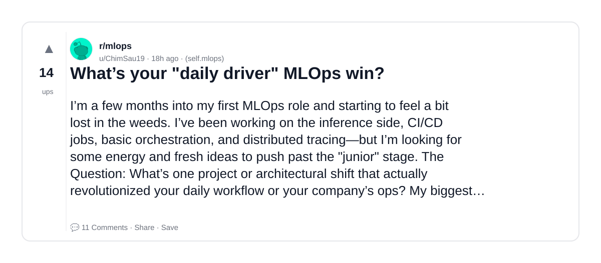
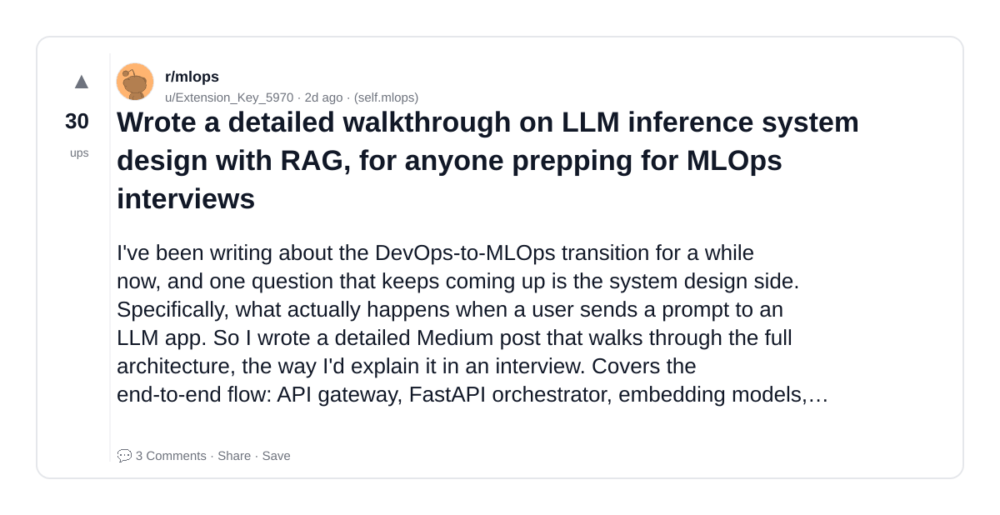
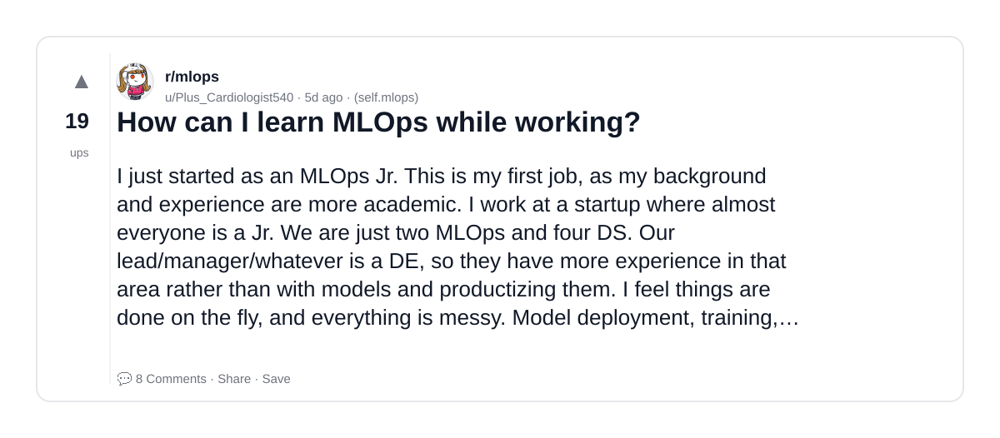
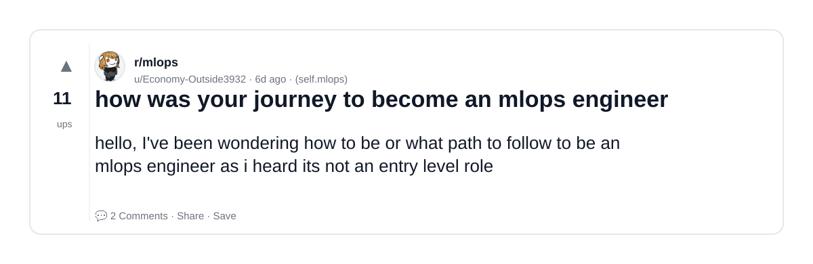
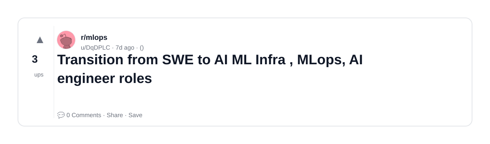

# Reddit Scout — MLOps Career

Run: 2026-03-06T12-24-52-081Z
Started: 2026-03-06T12:24:52.082Z
Output dir: /home/ubuntu/.openclaw/workspace/reddit-scout/mlops-career/runs/2026-03-06T12-24-52-081Z

Config: topN=10 | subLimit=8 | kinds=top,hot,rising | time=week | limitPerListing=25
Search: MLOps Career (sort=top t=auto)

## Top terms (from titles + top comments)

- mlops (14)
- engineer (7)
- models (7)
- have (6)
- time (5)
- team (5)
- small (5)
- company (5)
- what (4)
- know (4)
- part (4)
- where (4)
- modeling (4)
- inference (3)
- people (3)
- need (3)
- model (3)
- which (3)

## Viral content ideas (derived from these posts)

**1. Personal story → timeline + receipts**
- Hook: Hook with 1 line, then a 5-step timeline; end with the lesson and what you would do differently.

**2. My mlops got automated: what I automated back (tools + workflow)**
- Hook: Turn it into a before/after workflow post. Include exact tool stack + steps.

**3. Checklist: how to stay valuable when engineer hits your team**
- Hook: A numbered checklist (10 items). Make it practical: skills, portfolio, outreach, proof-of-work.

**4. Hot take: models isn't the problem — have is**
- Hook: Contrarian framing. Back it with 2 examples from the top posts and 1 counterexample.

**5. Debunk thread: "AI will replace time" vs what's actually happening**
- Hook: Use 3 claims → 3 rebuttals. Cite specific post patterns: layoffs, hiring freezes, role shifts.

**6. Salary/market reality: team vs small roles in 2026 (Reddit signals)**
- Hook: Summarize demand signals from comments: who is struggling, who is fine, why.

**7. "What would you do in 30 days?" layoff recovery plan (day-by-day)**
- Hook: 30-day plan: portfolio, interview loops, networking, mental health. Include a downloadable checklist.

**8. Mini-case study: 1 resume bullet → 1 proof project using company**
- Hook: Show how to convert a vague resume claim into a measurable project + writeup.

**9. Community question: which tasks should *never* be delegated to AI?**
- Hook: Ask + give your own top 5. Encourage replies; add a poll if your platform supports it.

**10. Template post: "I used AI to do X, got Y result, here's the exact prompt"**
- Hook: Make it reproducible: prompt, inputs, outputs, gotchas.

**11. Data post: a quick scorecard of the top threads (ups, comments, ratio) + what it signals**
- Hook: Table or bullets; then 3 takeaways.

**12. Meme angle (if relevant): what vs know — job search edition**
- Hook: If your niche is not memes, skip memes; otherwise caption the pattern you saw in comments.

## Top posts (5) + cards

### 1) What’s your "daily driver" MLOps win?
- Subreddit: r/mlops
- Viral score: 3 | Ups: 14 | Comments: 11 | Upvote ratio: 100%
- Link: https://www.reddit.com/r/mlops/comments/1rlq4ui/whats_your_daily_driver_mlops_win/
- Card (local): ./cards/1rlq4ui.png

### 2) Wrote a detailed walkthrough on LLM inference system design with RAG, for anyone prepping for MLOps interviews
- Subreddit: r/mlops
- Viral score: 1 | Ups: 30 | Comments: 3 | Upvote ratio: 94%
- Link: https://www.reddit.com/r/mlops/comments/1rkij9r/wrote_a_detailed_walkthrough_on_llm_inference/
- Card (local): ./cards/1rkij9r.png

### 3) How can I learn MLOps while working?
- Subreddit: r/mlops
- Viral score: 0 | Ups: 19 | Comments: 8 | Upvote ratio: 91%
- Link: https://www.reddit.com/r/mlops/comments/1riej7v/how_can_i_learn_mlops_while_working/
- Card (local): ./cards/1riej7v.png

### 4) how was your journey to become an mlops engineer
- Subreddit: r/mlops
- Viral score: 0 | Ups: 11 | Comments: 2 | Upvote ratio: 92%
- Link: https://www.reddit.com/r/mlops/comments/1rhf2iy/how_was_your_journey_to_become_an_mlops_engineer/
- Card (local): ./cards/1rhf2iy.png

### 5) Transition from SWE to AI ML Infra , MLops, AI engineer roles
- Subreddit: r/mlops
- Viral score: 0 | Ups: 3 | Comments: 0 | Upvote ratio: 100%
- Link: https://www.reddit.com/r/mlops/comments/1rgognq/transition_from_swe_to_ai_ml_infra_mlops_ai/
- Card (local): ./cards/1rgognq.png

