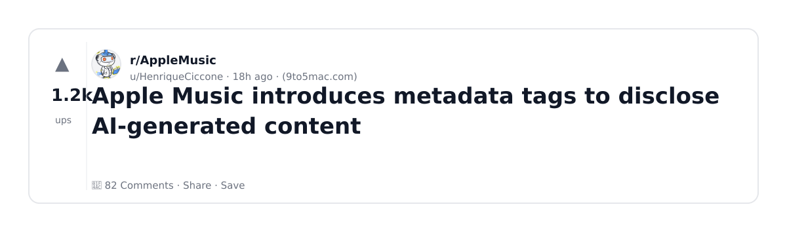
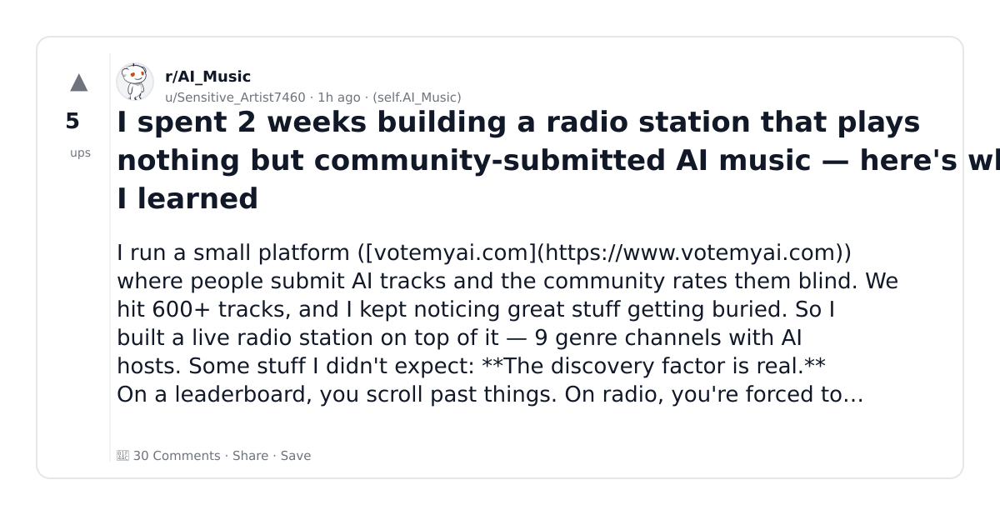
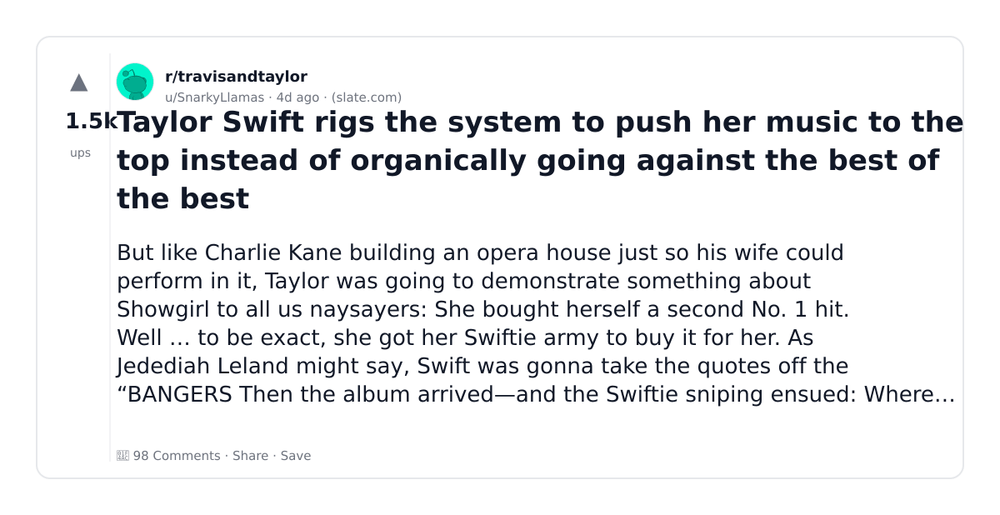
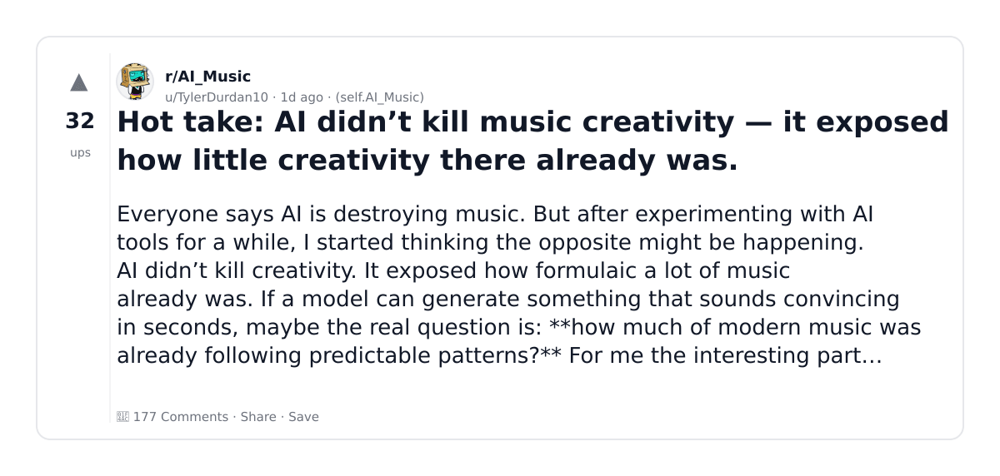
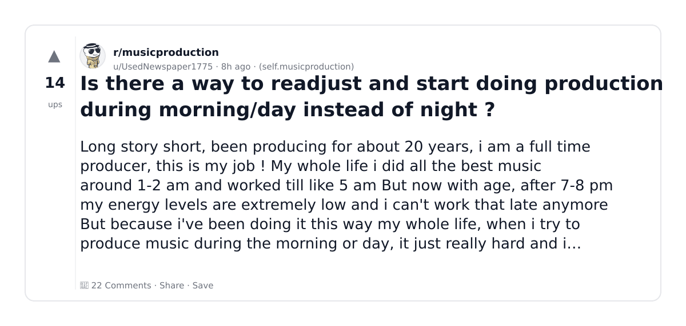
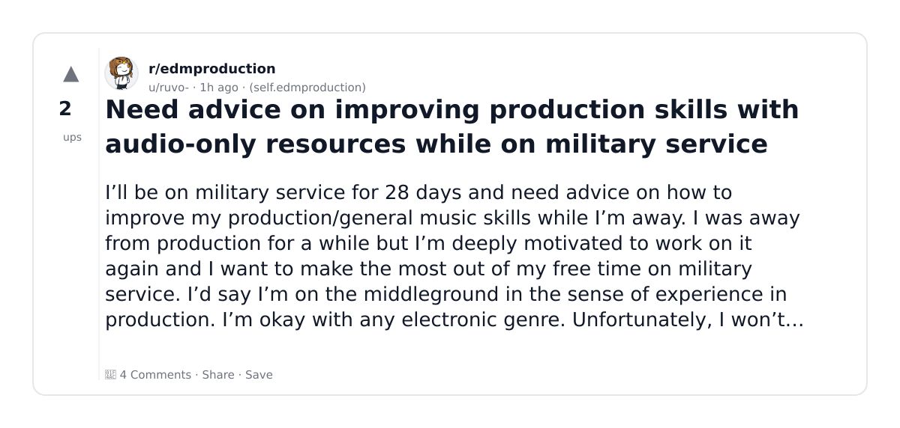
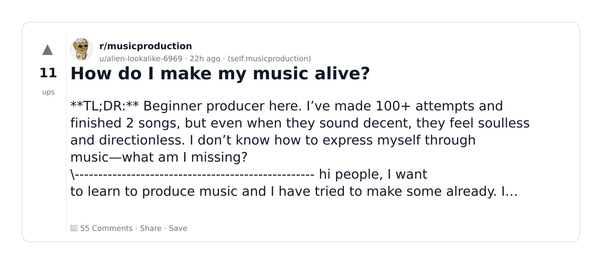
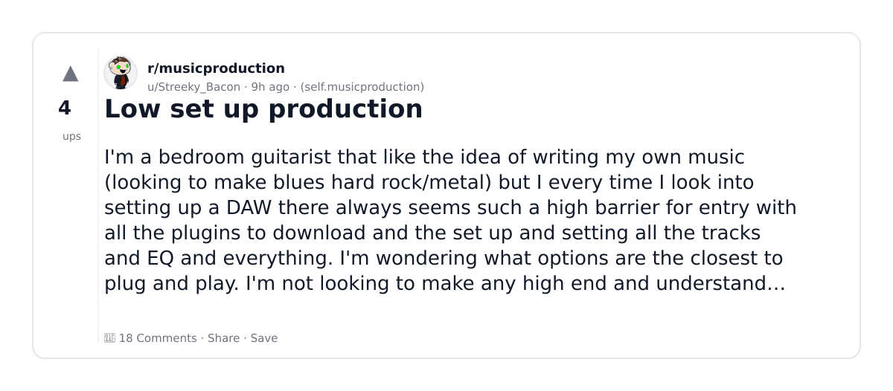
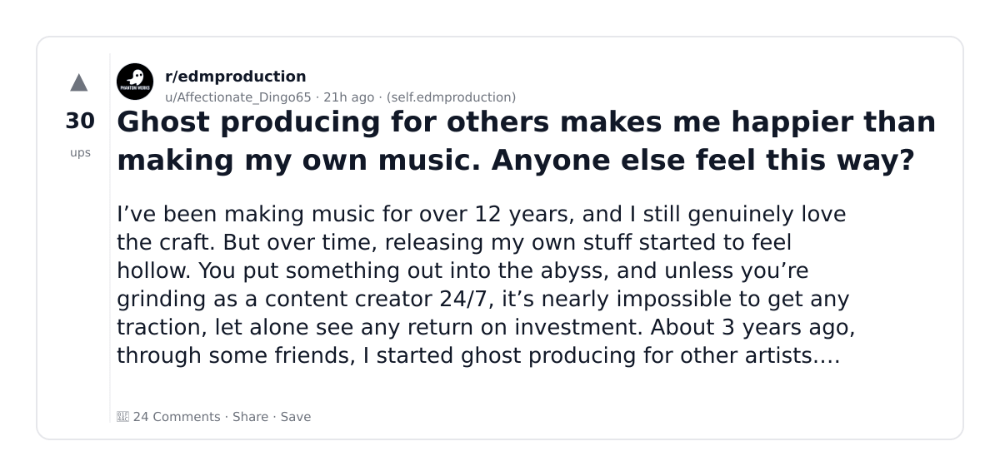
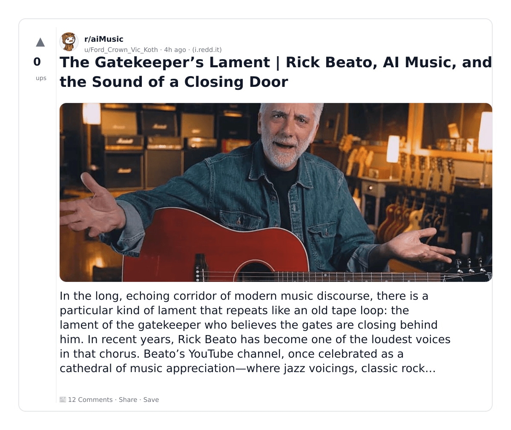

# Reddit Scout — music production AI

Run: 2026-03-05T17-18-02-797Z
Started: 2026-03-05T17:18:02.798Z
Output dir: /home/ubuntu/.openclaw/workspace/reddit-scout/music-production-ai/runs/2026-03-05T17-18-02-797Z

Config: topN=10 | subLimit=8 | kinds=top,hot,rising | time=week | limitPerListing=25
Search: music production AI (sort=top t=auto)

## Top terms (from titles + top comments)

- music (28)
- thing (12)
- what (11)
- have (11)
- more (9)
- make (8)
- like (8)
- there (7)
- audio (7)
- something (7)
- will (7)
- production (6)
- good (6)
- about (6)
- going (5)
- didn (5)
- sound (5)
- after (5)

## Viral content ideas (derived from these posts)

**1. Personal story → timeline + receipts**
- Hook: Hook with 1 line, then a 5-step timeline; end with the lesson and what you would do differently.

**2. My music got automated: what I automated back (tools + workflow)**
- Hook: Turn it into a before/after workflow post. Include exact tool stack + steps.

**3. Checklist: how to stay valuable when thing hits your team**
- Hook: A numbered checklist (10 items). Make it practical: skills, portfolio, outreach, proof-of-work.

**4. Hot take: what isn't the problem — have is**
- Hook: Contrarian framing. Back it with 2 examples from the top posts and 1 counterexample.

**5. Debunk thread: "AI will replace more" vs what's actually happening**
- Hook: Use 3 claims → 3 rebuttals. Cite specific post patterns: layoffs, hiring freezes, role shifts.

**6. Salary/market reality: make vs like roles in 2026 (Reddit signals)**
- Hook: Summarize demand signals from comments: who is struggling, who is fine, why.

**7. "What would you do in 30 days?" layoff recovery plan (day-by-day)**
- Hook: 30-day plan: portfolio, interview loops, networking, mental health. Include a downloadable checklist.

**8. Mini-case study: 1 resume bullet → 1 proof project using there**
- Hook: Show how to convert a vague resume claim into a measurable project + writeup.

**9. Community question: which tasks should *never* be delegated to AI?**
- Hook: Ask + give your own top 5. Encourage replies; add a poll if your platform supports it.

**10. Template post: "I used AI to do X, got Y result, here's the exact prompt"**
- Hook: Make it reproducible: prompt, inputs, outputs, gotchas.

**11. Data post: a quick scorecard of the top threads (ups, comments, ratio) + what it signals**
- Hook: Table or bullets; then 3 takeaways.

**12. Meme angle (if relevant): audio vs something — job search edition**
- Hook: If your niche is not memes, skip memes; otherwise caption the pattern you saw in comments.

## Top posts (10) + cards

### 1) Apple Music introduces metadata tags to disclose AI-generated content
- Subreddit: r/AppleMusic
- Viral score: 125 | Ups: 1198 | Comments: 82 | Upvote ratio: 99%
- Link: https://www.reddit.com/r/AppleMusic/comments/1rl0chn/apple_music_introduces_metadata_tags_to_disclose/
- Card (local): ./cards/1rl0chn.png

### 2) I spent 2 weeks building a radio station that plays nothing but community-submitted AI music — here's what I learned
- Subreddit: r/AI_Music
- Viral score: 79 | Ups: 5 | Comments: 30 | Upvote ratio: 65%
- Link: https://www.reddit.com/r/AI_Music/comments/1rll3tj/i_spent_2_weeks_building_a_radio_station_that/
- Card (local): ./cards/1rll3tj.png

### 3) Taylor Swift rigs the system to push her music to the top instead of organically going against the best of the best
- Subreddit: r/travisandtaylor
- Viral score: 34 | Ups: 1451 | Comments: 98 | Upvote ratio: 99%
- Link: https://www.reddit.com/r/travisandtaylor/comments/1rhxuo7/taylor_swift_rigs_the_system_to_push_her_music_to/
- Card (local): ./cards/1rhxuo7.png

### 4) Hot take: AI didn’t kill music creativity — it exposed how little creativity there already was.
- Subreddit: r/AI_Music
- Viral score: 20 | Ups: 32 | Comments: 177 | Upvote ratio: 55%
- Link: https://www.reddit.com/r/AI_Music/comments/1rknyg9/hot_take_ai_didnt_kill_music_creativity_it/
- Card (local): ./cards/1rknyg9.png

### 5) Is there a way to readjust and start doing production during morning/day instead of night ?
- Subreddit: r/musicproduction
- Viral score: 12 | Ups: 14 | Comments: 22 | Upvote ratio: 82%
- Link: https://www.reddit.com/r/musicproduction/comments/1rlctz5/is_there_a_way_to_readjust_and_start_doing/
- Card (local): ./cards/1rlctz5.png

### 6) Need advice on improving production skills with audio-only resources while on military service
- Subreddit: r/edmproduction
- Viral score: 10 | Ups: 2 | Comments: 4 | Upvote ratio: 100%
- Link: https://www.reddit.com/r/edmproduction/comments/1rll6gr/need_advice_on_improving_production_skills_with/
- Card (local): ./cards/1rll6gr.png

### 7) How do I make my music alive?
- Subreddit: r/musicproduction
- Viral score: 7 | Ups: 11 | Comments: 55 | Upvote ratio: 72%
- Link: https://www.reddit.com/r/musicproduction/comments/1rkujdt/how_do_i_make_my_music_alive/
- Card (local): ./cards/1rkujdt.png

### 8) Low set up production
- Subreddit: r/musicproduction
- Viral score: 6 | Ups: 4 | Comments: 18 | Upvote ratio: 83%
- Link: https://www.reddit.com/r/musicproduction/comments/1rlc4g4/low_set_up_production/
- Card (local): ./cards/1rlc4g4.png

### 9) Ghost producing for others makes me happier than making my own music. Anyone else feel this way?
- Subreddit: r/edmproduction
- Viral score: 6 | Ups: 30 | Comments: 24 | Upvote ratio: 89%
- Link: https://www.reddit.com/r/edmproduction/comments/1rkwnz1/ghost_producing_for_others_makes_me_happier_than/
- Card (local): ./cards/1rkwnz1.png

### 10) The Gatekeeper’s Lament | Rick Beato, AI Music, and the Sound of a Closing Door
- Subreddit: r/aiMusic
- Viral score: 5 | Ups: 0 | Comments: 12 | Upvote ratio: 38%
- Link: https://www.reddit.com/r/aiMusic/comments/1rlh7qs/the_gatekeepers_lament_rick_beato_ai_music_and/
- Card (local): ./cards/1rlh7qs.png

