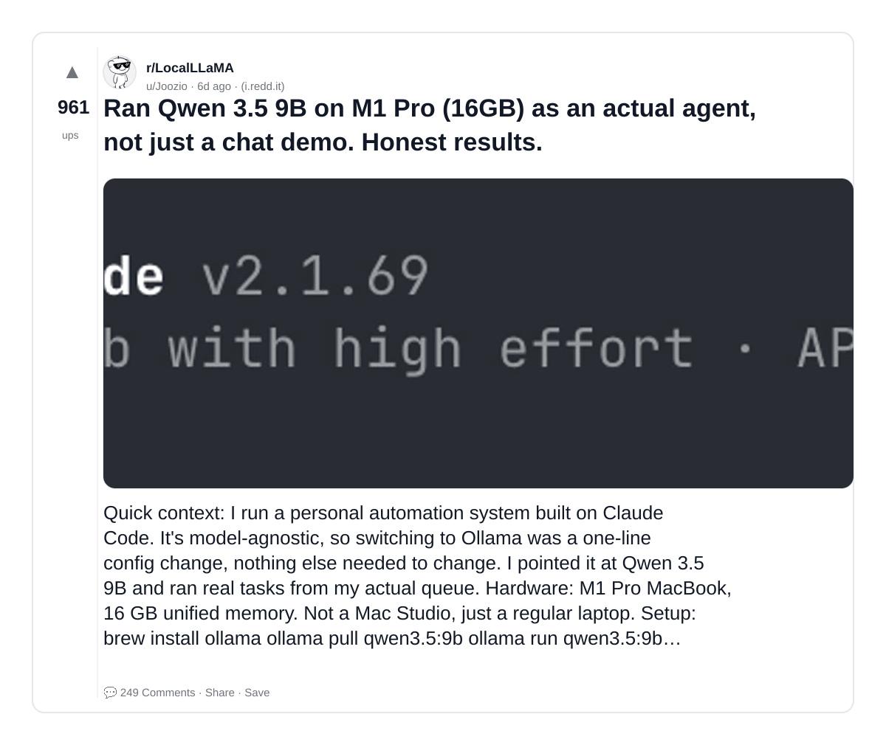
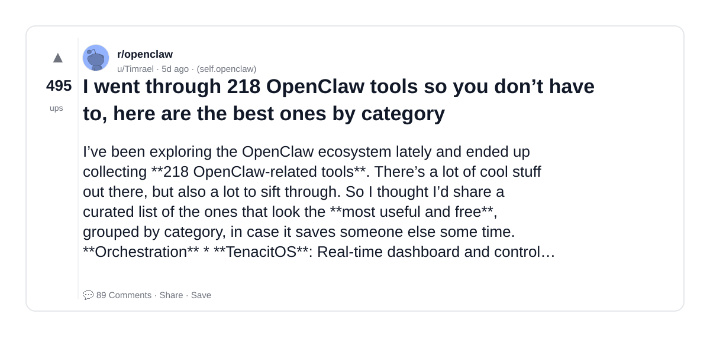
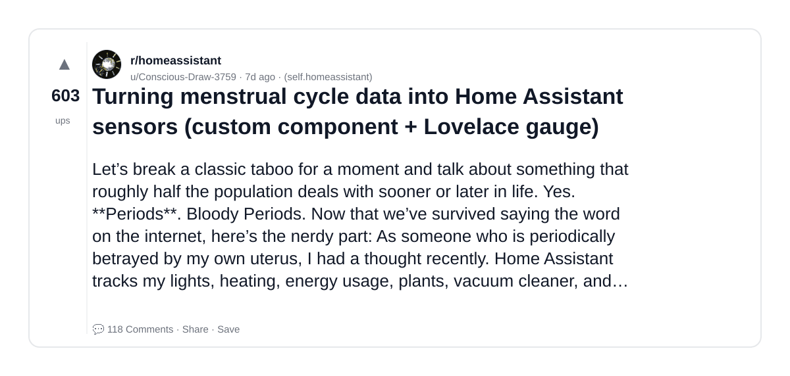

# Reddit Scout — OpenClaw AI agent automation personal assistant

Run: 2026-03-11T15-35-27-467Z
Started: 2026-03-11T15:35:27.468Z
Output dir: /home/ubuntu/.openclaw/workspace/reddit-scout/openclaw-ai-agent-automation-personal-assistant/runs/2026-03-11T15-35-27-467Z

Config: topN=10 | subLimit=8 | kinds=top,hot,rising | time=week | limitPerListing=25
Search: OpenClaw AI agent automation personal assistant (sort=top t=auto)

## Top terms (from titles + top comments)

- tools (5)
- claude (4)
- agent (3)
- have (3)
- code (3)
- about (3)
- some (3)
- anything (3)
- potential (3)
- openclaw (2)
- here (2)
- turning (2)
- data (2)
- into (2)
- assistant (2)
- trying (2)
- working (2)
- great (2)

## Viral content ideas (derived from these posts)

**1. Personal story → timeline + receipts**
- Hook: Hook with 1 line, then a 5-step timeline; end with the lesson and what you would do differently.

**2. My tools got automated: what I automated back (tools + workflow)**
- Hook: Turn it into a before/after workflow post. Include exact tool stack + steps.

**3. Checklist: how to stay valuable when claude hits your team**
- Hook: A numbered checklist (10 items). Make it practical: skills, portfolio, outreach, proof-of-work.

**4. Hot take: agent isn't the problem — have is**
- Hook: Contrarian framing. Back it with 2 examples from the top posts and 1 counterexample.

**5. Debunk thread: "AI will replace code" vs what's actually happening**
- Hook: Use 3 claims → 3 rebuttals. Cite specific post patterns: layoffs, hiring freezes, role shifts.

**6. Salary/market reality: about vs some roles in 2026 (Reddit signals)**
- Hook: Summarize demand signals from comments: who is struggling, who is fine, why.

**7. "What would you do in 30 days?" layoff recovery plan (day-by-day)**
- Hook: 30-day plan: portfolio, interview loops, networking, mental health. Include a downloadable checklist.

**8. Mini-case study: 1 resume bullet → 1 proof project using anything**
- Hook: Show how to convert a vague resume claim into a measurable project + writeup.

**9. Community question: which tasks should *never* be delegated to AI?**
- Hook: Ask + give your own top 5. Encourage replies; add a poll if your platform supports it.

**10. Template post: "I used AI to do X, got Y result, here's the exact prompt"**
- Hook: Make it reproducible: prompt, inputs, outputs, gotchas.

**11. Data post: a quick scorecard of the top threads (ups, comments, ratio) + what it signals**
- Hook: Table or bullets; then 3 takeaways.

**12. Meme angle (if relevant): potential vs openclaw — job search edition**
- Hook: If your niche is not memes, skip memes; otherwise caption the pattern you saw in comments.

## Top posts (3) + cards

### 1) Ran Qwen 3.5 9B on M1 Pro (16GB) as an actual agent, not just a chat demo. Honest results.
- Subreddit: r/LocalLLaMA
- Viral score: 19 | Ups: 961 | Comments: 249 | Upvote ratio: 94%
- Link: https://www.reddit.com/r/LocalLLaMA/comments/1rll349/ran_qwen_35_9b_on_m1_pro_16gb_as_an_actual_agent/
- Card (local): ./cards/1rll349.png

### 2) I went through 218 OpenClaw tools so you don’t have to, here are the best ones by category
- Subreddit: r/openclaw
- Viral score: 10 | Ups: 495 | Comments: 89 | Upvote ratio: 98%
- Link: https://www.reddit.com/r/openclaw/comments/1rmgt2m/i_went_through_218_openclaw_tools_so_you_dont/
- Card (local): ./cards/1rmgt2m.png

### 3) Turning menstrual cycle data into Home Assistant sensors (custom component + Lovelace gauge)
- Subreddit: r/homeassistant
- Viral score: 8 | Ups: 603 | Comments: 118 | Upvote ratio: 95%
- Link: https://www.reddit.com/r/homeassistant/comments/1rkdrou/turning_menstrual_cycle_data_into_home_assistant/
- Card (local): ./cards/1rkdrou.png

