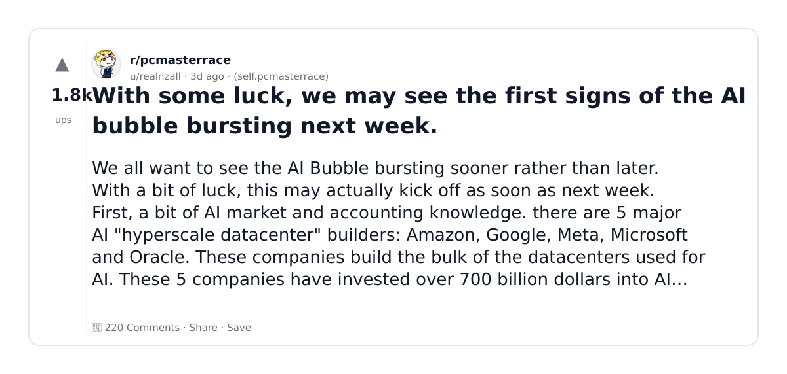
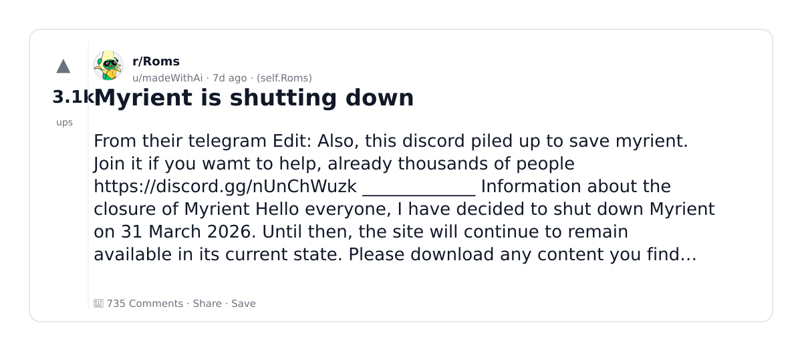
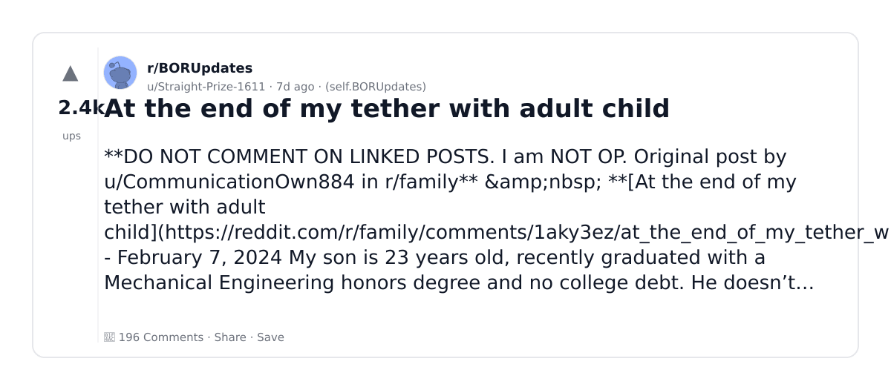
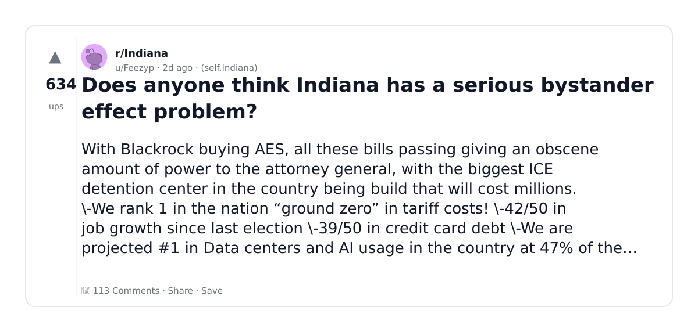
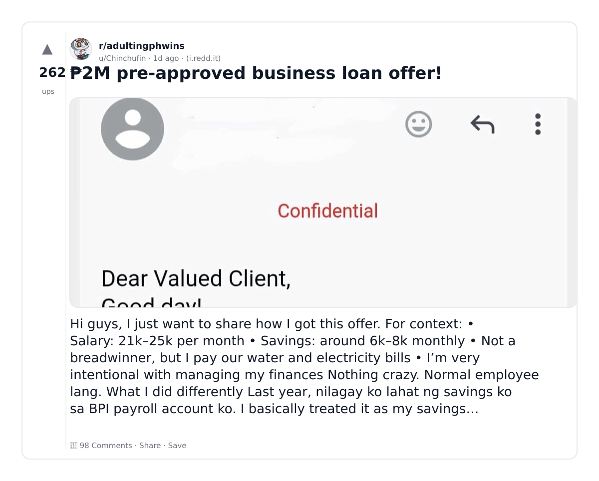
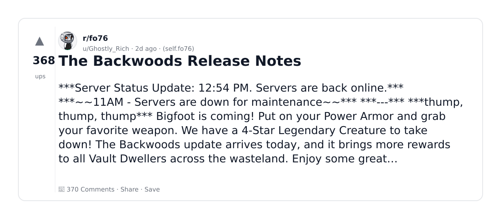
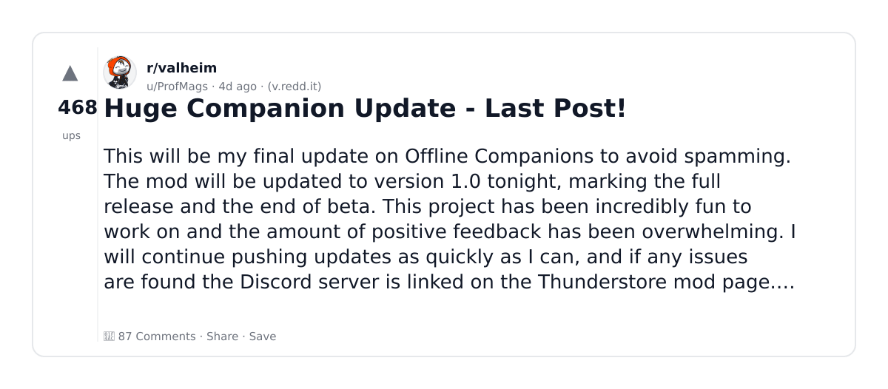
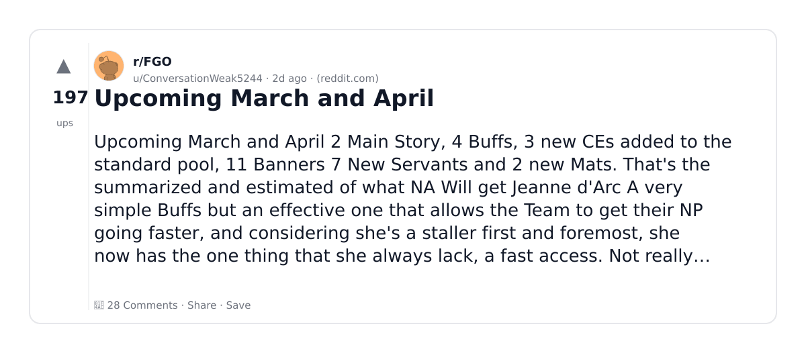
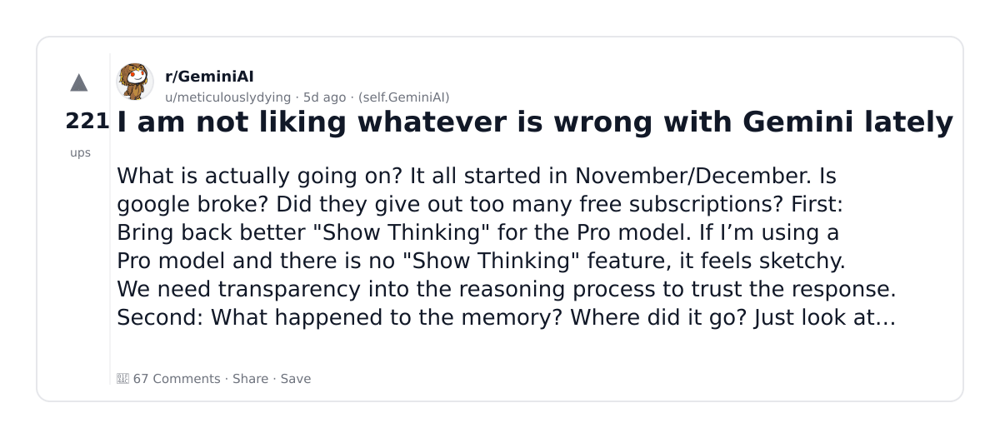

# Reddit Scout — Water Usage and Datacenters

Run: 2026-03-05T16-37-37-601Z
Started: 2026-03-05T16:37:37.602Z
Output dir: /home/ubuntu/.openclaw/workspace/reddit-scout/water-usage-and-datacenters/runs/2026-03-05T16-37-37-601Z

Config: topN=10 | subLimit=8 | kinds=top,hot,rising | time=week | limitPerListing=25
Search: Water Usage and Datacenters (sort=top t=auto)

## Top terms (from titles + top comments)

- have (11)
- what (9)
- like (8)
- first (7)
- people (7)
- when (7)
- money (6)
- event (6)
- business (5)
- real (5)
- does (4)
- know (4)
- made (4)
- world (4)
- state (4)
- about (4)
- think (3)
- notes (3)

## Viral content ideas (derived from these posts)

**1. Personal story → timeline + receipts**
- Hook: Hook with 1 line, then a 5-step timeline; end with the lesson and what you would do differently.

**2. My have got automated: what I automated back (tools + workflow)**
- Hook: Turn it into a before/after workflow post. Include exact tool stack + steps.

**3. Checklist: how to stay valuable when what hits your team**
- Hook: A numbered checklist (10 items). Make it practical: skills, portfolio, outreach, proof-of-work.

**4. Hot take: like isn't the problem — first is**
- Hook: Contrarian framing. Back it with 2 examples from the top posts and 1 counterexample.

**5. Debunk thread: "AI will replace people" vs what's actually happening**
- Hook: Use 3 claims → 3 rebuttals. Cite specific post patterns: layoffs, hiring freezes, role shifts.

**6. Salary/market reality: when vs money roles in 2026 (Reddit signals)**
- Hook: Summarize demand signals from comments: who is struggling, who is fine, why.

**7. "What would you do in 30 days?" layoff recovery plan (day-by-day)**
- Hook: 30-day plan: portfolio, interview loops, networking, mental health. Include a downloadable checklist.

**8. Mini-case study: 1 resume bullet → 1 proof project using event**
- Hook: Show how to convert a vague resume claim into a measurable project + writeup.

**9. Community question: which tasks should *never* be delegated to AI?**
- Hook: Ask + give your own top 5. Encourage replies; add a poll if your platform supports it.

**10. Template post: "I used AI to do X, got Y result, here's the exact prompt"**
- Hook: Make it reproducible: prompt, inputs, outputs, gotchas.

**11. Data post: a quick scorecard of the top threads (ups, comments, ratio) + what it signals**
- Hook: Table or bullets; then 3 takeaways.

**12. Meme angle (if relevant): business vs real — job search edition**
- Hook: If your niche is not memes, skip memes; otherwise caption the pattern you saw in comments.

## Top posts (10) + cards

### 1) One Piece - Volume 114 SBS Megathread
- Subreddit: r/OnePiece
- Viral score: 86 | Ups: 1371 | Comments: 530 | Upvote ratio: 99%
- Link: https://www.reddit.com/r/OnePiece/comments/1rjawd6/one_piece_volume_114_sbs_megathread/
- Card (local): ./cards/1rjawd6.png

### 2) With some luck, we may see the first signs of the AI bubble bursting next week.
- Subreddit: r/pcmasterrace
- Viral score: 74 | Ups: 1794 | Comments: 220 | Upvote ratio: 91%
- Link: https://www.reddit.com/r/pcmasterrace/comments/1rj7v2p/with_some_luck_we_may_see_the_first_signs_of_the/
- Card (local): ./cards/1rj7v2p.png

### 3) Myrient is shutting down
- Subreddit: r/Roms
- Viral score: 63 | Ups: 3105 | Comments: 735 | Upvote ratio: 99%
- Link: https://www.reddit.com/r/Roms/comments/1rfn2lg/myrient_is_shutting_down/
- Card (local): ./cards/1rfn2lg.png

### 4) At the end of my tether with adult child
- Subreddit: r/BORUpdates
- Viral score: 38 | Ups: 2418 | Comments: 196 | Upvote ratio: 98%
- Link: https://www.reddit.com/r/BORUpdates/comments/1rfw295/at_the_end_of_my_tether_with_adult_child/
- Card (local): ./cards/1rfw295.png

### 5) Does anyone think Indiana has a serious bystander effect problem?
- Subreddit: r/Indiana
- Viral score: 31 | Ups: 634 | Comments: 113 | Upvote ratio: 92%
- Link: https://www.reddit.com/r/Indiana/comments/1rjjxk0/does_anyone_think_indiana_has_a_serious_bystander/
- Card (local): ./cards/1rjjxk0.png

### 6) ₱2M pre-approved business loan offer!
- Subreddit: r/adultingphwins
- Viral score: 30 | Ups: 262 | Comments: 98 | Upvote ratio: 94%
- Link: https://www.reddit.com/r/adultingphwins/comments/1rkiica/2m_preapproved_business_loan_offer/
- Card (local): ./cards/1rkiica.png

### 7) The Backwoods Release Notes
- Subreddit: r/fo76
- Viral score: 30 | Ups: 368 | Comments: 370 | Upvote ratio: 94%
- Link: https://www.reddit.com/r/fo76/comments/1rjt582/the_backwoods_release_notes/
- Card (local): ./cards/1rjt582.png

### 8) Huge Companion Update - Last Post!
- Subreddit: r/valheim
- Viral score: 14 | Ups: 468 | Comments: 87 | Upvote ratio: 97%
- Link: https://www.reddit.com/r/valheim/comments/1rigkup/huge_companion_update_last_post/
- Card (local): ./cards/1rigkup.png

### 9) Upcoming March and April
- Subreddit: r/FGO
- Viral score: 11 | Ups: 197 | Comments: 28 | Upvote ratio: 99%
- Link: https://www.reddit.com/r/FGO/comments/1rk6o6k/upcoming_march_and_april/
- Card (local): ./cards/1rk6o6k.png

### 10) I am not liking whatever is wrong with Gemini lately
- Subreddit: r/GeminiAI
- Viral score: 5 | Ups: 221 | Comments: 67 | Upvote ratio: 94%
- Link: https://www.reddit.com/r/GeminiAI/comments/1rh95uj/i_am_not_liking_whatever_is_wrong_with_gemini/
- Card (local): ./cards/1rh95uj.png

