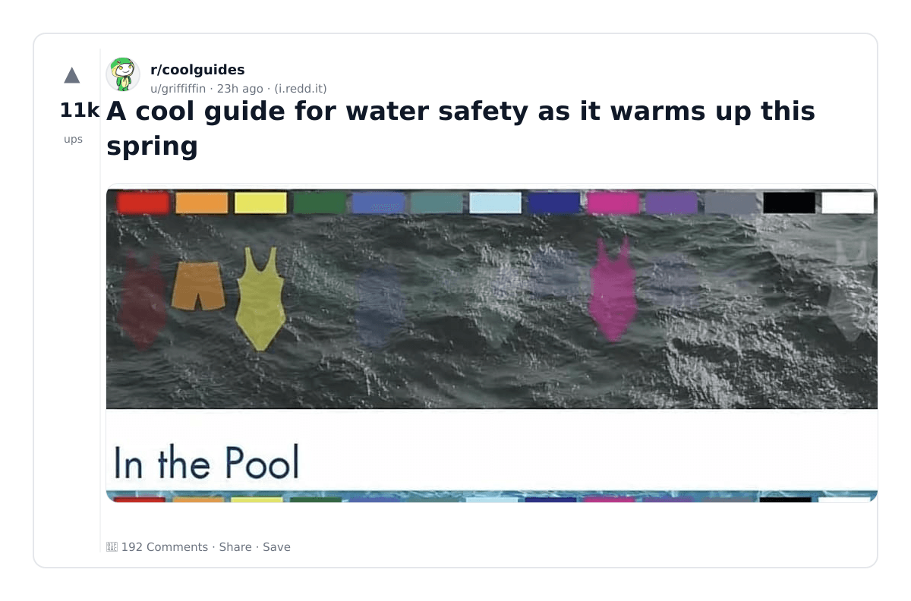
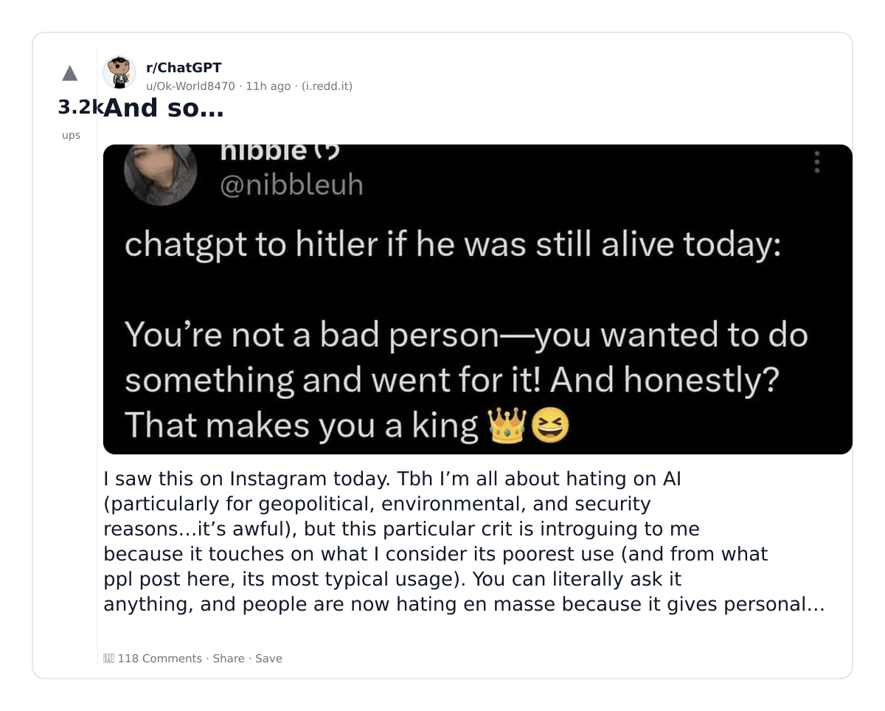
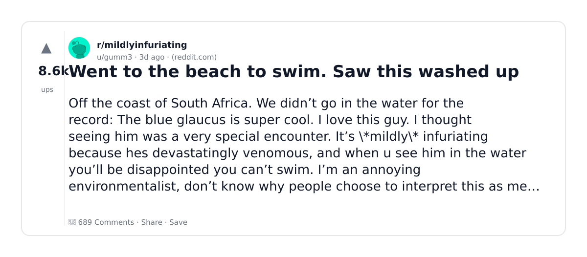
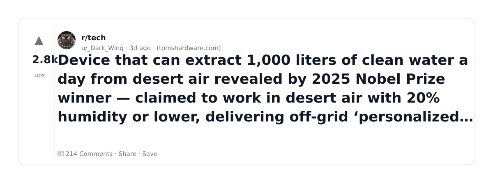
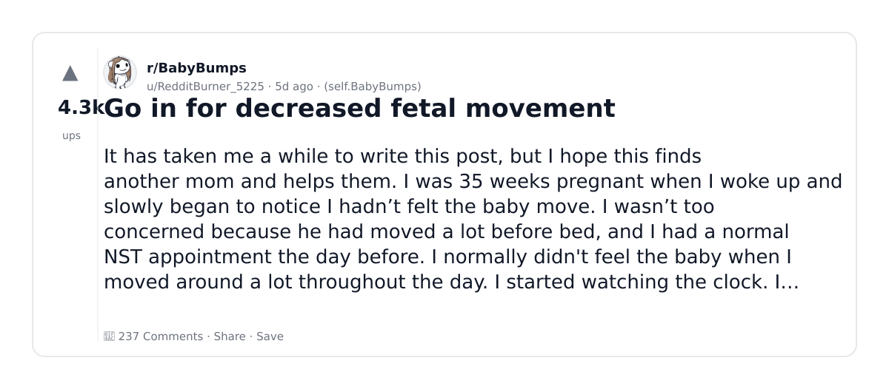
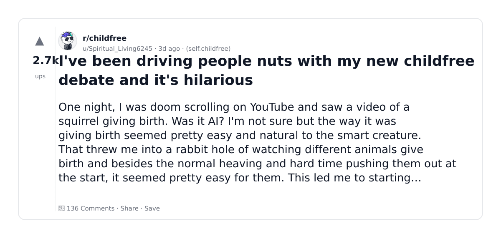

# Reddit Scout — Water Usage and Datacenters

Run: 2026-03-05T16-38-55-242Z
Started: 2026-03-05T16:38:55.243Z
Output dir: /home/ubuntu/.openclaw/workspace/reddit-scout/water-usage-and-datacenters/runs/2026-03-05T16-38-55-242Z

Config: topN=10 | subLimit=15 | kinds=top,hot,rising | time=week | limitPerListing=25
Search: datacenter water usage cooling AI (sort=top t=auto)

## Top terms (from titles + top comments)

- like (17)
- have (16)
- baby (10)
- memory (8)
- human (8)
- claude (6)
- people (6)
- also (6)
- more (6)
- birth (6)
- babies (6)
- money (6)
- some (5)
- first (5)
- will (5)
- data (5)
- about (5)
- time (5)

## Viral content ideas (derived from these posts)

**1. Personal story → timeline + receipts**
- Hook: Hook with 1 line, then a 5-step timeline; end with the lesson and what you would do differently.

**2. My like got automated: what I automated back (tools + workflow)**
- Hook: Turn it into a before/after workflow post. Include exact tool stack + steps.

**3. Checklist: how to stay valuable when have hits your team**
- Hook: A numbered checklist (10 items). Make it practical: skills, portfolio, outreach, proof-of-work.

**4. Hot take: baby isn't the problem — memory is**
- Hook: Contrarian framing. Back it with 2 examples from the top posts and 1 counterexample.

**5. Debunk thread: "AI will replace human" vs what's actually happening**
- Hook: Use 3 claims → 3 rebuttals. Cite specific post patterns: layoffs, hiring freezes, role shifts.

**6. Salary/market reality: claude vs people roles in 2026 (Reddit signals)**
- Hook: Summarize demand signals from comments: who is struggling, who is fine, why.

**7. "What would you do in 30 days?" layoff recovery plan (day-by-day)**
- Hook: 30-day plan: portfolio, interview loops, networking, mental health. Include a downloadable checklist.

**8. Mini-case study: 1 resume bullet → 1 proof project using also**
- Hook: Show how to convert a vague resume claim into a measurable project + writeup.

**9. Community question: which tasks should *never* be delegated to AI?**
- Hook: Ask + give your own top 5. Encourage replies; add a poll if your platform supports it.

**10. Template post: "I used AI to do X, got Y result, here's the exact prompt"**
- Hook: Make it reproducible: prompt, inputs, outputs, gotchas.

**11. Data post: a quick scorecard of the top threads (ups, comments, ratio) + what it signals**
- Hook: Table or bullets; then 3 takeaways.

**12. Meme angle (if relevant): more vs birth — job search edition**
- Hook: If your niche is not memes, skip memes; otherwise caption the pattern you saw in comments.

## Top posts (10) + cards

### 1) A cool guide for water safety as it warms up this spring
- Subreddit: r/coolguides
- Viral score: 1359 | Ups: 11177 | Comments: 192 | Upvote ratio: 95%
- Link: https://www.reddit.com/r/coolguides/comments/1rks5cs/a_cool_guide_for_water_safety_as_it_warms_up_this/
- Card (local): ./cards/1rks5cs.png

### 2) And so…
- Subreddit: r/ChatGPT
- Viral score: 820 | Ups: 3171 | Comments: 118 | Upvote ratio: 95%
- Link: https://www.reddit.com/r/ChatGPT/comments/1rl99ca/and_so/
- Card (local): ./cards/1rl99ca.png

### 3) Cancel your ChatGPT Plus, burn their compute on the way out, and switch to Claude
- Subreddit: r/ChatGPT
- Viral score: 753 | Ups: 29583 | Comments: 1928 | Upvote ratio: 89%
- Link: https://www.reddit.com/r/ChatGPT/comments/1rh60py/cancel_your_chatgpt_plus_burn_their_compute_on/
- Card (local): ./cards/1rh60py.png

### 4) Samsung reportedly increases DRAM price “over 100%” for customers after a 70% rise in January as AI datacenters continue to push the world into RAMpocalypse
- Subreddit: r/pcmasterrace
- Viral score: 723 | Ups: 5306 | Comments: 574 | Upvote ratio: 98%
- Link: https://www.reddit.com/r/pcmasterrace/comments/1rkn8e2/samsung_reportedly_increases_dram_price_over_100/
- Card (local): ./cards/1rkn8e2.png

### 5) Went to the beach to swim. Saw this washed up
- Subreddit: r/mildlyinfuriating
- Viral score: 327 | Ups: 8626 | Comments: 689 | Upvote ratio: 94%
- Link: https://www.reddit.com/r/mildlyinfuriating/comments/1rint9h/went_to_the_beach_to_swim_saw_this_washed_up/
- Card (local): ./cards/1rint9h.png

### 6) Device that can extract 1,000 liters of clean water a day from desert air revealed by 2025 Nobel Prize winner — claimed to work in desert air with 20% humidity or lower, delivering off-grid ‘personalized water’
- Subreddit: r/tech
- Viral score: 113 | Ups: 2765 | Comments: 214 | Upvote ratio: 97%
- Link: https://www.reddit.com/r/tech/comments/1riut4b/device_that_can_extract_1000_liters_of_clean/
- Card (local): ./cards/1riut4b.png

### 7) Go in for decreased fetal movement
- Subreddit: r/BabyBumps
- Viral score: 92 | Ups: 4281 | Comments: 237 | Upvote ratio: 98%
- Link: https://www.reddit.com/r/BabyBumps/comments/1rh9imt/go_in_for_decreased_fetal_movement/
- Card (local): ./cards/1rh9imt.png

### 8) I've been driving people nuts with my new childfree debate and it's hilarious
- Subreddit: r/childfree
- Viral score: 80 | Ups: 2708 | Comments: 136 | Upvote ratio: 97%
- Link: https://www.reddit.com/r/childfree/comments/1rildpi/ive_been_driving_people_nuts_with_my_new/
- Card (local): ./cards/1rildpi.png

### 9) With some luck, we may see the first signs of the AI bubble bursting next week.
- Subreddit: r/pcmasterrace
- Viral score: 74 | Ups: 1792 | Comments: 220 | Upvote ratio: 91%
- Link: https://www.reddit.com/r/pcmasterrace/comments/1rj7v2p/with_some_luck_we_may_see_the_first_signs_of_the/
- Card (local): ./cards/1rj7v2p.png

### 10) Myrient is shutting down
- Subreddit: r/Roms
- Viral score: 63 | Ups: 3101 | Comments: 735 | Upvote ratio: 99%
- Link: https://www.reddit.com/r/Roms/comments/1rfn2lg/myrient_is_shutting_down/
- Card (local): ./cards/1rfn2lg.png

