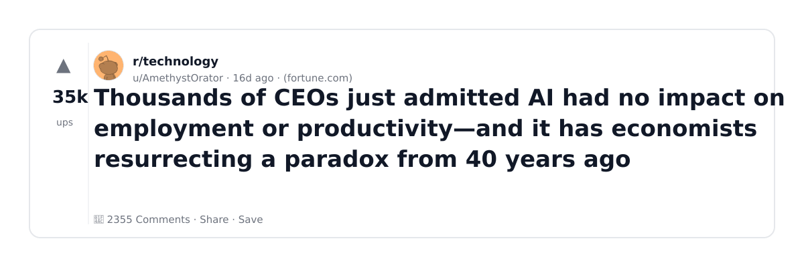
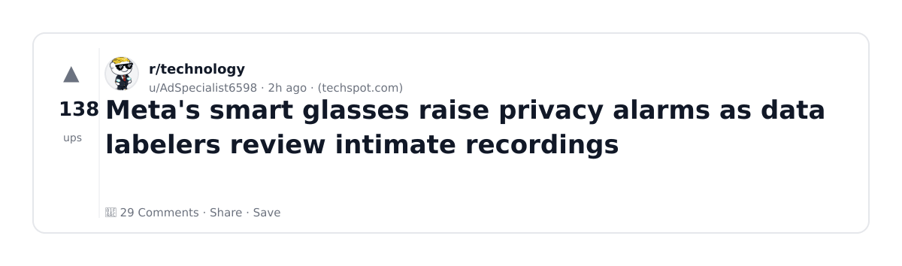

# Reddit Scout — Water Usage and Datacenters

Run: 2026-03-05T16-41-46-279Z
Started: 2026-03-05T16:41:46.279Z
Output dir: /home/ubuntu/.openclaw/workspace/reddit-scout/water-usage-and-datacenters/runs/2026-03-05T16-41-46-279Z

Config: topN=10 | subLimit=15 | kinds=top,hot | time=month | limitPerListing=25
Search: data center water consumption cooling AI (sort=top t=auto)

## Top terms (from titles + top comments)

- copyright (8)
- have (8)
- people (7)
- meta (6)
- data (5)
- court (5)
- glasses (5)
- year (4)
- after (4)
- supreme (4)
- plan (4)
- about (4)
- when (4)
- what (4)
- google (4)
- million (3)
- generated (3)
- review (3)

## Viral content ideas (derived from these posts)

**1. Personal story → timeline + receipts**
- Hook: Hook with 1 line, then a 5-step timeline; end with the lesson and what you would do differently.

**2. My copyright got automated: what I automated back (tools + workflow)**
- Hook: Turn it into a before/after workflow post. Include exact tool stack + steps.

**3. Checklist: how to stay valuable when have hits your team**
- Hook: A numbered checklist (10 items). Make it practical: skills, portfolio, outreach, proof-of-work.

**4. Hot take: people isn't the problem — meta is**
- Hook: Contrarian framing. Back it with 2 examples from the top posts and 1 counterexample.

**5. Debunk thread: "AI will replace data" vs what's actually happening**
- Hook: Use 3 claims → 3 rebuttals. Cite specific post patterns: layoffs, hiring freezes, role shifts.

**6. Salary/market reality: court vs glasses roles in 2026 (Reddit signals)**
- Hook: Summarize demand signals from comments: who is struggling, who is fine, why.

**7. "What would you do in 30 days?" layoff recovery plan (day-by-day)**
- Hook: 30-day plan: portfolio, interview loops, networking, mental health. Include a downloadable checklist.

**8. Mini-case study: 1 resume bullet → 1 proof project using year**
- Hook: Show how to convert a vague resume claim into a measurable project + writeup.

**9. Community question: which tasks should *never* be delegated to AI?**
- Hook: Ask + give your own top 5. Encourage replies; add a poll if your platform supports it.

**10. Template post: "I used AI to do X, got Y result, here's the exact prompt"**
- Hook: Make it reproducible: prompt, inputs, outputs, gotchas.

**11. Data post: a quick scorecard of the top threads (ups, comments, ratio) + what it signals**
- Hook: Table or bullets; then 3 takeaways.

**12. Meme angle (if relevant): after vs supreme — job search edition**
- Hook: If your niche is not memes, skip memes; otherwise caption the pattern you saw in comments.

## Top posts (10) + cards

### 1) 86-year-old Pennsylvania farmer rejects AI data center offer of $15 million to sell his land. Instead, he sold development rights to a conservation fund for $2 million
- Subreddit: r/nextfuckinglevel
- Viral score: 1099 | Ups: 123233 | Comments: 1784 | Upvote ratio: 97%
- Link: https://www.reddit.com/r/nextfuckinglevel/comments/1r9yg5w/86yearold_pennsylvania_farmer_rejects_ai_data/
- Card (local): ./cards/1r9yg5w.png

### 2) AI-generated art can’t be copyrighted after Supreme Court declines to review the rule
- Subreddit: r/technology
- Viral score: 890 | Ups: 7308 | Comments: 221 | Upvote ratio: 98%
- Link: https://www.reddit.com/r/technology/comments/1rkqzzd/aigenerated_art_cant_be_copyrighted_after_supreme/
- Card (local): ./cards/1rkqzzd.png

### 3) GOP state lawmakers urge White House to halt efforts to block state AI laws
- Subreddit: r/technology
- Viral score: 686 | Ups: 790 | Comments: 52 | Upvote ratio: 96%
- Link: https://www.reddit.com/r/technology/comments/1rlhffx/gop_state_lawmakers_urge_white_house_to_halt/
- Card (local): ./cards/1rlhffx.png

### 4) AI Added ‘Basically Zero’ to US Economic Growth Last Year, Goldman Sachs Says
- Subreddit: r/technology
- Viral score: 407 | Ups: 37113 | Comments: 1605 | Upvote ratio: 96%
- Link: https://www.reddit.com/r/technology/comments/1rct2p0/ai_added_basically_zero_to_us_economic_growth/
- Card (local): ./cards/1rct2p0.png

### 5) Thousands of CEOs just admitted AI had no impact on employment or productivity—and it has economists resurrecting a paradox from 40 years ago
- Subreddit: r/technology
- Viral score: 242 | Ups: 34714 | Comments: 2355 | Upvote ratio: 96%
- Link: https://www.reddit.com/r/technology/comments/1r7omz0/thousands_of_ceos_just_admitted_ai_had_no_impact/
- Card (local): ./cards/1r7omz0.png

### 6) Meta's smart glasses raise privacy alarms as data labelers review intimate recordings
- Subreddit: r/technology
- Viral score: 217 | Ups: 138 | Comments: 29 | Upvote ratio: 92%
- Link: https://www.reddit.com/r/technology/comments/1rljafg/metas_smart_glasses_raise_privacy_alarms_as_data/
- Card (local): ./cards/1rljafg.png

### 7) Discord faces backlash over age checks after data breach exposed 70,000 IDs
- Subreddit: r/technology
- Viral score: 214 | Ups: 48501 | Comments: 2679 | Upvote ratio: 97%
- Link: https://www.reddit.com/r/technology/comments/1r0ee6g/discord_faces_backlash_over_age_checks_after_data/
- Card (local): ./cards/1r0ee6g.png

### 8) Regulator contacts Meta over workers watching intimate AI glasses videos
- Subreddit: r/worldnews
- Viral score: 163 | Ups: 325 | Comments: 43 | Upvote ratio: 94%
- Link: https://www.reddit.com/r/worldnews/comments/1rlepbs/regulator_contacts_meta_over_workers_watching/
- Card (local): ./cards/1rlepbs.png

### 9) Supposedly big-brained execs are outsourcing decisionmaking to AI
- Subreddit: r/technology
- Viral score: 156 | Ups: 215 | Comments: 41 | Upvote ratio: 94%
- Link: https://www.reddit.com/r/technology/comments/1rlg7ox/supposedly_bigbrained_execs_are_outsourcing/
- Card (local): ./cards/1rlg7ox.png

### 10) China's new five-year plan calls for AI throughout its economy, tech breakthroughs
- Subreddit: r/tech
- Viral score: 156 | Ups: 325 | Comments: 58 | Upvote ratio: 94%
- Link: https://www.reddit.com/r/tech/comments/1rldvmx/chinas_new_fiveyear_plan_calls_for_ai_throughout/
- Card (local): ./cards/1rldvmx.png

