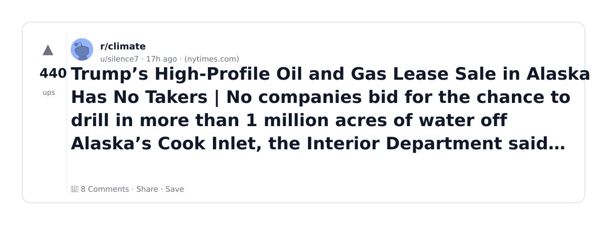
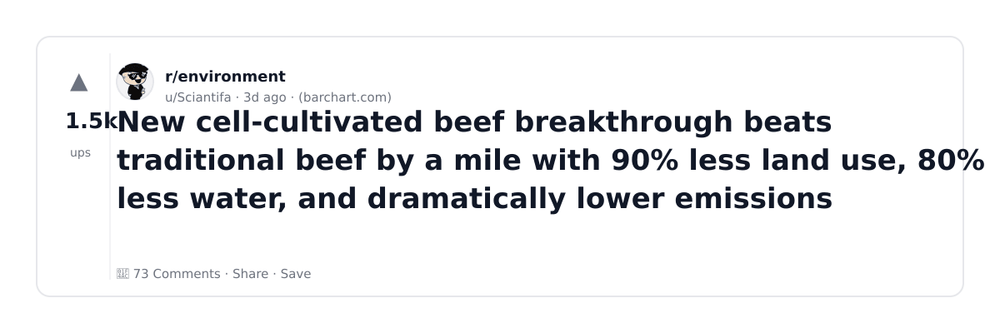
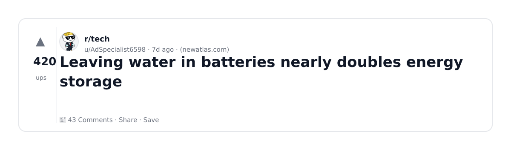
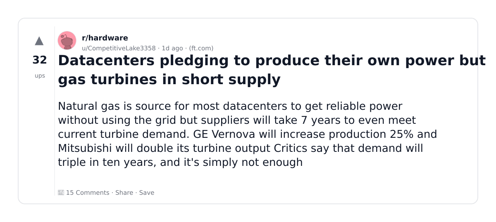
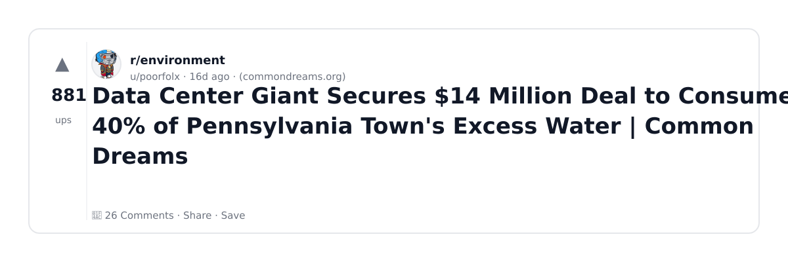
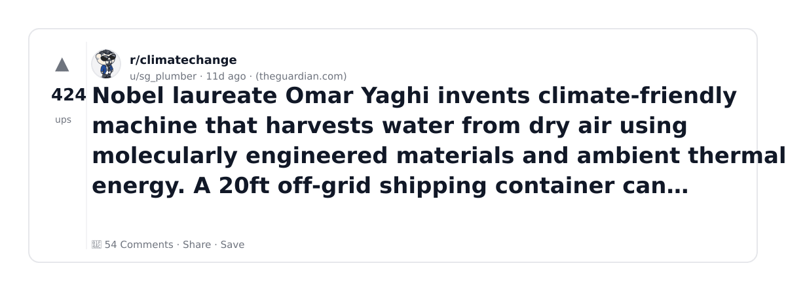

# Reddit Scout — Water Usage and Datacenters

Run: 2026-03-05T16-50-41-665Z
Started: 2026-03-05T16:50:41.665Z
Output dir: /home/ubuntu/.openclaw/workspace/reddit-scout/water-usage-and-datacenters/runs/2026-03-05T16-50-41-665Z

Config: topN=10 | subLimit=14 | kinds=top,hot | time=month | limitPerListing=25
Search: data center water cooling AI (sort=top t=auto)

## Top terms (from titles + top comments)

- water (32)
- have (7)
- oklahoma (6)
- drinking (5)
- will (5)
- long (5)
- boarman (5)
- clean (4)
- work (4)
- data (4)
- need (4)
- after (4)
- about (4)
- which (4)
- local (4)
- there (4)
- some (4)
- other (4)

## Viral content ideas (derived from these posts)

**1. Personal story → timeline + receipts**
- Hook: Hook with 1 line, then a 5-step timeline; end with the lesson and what you would do differently.

**2. My water got automated: what I automated back (tools + workflow)**
- Hook: Turn it into a before/after workflow post. Include exact tool stack + steps.

**3. Checklist: how to stay valuable when have hits your team**
- Hook: A numbered checklist (10 items). Make it practical: skills, portfolio, outreach, proof-of-work.

**4. Hot take: oklahoma isn't the problem — drinking is**
- Hook: Contrarian framing. Back it with 2 examples from the top posts and 1 counterexample.

**5. Debunk thread: "AI will replace will" vs what's actually happening**
- Hook: Use 3 claims → 3 rebuttals. Cite specific post patterns: layoffs, hiring freezes, role shifts.

**6. Salary/market reality: long vs boarman roles in 2026 (Reddit signals)**
- Hook: Summarize demand signals from comments: who is struggling, who is fine, why.

**7. "What would you do in 30 days?" layoff recovery plan (day-by-day)**
- Hook: 30-day plan: portfolio, interview loops, networking, mental health. Include a downloadable checklist.

**8. Mini-case study: 1 resume bullet → 1 proof project using clean**
- Hook: Show how to convert a vague resume claim into a measurable project + writeup.

**9. Community question: which tasks should *never* be delegated to AI?**
- Hook: Ask + give your own top 5. Encourage replies; add a poll if your platform supports it.

**10. Template post: "I used AI to do X, got Y result, here's the exact prompt"**
- Hook: Make it reproducible: prompt, inputs, outputs, gotchas.

**11. Data post: a quick scorecard of the top threads (ups, comments, ratio) + what it signals**
- Hook: Table or bullets; then 3 takeaways.

**12. Meme angle (if relevant): work vs data — job search edition**
- Hook: If your niche is not memes, skip memes; otherwise caption the pattern you saw in comments.

## Top posts (10) + cards

### 1) Device that can extract 1,000 liters of clean water a day from desert air revealed by 2025 Nobel Prize winner — claimed to work in desert air with 20% humidity or lower, delivering off-grid ‘personalized water’
- Subreddit: r/tech
- Viral score: 99 | Ups: 2764 | Comments: 214 | Upvote ratio: 97%
- Link: https://www.reddit.com/r/tech/comments/1riut4b/device_that_can_extract_1000_liters_of_clean/
- Card (local): ./cards/1riut4b.png

### 2) Trump’s High-Profile Oil and Gas Lease Sale in Alaska Has No Takers | No companies bid for the chance to drill in more than 1 million acres of water off Alaska’s Cook Inlet, the Interior Department said Wednesday.
- Subreddit: r/climate
- Viral score: 45 | Ups: 440 | Comments: 8 | Upvote ratio: 100%
- Link: https://www.reddit.com/r/climate/comments/1rl225h/trumps_highprofile_oil_and_gas_lease_sale_in/
- Card (local): ./cards/1rl225h.png

### 3) New cell-cultivated beef breakthrough beats traditional beef by a mile with 90% less land use, 80% less water, and dramatically lower emissions
- Subreddit: r/environment
- Viral score: 41 | Ups: 1511 | Comments: 73 | Upvote ratio: 98%
- Link: https://www.reddit.com/r/environment/comments/1riv1b4/new_cellcultivated_beef_breakthrough_beats/
- Card (local): ./cards/1riv1b4.png

### 4) Israel is filling up the Sea of Galilee with desalinated water
- Subreddit: r/climatechange
- Viral score: 15 | Ups: 1338 | Comments: 143 | Upvote ratio: 95%
- Link: https://www.reddit.com/r/climatechange/comments/1rerlec/israel_is_filling_up_the_sea_of_galilee_with/
- Card (local): ./cards/1rerlec.png

### 5) Google Data Center’s expected water use made public
- Subreddit: r/environment
- Viral score: 13 | Ups: 1106 | Comments: 42 | Upvote ratio: 99%
- Link: https://www.reddit.com/r/environment/comments/1rgdii2/google_data_centers_expected_water_use_made_public/
- Card (local): ./cards/1rgdii2.png

### 6) Leaving water in batteries nearly doubles energy storage
- Subreddit: r/tech
- Viral score: 5 | Ups: 420 | Comments: 43 | Upvote ratio: 95%
- Link: https://www.reddit.com/r/tech/comments/1rfbvk4/leaving_water_in_batteries_nearly_doubles_energy/
- Card (local): ./cards/1rfbvk4.png

### 7) Salty, Oily Drinking Water Left Sores in Their Mouths. Oklahoma Refused to Find Out Why.
- Subreddit: r/environment
- Viral score: 4 | Ups: 1533 | Comments: 30 | Upvote ratio: 99%
- Link: https://www.reddit.com/r/environment/comments/1r2sxnt/salty_oily_drinking_water_left_sores_in_their/
- Card (local): ./cards/1r2sxnt.png

### 8) Datacenters pledging to produce their own power but gas turbines in short supply
- Subreddit: r/hardware
- Viral score: 4 | Ups: 32 | Comments: 15 | Upvote ratio: 82%
- Link: https://www.reddit.com/r/hardware/comments/1rkrdvy/datacenters_pledging_to_produce_their_own_power/
- Card (local): ./cards/1rkrdvy.png

### 9) Data Center Giant Secures $14 Million Deal to Consume 40% of Pennsylvania Town's Excess Water | Common Dreams
- Subreddit: r/environment
- Viral score: 3 | Ups: 881 | Comments: 26 | Upvote ratio: 99%
- Link: https://www.reddit.com/r/environment/comments/1r7jk9x/data_center_giant_secures_14_million_deal_to/
- Card (local): ./cards/1r7jk9x.png

### 10) Nobel laureate Omar Yaghi invents climate-friendly machine that harvests water from dry air using molecularly engineered materials and ambient thermal energy. A 20ft off-grid shipping container can generate up to 1,000 litres of clean water every day even in arid and desert conditions
- Subreddit: r/climatechange
- Viral score: 3 | Ups: 424 | Comments: 54 | Upvote ratio: 98%
- Link: https://www.reddit.com/r/climatechange/comments/1rc1rck/nobel_laureate_omar_yaghi_invents_climatefriendly/
- Card (local): ./cards/1rc1rck.png

