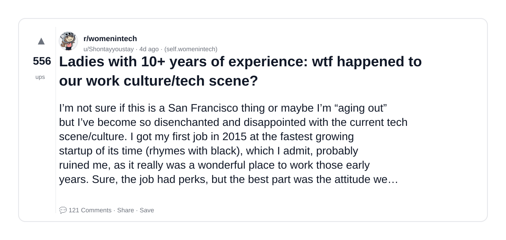
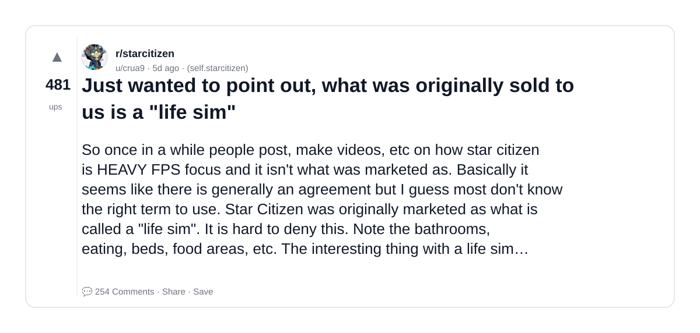
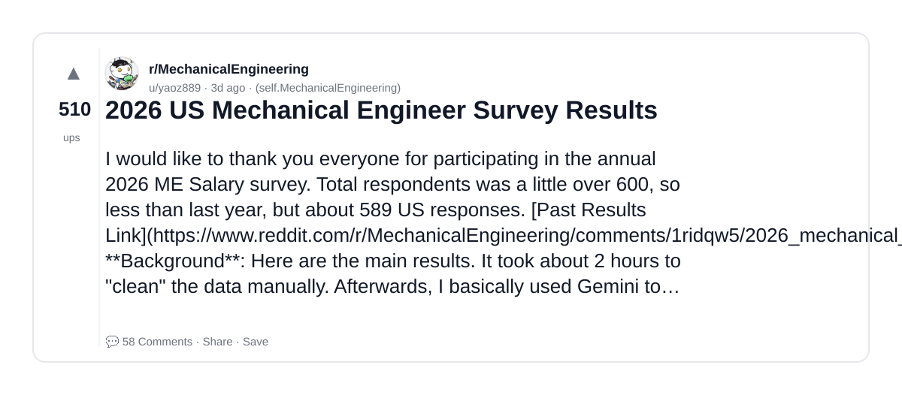
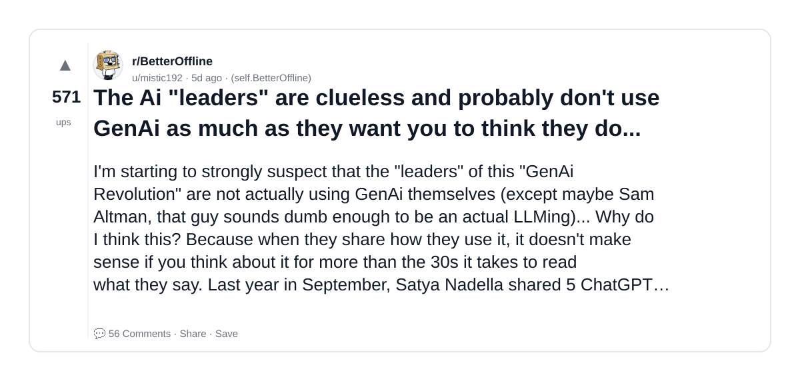
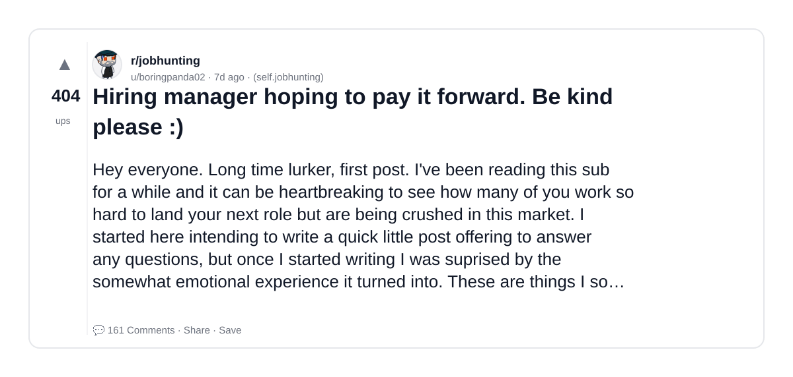
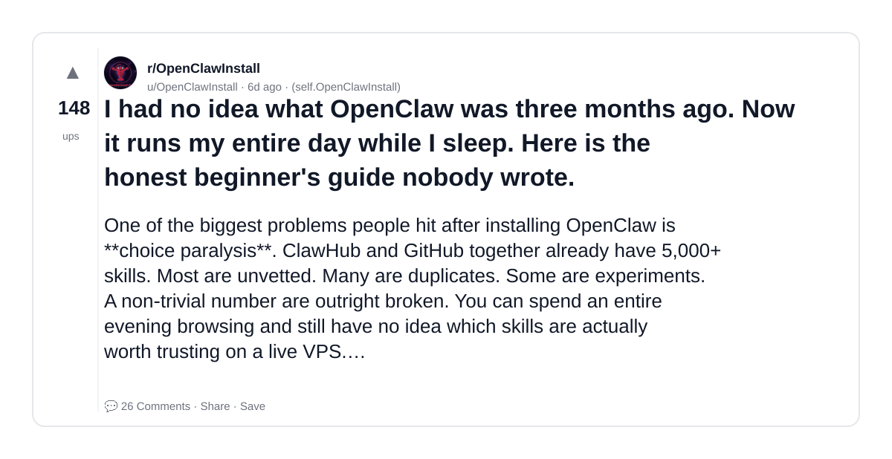

# Reddit Scout — GenAI engineer career hiring AI startup what CTOs look for production experience

Run: 2026-03-26T09-25-58-142Z
Started: 2026-03-26T09:25:58.142Z
Output dir: /home/ubuntu/.openclaw/workspace-ce/users/1085339629/reddit-scout/genai-engineer-career-hiring-ai-startup-what-ctos-look-for-p/runs/2026-03-26T09-25-58-142Z

Config: topN=20 | subLimit=12 | kinds=top,hot,rising | time=week | limitPerListing=25
Search: GenAI engineer career hiring AI startup what CTOs look for production experience (sort=top t=auto)

## Top terms (from titles + top comments)

- tech (7)
- what (7)
- good (7)
- like (7)
- have (6)
- about (6)
- time (5)
- work (4)
- something (4)
- experience (3)
- think (3)
- there (3)
- people (3)
- working (3)
- days (3)
- person (3)
- used (3)
- post (3)

## Viral content ideas (derived from these posts)

**1. Personal story → timeline + receipts**
- Hook: Hook with 1 line, then a 5-step timeline; end with the lesson and what you would do differently.

**2. My tech got automated: what I automated back (tools + workflow)**
- Hook: Turn it into a before/after workflow post. Include exact tool stack + steps.

**3. Checklist: how to stay valuable when what hits your team**
- Hook: A numbered checklist (10 items). Make it practical: skills, portfolio, outreach, proof-of-work.

**4. Hot take: good isn't the problem — like is**
- Hook: Contrarian framing. Back it with 2 examples from the top posts and 1 counterexample.

**5. Debunk thread: "AI will replace have" vs what's actually happening**
- Hook: Use 3 claims → 3 rebuttals. Cite specific post patterns: layoffs, hiring freezes, role shifts.

**6. Salary/market reality: about vs time roles in 2026 (Reddit signals)**
- Hook: Summarize demand signals from comments: who is struggling, who is fine, why.

**7. "What would you do in 30 days?" layoff recovery plan (day-by-day)**
- Hook: 30-day plan: portfolio, interview loops, networking, mental health. Include a downloadable checklist.

**8. Mini-case study: 1 resume bullet → 1 proof project using work**
- Hook: Show how to convert a vague resume claim into a measurable project + writeup.

**9. Community question: which tasks should *never* be delegated to AI?**
- Hook: Ask + give your own top 5. Encourage replies; add a poll if your platform supports it.

**10. Template post: "I used AI to do X, got Y result, here's the exact prompt"**
- Hook: Make it reproducible: prompt, inputs, outputs, gotchas.

**11. Data post: a quick scorecard of the top threads (ups, comments, ratio) + what it signals**
- Hook: Table or bullets; then 3 takeaways.

**12. Meme angle (if relevant): something vs experience — job search edition**
- Hook: If your niche is not memes, skip memes; otherwise caption the pattern you saw in comments.

## Top posts (6) + cards

### 1) Ladies with 10+ years of experience: wtf happened to our work culture/tech scene?
- Subreddit: r/womenintech
- Viral score: 14 | Ups: 556 | Comments: 121 | Upvote ratio: 99%
- Link: https://www.reddit.com/r/womenintech/comments/1s06nhw/ladies_with_10_years_of_experience_wtf_happened/
- Card (local): ./cards/1s06nhw.png

### 2) Just wanted to point out, what was originally sold to us is a "life sim"
- Subreddit: r/starcitizen
- Viral score: 13 | Ups: 481 | Comments: 254 | Upvote ratio: 81%
- Link: https://www.reddit.com/r/starcitizen/comments/1rzjrnm/just_wanted_to_point_out_what_was_originally_sold/
- Card (local): ./cards/1rzjrnm.png

### 3) 2026 US Mechanical Engineer Survey Results
- Subreddit: r/MechanicalEngineering
- Viral score: 12 | Ups: 510 | Comments: 58 | Upvote ratio: 99%
- Link: https://www.reddit.com/r/MechanicalEngineering/comments/1s1fkl9/2026_us_mechanical_engineer_survey_results/
- Card (local): ./cards/1s1fkl9.png

### 4) The Ai "leaders" are clueless and probably don't use GenAi as much as they want you to think they do...
- Subreddit: r/BetterOffline
- Viral score: 10 | Ups: 571 | Comments: 56 | Upvote ratio: 99%
- Link: https://www.reddit.com/r/BetterOffline/comments/1rzd0p3/the_ai_leaders_are_clueless_and_probably_dont_use/
- Card (local): ./cards/1rzd0p3.png

### 5) Hiring manager hoping to pay it forward. Be kind please :)
- Subreddit: r/jobhunting
- Viral score: 7 | Ups: 404 | Comments: 161 | Upvote ratio: 95%
- Link: https://www.reddit.com/r/jobhunting/comments/1rxrf8e/hiring_manager_hoping_to_pay_it_forward_be_kind/
- Card (local): ./cards/1rxrf8e.png

### 6) I had no idea what OpenClaw was three months ago. Now it runs my entire day while I sleep. Here is the honest beginner's guide nobody wrote.
- Subreddit: r/OpenClawInstall
- Viral score: 2 | Ups: 148 | Comments: 26 | Upvote ratio: 79%
- Link: https://www.reddit.com/r/OpenClawInstall/comments/1ryn1xr/i_had_no_idea_what_openclaw_was_three_months_ago/
- Card (local): ./cards/1ryn1xr.png

