# Reddit Scout — GenAI engineer career hiring AI startup what CTOs look for production experience

Run: 2026-03-26T09-26-24-054Z
Started: 2026-03-26T09:26:24.054Z
Output dir: /home/ubuntu/.openclaw/workspace-ce/users/1085339629/reddit-scout/genai-engineer-career-hiring-ai-startup-what-ctos-look-for-p/runs/2026-03-26T09-26-24-054Z

Config: topN=30 | subLimit=15 | kinds=top,hot,rising | time=month | limitPerListing=25
Search: GenAI engineer career hiring AI startup what CTOs look for production experience (sort=top t=auto)

## Top terms (from titles + top comments)

- more (13)
- have (13)
- what (11)
- about (10)
- code (10)
- like (9)
- when (8)
- time (7)
- think (7)
- will (7)
- work (6)
- where (6)
- company (6)
- feel (5)
- people (5)
- same (5)
- jobs (5)
- years (5)

## Viral content ideas (derived from these posts)

**1. "I got laid off" story → what happened next (timeline + receipts)**
- Hook: Hook with 1 line, then a 5-step timeline; end with the lesson and what you would do differently.

**2. My more got automated: what I automated back (tools + workflow)**
- Hook: Turn it into a before/after workflow post. Include exact tool stack + steps.

**3. Checklist: how to stay valuable when have hits your team**
- Hook: A numbered checklist (10 items). Make it practical: skills, portfolio, outreach, proof-of-work.

**4. Hot take: what isn't the problem — about is**
- Hook: Contrarian framing. Back it with 2 examples from the top posts and 1 counterexample.

**5. Debunk thread: "AI will replace code" vs what's actually happening**
- Hook: Use 3 claims → 3 rebuttals. Cite specific post patterns: layoffs, hiring freezes, role shifts.

**6. Salary/market reality: like vs when roles in 2026 (Reddit signals)**
- Hook: Summarize demand signals from comments: who is struggling, who is fine, why.

**7. "What would you do in 30 days?" layoff recovery plan (day-by-day)**
- Hook: 30-day plan: portfolio, interview loops, networking, mental health. Include a downloadable checklist.

**8. Mini-case study: 1 resume bullet → 1 proof project using time**
- Hook: Show how to convert a vague resume claim into a measurable project + writeup.

**9. Community question: which tasks should *never* be delegated to AI?**
- Hook: Ask + give your own top 5. Encourage replies; add a poll if your platform supports it.

**10. Template post: "I used AI to do X, got Y result, here's the exact prompt"**
- Hook: Make it reproducible: prompt, inputs, outputs, gotchas.

**11. Data post: a quick scorecard of the top threads (ups, comments, ratio) + what it signals**
- Hook: Table or bullets; then 3 takeaways.

**12. Meme angle (if relevant): think vs will — job search edition**
- Hook: If your niche is not memes, skip memes; otherwise caption the pattern you saw in comments.

## Top posts (12) + cards

### 1) I [26F] feel guilty about asking my boyfriend [34M] to move for my career
- Subreddit: r/BestofRedditorUpdates
- Viral score: 21 | Ups: 2084 | Comments: 157 | Upvote ratio: 97%
- Link: https://www.reddit.com/r/BestofRedditorUpdates/comments/1rvta2a/i_26f_feel_guilty_about_asking_my_boyfriend_34m/
- Card (local): ./cards/1rvta2a.png

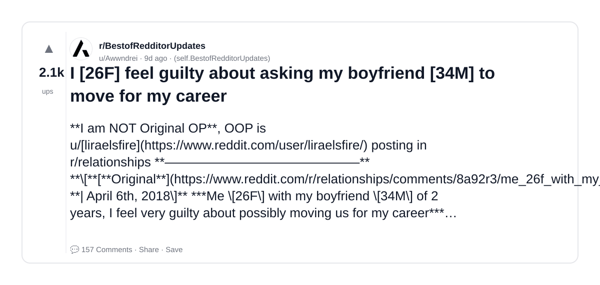

### 2) Making $400-700/month selling AI influencer photos to small brands on Fiverr and I still feel weird about it
- Subreddit: r/passive_income
- Viral score: 19 | Ups: 2994 | Comments: 253 | Upvote ratio: 95%
- Link: https://www.reddit.com/r/passive_income/comments/1rqpuhm/making_400700month_selling_ai_influencer_photos/
- Card (local): ./cards/1rqpuhm.png

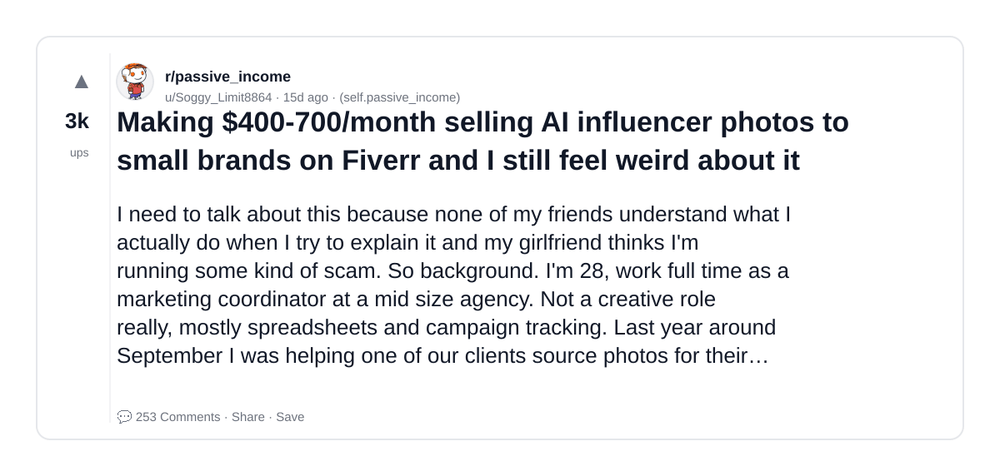

### 3) Quit my job with no offer lined up because of my health. Took 8 months to land something. Sharing what actually worked and what was a complete waste of time.
- Subreddit: r/jobsearchhacks
- Viral score: 11 | Ups: 2497 | Comments: 111 | Upvote ratio: 98%
- Link: https://www.reddit.com/r/jobsearchhacks/comments/1rnu44b/quit_my_job_with_no_offer_lined_up_because_of_my/
- Card (local): ./cards/1rnu44b.png

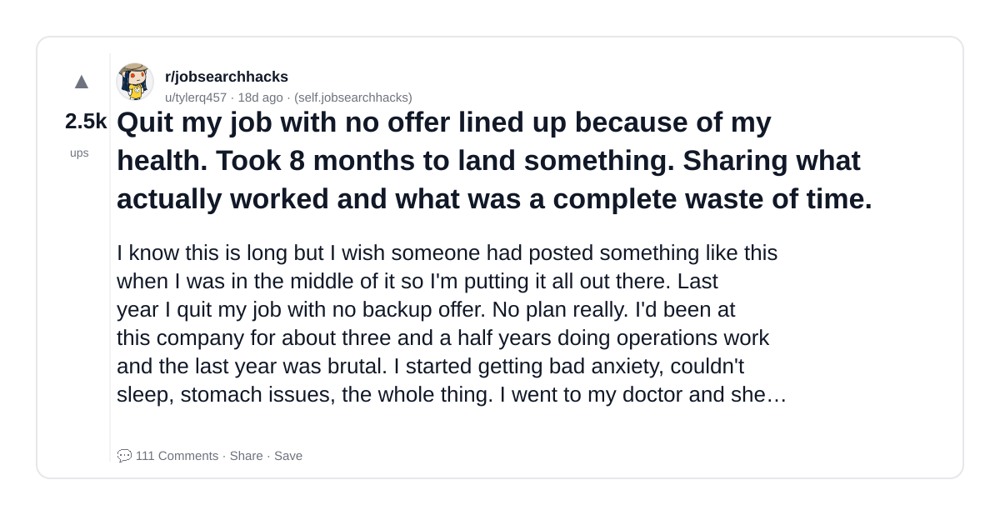

### 4) The Ai "leaders" are clueless and probably don't use GenAi as much as they want you to think they do...
- Subreddit: r/BetterOffline
- Viral score: 10 | Ups: 574 | Comments: 56 | Upvote ratio: 99%
- Link: https://www.reddit.com/r/BetterOffline/comments/1rzd0p3/the_ai_leaders_are_clueless_and_probably_dont_use/
- Card (local): ./cards/1rzd0p3.png

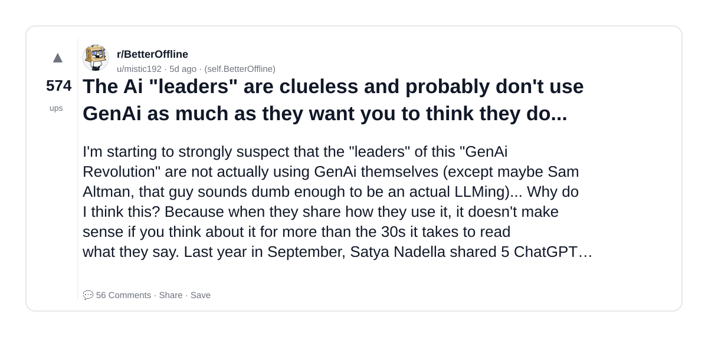

### 5) The AI coding productivity data is in and it's not what anyone expected
- Subreddit: r/ExperiencedDevs
- Viral score: 7 | Ups: 1338 | Comments: 432 | Upvote ratio: 89%
- Link: https://www.reddit.com/r/ExperiencedDevs/comments/1rnkv2t/the_ai_coding_productivity_data_is_in_and_its_not/
- Card (local): ./cards/1rnkv2t.png

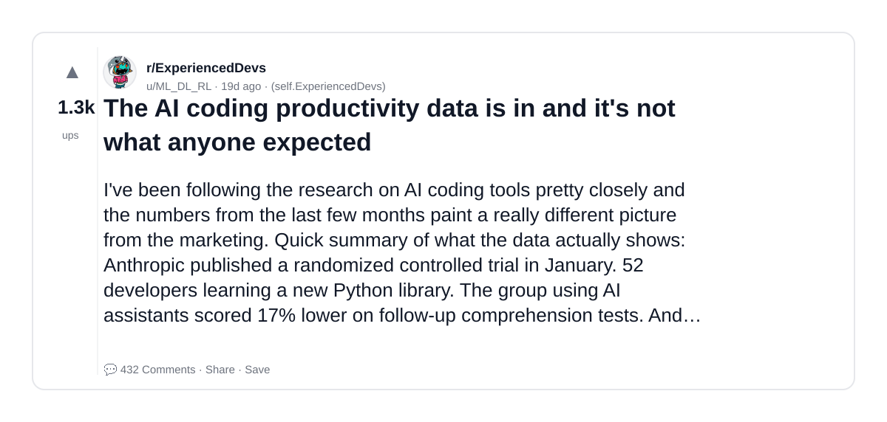

### 6) AI has taken fun out of programming and now i’m hopeless
- Subreddit: r/webdev
- Viral score: 6 | Ups: 1236 | Comments: 777 | Upvote ratio: 85%
- Link: https://www.reddit.com/r/webdev/comments/1rer3t1/ai_has_taken_fun_out_of_programming_and_now_im/
- Card (local): ./cards/1rer3t1.png

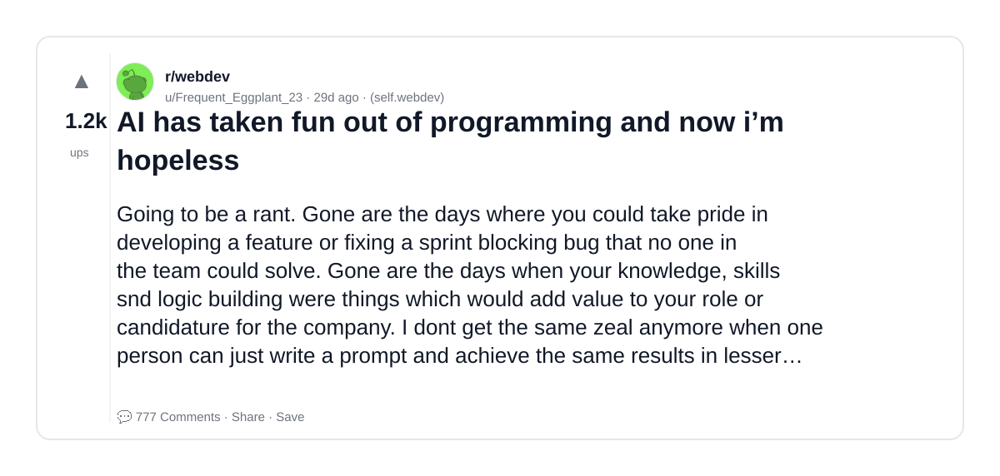

### 7) "Minimum wage is for minimum effort, people who don't want to work. The more effort put in gaining knowledge and experience, the more you are worth. The minimum wage is to filter people. ." r/remotework slapfights about if a person should be able to survive on a minimum wage job
- Subreddit: r/SubredditDrama
- Viral score: 5 | Ups: 665 | Comments: 520 | Upvote ratio: 95%
- Link: https://www.reddit.com/r/SubredditDrama/comments/1rl54fs/minimum_wage_is_for_minimum_effort_people_who/
- Card (local): ./cards/1rl54fs.png

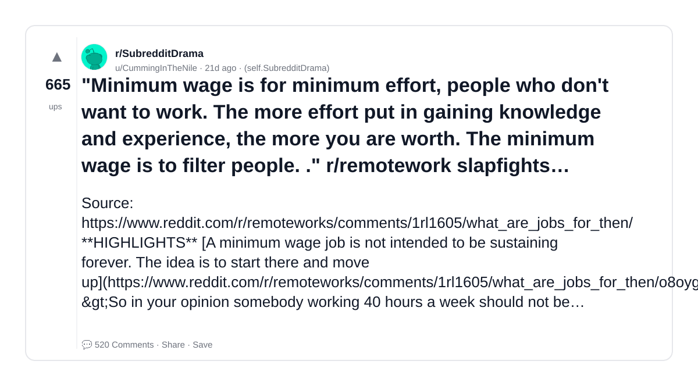

### 8) The Pentagon blacklisted Anthropic for refusing to remove surveillance safeguards. Hours later, OpenAI signed a deal keeping those same safeguards. I pulled the primary sources. Here's what I found.
- Subreddit: r/Anthropic
- Viral score: 4 | Ups: 1249 | Comments: 165 | Upvote ratio: 97%
- Link: https://www.reddit.com/r/Anthropic/comments/1rh5nzg/the_pentagon_blacklisted_anthropic_for_refusing/
- Card (local): ./cards/1rh5nzg.png

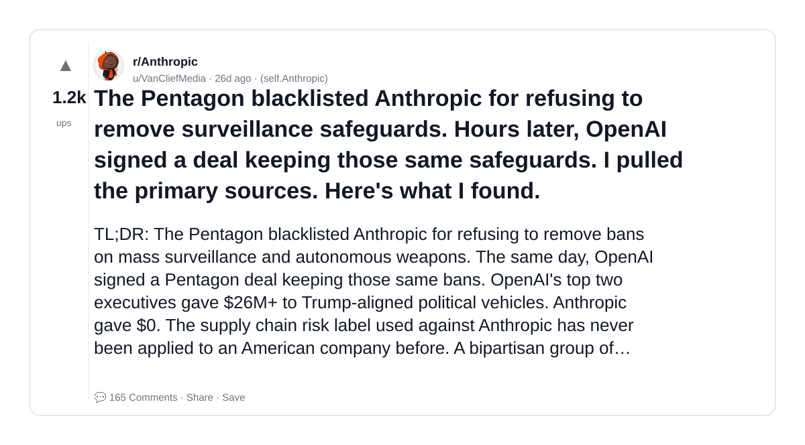

### 9) We keep asking the powerful "If AI is going to take all our jobs, what's the plan?" Their plan is obvious: they don't care.
- Subreddit: r/antiwork
- Viral score: 4 | Ups: 706 | Comments: 102 | Upvote ratio: 99%
- Link: https://www.reddit.com/r/antiwork/comments/1rotmpv/we_keep_asking_the_powerful_if_ai_is_going_to/
- Card (local): ./cards/1rotmpv.png

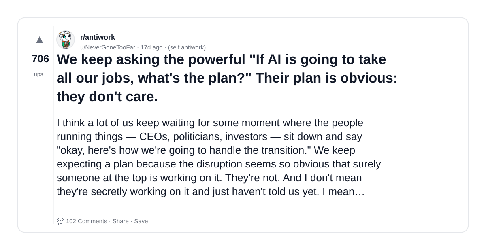

### 10) Cautionary - Using AI in your job instead of understanding code got my colleague fired
- Subreddit: r/developersIndia
- Viral score: 3 | Ups: 1282 | Comments: 128 | Upvote ratio: 95%
- Link: https://www.reddit.com/r/developersIndia/comments/1rck902/cautionary_using_ai_in_your_job_instead_of/
- Card (local): ./cards/1rck902.png

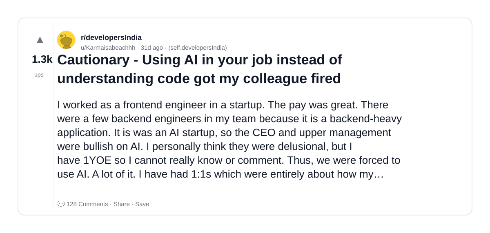

### 11) I attended my first career fair as an employer - heres some of my thoughts
- Subreddit: r/EngineeringStudents
- Viral score: 3 | Ups: 993 | Comments: 75 | Upvote ratio: 98%
- Link: https://www.reddit.com/r/EngineeringStudents/comments/1rdk8cj/i_attended_my_first_career_fair_as_an_employer/
- Card (local): ./cards/1rdk8cj.png

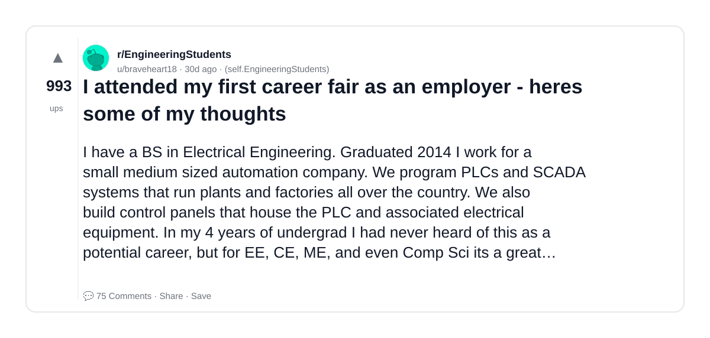

### 12) This 84 Year Old Honda Engineer Has Anime Hair, 250 Patents, And Can Bench Press 170kg
- Subreddit: r/MotorBuzz
- Viral score: 1 | Ups: 682 | Comments: 38 | Upvote ratio: 86%
- Link: https://www.reddit.com/r/MotorBuzz/comments/1rc4r54/this_84_year_old_honda_engineer_has_anime_hair/
- Card (local): ./cards/1rc4r54.png

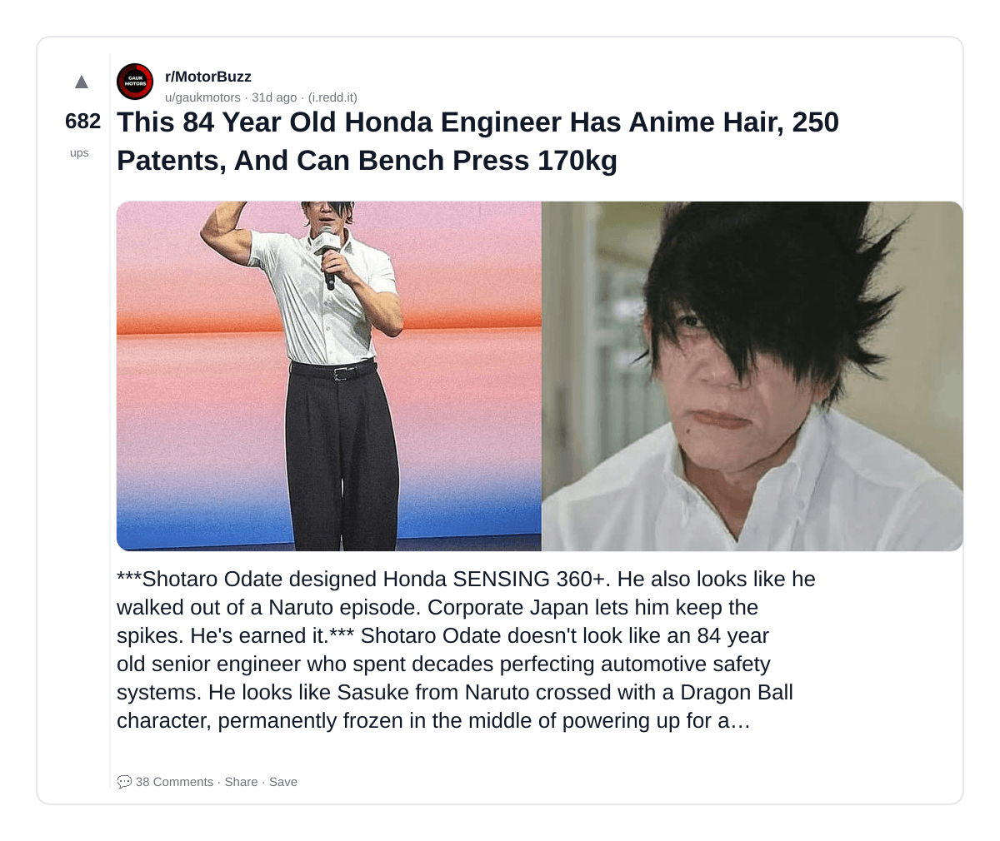
