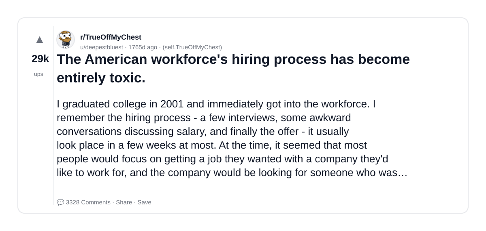
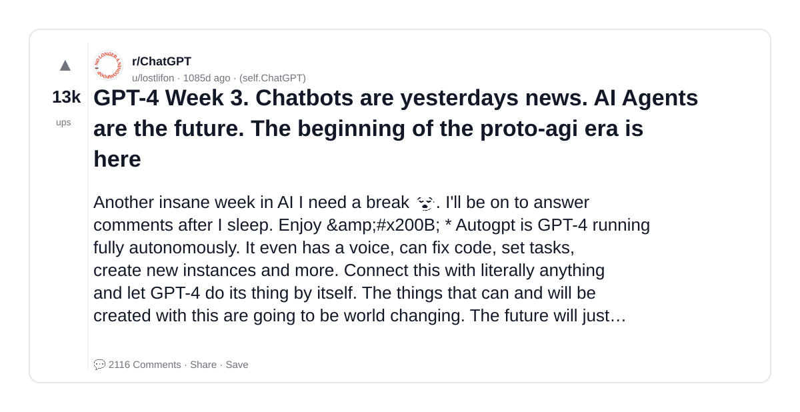
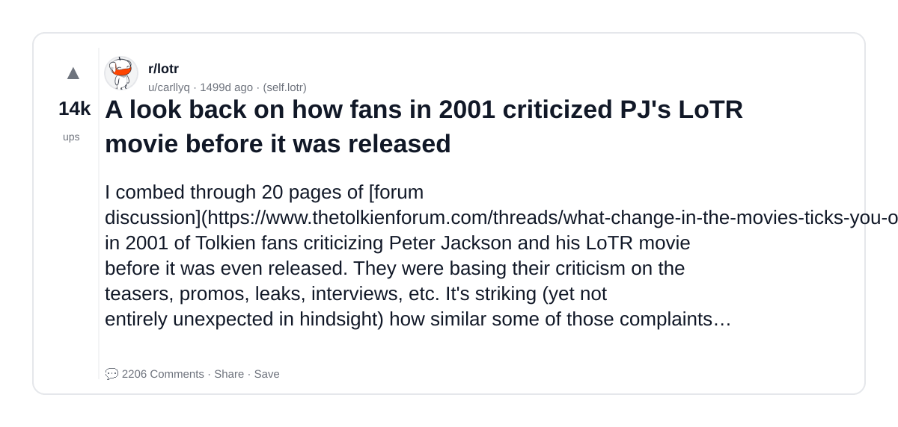
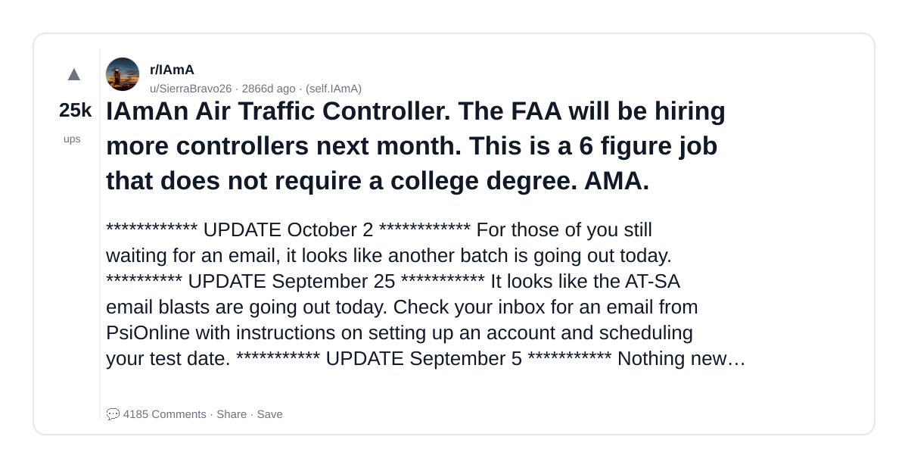
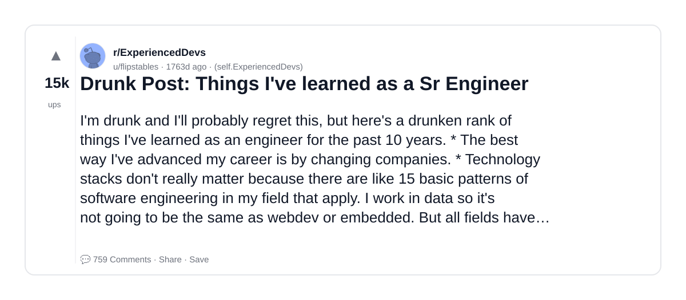
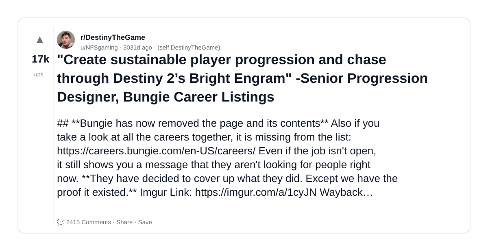

# Reddit Scout — GenAI engineer career hiring AI startup what CTOs look for production experience

Run: 2026-03-26T09-27-05-245Z
Started: 2026-03-26T09:27:05.245Z
Output dir: /home/ubuntu/.openclaw/workspace-ce/users/1085339629/reddit-scout/genai-engineer-career-hiring-ai-startup-what-ctos-look-for-p/runs/2026-03-26T09-27-05-245Z

Config: topN=30 | subLimit=10 | kinds=top,hot,rising | time=all | limitPerListing=25
Search: GenAI engineer career hiring AI startup what CTOs look for production experience (sort=top t=auto)

## Top terms (from titles + top comments)

- what (20)
- people (15)
- tech (13)
- work (11)
- other (9)
- about (9)
- want (9)
- know (9)
- shit (9)
- life (9)
- said (8)
- years (8)
- company (8)
- working (8)
- code (8)
- like (7)
- programming (7)
- hard (7)

## Viral content ideas (derived from these posts)

**1. Personal story → timeline + receipts**
- Hook: Hook with 1 line, then a 5-step timeline; end with the lesson and what you would do differently.

**2. My what got automated: what I automated back (tools + workflow)**
- Hook: Turn it into a before/after workflow post. Include exact tool stack + steps.

**3. Checklist: how to stay valuable when people hits your team**
- Hook: A numbered checklist (10 items). Make it practical: skills, portfolio, outreach, proof-of-work.

**4. Hot take: tech isn't the problem — work is**
- Hook: Contrarian framing. Back it with 2 examples from the top posts and 1 counterexample.

**5. Debunk thread: "AI will replace other" vs what's actually happening**
- Hook: Use 3 claims → 3 rebuttals. Cite specific post patterns: layoffs, hiring freezes, role shifts.

**6. Salary/market reality: about vs want roles in 2026 (Reddit signals)**
- Hook: Summarize demand signals from comments: who is struggling, who is fine, why.

**7. "What would you do in 30 days?" layoff recovery plan (day-by-day)**
- Hook: 30-day plan: portfolio, interview loops, networking, mental health. Include a downloadable checklist.

**8. Mini-case study: 1 resume bullet → 1 proof project using know**
- Hook: Show how to convert a vague resume claim into a measurable project + writeup.

**9. Community question: which tasks should *never* be delegated to AI?**
- Hook: Ask + give your own top 5. Encourage replies; add a poll if your platform supports it.

**10. Template post: "I used AI to do X, got Y result, here's the exact prompt"**
- Hook: Make it reproducible: prompt, inputs, outputs, gotchas.

**11. Data post: a quick scorecard of the top threads (ups, comments, ratio) + what it signals**
- Hook: Table or bullets; then 3 takeaways.

**12. Meme angle (if relevant): shit vs life — job search edition**
- Hook: If your niche is not memes, skip memes; otherwise caption the pattern you saw in comments.

## Top posts (6) + cards

### 1) The American workforce's hiring process has become entirely toxic.
- Subreddit: r/TrueOffMyChest
- Viral score: 1 | Ups: 28761 | Comments: 3328 | Upvote ratio: 94%
- Link: https://www.reddit.com/r/TrueOffMyChest/comments/nlkrzu/the_american_workforces_hiring_process_has_become/
- Card (local): ./cards/nlkrzu.png

### 2) GPT-4 Week 3. Chatbots are yesterdays news. AI Agents are the future. The beginning of the proto-agi era is here
- Subreddit: r/ChatGPT
- Viral score: 1 | Ups: 13167 | Comments: 2116 | Upvote ratio: 92%
- Link: https://www.reddit.com/r/ChatGPT/comments/12diapw/gpt4_week_3_chatbots_are_yesterdays_news_ai/
- Card (local): ./cards/12diapw.png

### 3) A look back on how fans in 2001 criticized PJ's LoTR movie before it was released
- Subreddit: r/lotr
- Viral score: 1 | Ups: 14209 | Comments: 2206 | Upvote ratio: 87%
- Link: https://www.reddit.com/r/lotr/comments/strutc/a_look_back_on_how_fans_in_2001_criticized_pjs/
- Card (local): ./cards/strutc.png

### 4) IAmAn Air Traffic Controller. The FAA will be hiring more controllers next month. This is a 6 figure job that does not require a college degree. AMA.
- Subreddit: r/IAmA
- Viral score: 1 | Ups: 24507 | Comments: 4185 | Upvote ratio: 89%
- Link: https://www.reddit.com/r/IAmA/comments/8kwxk3/iaman_air_traffic_controller_the_faa_will_be/
- Card (local): ./cards/8kwxk3.png

### 5) Drunk Post: Things I've learned as a Sr Engineer
- Subreddit: r/ExperiencedDevs
- Viral score: 1 | Ups: 14869 | Comments: 759 | Upvote ratio: 99%
- Link: https://www.reddit.com/r/ExperiencedDevs/comments/nmodyl/drunk_post_things_ive_learned_as_a_sr_engineer/
- Card (local): ./cards/nmodyl.png

### 6) "Create sustainable player progression and chase through Destiny 2’s Bright Engram" -Senior Progression Designer, Bungie Career Listings
- Subreddit: r/DestinyTheGame
- Viral score: 0 | Ups: 16725 | Comments: 2415 | Upvote ratio: 92%
- Link: https://www.reddit.com/r/DestinyTheGame/comments/7i2a4c/create_sustainable_player_progression_and_chase/
- Card (local): ./cards/7i2a4c.png

