# Reddit Scout — RAG in Production - Real architectural decisions, failure modes, and benchmark numbers from building RAG systems at scale. Hybrid search, reranking, RAGAS evaluation, context retrieval, embedding drift, vector DB trade-offs

Run: 2026-03-26T06-04-07-613Z
Started: 2026-03-26T06:04:07.613Z
Output dir: /home/ubuntu/.openclaw/workspace-ce/users/1085339629/reddit-scout/rag-in-production-real-architectural-decisions-failure-modes/runs/2026-03-26T06-04-07-613Z

Config: topN=30 | subLimit=10 | kinds=top,hot,rising | time=all | limitPerListing=25
Search: RAG in Production - Real architectural decisions, failure modes, and benchmark numbers from building RAG systems at scale. Hybrid search, reranking, RAGAS evaluation, context retrieval, embedding drift, vector DB trade-offs (sort=top t=auto)

## Top terms (from titles + top comments)

- tracks (7)
- production (6)
- mixing (6)
- limiter (6)
- more (5)
- through (5)
- systems (5)
- there (5)
- audio (5)
- what (5)
- also (5)
- delay (4)
- sounds (4)
- some (4)
- speakers (4)
- sale (3)
- plugins (3)
- time (3)

## Viral content ideas (derived from these posts)

**1. Personal story → timeline + receipts**
- Hook: Hook with 1 line, then a 5-step timeline; end with the lesson and what you would do differently.

**2. My tracks got automated: what I automated back (tools + workflow)**
- Hook: Turn it into a before/after workflow post. Include exact tool stack + steps.

**3. Checklist: how to stay valuable when production hits your team**
- Hook: A numbered checklist (10 items). Make it practical: skills, portfolio, outreach, proof-of-work.

**4. Hot take: mixing isn't the problem — limiter is**
- Hook: Contrarian framing. Back it with 2 examples from the top posts and 1 counterexample.

**5. Debunk thread: "AI will replace more" vs what's actually happening**
- Hook: Use 3 claims → 3 rebuttals. Cite specific post patterns: layoffs, hiring freezes, role shifts.

**6. Salary/market reality: through vs systems roles in 2026 (Reddit signals)**
- Hook: Summarize demand signals from comments: who is struggling, who is fine, why.

**7. "What would you do in 30 days?" layoff recovery plan (day-by-day)**
- Hook: 30-day plan: portfolio, interview loops, networking, mental health. Include a downloadable checklist.

**8. Mini-case study: 1 resume bullet → 1 proof project using there**
- Hook: Show how to convert a vague resume claim into a measurable project + writeup.

**9. Community question: which tasks should *never* be delegated to AI?**
- Hook: Ask + give your own top 5. Encourage replies; add a poll if your platform supports it.

**10. Template post: "I used AI to do X, got Y result, here's the exact prompt"**
- Hook: Make it reproducible: prompt, inputs, outputs, gotchas.

**11. Data post: a quick scorecard of the top threads (ups, comments, ratio) + what it signals**
- Hook: Table or bullets; then 3 takeaways.

**12. Meme angle (if relevant): audio vs what — job search edition**
- Hook: If your niche is not memes, skip memes; otherwise caption the pattern you saw in comments.

## Top posts (12) + cards

### 1) My Production/ Vinyl DJ Setup…
- Subreddit: r/TechnoProduction
- Viral score: 2 | Ups: 68 | Comments: 11 | Upvote ratio: 95%
- Link: https://www.reddit.com/r/TechnoProduction/comments/1s107qn/my_production_vinyl_dj_setup/
- Card (local): ./cards/1s107qn.png

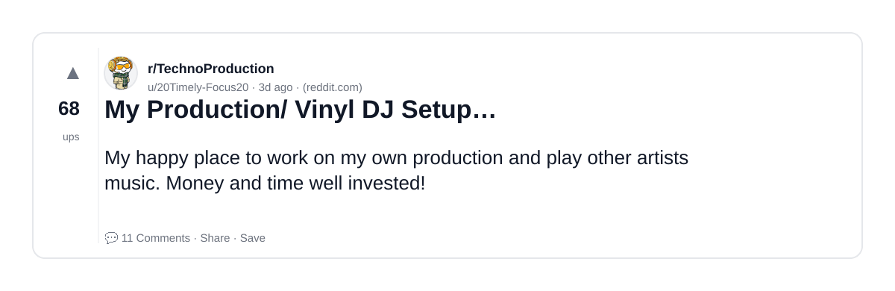

### 2) W.A. Production 12th Anniversary Sale - Up to 87% off plugins, presets, sample packs, tutorials and more through 26 April
- Subreddit: r/AudioProductionDeals
- Viral score: 1 | Ups: 1 | Comments: 0 | Upvote ratio: 100%
- Link: https://www.reddit.com/r/AudioProductionDeals/comments/1s3yau2/wa_production_12th_anniversary_sale_up_to_87_off/
- Card (local): ./cards/1s3yau2.png

### 3) Applied Acoustics Systems "Objeq Delay" Acoustic Filter and Delay (FREE) for limited time
- Subreddit: r/AudioProductionDeals
- Viral score: 1 | Ups: 53 | Comments: 19 | Upvote ratio: 100%
- Link: https://www.reddit.com/r/AudioProductionDeals/comments/1ry8zyv/applied_acoustics_systems_objeq_delay_acoustic/
- Card (local): ./cards/1ry8zyv.png

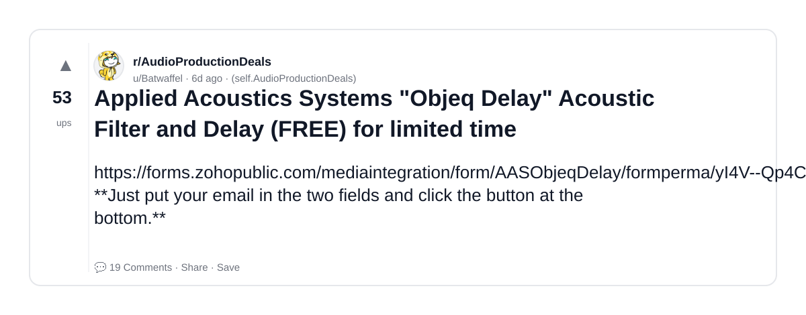

### 4) Building a Violin - Rob Scallon [2:56:05]
- Subreddit: r/ArtisanVideos
- Viral score: 0 | Ups: 31 | Comments: 1 | Upvote ratio: 84%
- Link: https://www.reddit.com/r/ArtisanVideos/comments/1s12gms/building_a_violin_rob_scallon_25605/
- Card (local): ./cards/1s12gms.png

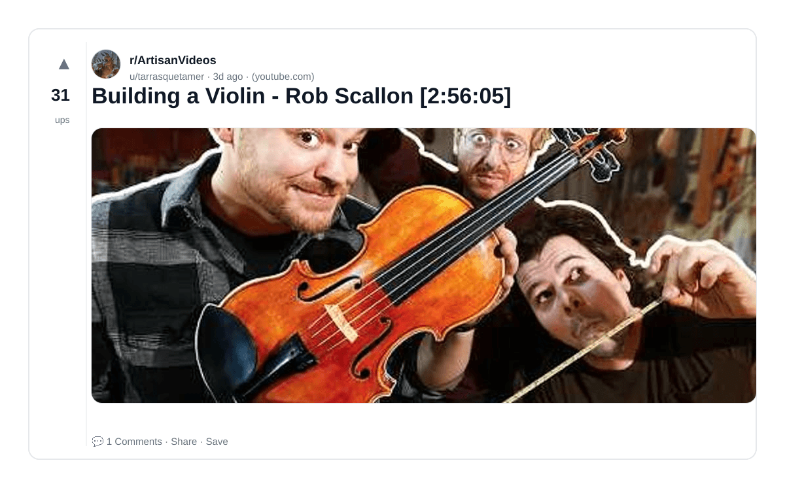

### 5) UVI "Falcon 2026" hybrid synthesiser/sampler with 20 oscillator types, 100+ fx, modulators, MIDI processing, and scripting in a semi-modular environment ($149) plug get a $100 voucher with purchase through 31 March. iLok Account Required
- Subreddit: r/AudioProductionDeals
- Viral score: 0 | Ups: 28 | Comments: 8 | Upvote ratio: 100%
- Link: https://www.reddit.com/r/AudioProductionDeals/comments/1ry9zch/uvi_falcon_2026_hybrid_synthesisersampler_with_20/
- Card (local): ./cards/1ry9zch.png

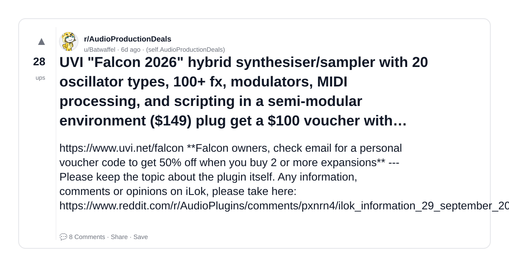

### 6) Hi guys, I created a website about 7 years ago in which I host all my field recordings and foley sounds which are all free to download and use CC0. There is currently 95+ packs with 1000's of sounds and hours of recordings and foley all perfect for Techno music production . (Jan/Feb update).
- Subreddit: r/TechnoProduction
- Viral score: 0 | Ups: 100 | Comments: 16 | Upvote ratio: 99%
- Link: https://www.reddit.com/r/TechnoProduction/comments/1rh1f6b/hi_guys_i_created_a_website_about_7_years_ago_in/
- Card (local): ./cards/1rh1f6b.png

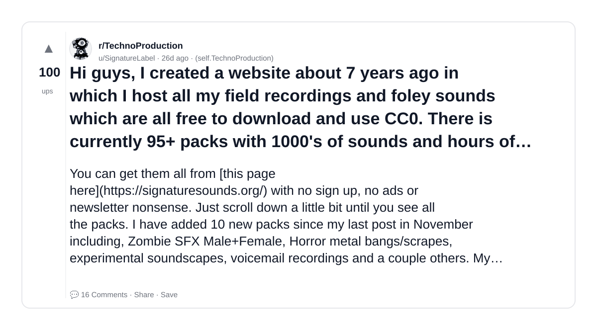

### 7) Ableton and 'secrets of techno production' - HELP?!
- Subreddit: r/TechnoProduction
- Viral score: 0 | Ups: 33 | Comments: 59 | Upvote ratio: 95%
- Link: https://www.reddit.com/r/TechnoProduction/comments/1re06rg/ableton_and_secrets_of_techno_production_help/
- Card (local): ./cards/1re06rg.png

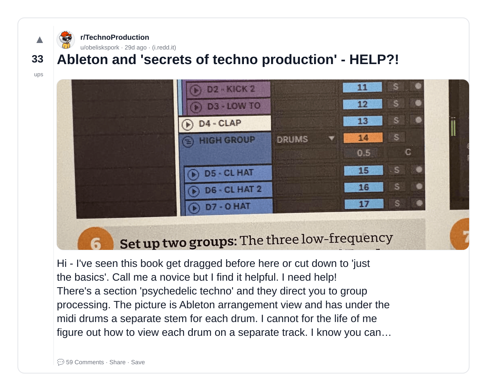

### 8) Mixing mids and highs and composition for big sound systems
- Subreddit: r/TechnoProduction
- Viral score: 0 | Ups: 6 | Comments: 11 | Upvote ratio: 80%
- Link: https://www.reddit.com/r/TechnoProduction/comments/1ryc87x/mixing_mids_and_highs_and_composition_for_big/
- Card (local): ./cards/1ryc87x.png

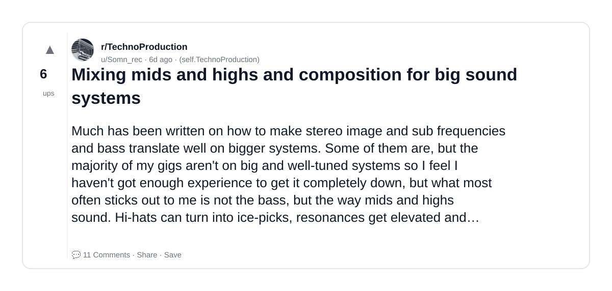

### 9) Opusonix "Opusonix Pro" collaborative review and approval platform for engineers and producers working with clients for real-time communication to annotate directly on audio files, compare versions, exchange feedback, and create notes ($5.99/mo) until 31 March with code: SPRINGMIX26
- Subreddit: r/AudioProductionDeals
- Viral score: 0 | Ups: 8 | Comments: 3 | Upvote ratio: 100%
- Link: https://www.reddit.com/r/AudioProductionDeals/comments/1rz2qdu/opusonix_opusonix_pro_collaborative_review_and/
- Card (local): ./cards/1rz2qdu.png

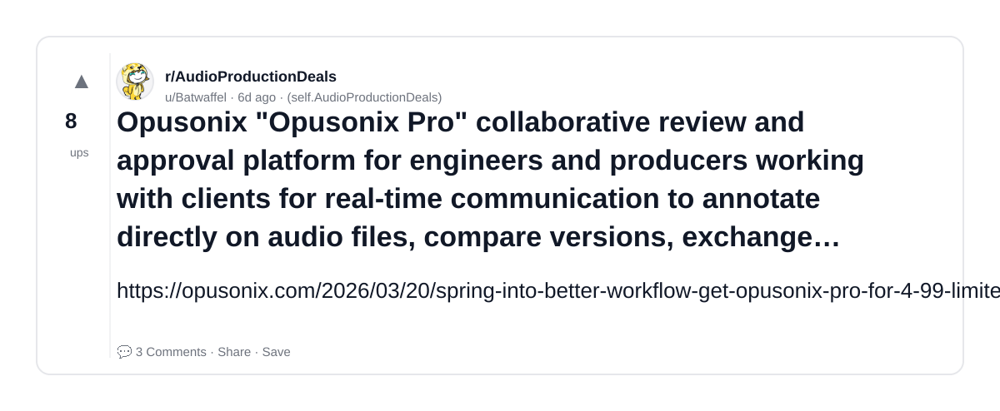

### 10) Aviram Dayan Production "Aviram Harp Guitar" large collection of stringed instruments featuring the following patches: HarpLyre, Holloway, Mandolin, Chitarpa, Balalaika, Knutsen harp guitar lyres, Tamburica for Kontakt ($32) until 7 April
- Subreddit: r/AudioProductionDeals
- Viral score: 0 | Ups: 1 | Comments: 0 | Upvote ratio: 100%
- Link: https://www.reddit.com/r/AudioProductionDeals/comments/1s3d2rt/aviram_dayan_production_aviram_harp_guitar_large/
- Card (local): ./cards/1s3d2rt.png

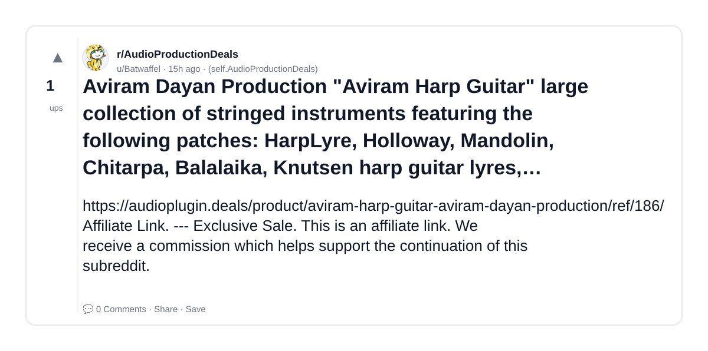

### 11) Tokyo Dawn Labs Mixing Month Sale - "TDR Production Bundle" ($99) "TDR Molot GE" ($10) "TDR Kotelnikov GE" ($19) "TDR Nova GE" ($19) "TDR Limiter 6 GE" ($19) through 16 March
- Subreddit: r/AudioProductionDeals
- Viral score: 0 | Ups: 31 | Comments: 6 | Upvote ratio: 98%
- Link: https://www.reddit.com/r/AudioProductionDeals/comments/1rildni/tokyo_dawn_labs_mixing_month_sale_tdr_production/
- Card (local): ./cards/1rildni.png

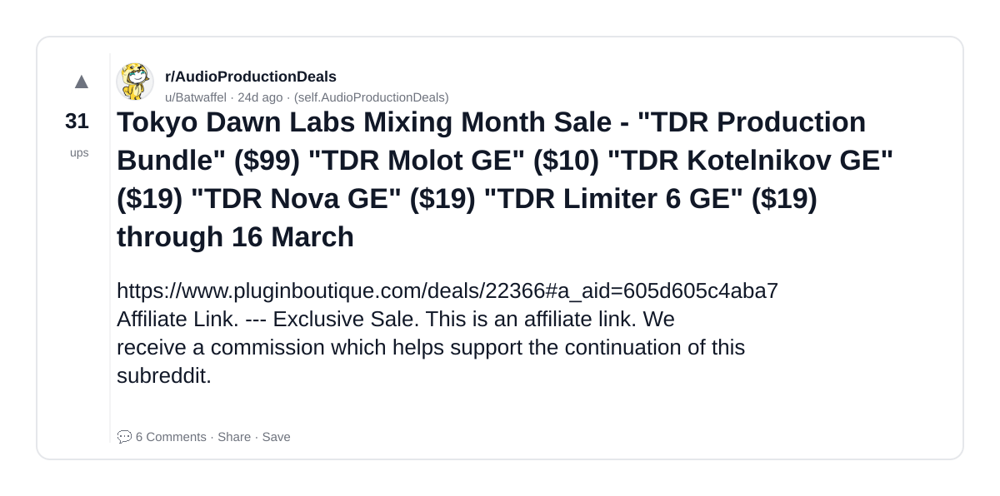

### 12) Designing and building a laminated hardwood sofa [55:14]
- Subreddit: r/ArtisanVideos
- Viral score: 0 | Ups: 49 | Comments: 1 | Upvote ratio: 86%
- Link: https://www.reddit.com/r/ArtisanVideos/comments/1pvnnkv/designing_and_building_a_laminated_hardwood_sofa/
- Card (local): ./cards/1pvnnkv.png

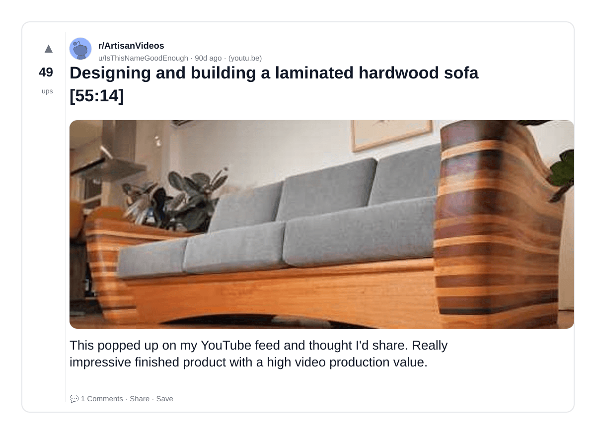
