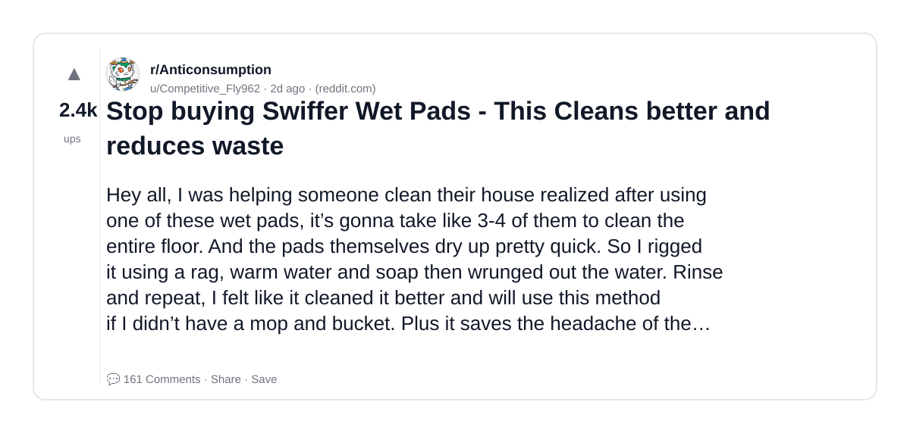
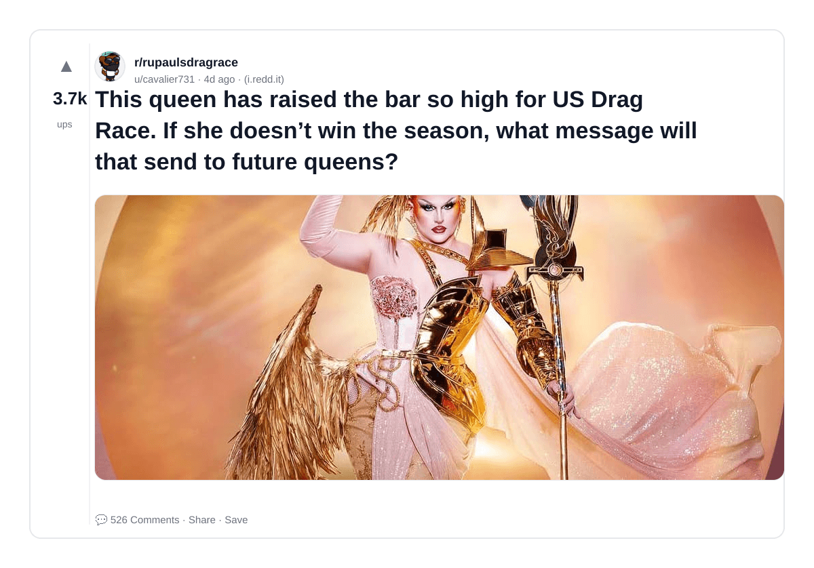
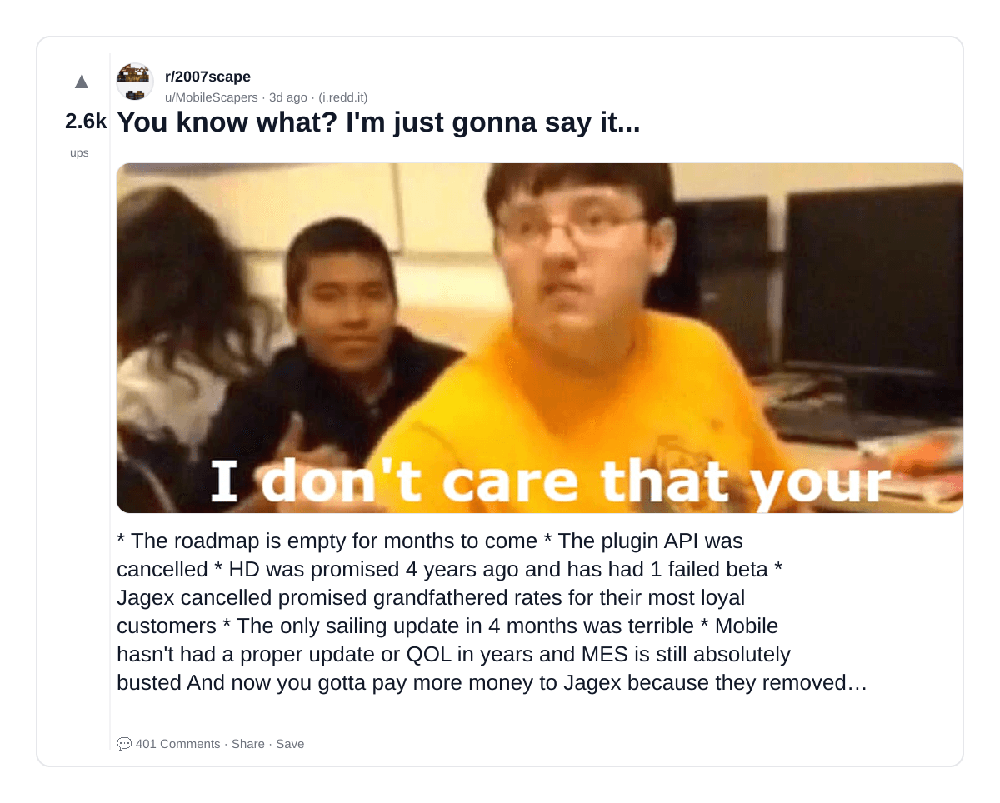
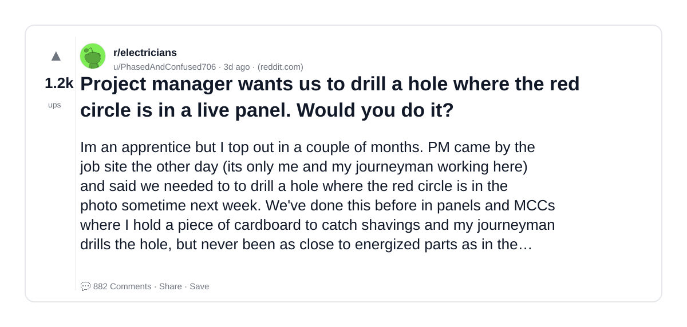
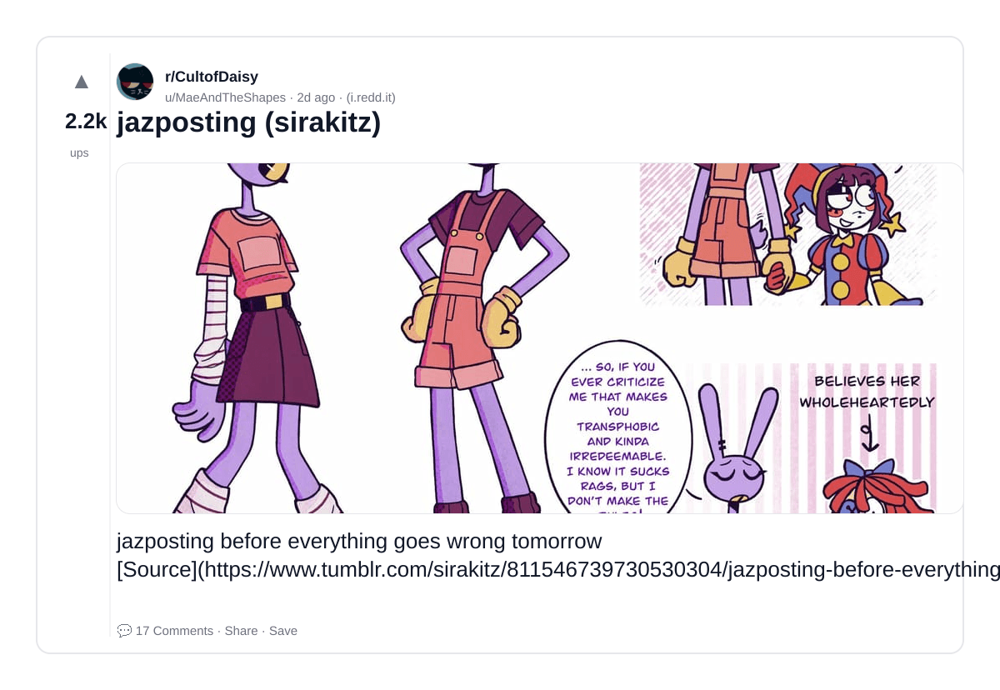
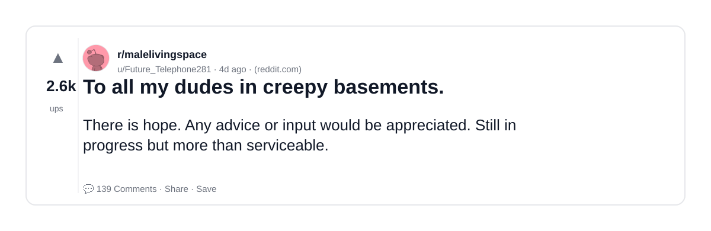
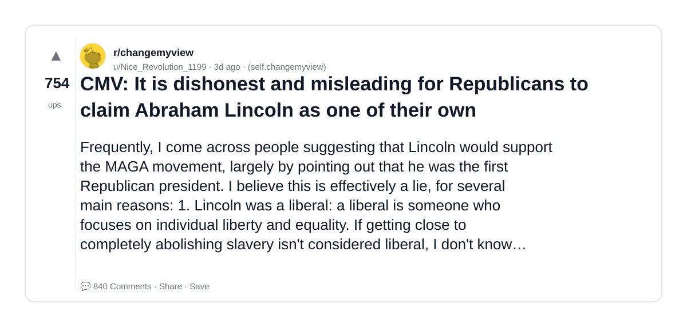
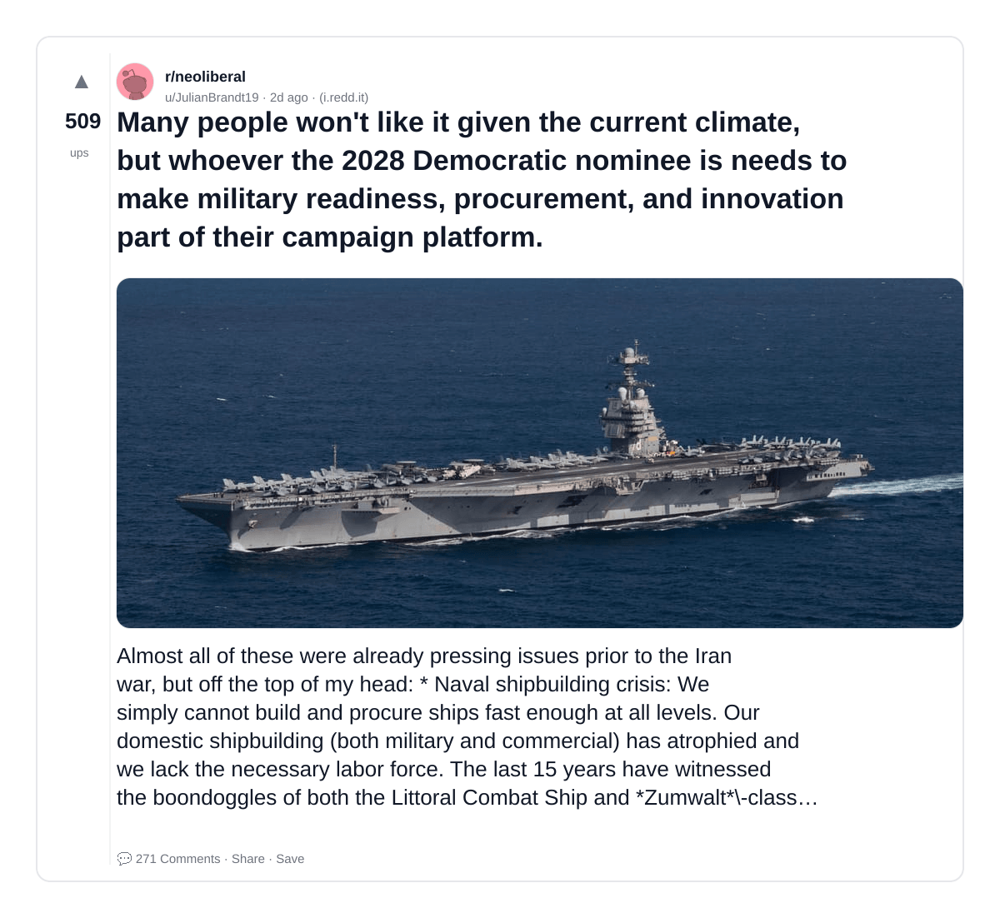
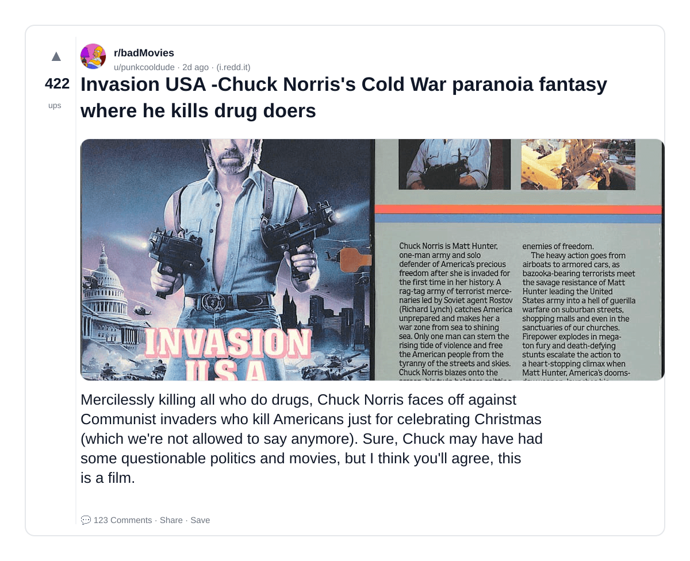

# Reddit Scout — RAG

Run: 2026-03-22T19-35-16-898Z
Started: 2026-03-22T19:35:16.898Z
Output dir: /home/ubuntu/.openclaw/workspace-ce/users/1085339629/reddit-scout/rag/runs/2026-03-22T19-35-16-898Z

Config: topN=10 | subLimit=10 | kinds=top,hot,rising | time=week | limitPerListing=25
Search: RAG (sort=top t=auto)

## Top terms (from titles + top comments)

- people (8)
- live (6)
- when (5)
- swiffer (4)
- season (4)
- what (4)
- will (4)
- lincoln (4)
- like (4)
- love (4)
- think (4)
- there (4)
- house (4)
- better (3)
- republicans (3)
- years (3)
- back (3)
- well (3)

## Viral content ideas (derived from these posts)

**1. Personal story → timeline + receipts**
- Hook: Hook with 1 line, then a 5-step timeline; end with the lesson and what you would do differently.

**2. My people got automated: what I automated back (tools + workflow)**
- Hook: Turn it into a before/after workflow post. Include exact tool stack + steps.

**3. Checklist: how to stay valuable when live hits your team**
- Hook: A numbered checklist (10 items). Make it practical: skills, portfolio, outreach, proof-of-work.

**4. Hot take: when isn't the problem — swiffer is**
- Hook: Contrarian framing. Back it with 2 examples from the top posts and 1 counterexample.

**5. Debunk thread: "AI will replace season" vs what's actually happening**
- Hook: Use 3 claims → 3 rebuttals. Cite specific post patterns: layoffs, hiring freezes, role shifts.

**6. Salary/market reality: what vs will roles in 2026 (Reddit signals)**
- Hook: Summarize demand signals from comments: who is struggling, who is fine, why.

**7. "What would you do in 30 days?" layoff recovery plan (day-by-day)**
- Hook: 30-day plan: portfolio, interview loops, networking, mental health. Include a downloadable checklist.

**8. Mini-case study: 1 resume bullet → 1 proof project using lincoln**
- Hook: Show how to convert a vague resume claim into a measurable project + writeup.

**9. Community question: which tasks should *never* be delegated to AI?**
- Hook: Ask + give your own top 5. Encourage replies; add a poll if your platform supports it.

**10. Template post: "I used AI to do X, got Y result, here's the exact prompt"**
- Hook: Make it reproducible: prompt, inputs, outputs, gotchas.

**11. Data post: a quick scorecard of the top threads (ups, comments, ratio) + what it signals**
- Hook: Table or bullets; then 3 takeaways.

**12. Meme angle (if relevant): like vs love — job search edition**
- Hook: If your niche is not memes, skip memes; otherwise caption the pattern you saw in comments.

## Top posts (10) + cards

### 1) Stop buying Swiffer Wet Pads - This Cleans better and reduces waste
- Subreddit: r/Anticonsumption
- Viral score: 128 | Ups: 2411 | Comments: 161 | Upvote ratio: 98%
- Link: https://www.reddit.com/r/Anticonsumption/comments/1rzc5w0/stop_buying_swiffer_wet_pads_this_cleans_better/
- Card (local): ./cards/1rzc5w0.png

### 2) This queen has raised the bar so high for US Drag Race. If she doesn’t win the season, what message will that send to future queens?
- Subreddit: r/rupaulsdragrace
- Viral score: 115 | Ups: 3694 | Comments: 526 | Upvote ratio: 93%
- Link: https://www.reddit.com/r/rupaulsdragrace/comments/1rxbnis/this_queen_has_raised_the_bar_so_high_for_us_drag/
- Card (local): ./cards/1rxbnis.png

### 3) You know what? I'm just gonna say it...
- Subreddit: r/2007scape
- Viral score: 114 | Ups: 2557 | Comments: 401 | Upvote ratio: 84%
- Link: https://www.reddit.com/r/2007scape/comments/1rykjqy/you_know_what_im_just_gonna_say_it/
- Card (local): ./cards/1rykjqy.png

### 4) Project manager wants us to drill a hole where the red circle is in a live panel. Would you do it?
- Subreddit: r/electricians
- Viral score: 91 | Ups: 1208 | Comments: 882 | Upvote ratio: 96%
- Link: https://www.reddit.com/r/electricians/comments/1ryf6o2/project_manager_wants_us_to_drill_a_hole_where/
- Card (local): ./cards/1ryf6o2.png

### 5) jazposting (sirakitz)
- Subreddit: r/CultofDaisy
- Viral score: 83 | Ups: 2238 | Comments: 17 | Upvote ratio: 99%
- Link: https://www.reddit.com/r/CultofDaisy/comments/1rz54sq/jazposting_sirakitz/
- Card (local): ./cards/1rz54sq.png

### 6) To all my dudes in creepy basements.
- Subreddit: r/malelivingspace
- Viral score: 77 | Ups: 2642 | Comments: 139 | Upvote ratio: 99%
- Link: https://www.reddit.com/r/malelivingspace/comments/1rxtguo/to_all_my_dudes_in_creepy_basements/
- Card (local): ./cards/1rxtguo.png

### 7) CMV: It is dishonest and misleading for Republicans to claim Abraham Lincoln as one of their own
- Subreddit: r/changemyview
- Viral score: 47 | Ups: 754 | Comments: 840 | Upvote ratio: 65%
- Link: https://www.reddit.com/r/changemyview/comments/1ry1gsq/cmv_it_is_dishonest_and_misleading_for/
- Card (local): ./cards/1ry1gsq.png

### 8) Many people won't like it given the current climate, but whoever the 2028 Democratic nominee is needs to make military readiness, procurement, and innovation part of their campaign platform.
- Subreddit: r/neoliberal
- Viral score: 36 | Ups: 509 | Comments: 271 | Upvote ratio: 86%
- Link: https://www.reddit.com/r/neoliberal/comments/1ryvth4/many_people_wont_like_it_given_the_current/
- Card (local): ./cards/1ryvth4.png

### 9) Rags to Riches.
- Subreddit: r/SkyrimMemes
- Viral score: 33 | Ups: 1186 | Comments: 28 | Upvote ratio: 100%
- Link: https://www.reddit.com/r/SkyrimMemes/comments/1ryeyyb/rags_to_riches/
- Card (local): ./cards/1ryeyyb.png

### 10) Invasion USA -Chuck Norris's Cold War paranoia fantasy where he kills drug doers
- Subreddit: r/badMovies
- Viral score: 25 | Ups: 422 | Comments: 123 | Upvote ratio: 89%
- Link: https://www.reddit.com/r/badMovies/comments/1rz2uee/invasion_usa_chuck_norriss_cold_war_paranoia/
- Card (local): ./cards/1rz2uee.png

