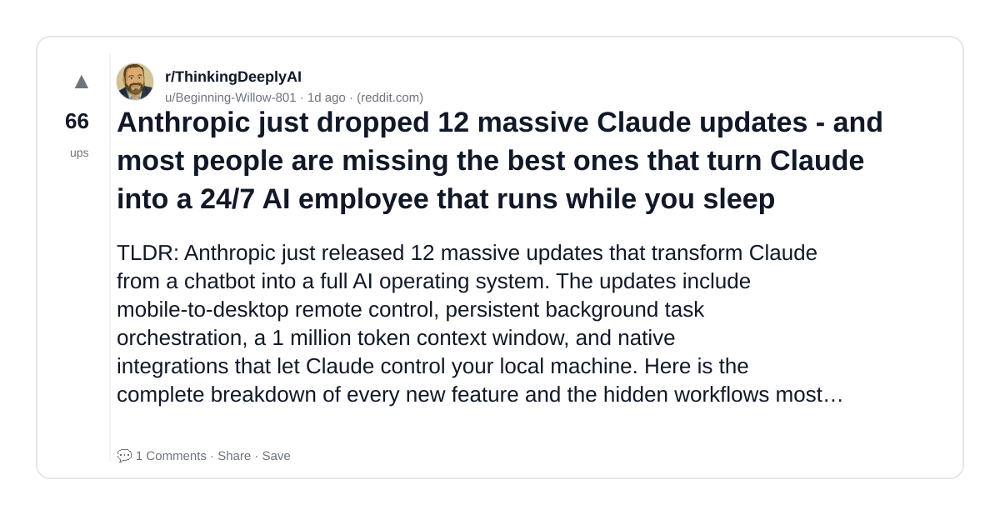
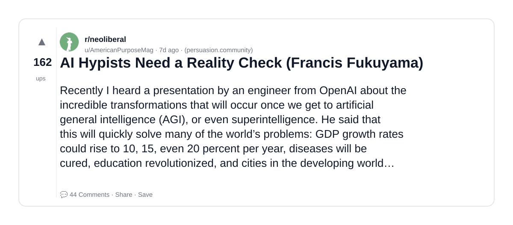
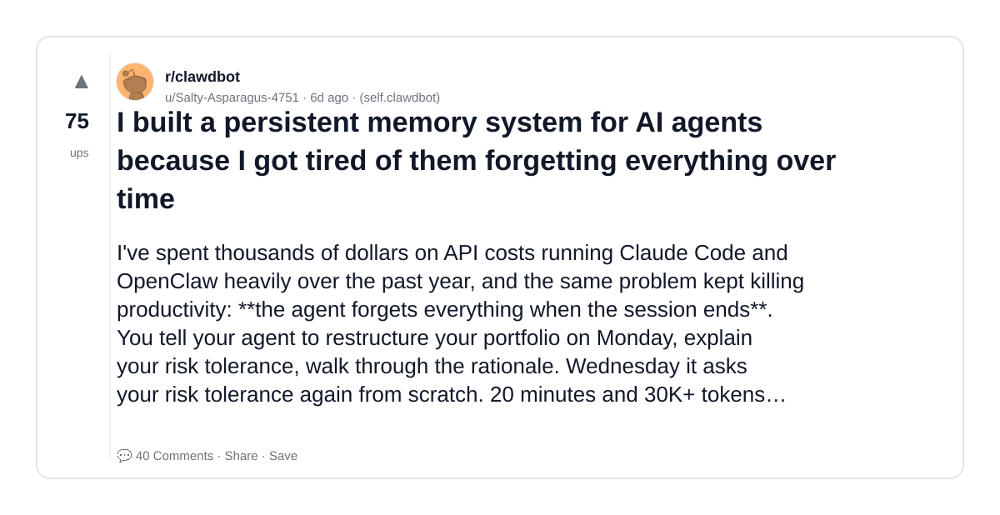
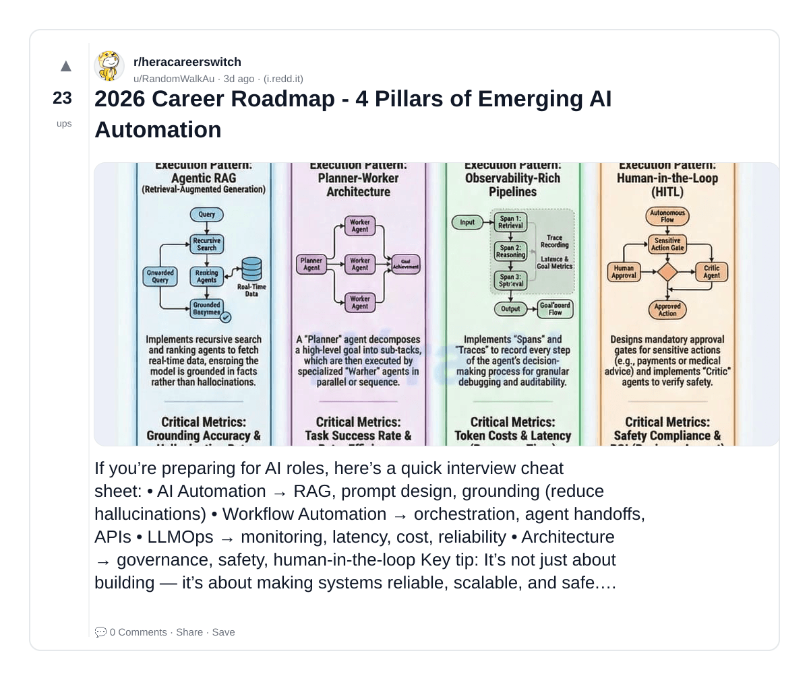
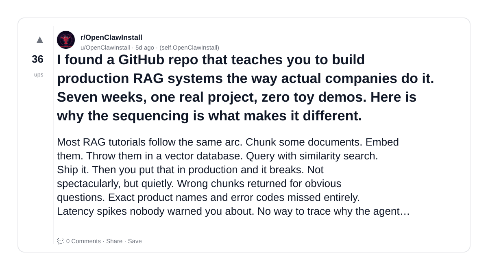

# Reddit Scout — System Design for AI GenAI LLM infrastructure scalability fault tolerance distributed systems

Run: 2026-03-26T07-16-14-953Z
Started: 2026-03-26T07:16:14.953Z
Output dir: /home/ubuntu/.openclaw/workspace-ce/users/1085339629/reddit-scout/system-design-for-ai-genai-llm-infrastructure-scalability-fa/runs/2026-03-26T07-16-14-953Z

Config: topN=20 | subLimit=12 | kinds=top,hot,rising | time=week | limitPerListing=25
Search: System Design for AI GenAI LLM infrastructure scalability fault tolerance distributed systems (sort=top t=auto)

## Top terms (from titles + top comments)

- time (4)
- more (4)
- into (3)
- over (3)
- come (3)
- some (3)
- intelligence (3)
- assuming (3)
- yadda (3)
- massive (2)
- claude (2)
- most (2)
- people (2)
- ones (2)
- francis (2)
- memory (2)
- system (2)
- them (2)

## Viral content ideas (derived from these posts)

**1. Personal story → timeline + receipts**
- Hook: Hook with 1 line, then a 5-step timeline; end with the lesson and what you would do differently.

**2. My time got automated: what I automated back (tools + workflow)**
- Hook: Turn it into a before/after workflow post. Include exact tool stack + steps.

**3. Checklist: how to stay valuable when more hits your team**
- Hook: A numbered checklist (10 items). Make it practical: skills, portfolio, outreach, proof-of-work.

**4. Hot take: into isn't the problem — over is**
- Hook: Contrarian framing. Back it with 2 examples from the top posts and 1 counterexample.

**5. Debunk thread: "AI will replace come" vs what's actually happening**
- Hook: Use 3 claims → 3 rebuttals. Cite specific post patterns: layoffs, hiring freezes, role shifts.

**6. Salary/market reality: some vs intelligence roles in 2026 (Reddit signals)**
- Hook: Summarize demand signals from comments: who is struggling, who is fine, why.

**7. "What would you do in 30 days?" layoff recovery plan (day-by-day)**
- Hook: 30-day plan: portfolio, interview loops, networking, mental health. Include a downloadable checklist.

**8. Mini-case study: 1 resume bullet → 1 proof project using assuming**
- Hook: Show how to convert a vague resume claim into a measurable project + writeup.

**9. Community question: which tasks should *never* be delegated to AI?**
- Hook: Ask + give your own top 5. Encourage replies; add a poll if your platform supports it.

**10. Template post: "I used AI to do X, got Y result, here's the exact prompt"**
- Hook: Make it reproducible: prompt, inputs, outputs, gotchas.

**11. Data post: a quick scorecard of the top threads (ups, comments, ratio) + what it signals**
- Hook: Table or bullets; then 3 takeaways.

**12. Meme angle (if relevant): yadda vs massive — job search edition**
- Hook: If your niche is not memes, skip memes; otherwise caption the pattern you saw in comments.

## Top posts (5) + cards

### 1) Anthropic just dropped 12 massive Claude updates - and most people are missing the best ones that turn Claude into a 24/7 AI employee that runs while you sleep
- Subreddit: r/ThinkingDeeplyAI
- Viral score: 3 | Ups: 66 | Comments: 1 | Upvote ratio: 95%
- Link: https://www.reddit.com/r/ThinkingDeeplyAI/comments/1s315bb/anthropic_just_dropped_12_massive_claude_updates/
- Card (local): ./cards/1s315bb.png

### 2) AI Hypists Need a Reality Check (Francis Fukuyama)
- Subreddit: r/neoliberal
- Viral score: 2 | Ups: 162 | Comments: 44 | Upvote ratio: 95%
- Link: https://www.reddit.com/r/neoliberal/comments/1ry1f5v/ai_hypists_need_a_reality_check_francis_fukuyama/
- Card (local): ./cards/1ry1f5v.png

### 3) I built a persistent memory system for AI agents because I got tired of them forgetting everything over time
- Subreddit: r/clawdbot
- Viral score: 1 | Ups: 75 | Comments: 40 | Upvote ratio: 89%
- Link: https://www.reddit.com/r/clawdbot/comments/1ryo919/i_built_a_persistent_memory_system_for_ai_agents/
- Card (local): ./cards/1ryo919.png

### 4) 2026 Career Roadmap - 4 Pillars of Emerging AI Automation
- Subreddit: r/heracareerswitch
- Viral score: 0 | Ups: 23 | Comments: 0 | Upvote ratio: 96%
- Link: https://www.reddit.com/r/heracareerswitch/comments/1s129tx/2026_career_roadmap_4_pillars_of_emerging_ai/
- Card (local): ./cards/1s129tx.png

### 5) I found a GitHub repo that teaches you to build production RAG systems the way actual companies do it. Seven weeks, one real project, zero toy demos. Here is why the sequencing is what makes it different.
- Subreddit: r/OpenClawInstall
- Viral score: 0 | Ups: 36 | Comments: 0 | Upvote ratio: 97%
- Link: https://www.reddit.com/r/OpenClawInstall/comments/1rzir0t/i_found_a_github_repo_that_teaches_you_to_build/
- Card (local): ./cards/1rzir0t.png

