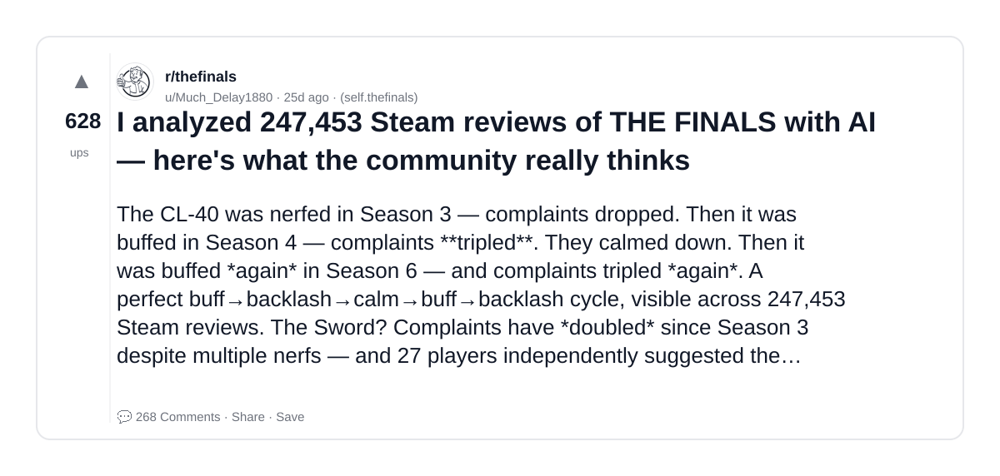
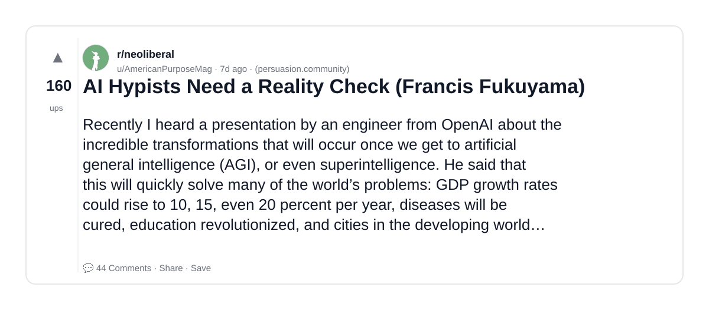
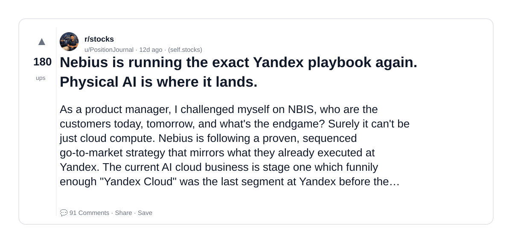
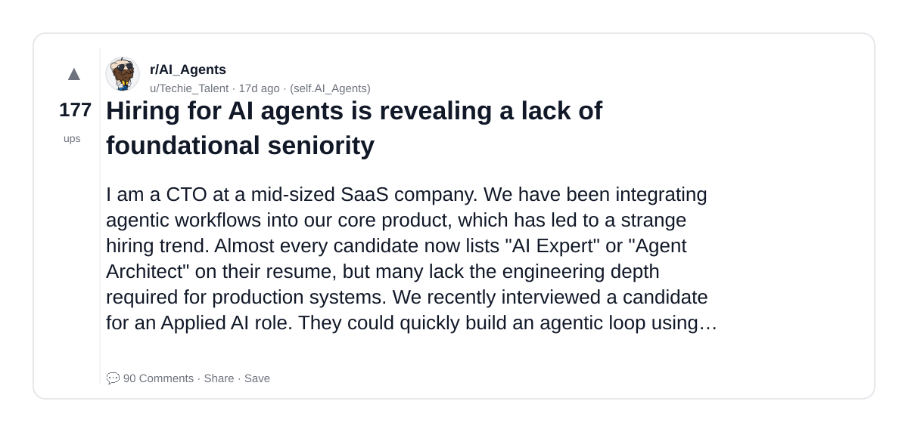
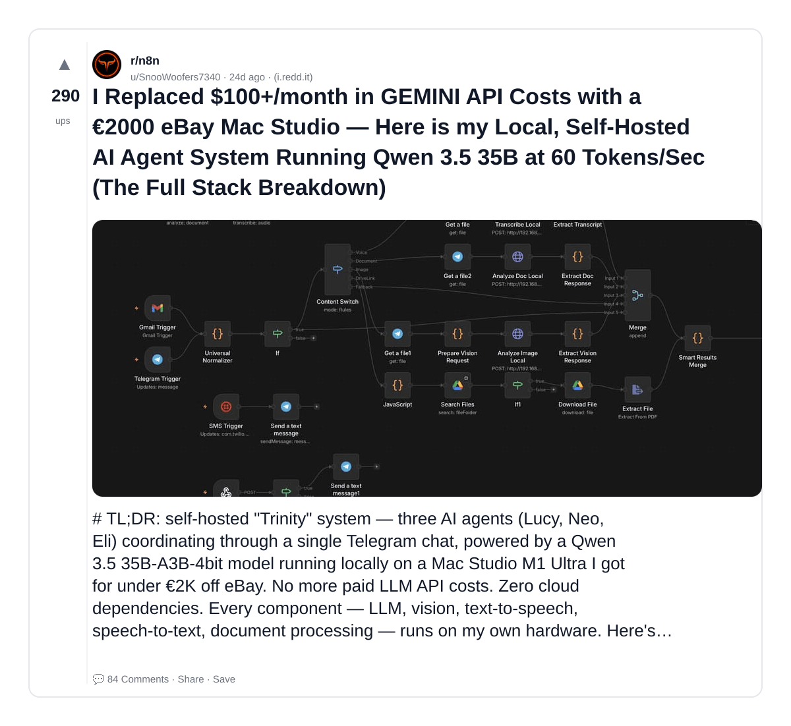
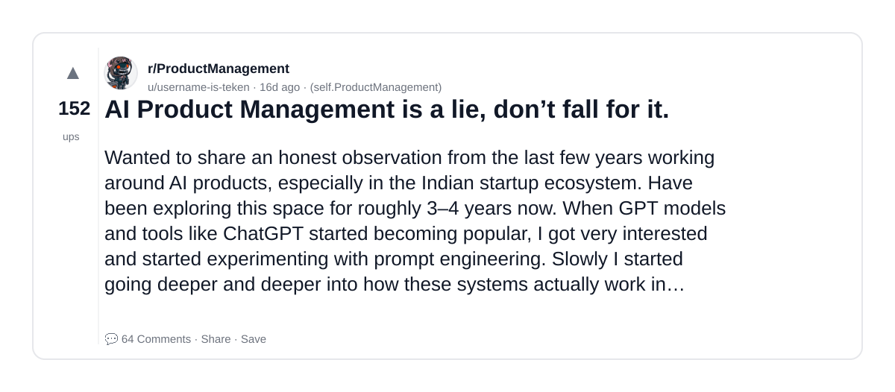
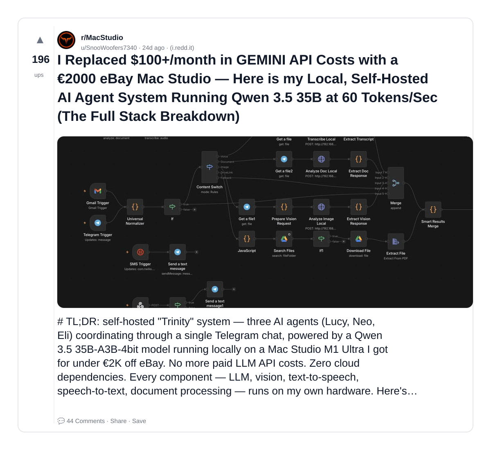
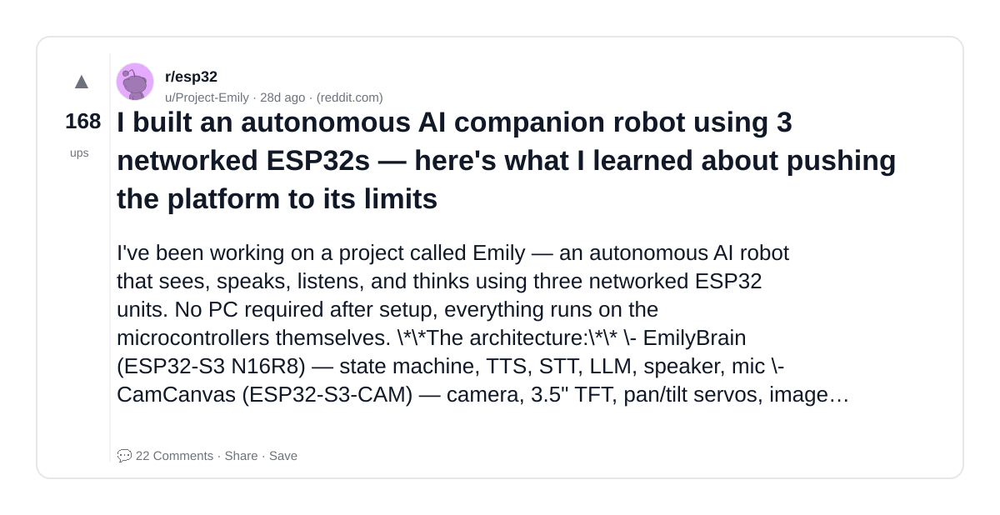

# Reddit Scout — System Design for AI GenAI LLM infrastructure scalability fault tolerance distributed systems

Run: 2026-03-26T07-16-34-917Z
Started: 2026-03-26T07:16:34.917Z
Output dir: /home/ubuntu/.openclaw/workspace-ce/users/1085339629/reddit-scout/system-design-for-ai-genai-llm-infrastructure-scalability-fa/runs/2026-03-26T07-16-34-917Z

Config: topN=30 | subLimit=15 | kinds=top,hot,rising | time=month | limitPerListing=25
Search: System Design for AI GenAI LLM infrastructure scalability fault tolerance distributed systems (sort=top t=auto)

## Top terms (from titles + top comments)

- here (9)
- will (9)
- nebius (6)
- what (5)
- agent (5)
- have (5)
- physical (4)
- product (4)
- work (4)
- post (4)
- most (4)
- technology (4)
- only (4)
- likely (4)
- running (3)
- yandex (3)
- hiring (3)
- gemini (3)

## Viral content ideas (derived from these posts)

**1. Personal story → timeline + receipts**
- Hook: Hook with 1 line, then a 5-step timeline; end with the lesson and what you would do differently.

**2. My here got automated: what I automated back (tools + workflow)**
- Hook: Turn it into a before/after workflow post. Include exact tool stack + steps.

**3. Checklist: how to stay valuable when will hits your team**
- Hook: A numbered checklist (10 items). Make it practical: skills, portfolio, outreach, proof-of-work.

**4. Hot take: nebius isn't the problem — what is**
- Hook: Contrarian framing. Back it with 2 examples from the top posts and 1 counterexample.

**5. Debunk thread: "AI will replace agent" vs what's actually happening**
- Hook: Use 3 claims → 3 rebuttals. Cite specific post patterns: layoffs, hiring freezes, role shifts.

**6. Salary/market reality: have vs physical roles in 2026 (Reddit signals)**
- Hook: Summarize demand signals from comments: who is struggling, who is fine, why.

**7. "What would you do in 30 days?" layoff recovery plan (day-by-day)**
- Hook: 30-day plan: portfolio, interview loops, networking, mental health. Include a downloadable checklist.

**8. Mini-case study: 1 resume bullet → 1 proof project using product**
- Hook: Show how to convert a vague resume claim into a measurable project + writeup.

**9. Community question: which tasks should *never* be delegated to AI?**
- Hook: Ask + give your own top 5. Encourage replies; add a poll if your platform supports it.

**10. Template post: "I used AI to do X, got Y result, here's the exact prompt"**
- Hook: Make it reproducible: prompt, inputs, outputs, gotchas.

**11. Data post: a quick scorecard of the top threads (ups, comments, ratio) + what it signals**
- Hook: Table or bullets; then 3 takeaways.

**12. Meme angle (if relevant): work vs post — job search edition**
- Hook: If your niche is not memes, skip memes; otherwise caption the pattern you saw in comments.

## Top posts (8) + cards

### 1) I analyzed 247,453 Steam reviews of THE FINALS with AI — here's what the community really thinks
- Subreddit: r/thefinals
- Viral score: 3 | Ups: 628 | Comments: 268 | Upvote ratio: 84%
- Link: https://www.reddit.com/r/thefinals/comments/1ri5z5a/i_analyzed_247453_steam_reviews_of_the_finals/
- Card (local): ./cards/1ri5z5a.png

### 2) AI Hypists Need a Reality Check (Francis Fukuyama)
- Subreddit: r/neoliberal
- Viral score: 2 | Ups: 160 | Comments: 44 | Upvote ratio: 95%
- Link: https://www.reddit.com/r/neoliberal/comments/1ry1f5v/ai_hypists_need_a_reality_check_francis_fukuyama/
- Card (local): ./cards/1ry1f5v.png

### 3) Nebius is running the exact Yandex playbook again. Physical AI is where it lands.
- Subreddit: r/stocks
- Viral score: 2 | Ups: 180 | Comments: 91 | Upvote ratio: 84%
- Link: https://www.reddit.com/r/stocks/comments/1rt1mz3/nebius_is_running_the_exact_yandex_playbook_again/
- Card (local): ./cards/1rt1mz3.png

### 4) Hiring for AI agents is revealing a lack of foundational seniority
- Subreddit: r/AI_Agents
- Viral score: 1 | Ups: 177 | Comments: 90 | Upvote ratio: 94%
- Link: https://www.reddit.com/r/AI_Agents/comments/1routeb/hiring_for_ai_agents_is_revealing_a_lack_of/
- Card (local): ./cards/1routeb.png

### 5) I Replaced $100+/month in GEMINI API Costs with a €2000 eBay Mac Studio — Here is my Local, Self-Hosted AI Agent System Running Qwen 3.5 35B at 60 Tokens/Sec (The Full Stack Breakdown)
- Subreddit: r/n8n
- Viral score: 1 | Ups: 290 | Comments: 84 | Upvote ratio: 83%
- Link: https://www.reddit.com/r/n8n/comments/1ri8922/i_replaced_100month_in_gemini_api_costs_with_a/
- Card (local): ./cards/1ri8922.png

### 6) AI Product Management is a lie, don’t fall for it.
- Subreddit: r/ProductManagement
- Viral score: 1 | Ups: 152 | Comments: 64 | Upvote ratio: 92%
- Link: https://www.reddit.com/r/ProductManagement/comments/1rq374h/ai_product_management_is_a_lie_dont_fall_for_it/
- Card (local): ./cards/1rq374h.png

### 7) I Replaced $100+/month in GEMINI API Costs with a €2000 eBay Mac Studio — Here is my Local, Self-Hosted AI Agent System Running Qwen 3.5 35B at 60 Tokens/Sec (The Full Stack Breakdown)
- Subreddit: r/MacStudio
- Viral score: 1 | Ups: 196 | Comments: 44 | Upvote ratio: 90%
- Link: https://www.reddit.com/r/MacStudio/comments/1ri8ldg/i_replaced_100month_in_gemini_api_costs_with_a/
- Card (local): ./cards/1ri8ldg.png

### 8) I built an autonomous AI companion robot using 3 networked ESP32s — here's what I learned about pushing the platform to its limits
- Subreddit: r/esp32
- Viral score: 0 | Ups: 168 | Comments: 22 | Upvote ratio: 92%
- Link: https://www.reddit.com/r/esp32/comments/1rf374k/i_built_an_autonomous_ai_companion_robot_using_3/
- Card (local): ./cards/1rf374k.png

