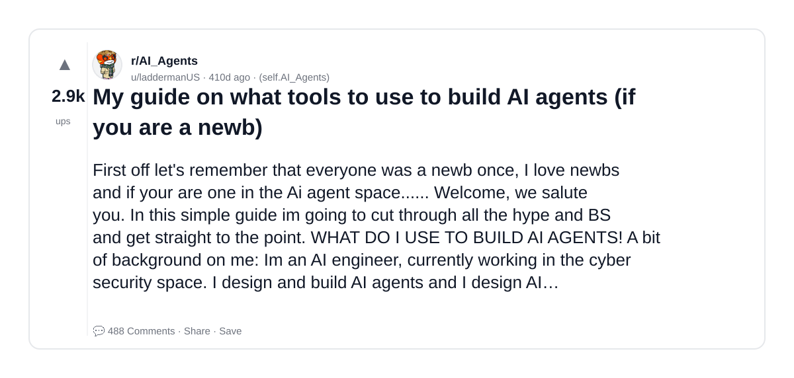
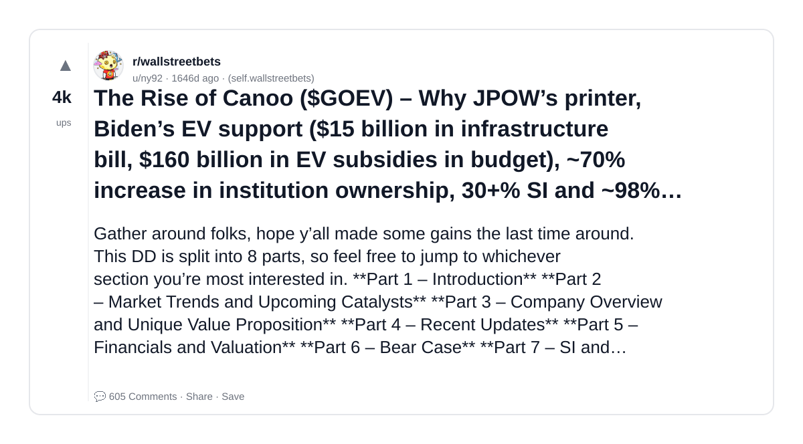
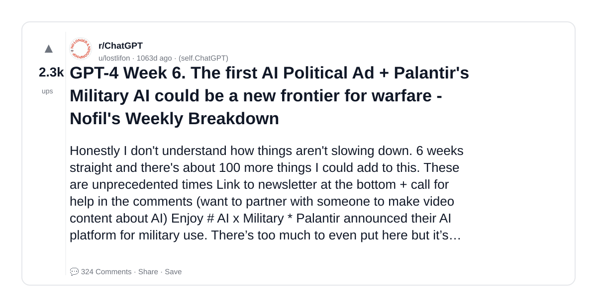

# Reddit Scout — System Design for AI GenAI LLM infrastructure scalability fault tolerance distributed systems

Run: 2026-03-26T07-16-59-494Z
Started: 2026-03-26T07:16:59.494Z
Output dir: /home/ubuntu/.openclaw/workspace-ce/users/1085339629/reddit-scout/system-design-for-ai-genai-llm-infrastructure-scalability-fa/runs/2026-03-26T07-16-59-494Z

Config: topN=30 | subLimit=10 | kinds=top,hot,rising | time=all | limitPerListing=25
Search: System Design for AI GenAI LLM infrastructure scalability fault tolerance distributed systems (sort=top t=auto)

## Top terms (from titles + top comments)

- what (4)
- equivalent (3)
- tools (2)
- billion (2)
- time (2)
- langchain (2)
- read (2)
- lots (2)
- holy (2)
- partner (2)
- social (2)
- media (2)
- guide (1)
- build (1)
- agents (1)
- newb (1)
- rise (1)
- canoo (1)

## Viral content ideas (derived from these posts)

**1. Personal story → timeline + receipts**
- Hook: Hook with 1 line, then a 5-step timeline; end with the lesson and what you would do differently.

**2. My what got automated: what I automated back (tools + workflow)**
- Hook: Turn it into a before/after workflow post. Include exact tool stack + steps.

**3. Checklist: how to stay valuable when equivalent hits your team**
- Hook: A numbered checklist (10 items). Make it practical: skills, portfolio, outreach, proof-of-work.

**4. Hot take: tools isn't the problem — billion is**
- Hook: Contrarian framing. Back it with 2 examples from the top posts and 1 counterexample.

**5. Debunk thread: "AI will replace time" vs what's actually happening**
- Hook: Use 3 claims → 3 rebuttals. Cite specific post patterns: layoffs, hiring freezes, role shifts.

**6. Salary/market reality: langchain vs read roles in 2026 (Reddit signals)**
- Hook: Summarize demand signals from comments: who is struggling, who is fine, why.

**7. "What would you do in 30 days?" layoff recovery plan (day-by-day)**
- Hook: 30-day plan: portfolio, interview loops, networking, mental health. Include a downloadable checklist.

**8. Mini-case study: 1 resume bullet → 1 proof project using lots**
- Hook: Show how to convert a vague resume claim into a measurable project + writeup.

**9. Community question: which tasks should *never* be delegated to AI?**
- Hook: Ask + give your own top 5. Encourage replies; add a poll if your platform supports it.

**10. Template post: "I used AI to do X, got Y result, here's the exact prompt"**
- Hook: Make it reproducible: prompt, inputs, outputs, gotchas.

**11. Data post: a quick scorecard of the top threads (ups, comments, ratio) + what it signals**
- Hook: Table or bullets; then 3 takeaways.

**12. Meme angle (if relevant): holy vs partner — job search edition**
- Hook: If your niche is not memes, skip memes; otherwise caption the pattern you saw in comments.

## Top posts (3) + cards

### 1) My guide on what tools to use to build AI agents (if you are a newb)
- Subreddit: r/AI_Agents
- Viral score: 1 | Ups: 2878 | Comments: 488 | Upvote ratio: 99%
- Link: https://www.reddit.com/r/AI_Agents/comments/1il8b1i/my_guide_on_what_tools_to_use_to_build_ai_agents/
- Card (local): ./cards/1il8b1i.png

### 2) The Rise of Canoo ($GOEV) – Why JPOW’s printer, Biden’s EV support ($15 billion in infrastructure bill, $160 billion in EV subsidies in budget), ~70% increase in institution ownership, 30+% SI and ~98% utilization are primed to send a young and unique EV manufacturer to the stratosphere.
- Subreddit: r/wallstreetbets
- Viral score: 0 | Ups: 4050 | Comments: 605 | Upvote ratio: 93%
- Link: https://www.reddit.com/r/wallstreetbets/comments/pt7jzp/the_rise_of_canoo_goev_why_jpows_printer_bidens/
- Card (local): ./cards/pt7jzp.png

### 3) GPT-4 Week 6. The first AI Political Ad + Palantir's Military AI could be a new frontier for warfare - Nofil's Weekly Breakdown
- Subreddit: r/ChatGPT
- Viral score: 0 | Ups: 2256 | Comments: 324 | Upvote ratio: 98%
- Link: https://www.reddit.com/r/ChatGPT/comments/1323qlg/gpt4_week_6_the_first_ai_political_ad_palantirs/
- Card (local): ./cards/1323qlg.png

