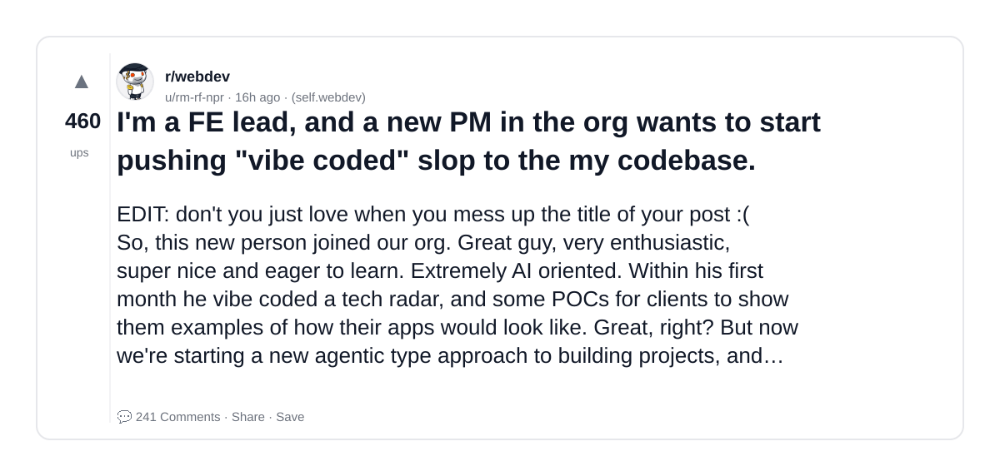
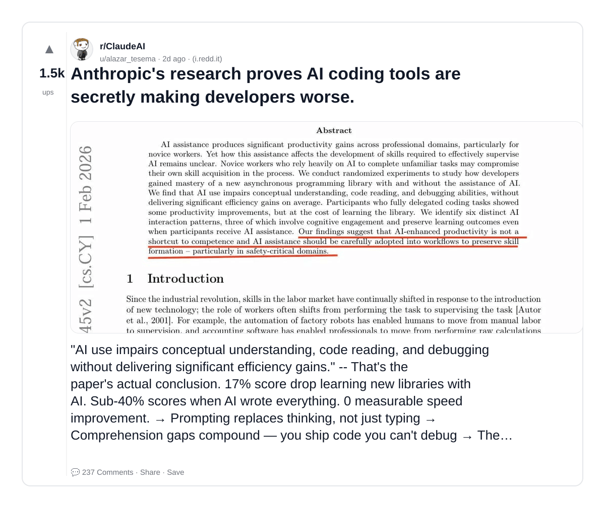
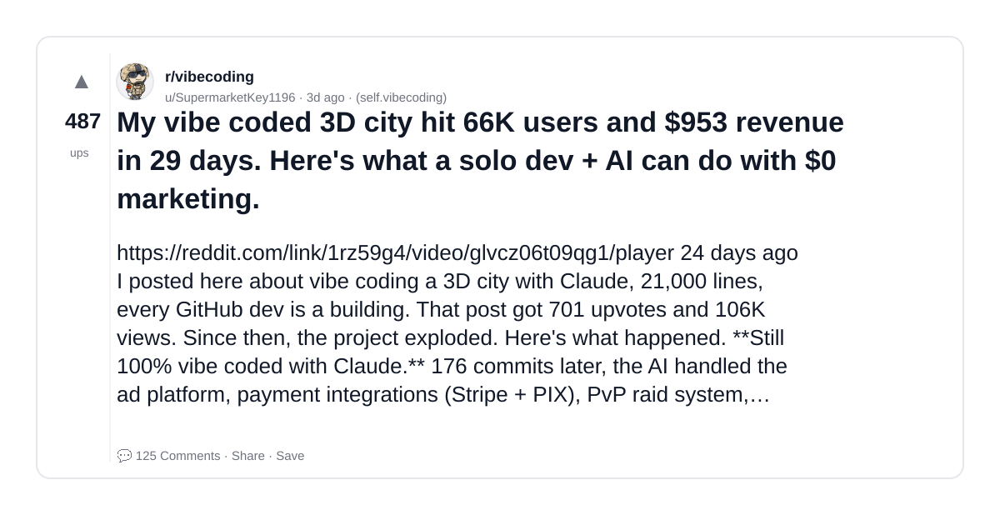
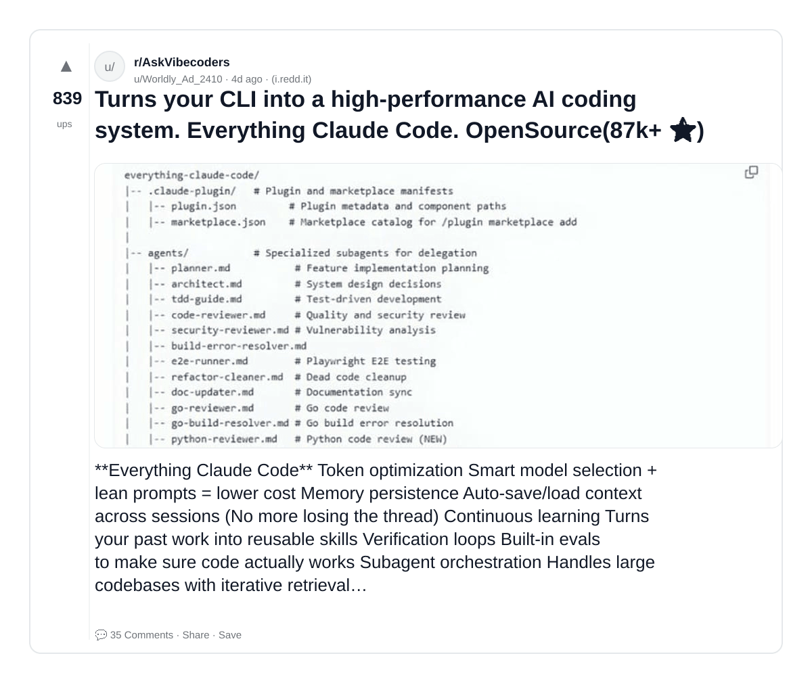
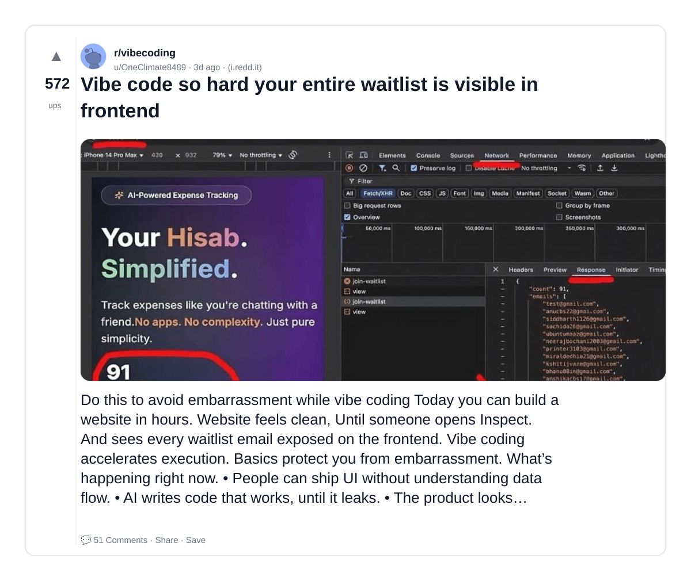
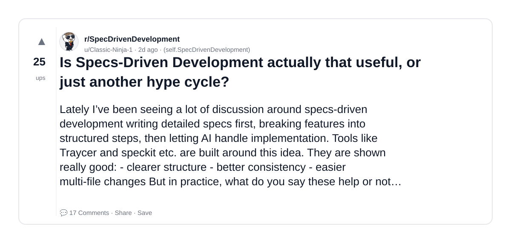
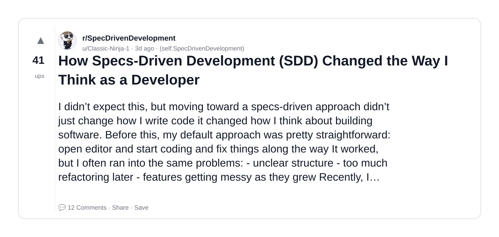
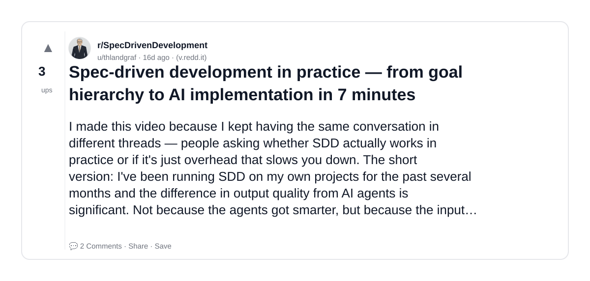
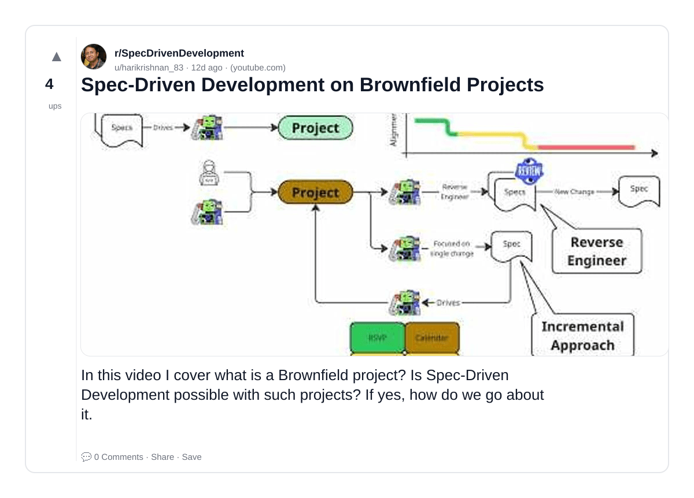
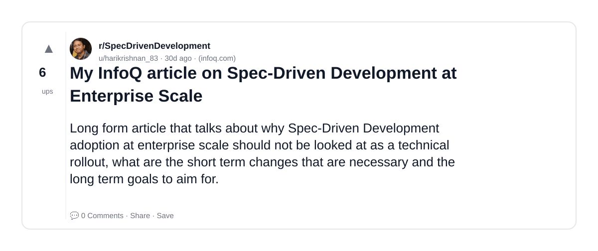

# Reddit Scout — vibe coding outreach AI sales automation prompt-driven

Run: 2026-03-23T11-26-46-783Z
Started: 2026-03-23T11:26:46.785Z
Output dir: /home/ubuntu/.openclaw/workspace-ce/users/1613832104/reddit-scout/vibe-coding-outreach-ai-sales-automation-prompt-driven/runs/2026-03-23T11-26-46-783Z

Config: topN=10 | subLimit=10 | kinds=top,hot,rising | time=week | limitPerListing=25
Search: vibe coding outreach AI sales automation prompt-driven (sort=top t=auto)

## Top terms (from titles + top comments)

- code (13)
- development (8)
- what (7)
- driven (6)
- spec (6)
- have (6)
- vibe (5)
- coding (5)
- claude (5)
- specs (5)
- projects (5)
- back (5)
- still (5)
- people (5)
- coded (4)
- about (4)
- well (4)
- agent (4)

## Viral content ideas (derived from these posts)

**1. Personal story → timeline + receipts**
- Hook: Hook with 1 line, then a 5-step timeline; end with the lesson and what you would do differently.

**2. My code got automated: what I automated back (tools + workflow)**
- Hook: Turn it into a before/after workflow post. Include exact tool stack + steps.

**3. Checklist: how to stay valuable when development hits your team**
- Hook: A numbered checklist (10 items). Make it practical: skills, portfolio, outreach, proof-of-work.

**4. Hot take: what isn't the problem — driven is**
- Hook: Contrarian framing. Back it with 2 examples from the top posts and 1 counterexample.

**5. Debunk thread: "AI will replace spec" vs what's actually happening**
- Hook: Use 3 claims → 3 rebuttals. Cite specific post patterns: layoffs, hiring freezes, role shifts.

**6. Salary/market reality: have vs vibe roles in 2026 (Reddit signals)**
- Hook: Summarize demand signals from comments: who is struggling, who is fine, why.

**7. "What would you do in 30 days?" layoff recovery plan (day-by-day)**
- Hook: 30-day plan: portfolio, interview loops, networking, mental health. Include a downloadable checklist.

**8. Mini-case study: 1 resume bullet → 1 proof project using coding**
- Hook: Show how to convert a vague resume claim into a measurable project + writeup.

**9. Community question: which tasks should *never* be delegated to AI?**
- Hook: Ask + give your own top 5. Encourage replies; add a poll if your platform supports it.

**10. Template post: "I used AI to do X, got Y result, here's the exact prompt"**
- Hook: Make it reproducible: prompt, inputs, outputs, gotchas.

**11. Data post: a quick scorecard of the top threads (ups, comments, ratio) + what it signals**
- Hook: Table or bullets; then 3 takeaways.

**12. Meme angle (if relevant): claude vs specs — job search edition**
- Hook: If your niche is not memes, skip memes; otherwise caption the pattern you saw in comments.

## Top posts (10) + cards

### 1) I'm a FE lead, and a new PM in the org wants to start pushing "vibe coded" slop to the my codebase.
- Subreddit: r/webdev
- Viral score: 137 | Ups: 460 | Comments: 241 | Upvote ratio: 91%
- Link: https://www.reddit.com/r/webdev/comments/1s0vcmt/im_a_fe_lead_and_a_new_pm_in_the_org_wants_to/
- Card (local): ./cards/1s0vcmt.png

### 2) Anthropic's research proves AI coding tools are secretly making developers worse.
- Subreddit: r/ClaudeAI
- Viral score: 87 | Ups: 1488 | Comments: 237 | Upvote ratio: 91%
- Link: https://www.reddit.com/r/ClaudeAI/comments/1rzmfyd/anthropics_research_proves_ai_coding_tools_are/
- Card (local): ./cards/1rzmfyd.png

### 3) My vibe coded 3D city hit 66K users and $953 revenue in 29 days. Here's what a solo dev + AI can do with $0 marketing.
- Subreddit: r/vibecoding
- Viral score: 21 | Ups: 487 | Comments: 125 | Upvote ratio: 86%
- Link: https://www.reddit.com/r/vibecoding/comments/1rz59g4/my_vibe_coded_3d_city_hit_66k_users_and_953/
- Card (local): ./cards/1rz59g4.png

### 4) Turns your CLI into a high-performance AI coding system. Everything Claude Code. OpenSource(87k+ ⭐)
- Subreddit: r/AskVibecoders
- Viral score: 18 | Ups: 839 | Comments: 35 | Upvote ratio: 98%
- Link: https://www.reddit.com/r/AskVibecoders/comments/1ry4esw/turns_your_cli_into_a_highperformance_ai_coding/
- Card (local): ./cards/1ry4esw.png

### 5) Vibe code so hard your entire waitlist is visible in frontend
- Subreddit: r/vibecoding
- Viral score: 16 | Ups: 572 | Comments: 51 | Upvote ratio: 97%
- Link: https://www.reddit.com/r/vibecoding/comments/1ryn86h/vibe_code_so_hard_your_entire_waitlist_is_visible/
- Card (local): ./cards/1ryn86h.png

### 6) Is Specs-Driven Development actually that useful, or just another hype cycle?
- Subreddit: r/SpecDrivenDevelopment
- Viral score: 2 | Ups: 25 | Comments: 17 | Upvote ratio: 100%
- Link: https://www.reddit.com/r/SpecDrivenDevelopment/comments/1rzuvuu/is_specsdriven_development_actually_that_useful/
- Card (local): ./cards/1rzuvuu.png

### 7) How Specs-Driven Development (SDD) Changed the Way I Think as a Developer
- Subreddit: r/SpecDrivenDevelopment
- Viral score: 1 | Ups: 41 | Comments: 12 | Upvote ratio: 94%
- Link: https://www.reddit.com/r/SpecDrivenDevelopment/comments/1ryxly9/how_specsdriven_development_sdd_changed_the_way_i/
- Card (local): ./cards/1ryxly9.png

### 8) Spec-driven development in practice — from goal hierarchy to AI implementation in 7 minutes
- Subreddit: r/SpecDrivenDevelopment
- Viral score: 0 | Ups: 3 | Comments: 2 | Upvote ratio: 100%
- Link: https://www.reddit.com/r/SpecDrivenDevelopment/comments/1rnhdqo/specdriven_development_in_practice_from_goal/
- Card (local): ./cards/1rnhdqo.png

### 9) Spec-Driven Development on Brownfield Projects
- Subreddit: r/SpecDrivenDevelopment
- Viral score: 0 | Ups: 4 | Comments: 0 | Upvote ratio: 84%
- Link: https://www.reddit.com/r/SpecDrivenDevelopment/comments/1rqqwqd/specdriven_development_on_brownfield_projects/
- Card (local): ./cards/1rqqwqd.png

### 10) My InfoQ article on Spec-Driven Development at Enterprise Scale
- Subreddit: r/SpecDrivenDevelopment
- Viral score: 0 | Ups: 6 | Comments: 0 | Upvote ratio: 100%
- Link: https://www.reddit.com/r/SpecDrivenDevelopment/comments/1rahxxj/my_infoq_article_on_specdriven_development_at/
- Card (local): ./cards/1rahxxj.png

