# Reddit Scout — Crime AI

Run: 2026-03-24T22-21-01-765Z
Started: 2026-03-24T22:21:01.765Z
Output dir: /home/ubuntu/.openclaw/workspace-ce/users/5122439348/reddit-scout/crime-ai/runs/2026-03-24T22-21-01-765Z

Config: topN=20 | subLimit=12 | kinds=top,hot,rising | time=week | limitPerListing=25
Search: Crime AI (sort=top t=auto)

## Top terms (from titles + top comments)

- like (20)
- what (15)
- have (15)
- even (14)
- them (13)
- sketch (11)
- make (11)
- about (10)
- character (9)
- some (9)
- trying (9)
- people (8)
- artist (7)
- same (7)
- will (7)
- look (7)
- going (6)
- which (6)

## Viral content ideas (derived from these posts)

**1. Personal story → timeline + receipts**
- Hook: Hook with 1 line, then a 5-step timeline; end with the lesson and what you would do differently.

**2. My like got automated: what I automated back (tools + workflow)**
- Hook: Turn it into a before/after workflow post. Include exact tool stack + steps.

**3. Checklist: how to stay valuable when what hits your team**
- Hook: A numbered checklist (10 items). Make it practical: skills, portfolio, outreach, proof-of-work.

**4. Hot take: have isn't the problem — even is**
- Hook: Contrarian framing. Back it with 2 examples from the top posts and 1 counterexample.

**5. Debunk thread: "AI will replace them" vs what's actually happening**
- Hook: Use 3 claims → 3 rebuttals. Cite specific post patterns: layoffs, hiring freezes, role shifts.

**6. Salary/market reality: sketch vs make roles in 2026 (Reddit signals)**
- Hook: Summarize demand signals from comments: who is struggling, who is fine, why.

**7. "What would you do in 30 days?" layoff recovery plan (day-by-day)**
- Hook: 30-day plan: portfolio, interview loops, networking, mental health. Include a downloadable checklist.

**8. Mini-case study: 1 resume bullet → 1 proof project using about**
- Hook: Show how to convert a vague resume claim into a measurable project + writeup.

**9. Community question: which tasks should *never* be delegated to AI?**
- Hook: Ask + give your own top 5. Encourage replies; add a poll if your platform supports it.

**10. Template post: "I used AI to do X, got Y result, here's the exact prompt"**
- Hook: Make it reproducible: prompt, inputs, outputs, gotchas.

**11. Data post: a quick scorecard of the top threads (ups, comments, ratio) + what it signals**
- Hook: Table or bullets; then 3 takeaways.

**12. Meme angle (if relevant): character vs some — job search edition**
- Hook: If your niche is not memes, skip memes; otherwise caption the pattern you saw in comments.

## Top posts (20) + cards

### 1) My Brother sells AI art for thousands and I dont know what to do
- Subreddit: r/antiai
- Viral score: 449 | Ups: 3364 | Comments: 1480 | Upvote ratio: 87%
- Link: https://www.reddit.com/r/antiai/comments/1s1grcp/my_brother_sells_ai_art_for_thousands_and_i_dont/
- Card (local): ./cards/1s1grcp.png

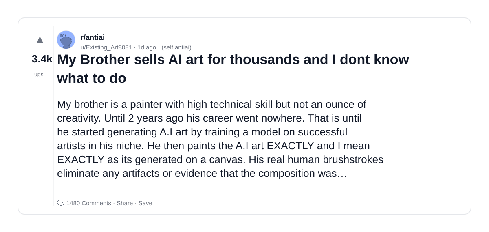

### 2) I would like to DEEPLY apologise for slandering the good name of character.ai
- Subreddit: r/CharacterAI
- Viral score: 159 | Ups: 752 | Comments: 59 | Upvote ratio: 97%
- Link: https://www.reddit.com/r/CharacterAI/comments/1s27qwk/i_would_like_to_deeply_apologise_for_slandering/
- Card (local): ./cards/1s27qwk.png

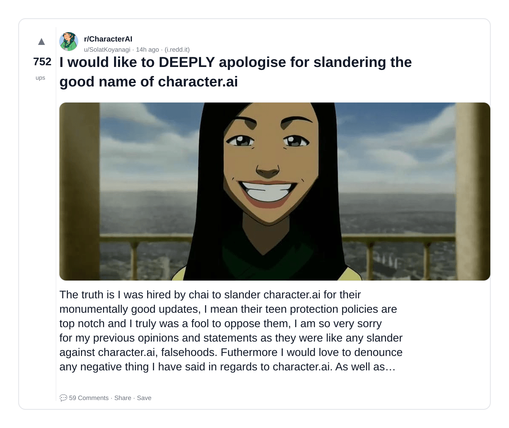

### 3) BBC confirms the US is responsible for the Minab school massacre that killed 175 people, mostly girls. The "advanced" AI targeting system used outdated coordinates to hit a base next door, ignoring satellite images showing kids playing in the courtyard. Absolute war crime.
- Subreddit: r/SECourses
- Viral score: 156 | Ups: 5070 | Comments: 515 | Upvote ratio: 97%
- Link: https://www.reddit.com/r/SECourses/comments/1rz94x7/bbc_confirms_the_us_is_responsible_for_the_minab/
- Card (local): ./cards/1rz94x7.png

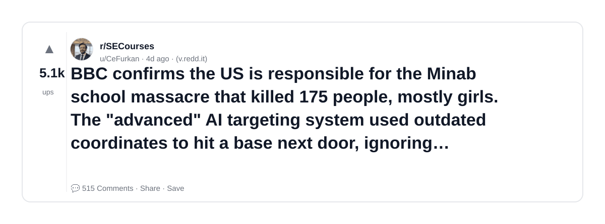

### 4) C.AI is going to die at this point
- Subreddit: r/CharacterAI
- Viral score: 127 | Ups: 48 | Comments: 18 | Upvote ratio: 90%
- Link: https://www.reddit.com/r/CharacterAI/comments/1s2pwii/cai_is_going_to_die_at_this_point/
- Card (local): ./cards/1s2pwii.png

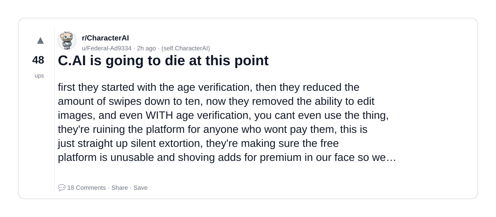

### 5) c.ai called me an ableist for this btw
- Subreddit: r/CharacterAI
- Viral score: 108 | Ups: 1389 | Comments: 64 | Upvote ratio: 99%
- Link: https://www.reddit.com/r/CharacterAI/comments/1s1lu62/cai_called_me_an_ableist_for_this_btw/
- Card (local): ./cards/1s1lu62.png

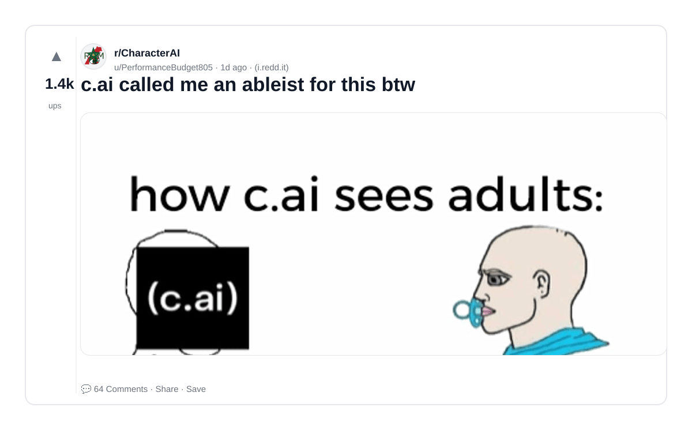

### 6) The ai bubble is slowly popping
- Subreddit: r/antiai
- Viral score: 100 | Ups: 4964 | Comments: 111 | Upvote ratio: 99%
- Link: https://www.reddit.com/r/antiai/comments/1ryun5n/the_ai_bubble_is_slowly_popping/
- Card (local): ./cards/1ryun5n.png

### 7) Good AI: The Scary Tapes FAQ
- Subreddit: r/distractible
- Viral score: 77 | Ups: 223 | Comments: 12 | Upvote ratio: 97%
- Link: https://www.reddit.com/r/distractible/comments/1s2i186/good_ai_the_scary_tapes_faq/
- Card (local): ./cards/1s2i186.png

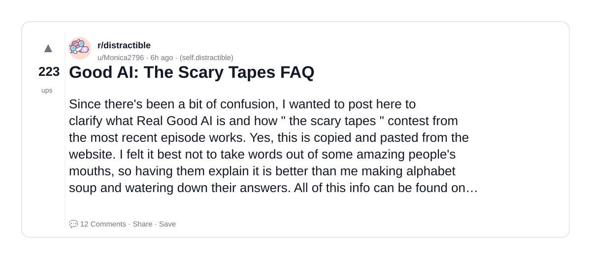

### 8) so, expressing hate on a random ai vid can farm downvotes, right?
- Subreddit: r/antiai
- Viral score: 74 | Ups: 175 | Comments: 33 | Upvote ratio: 97%
- Link: https://www.reddit.com/r/antiai/comments/1s2fmfj/so_expressing_hate_on_a_random_ai_vid_can_farm/
- Card (local): ./cards/1s2fmfj.png

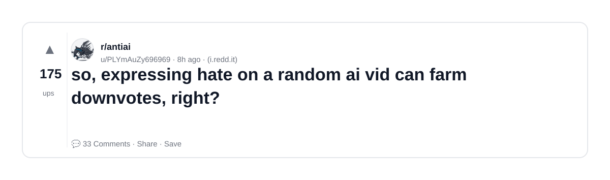

### 9) The Character.Ai lately:
- Subreddit: r/CharacterAI
- Viral score: 71 | Ups: 531 | Comments: 35 | Upvote ratio: 98%
- Link: https://www.reddit.com/r/CharacterAI/comments/1s21p3z/the_characterai_lately/
- Card (local): ./cards/1s21p3z.png

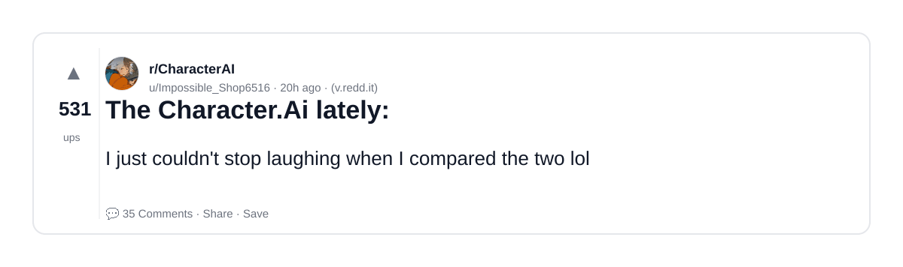

### 10) "AI is spreading misinformation!" {spreads misinformation}
- Subreddit: r/DefendingAIArt
- Viral score: 70 | Ups: 26 | Comments: 7 | Upvote ratio: 96%
- Link: https://www.reddit.com/r/DefendingAIArt/comments/1s2qh89/ai_is_spreading_misinformation_spreads/
- Card (local): ./cards/1s2qh89.png

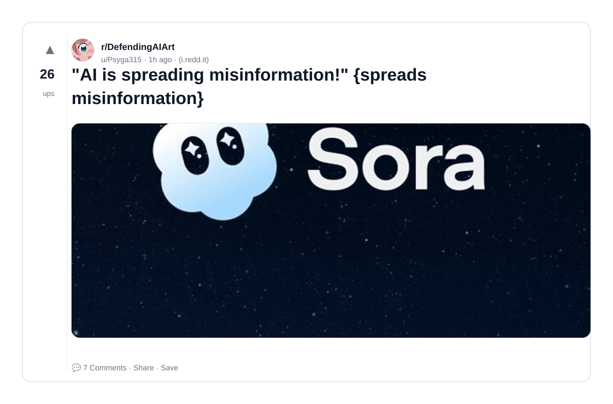

### 11) Most advanced AI model btw
- Subreddit: r/antiai
- Viral score: 70 | Ups: 2395 | Comments: 191 | Upvote ratio: 98%
- Link: https://www.reddit.com/r/antiai/comments/1rzn6z2/most_advanced_ai_model_btw/
- Card (local): ./cards/1rzn6z2.png

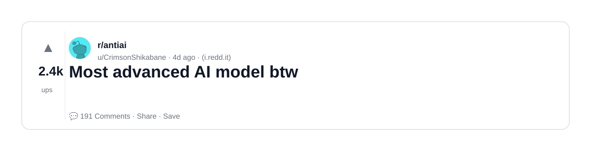

### 12) OP posts a sketch, asking for help with the pose. AI user comes in, pretending to be a wise older artist, stealing the show and bragging about his "art accolades."
- Subreddit: r/antiai
- Viral score: 67 | Ups: 50 | Comments: 7 | Upvote ratio: 100%
- Link: https://www.reddit.com/r/antiai/comments/1s2p8ar/op_posts_a_sketch_asking_for_help_with_the_pose/
- Card (local): ./cards/1s2p8ar.png

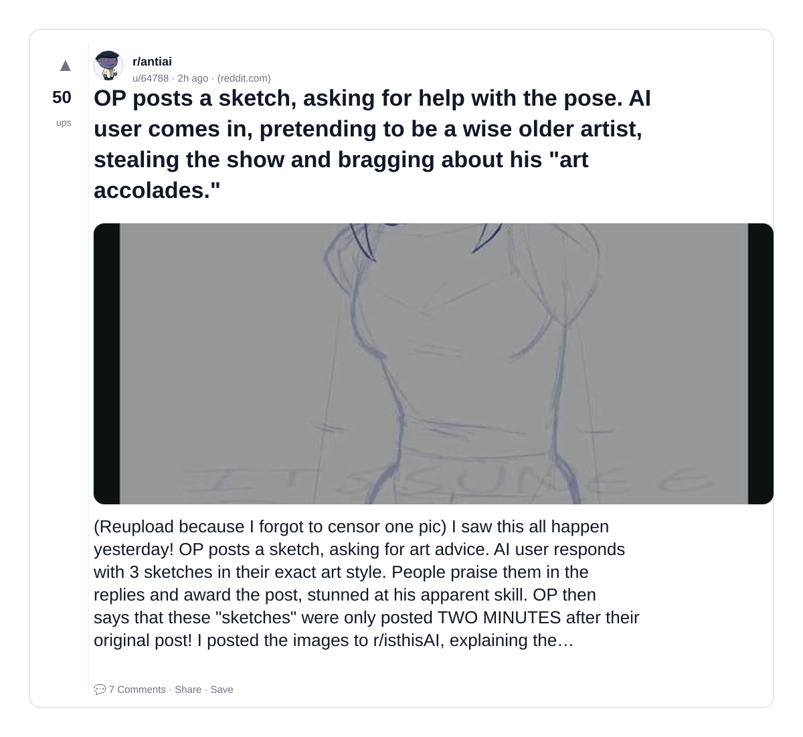

### 13) I'm fed up of how this makes me feel that c.ai is just racist.
- Subreddit: r/CharacterAI
- Viral score: 67 | Ups: 2788 | Comments: 169 | Upvote ratio: 97%
- Link: https://www.reddit.com/r/CharacterAI/comments/1rz8eqw/im_fed_up_of_how_this_makes_me_feel_that_cai_is/
- Card (local): ./cards/1rz8eqw.png

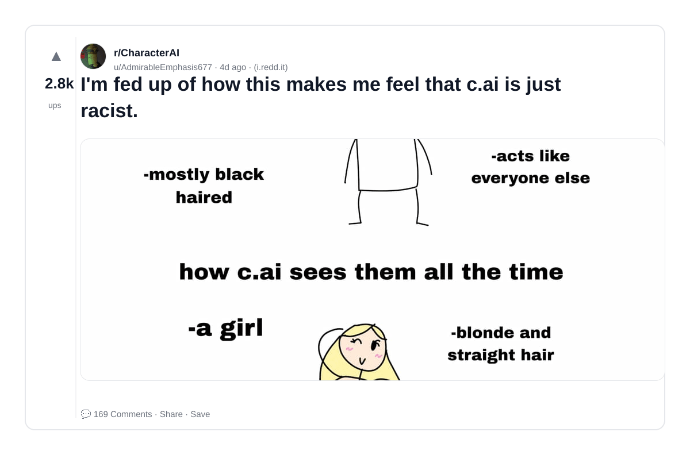

### 14) Strange new genre of AI videos flooding the web.
- Subreddit: r/antiai
- Viral score: 61 | Ups: 115 | Comments: 37 | Upvote ratio: 98%
- Link: https://www.reddit.com/r/antiai/comments/1s2g4l0/strange_new_genre_of_ai_videos_flooding_the_web/
- Card (local): ./cards/1s2g4l0.png

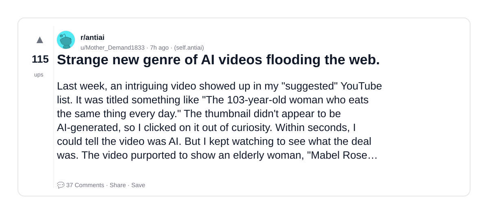

### 15) Hydrogen is the only element according to ai
- Subreddit: r/antiai
- Viral score: 49 | Ups: 66 | Comments: 23 | Upvote ratio: 91%
- Link: https://www.reddit.com/r/antiai/comments/1s2kkpc/hydrogen_is_the_only_element_according_to_ai/
- Card (local): ./cards/1s2kkpc.png

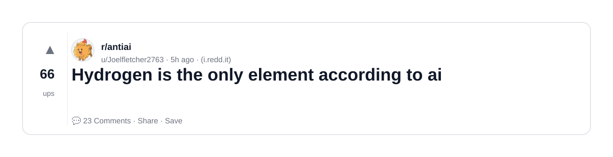

### 16) Let me just falsely accuse my neighbor using AI...
- Subreddit: r/antiai
- Viral score: 48 | Ups: 2589 | Comments: 40 | Upvote ratio: 97%
- Link: https://www.reddit.com/r/antiai/comments/1rz7khf/let_me_just_falsely_accuse_my_neighbor_using_ai/
- Card (local): ./cards/1rz7khf.png

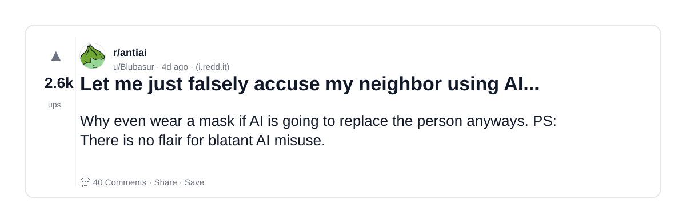

### 17) Work is forcing me to use AI, how do I cope?
- Subreddit: r/antiai
- Viral score: 45 | Ups: 31 | Comments: 25 | Upvote ratio: 96%
- Link: https://www.reddit.com/r/antiai/comments/1s2lrmt/work_is_forcing_me_to_use_ai_how_do_i_cope/
- Card (local): ./cards/1s2lrmt.png

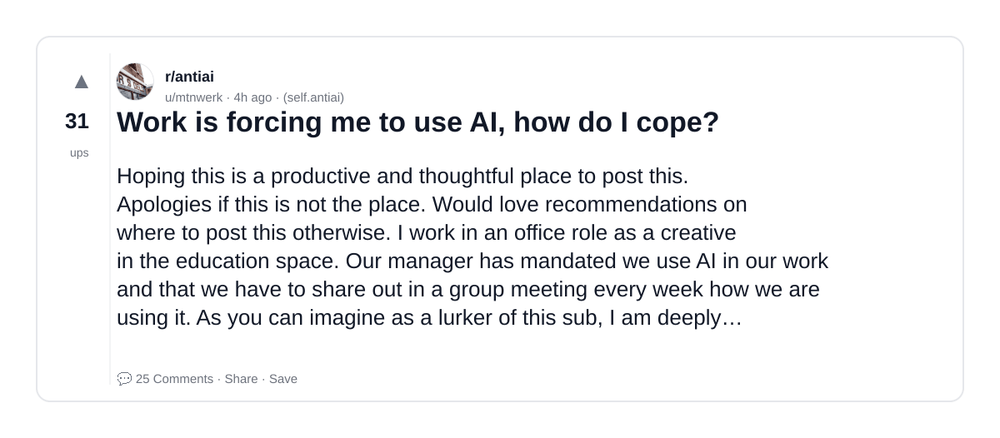

### 18) Agents before AI was a thing
- Subreddit: r/OpenAI
- Viral score: 41 | Ups: 1573 | Comments: 64 | Upvote ratio: 94%
- Link: https://www.reddit.com/r/OpenAI/comments/1rzxcw5/agents_before_ai_was_a_thing/
- Card (local): ./cards/1rzxcw5.png

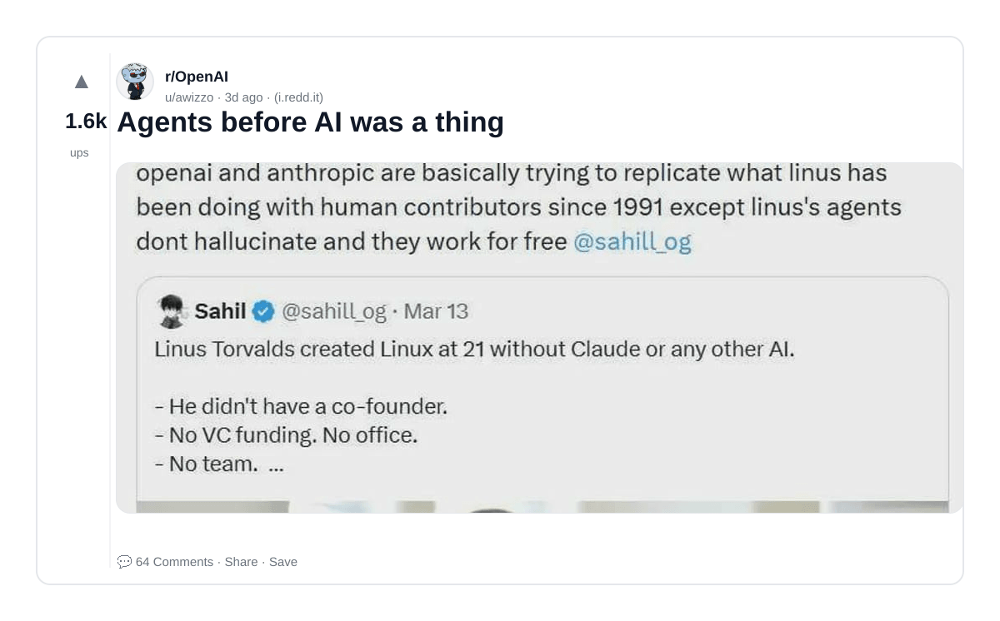

### 19) The bombing of a school by the United States, of which we still don’t know if AI was used, was a war crime. Anyone involved in that action needs to be treated like a war criminal. Too often civilians, more often children, pay the price of war.
- Subreddit: r/50501
- Viral score: 41 | Ups: 2873 | Comments: 28 | Upvote ratio: 100%
- Link: https://www.reddit.com/r/50501/comments/1ry4tk6/the_bombing_of_a_school_by_the_united_states_of/
- Card (local): ./cards/1ry4tk6.png

### 20) No matter where you go, whether it's the bustling streets or a cozy coffee shop, cameras and AI systems are constantly watching and observing. Like any tool, it raises a significant concern about the potential for both good and bad using this technology..
- Subreddit: r/ObscurePatentDangers
- Viral score: 39 | Ups: 1499 | Comments: 106 | Upvote ratio: 99%
- Link: https://www.reddit.com/r/ObscurePatentDangers/comments/1rzdqbo/no_matter_where_you_go_whether_its_the_bustling/
- Card (local): ./cards/1rzdqbo.png

