# Reddit Scout — Crime AI

Run: 2026-03-24T22-22-50-363Z
Started: 2026-03-24T22:22:50.364Z
Output dir: /home/ubuntu/.openclaw/workspace-ce/users/5122439348/reddit-scout/crime-ai/runs/2026-03-24T22-22-50-363Z

Config: topN=30 | subLimit=15 | kinds=top,hot,rising | time=month | limitPerListing=25
Search: Crime AI (sort=top t=auto)

## Top terms (from titles + top comments)

- like (17)
- about (13)
- what (13)
- have (12)
- sketch (11)
- them (11)
- people (10)
- character (8)
- even (8)
- help (7)
- artist (7)
- said (7)
- trying (7)
- some (7)
- think (7)
- more (6)
- both (6)
- over (6)

## Viral content ideas (derived from these posts)

**1. Personal story → timeline + receipts**
- Hook: Hook with 1 line, then a 5-step timeline; end with the lesson and what you would do differently.

**2. My like got automated: what I automated back (tools + workflow)**
- Hook: Turn it into a before/after workflow post. Include exact tool stack + steps.

**3. Checklist: how to stay valuable when about hits your team**
- Hook: A numbered checklist (10 items). Make it practical: skills, portfolio, outreach, proof-of-work.

**4. Hot take: what isn't the problem — have is**
- Hook: Contrarian framing. Back it with 2 examples from the top posts and 1 counterexample.

**5. Debunk thread: "AI will replace sketch" vs what's actually happening**
- Hook: Use 3 claims → 3 rebuttals. Cite specific post patterns: layoffs, hiring freezes, role shifts.

**6. Salary/market reality: them vs people roles in 2026 (Reddit signals)**
- Hook: Summarize demand signals from comments: who is struggling, who is fine, why.

**7. "What would you do in 30 days?" layoff recovery plan (day-by-day)**
- Hook: 30-day plan: portfolio, interview loops, networking, mental health. Include a downloadable checklist.

**8. Mini-case study: 1 resume bullet → 1 proof project using character**
- Hook: Show how to convert a vague resume claim into a measurable project + writeup.

**9. Community question: which tasks should *never* be delegated to AI?**
- Hook: Ask + give your own top 5. Encourage replies; add a poll if your platform supports it.

**10. Template post: "I used AI to do X, got Y result, here's the exact prompt"**
- Hook: Make it reproducible: prompt, inputs, outputs, gotchas.

**11. Data post: a quick scorecard of the top threads (ups, comments, ratio) + what it signals**
- Hook: Table or bullets; then 3 takeaways.

**12. Meme angle (if relevant): even vs help — job search edition**
- Hook: If your niche is not memes, skip memes; otherwise caption the pattern you saw in comments.

## Top posts (30) + cards

### 1) I would like to DEEPLY apologise for slandering the good name of character.ai
- Subreddit: r/CharacterAI
- Viral score: 158 | Ups: 754 | Comments: 59 | Upvote ratio: 97%
- Link: https://www.reddit.com/r/CharacterAI/comments/1s27qwk/i_would_like_to_deeply_apologise_for_slandering/
- Card (local): ./cards/1s27qwk.png

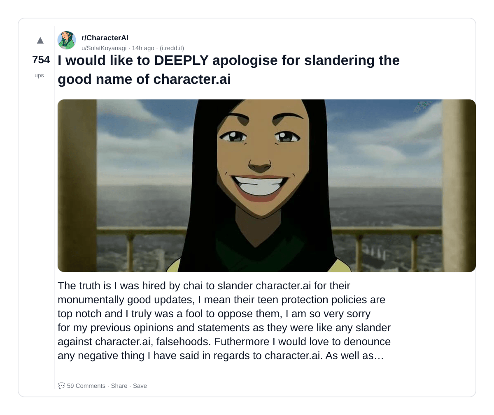

### 2) BBC confirms the US is responsible for the Minab school massacre that killed 175 people, mostly girls. The "advanced" AI targeting system used outdated coordinates to hit a base next door, ignoring satellite images showing kids playing in the courtyard. Absolute war crime.
- Subreddit: r/SECourses
- Viral score: 156 | Ups: 5075 | Comments: 515 | Upvote ratio: 97%
- Link: https://www.reddit.com/r/SECourses/comments/1rz94x7/bbc_confirms_the_us_is_responsible_for_the_minab/
- Card (local): ./cards/1rz94x7.png

### 3) C.AI is going to die at this point
- Subreddit: r/CharacterAI
- Viral score: 123 | Ups: 50 | Comments: 18 | Upvote ratio: 90%
- Link: https://www.reddit.com/r/CharacterAI/comments/1s2pwii/cai_is_going_to_die_at_this_point/
- Card (local): ./cards/1s2pwii.png

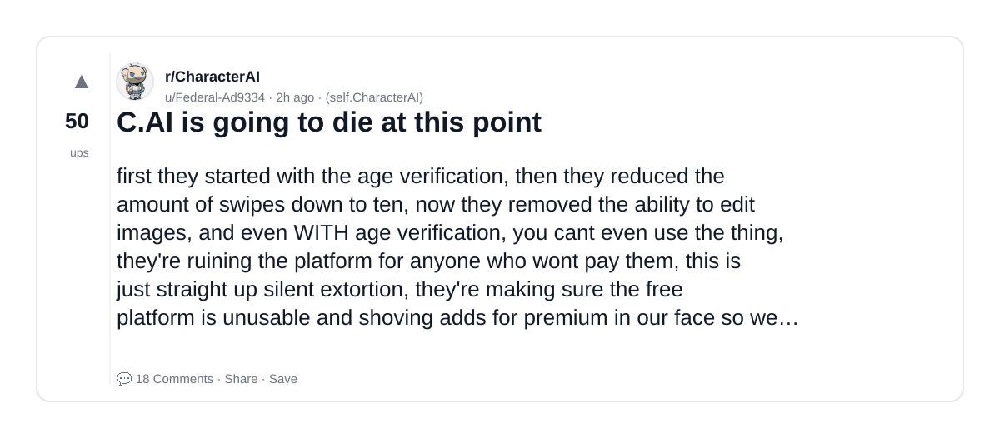

### 4) Anti-AI Art about 'Ragebait'
- Subreddit: r/antiai
- Viral score: 101 | Ups: 14813 | Comments: 985 | Upvote ratio: 96%
- Link: https://www.reddit.com/r/antiai/comments/1rpoktv/antiai_art_about_ragebait/
- Card (local): ./cards/1rpoktv.png

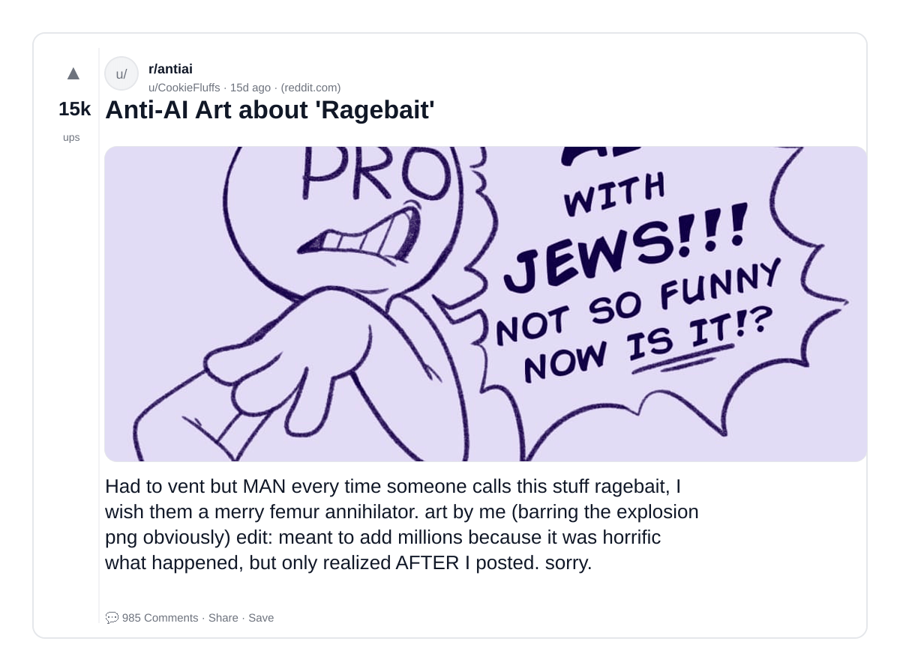

### 5) It might be time to ban AI.
- Subreddit: r/WorkReform
- Viral score: 100 | Ups: 11086 | Comments: 296 | Upvote ratio: 97%
- Link: https://www.reddit.com/r/WorkReform/comments/1rt6ccf/it_might_be_time_to_ban_ai/
- Card (local): ./cards/1rt6ccf.png

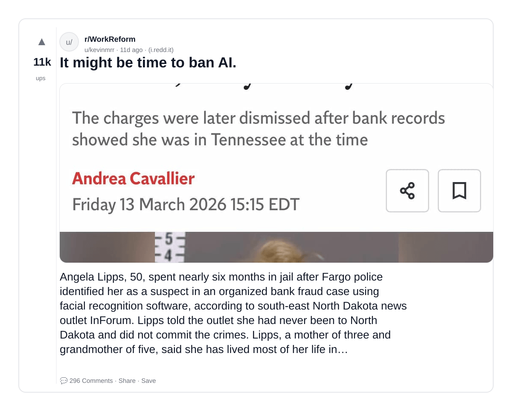

### 6) Loving this trend of AI bros getting a taste of their own medicine!
- Subreddit: r/antiai
- Viral score: 78 | Ups: 19504 | Comments: 532 | Upvote ratio: 97%
- Link: https://www.reddit.com/r/antiai/comments/1rjajcx/loving_this_trend_of_ai_bros_getting_a_taste_of/
- Card (local): ./cards/1rjajcx.png

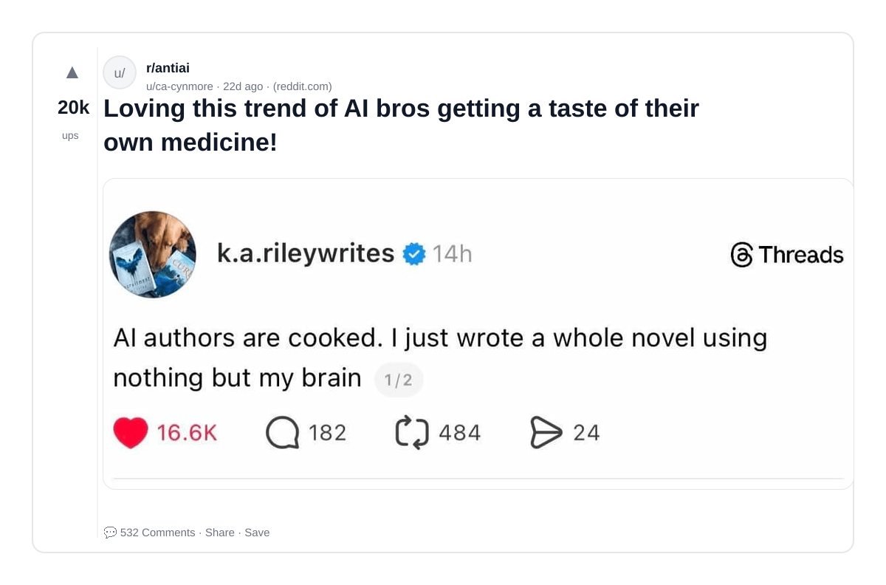

### 7) so, expressing hate on a random ai vid can farm downvotes, right?
- Subreddit: r/antiai
- Viral score: 75 | Ups: 174 | Comments: 33 | Upvote ratio: 97%
- Link: https://www.reddit.com/r/antiai/comments/1s2fmfj/so_expressing_hate_on_a_random_ai_vid_can_farm/
- Card (local): ./cards/1s2fmfj.png

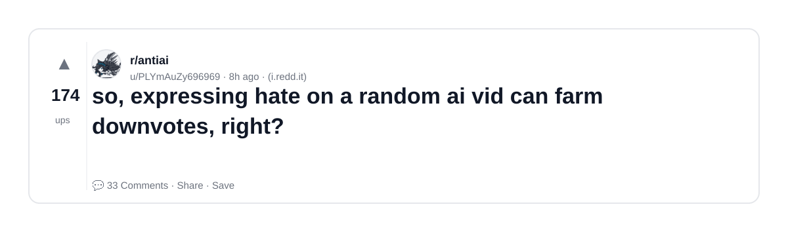

### 8) "AI is spreading misinformation!" {spreads misinformation}
- Subreddit: r/DefendingAIArt
- Viral score: 71 | Ups: 27 | Comments: 7 | Upvote ratio: 97%
- Link: https://www.reddit.com/r/DefendingAIArt/comments/1s2qh89/ai_is_spreading_misinformation_spreads/
- Card (local): ./cards/1s2qh89.png

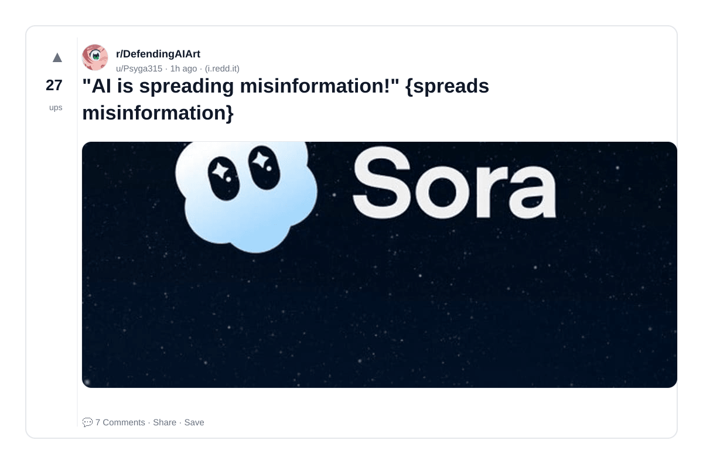

### 9) The Character.Ai lately:
- Subreddit: r/CharacterAI
- Viral score: 71 | Ups: 527 | Comments: 35 | Upvote ratio: 98%
- Link: https://www.reddit.com/r/CharacterAI/comments/1s21p3z/the_characterai_lately/
- Card (local): ./cards/1s21p3z.png

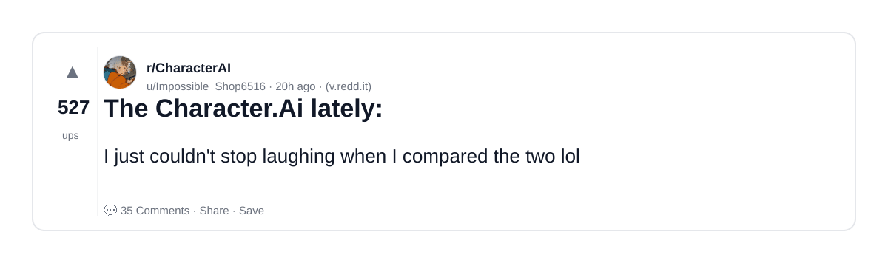

### 10) OP posts a sketch, asking for help with the pose. AI user comes in, pretending to be a wise older artist, stealing the show and bragging about his "art accolades."
- Subreddit: r/antiai
- Viral score: 68 | Ups: 48 | Comments: 7 | Upvote ratio: 99%
- Link: https://www.reddit.com/r/antiai/comments/1s2p8ar/op_posts_a_sketch_asking_for_help_with_the_pose/
- Card (local): ./cards/1s2p8ar.png

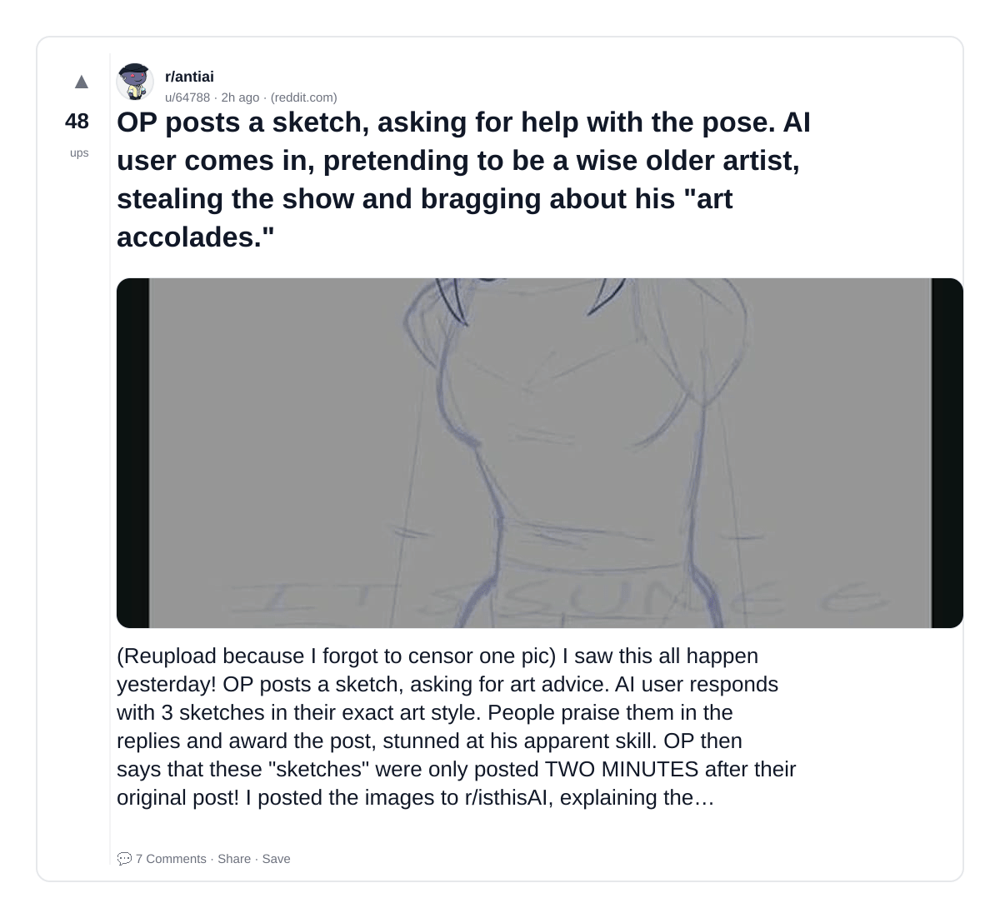

### 11) Aaaaand the AI Bro's keep losing!
- Subreddit: r/antiai
- Viral score: 65 | Ups: 15049 | Comments: 616 | Upvote ratio: 98%
- Link: https://www.reddit.com/r/antiai/comments/1rk1dp5/aaaaand_the_ai_bros_keep_losing/
- Card (local): ./cards/1rk1dp5.png

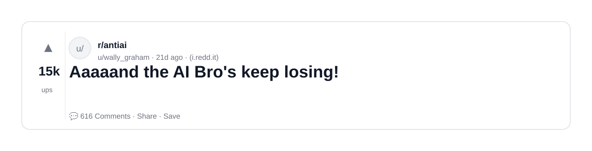

### 12) I'm fed up of how this makes me feel that c.ai is just racist.
- Subreddit: r/CharacterAI
- Viral score: 64 | Ups: 2793 | Comments: 169 | Upvote ratio: 97%
- Link: https://www.reddit.com/r/CharacterAI/comments/1rz8eqw/im_fed_up_of_how_this_makes_me_feel_that_cai_is/
- Card (local): ./cards/1rz8eqw.png

### 13) Strange new genre of AI videos flooding the web.
- Subreddit: r/antiai
- Viral score: 61 | Ups: 118 | Comments: 37 | Upvote ratio: 98%
- Link: https://www.reddit.com/r/antiai/comments/1s2g4l0/strange_new_genre_of_ai_videos_flooding_the_web/
- Card (local): ./cards/1s2g4l0.png

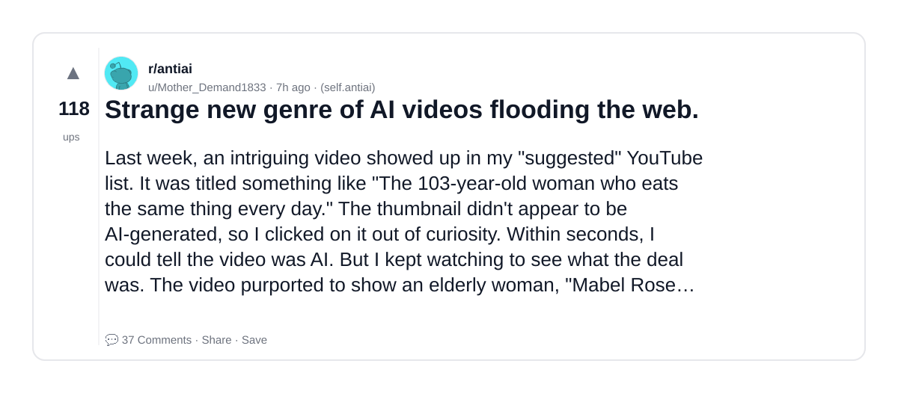

### 14) all they have to do is said "by clicking this button you are confirming you are above age 18 and its no longer our responsibility of your actions" or "anything our ai said to you to you do anything irl is not our responsibility but its your" or something but they roll out ID checking, vro🥀
- Subreddit: r/CharacterAI
- Viral score: 56 | Ups: 4226 | Comments: 297 | Upvote ratio: 97%
- Link: https://www.reddit.com/r/CharacterAI/comments/1rwcm7h/all_they_have_to_do_is_said_by_clicking_this/
- Card (local): ./cards/1rwcm7h.png

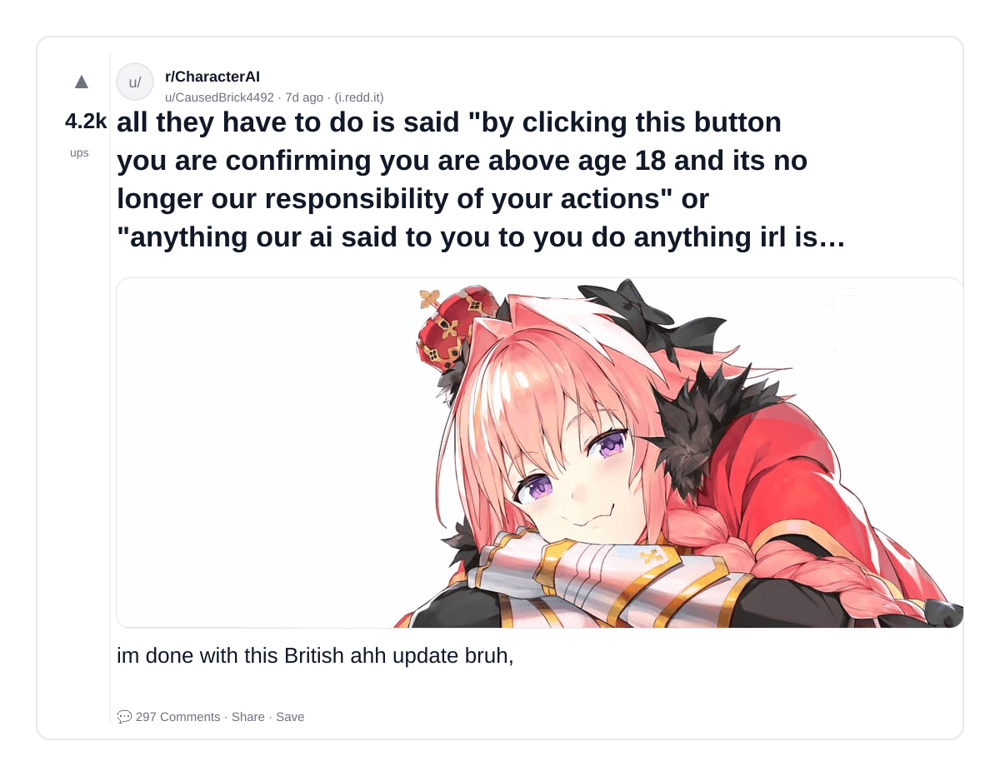

### 15) Hydrogen is the only element according to ai
- Subreddit: r/antiai
- Viral score: 49 | Ups: 64 | Comments: 23 | Upvote ratio: 90%
- Link: https://www.reddit.com/r/antiai/comments/1s2kkpc/hydrogen_is_the_only_element_according_to_ai/
- Card (local): ./cards/1s2kkpc.png

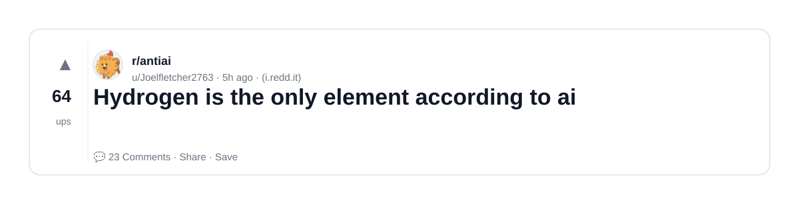

### 16) Work is forcing me to use AI, how do I cope?
- Subreddit: r/antiai
- Viral score: 43 | Ups: 31 | Comments: 25 | Upvote ratio: 98%
- Link: https://www.reddit.com/r/antiai/comments/1s2lrmt/work_is_forcing_me_to_use_ai_how_do_i_cope/
- Card (local): ./cards/1s2lrmt.png

### 17) The bombing of a school by the United States, of which we still don’t know if AI was used, was a war crime. Anyone involved in that action needs to be treated like a war criminal. Too often civilians, more often children, pay the price of war.
- Subreddit: r/50501
- Viral score: 41 | Ups: 2872 | Comments: 28 | Upvote ratio: 100%
- Link: https://www.reddit.com/r/50501/comments/1ry4tk6/the_bombing_of_a_school_by_the_united_states_of/
- Card (local): ./cards/1ry4tk6.png

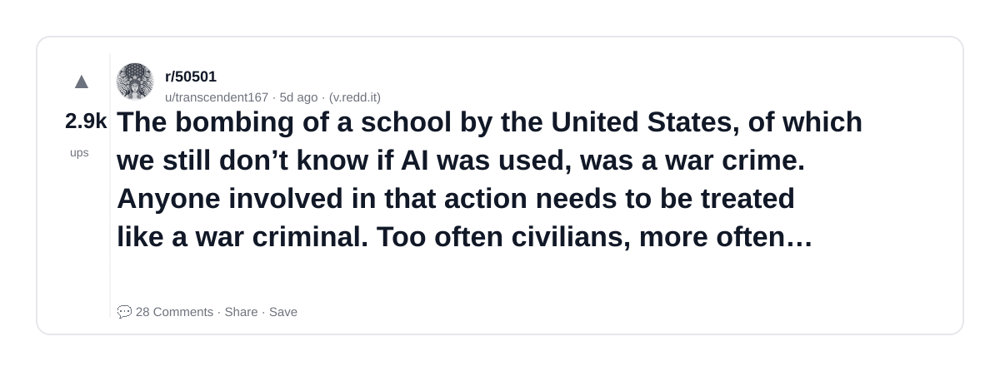

### 18) Agents before AI was a thing
- Subreddit: r/OpenAI
- Viral score: 39 | Ups: 1581 | Comments: 64 | Upvote ratio: 94%
- Link: https://www.reddit.com/r/OpenAI/comments/1rzxcw5/agents_before_ai_was_a_thing/
- Card (local): ./cards/1rzxcw5.png

### 19) No matter where you go, whether it's the bustling streets or a cozy coffee shop, cameras and AI systems are constantly watching and observing. Like any tool, it raises a significant concern about the potential for both good and bad using this technology..
- Subreddit: r/ObscurePatentDangers
- Viral score: 39 | Ups: 1503 | Comments: 106 | Upvote ratio: 99%
- Link: https://www.reddit.com/r/ObscurePatentDangers/comments/1rzdqbo/no_matter_where_you_go_whether_its_the_bustling/
- Card (local): ./cards/1rzdqbo.png

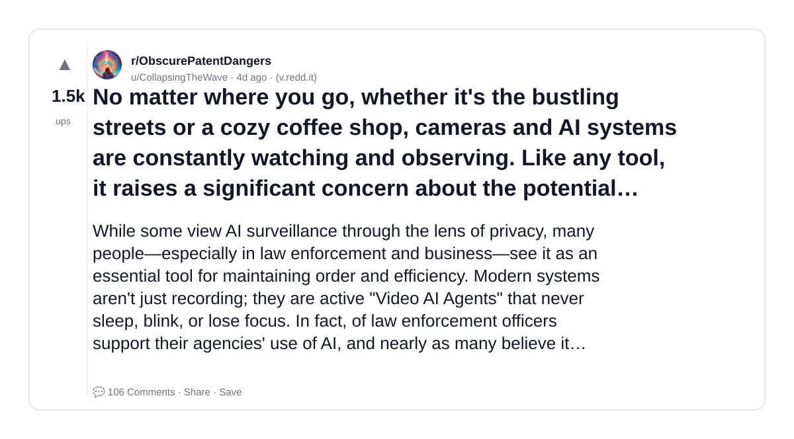

### 20) C.ai is cooked
- Subreddit: r/CharacterAI
- Viral score: 36 | Ups: 18 | Comments: 3 | Upvote ratio: 91%
- Link: https://www.reddit.com/r/CharacterAI/comments/1s2qjeo/cai_is_cooked/
- Card (local): ./cards/1s2qjeo.png

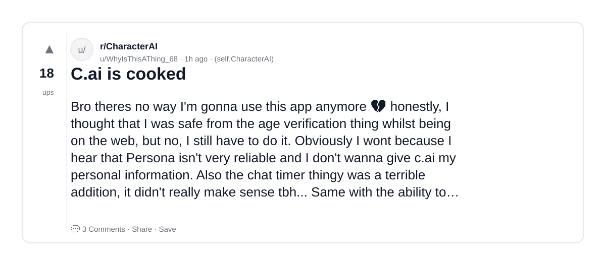

### 21) Ado a Japanese singer known for not showing her face is trying to be leaked through AI
- Subreddit: r/antiai
- Viral score: 29 | Ups: 9541 | Comments: 555 | Upvote ratio: 95%
- Link: https://www.reddit.com/r/antiai/comments/1rdisrj/ado_a_japanese_singer_known_for_not_showing_her/
- Card (local): ./cards/1rdisrj.png

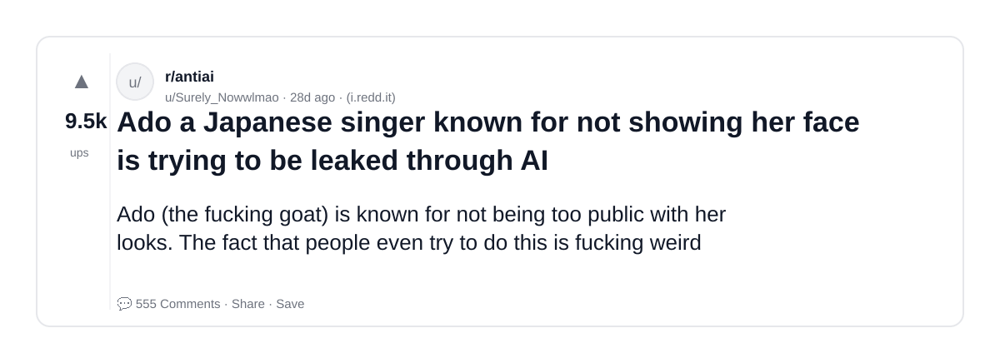

### 22) Three companies shipped "AI agent on your desktop" in the same two weeks. That's not a coincidence.
- Subreddit: r/artificial
- Viral score: 27 | Ups: 46 | Comments: 49 | Upvote ratio: 73%
- Link: https://www.reddit.com/r/artificial/comments/1s2ddgb/three_companies_shipped_ai_agent_on_your_desktop/
- Card (local): ./cards/1s2ddgb.png

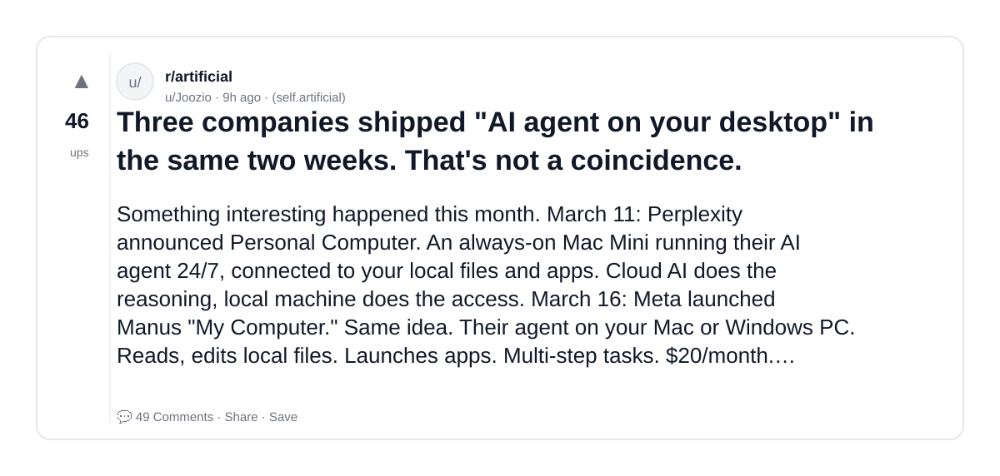

### 23) Ch.ai when the community gets fed up with these updates
- Subreddit: r/CharacterAI
- Viral score: 26 | Ups: 39 | Comments: 1 | Upvote ratio: 98%
- Link: https://www.reddit.com/r/CharacterAI/comments/1s2omap/chai_when_the_community_gets_fed_up_with_these/
- Card (local): ./cards/1s2omap.png

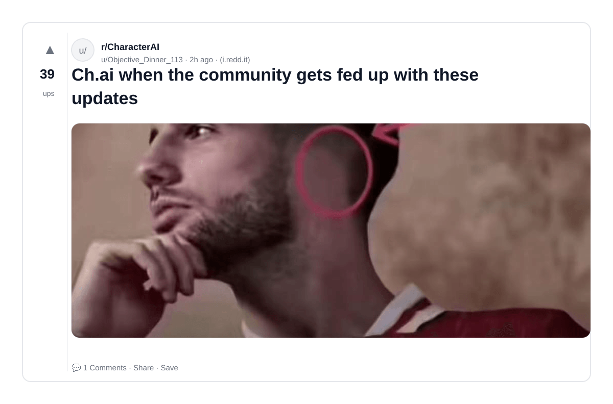

### 24) AI identified and helped jail a woman over 1,000 miles away who had nothing to do with the crime
- Subreddit: r/sadcringe
- Viral score: 21 | Ups: 1968 | Comments: 52 | Upvote ratio: 99%
- Link: https://www.reddit.com/r/sadcringe/comments/1rvxqha/ai_identified_and_helped_jail_a_woman_over_1000/
- Card (local): ./cards/1rvxqha.png

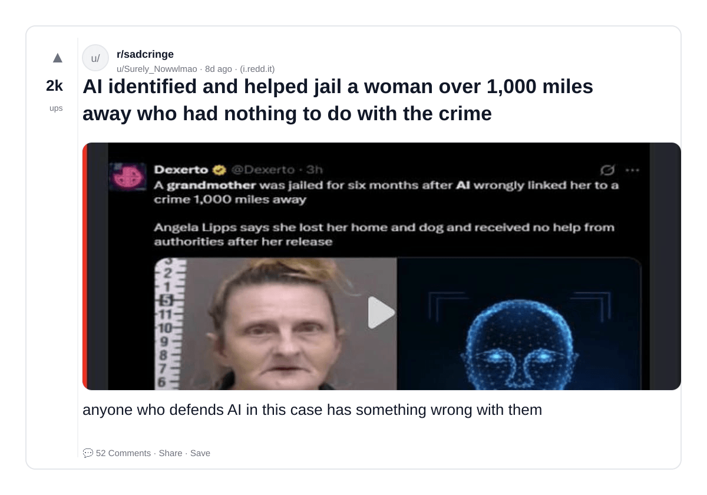

### 25) Andrej Karpathy's autonomous AI research agent ran 700 experiments in 2 days and gave a glimpse of where AI is heading
- Subreddit: r/artificial
- Viral score: 20 | Ups: 243 | Comments: 71 | Upvote ratio: 85%
- Link: https://www.reddit.com/r/artificial/comments/1s1b1zm/andrej_karpathys_autonomous_ai_research_agent_ran/
- Card (local): ./cards/1s1b1zm.png

### 26) Very funny how antis say "We can always tell", yet from my other account I've posted dozens of AI-generated artworks on their subs, while pretending I drew them. Guess what? Literally nobody noticed, and a lot of people were saying how good my art is.
- Subreddit: r/DefendingAIArt
- Viral score: 20 | Ups: 5 | Comments: 5 | Upvote ratio: 86%
- Link: https://www.reddit.com/r/DefendingAIArt/comments/1s2qe2j/very_funny_how_antis_say_we_can_always_tell_yet/
- Card (local): ./cards/1s2qe2j.png

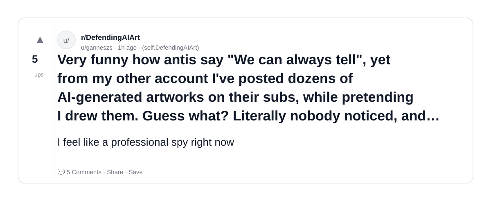

### 27) Mark Zuckerberg builds AI CEO to help him run Meta
- Subreddit: r/artificial
- Viral score: 18 | Ups: 110 | Comments: 73 | Upvote ratio: 93%
- Link: https://www.reddit.com/r/artificial/comments/1s1qk1c/mark_zuckerberg_builds_ai_ceo_to_help_him_run_meta/
- Card (local): ./cards/1s1qk1c.png

### 28) It’s just embarrassing sharing an internet with these parroting freaks. We knew this would come about, with AI, and all they do is parrot to death.
- Subreddit: r/DefendingAIArt
- Viral score: 18 | Ups: 82 | Comments: 7 | Upvote ratio: 98%
- Link: https://www.reddit.com/r/DefendingAIArt/comments/1s2c430/its_just_embarrassing_sharing_an_internet_with/
- Card (local): ./cards/1s2c430.png

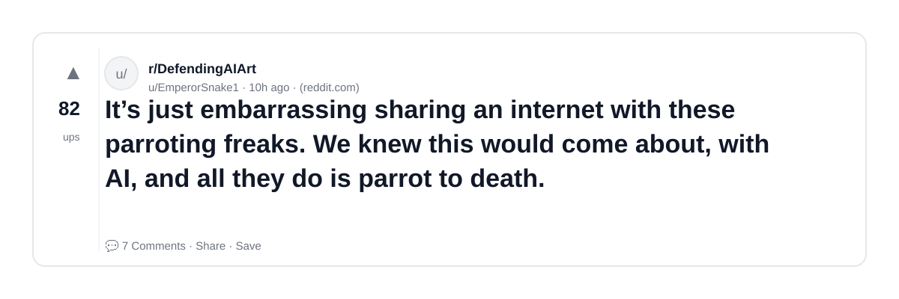

### 29) AI error or not, Iran school bombing is a permanent stain on America’s soul - A debate on AI in warfare obscures the truth about an Iran school bombing. U.S. humans are to blame for this war crime.
- Subreddit: r/politics
- Viral score: 17 | Ups: 2707 | Comments: 222 | Upvote ratio: 98%
- Link: https://www.reddit.com/r/politics/comments/1rp3oby/ai_error_or_not_iran_school_bombing_is_a/
- Card (local): ./cards/1rp3oby.png

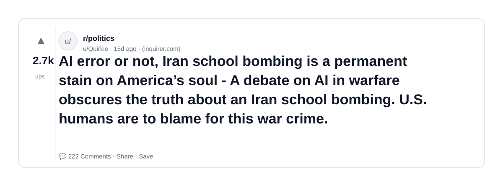

### 30) GOODBYE C.AI
- Subreddit: r/CharacterAI
- Viral score: 14 | Ups: 3669 | Comments: 768 | Upvote ratio: 94%
- Link: https://www.reddit.com/r/CharacterAI/comments/1rfjmhw/goodbye_cai/
- Card (local): ./cards/1rfjmhw.png

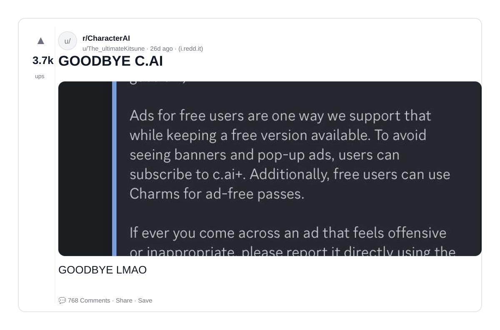
