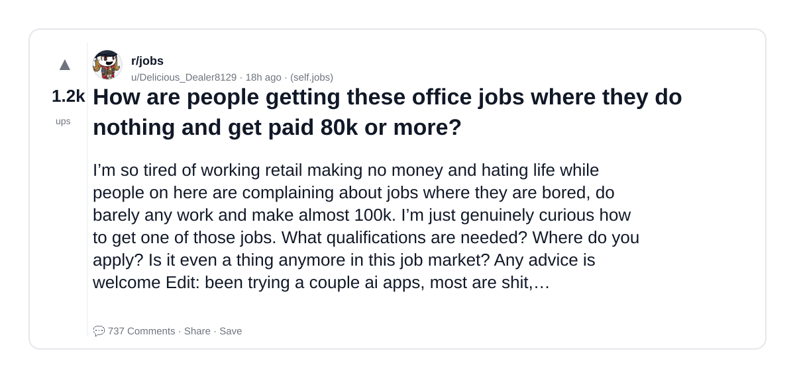
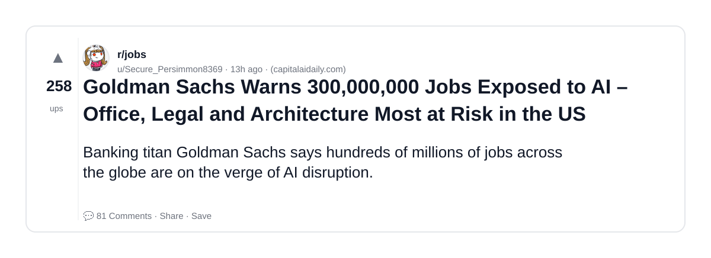
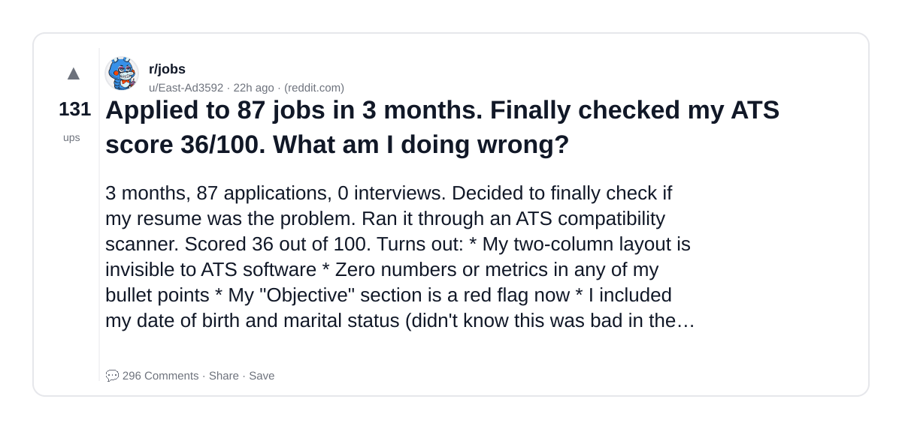
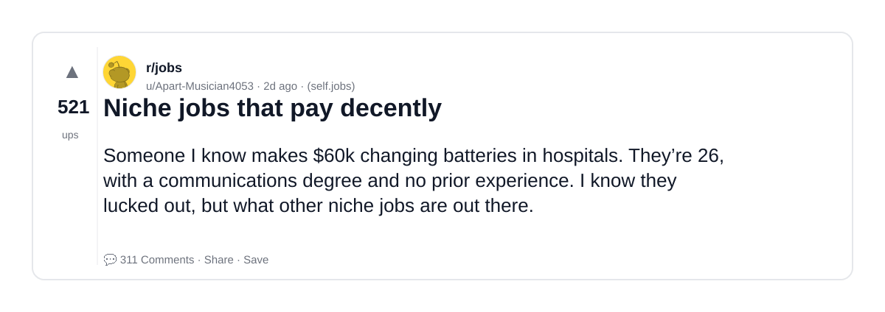
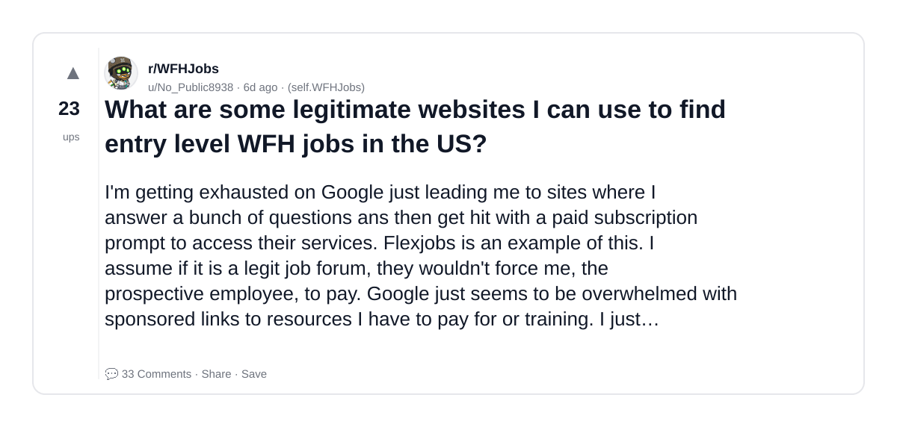
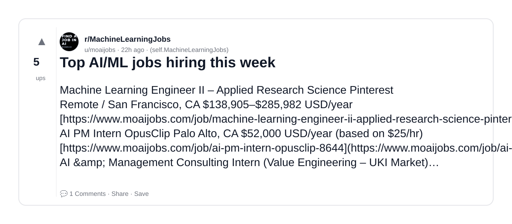
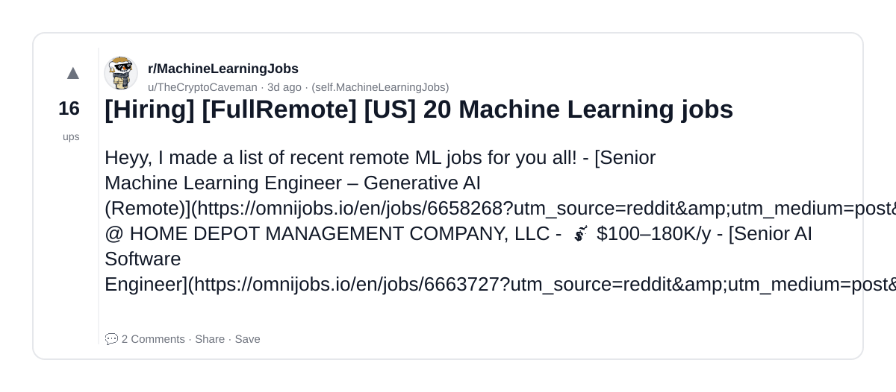
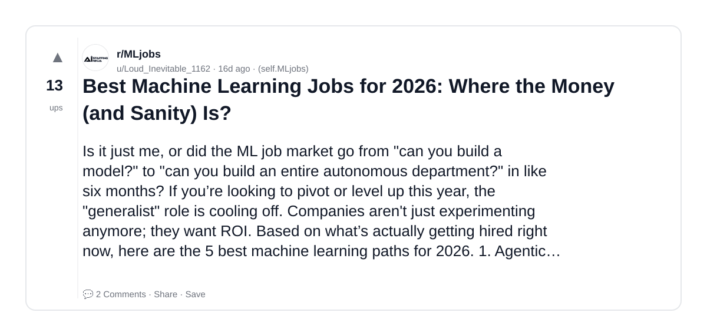

# Reddit Scout — ML and Jobs

Run: 2026-03-21T13-27-37-065Z
Started: 2026-03-21T13:27:37.065Z
Output dir: /home/ubuntu/.openclaw/workspace-ce/users/5122439348/reddit-scout/ml-and-jobs/runs/2026-03-21T13-27-37-065Z

Config: topN=10 | subLimit=10 | kinds=top,hot,rising | time=week | limitPerListing=25
Search: ML and Jobs (sort=top t=auto)

## Top terms (from titles + top comments)

- jobs (16)
- have (11)
- need (10)
- like (10)
- post (7)
- hiring (6)
- about (6)
- work (6)
- what (5)
- companies (5)
- into (5)
- every (5)
- skills (5)
- people (4)
- paid (4)
- more (4)
- most (4)
- doing (4)

## Viral content ideas (derived from these posts)

**1. Personal story → timeline + receipts**
- Hook: Hook with 1 line, then a 5-step timeline; end with the lesson and what you would do differently.

**2. My jobs got automated: what I automated back (tools + workflow)**
- Hook: Turn it into a before/after workflow post. Include exact tool stack + steps.

**3. Checklist: how to stay valuable when have hits your team**
- Hook: A numbered checklist (10 items). Make it practical: skills, portfolio, outreach, proof-of-work.

**4. Hot take: need isn't the problem — like is**
- Hook: Contrarian framing. Back it with 2 examples from the top posts and 1 counterexample.

**5. Debunk thread: "AI will replace post" vs what's actually happening**
- Hook: Use 3 claims → 3 rebuttals. Cite specific post patterns: layoffs, hiring freezes, role shifts.

**6. Salary/market reality: hiring vs about roles in 2026 (Reddit signals)**
- Hook: Summarize demand signals from comments: who is struggling, who is fine, why.

**7. "What would you do in 30 days?" layoff recovery plan (day-by-day)**
- Hook: 30-day plan: portfolio, interview loops, networking, mental health. Include a downloadable checklist.

**8. Mini-case study: 1 resume bullet → 1 proof project using work**
- Hook: Show how to convert a vague resume claim into a measurable project + writeup.

**9. Community question: which tasks should *never* be delegated to AI?**
- Hook: Ask + give your own top 5. Encourage replies; add a poll if your platform supports it.

**10. Template post: "I used AI to do X, got Y result, here's the exact prompt"**
- Hook: Make it reproducible: prompt, inputs, outputs, gotchas.

**11. Data post: a quick scorecard of the top threads (ups, comments, ratio) + what it signals**
- Hook: Table or bullets; then 3 takeaways.

**12. Meme angle (if relevant): what vs companies — job search edition**
- Hook: If your niche is not memes, skip memes; otherwise caption the pattern you saw in comments.

## Top posts (10) + cards

### 1) How are people getting these office jobs where they do nothing and get paid 80k or more?
- Subreddit: r/jobs
- Viral score: 416 | Ups: 1239 | Comments: 737 | Upvote ratio: 92%
- Link: https://www.reddit.com/r/jobs/comments/1rz5hgs/how_are_people_getting_these_office_jobs_where/
- Card (local): ./cards/1rz5hgs.png

### 2) Goldman Sachs Warns 300,000,000 Jobs Exposed to AI – Office, Legal and Architecture Most at Risk in the US
- Subreddit: r/jobs
- Viral score: 73 | Ups: 258 | Comments: 81 | Upvote ratio: 91%
- Link: https://www.reddit.com/r/jobs/comments/1rzcnjp/goldman_sachs_warns_300000000_jobs_exposed_to_ai/
- Card (local): ./cards/1rzcnjp.png

### 3) Applied to 87 jobs in 3 months. Finally checked my ATS score 36/100. What am I doing wrong?
- Subreddit: r/jobs
- Viral score: 61 | Ups: 131 | Comments: 296 | Upvote ratio: 80%
- Link: https://www.reddit.com/r/jobs/comments/1ryywi7/applied_to_87_jobs_in_3_months_finally_checked_my/
- Card (local): ./cards/1ryywi7.png

### 4) Niche jobs that pay decently
- Subreddit: r/jobs
- Viral score: 55 | Ups: 521 | Comments: 311 | Upvote ratio: 95%
- Link: https://www.reddit.com/r/jobs/comments/1rycj7v/niche_jobs_that_pay_decently/
- Card (local): ./cards/1rycj7v.png

### 5) Why all Lowe's jobs are temporary?
- Subreddit: r/jobs
- Viral score: 13 | Ups: 1 | Comments: 1 | Upvote ratio: 100%
- Link: https://www.reddit.com/r/jobs/comments/1rzqy8c/why_all_lowes_jobs_are_temporary/
- Card (local): ./cards/1rzqy8c.png

### 6) What are some legitimate websites I can use to find entry level WFH jobs in the US?
- Subreddit: r/WFHJobs
- Viral score: 1 | Ups: 23 | Comments: 33 | Upvote ratio: 96%
- Link: https://www.reddit.com/r/WFHJobs/comments/1ru97v2/what_are_some_legitimate_websites_i_can_use_to/
- Card (local): ./cards/1ru97v2.png

### 7) Top AI/ML jobs hiring this week
- Subreddit: r/MachineLearningJobs
- Viral score: 0 | Ups: 5 | Comments: 1 | Upvote ratio: 86%
- Link: https://www.reddit.com/r/MachineLearningJobs/comments/1ryzxvb/top_aiml_jobs_hiring_this_week/
- Card (local): ./cards/1ryzxvb.png

### 8) [Hiring] [FullRemote] [US] 20 Machine Learning jobs
- Subreddit: r/MachineLearningJobs
- Viral score: 0 | Ups: 16 | Comments: 2 | Upvote ratio: 100%
- Link: https://www.reddit.com/r/MachineLearningJobs/comments/1rxemde/hiring_fullremote_us_20_machine_learning_jobs/
- Card (local): ./cards/1rxemde.png

### 9) Best Machine Learning Jobs for 2026: Where the Money (and Sanity) Is?
- Subreddit: r/MLjobs
- Viral score: 0 | Ups: 13 | Comments: 2 | Upvote ratio: 100%
- Link: https://www.reddit.com/r/MLjobs/comments/1rld49y/best_machine_learning_jobs_for_2026_where_the/
- Card (local): ./cards/1rld49y.png

### 10) Introducing a way to post jobs and have them featured on foo🦍
- Subreddit: r/ai_ml_jobs
- Viral score: 0 | Ups: 3 | Comments: 0 | Upvote ratio: 100%
- Link: https://www.reddit.com/r/ai_ml_jobs/comments/1rpsb1r/introducing_a_way_to_post_jobs_and_have_them/
- Card (local): ./cards/1rpsb1r.png

