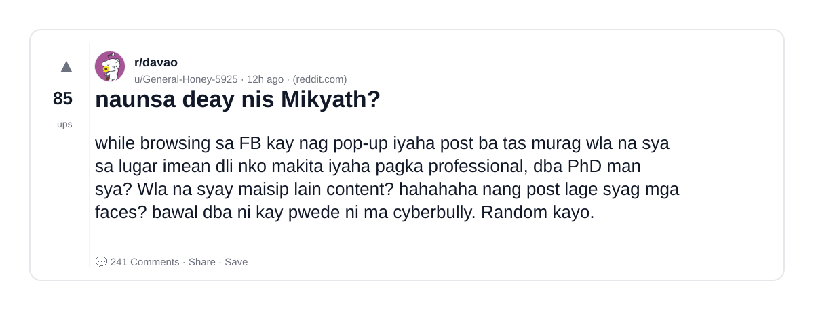
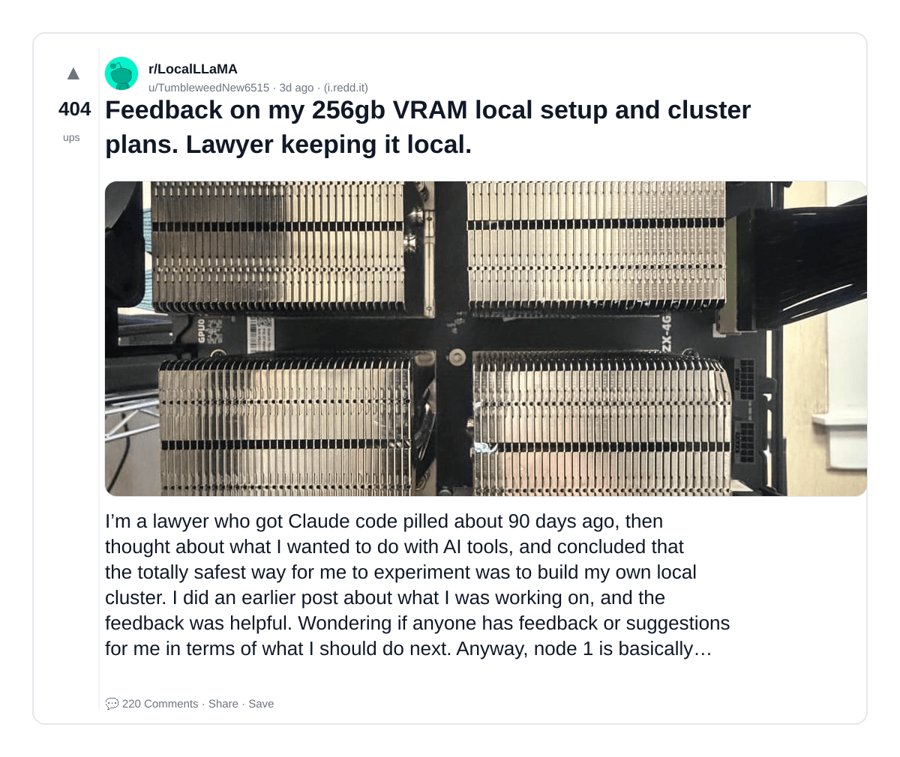
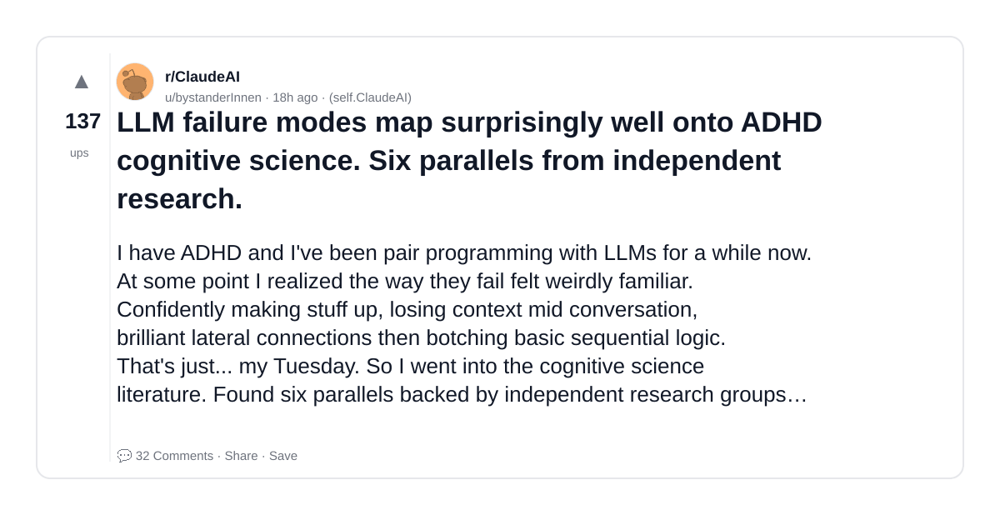
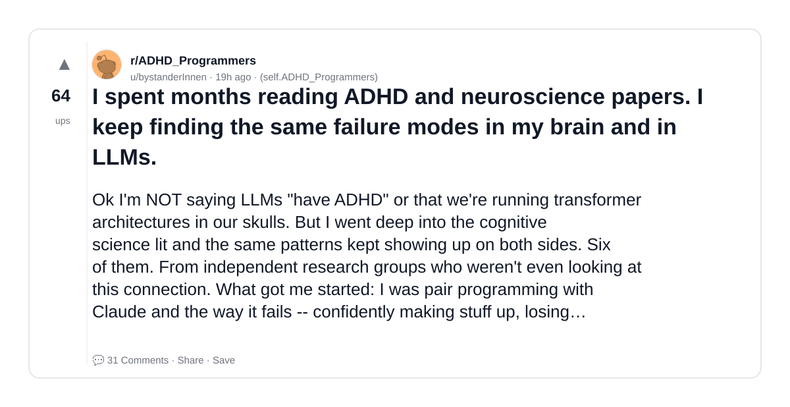
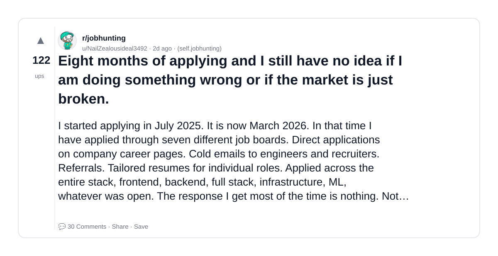
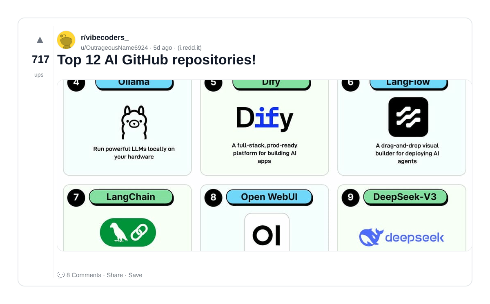
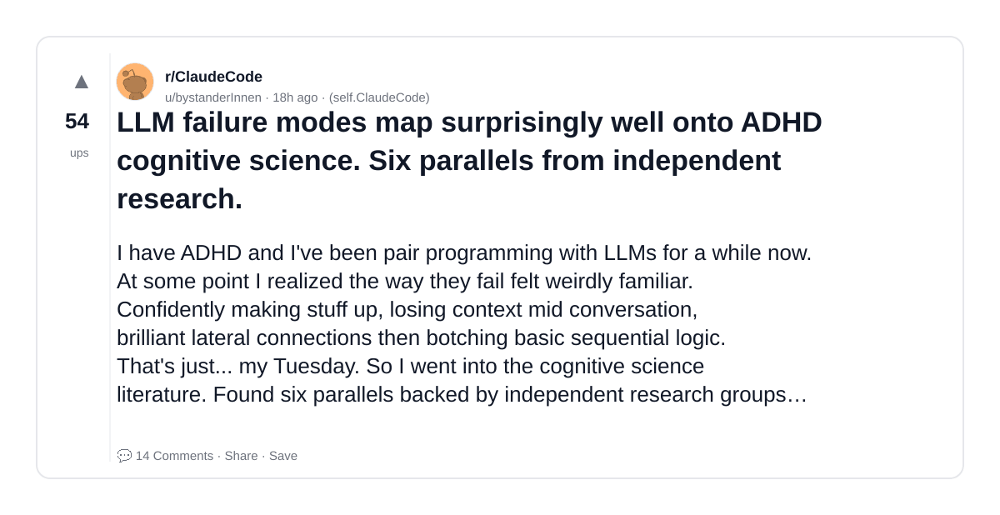
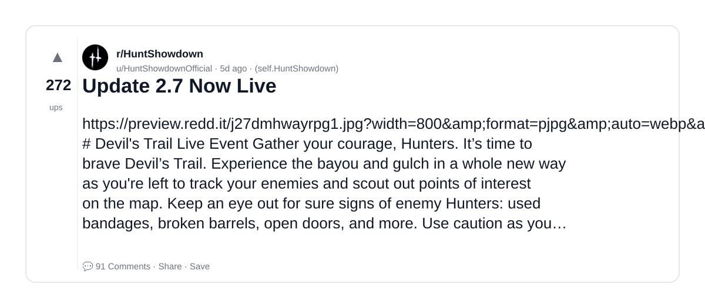
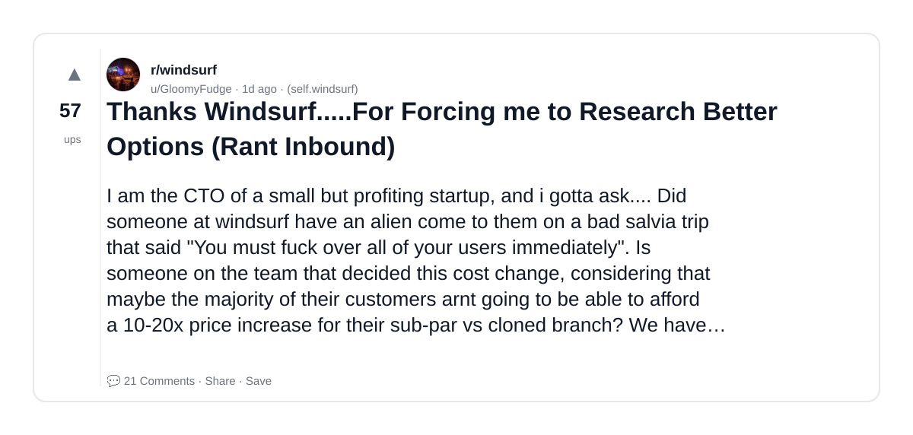
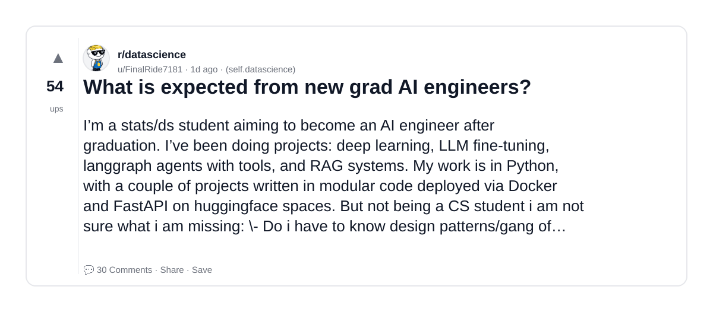

# Reddit Scout — RAG and AI

Run: 2026-03-23T15-18-44-273Z
Started: 2026-03-23T15:18:44.277Z
Output dir: /home/ubuntu/.openclaw/workspace-ce/users/5122439348/reddit-scout/rag-and-ai/runs/2026-03-23T15-18-44-273Z

Config: topN=10 | subLimit=8 | kinds=top,hot,rising | time=week | limitPerListing=25
Search: RAG and AI (sort=top t=auto)

## Top terms (from titles + top comments)

- have (16)
- what (12)
- adhd (9)
- some (8)
- more (8)
- llms (7)
- even (6)
- people (6)
- make (6)
- agents (6)
- well (5)
- keep (5)
- windsurf (5)
- into (5)
- also (5)
- like (5)
- will (5)
- other (5)

## Viral content ideas (derived from these posts)

**1. Personal story → timeline + receipts**
- Hook: Hook with 1 line, then a 5-step timeline; end with the lesson and what you would do differently.

**2. My have got automated: what I automated back (tools + workflow)**
- Hook: Turn it into a before/after workflow post. Include exact tool stack + steps.

**3. Checklist: how to stay valuable when what hits your team**
- Hook: A numbered checklist (10 items). Make it practical: skills, portfolio, outreach, proof-of-work.

**4. Hot take: adhd isn't the problem — some is**
- Hook: Contrarian framing. Back it with 2 examples from the top posts and 1 counterexample.

**5. Debunk thread: "AI will replace more" vs what's actually happening**
- Hook: Use 3 claims → 3 rebuttals. Cite specific post patterns: layoffs, hiring freezes, role shifts.

**6. Salary/market reality: llms vs even roles in 2026 (Reddit signals)**
- Hook: Summarize demand signals from comments: who is struggling, who is fine, why.

**7. "What would you do in 30 days?" layoff recovery plan (day-by-day)**
- Hook: 30-day plan: portfolio, interview loops, networking, mental health. Include a downloadable checklist.

**8. Mini-case study: 1 resume bullet → 1 proof project using people**
- Hook: Show how to convert a vague resume claim into a measurable project + writeup.

**9. Community question: which tasks should *never* be delegated to AI?**
- Hook: Ask + give your own top 5. Encourage replies; add a poll if your platform supports it.

**10. Template post: "I used AI to do X, got Y result, here's the exact prompt"**
- Hook: Make it reproducible: prompt, inputs, outputs, gotchas.

**11. Data post: a quick scorecard of the top threads (ups, comments, ratio) + what it signals**
- Hook: Table or bullets; then 3 takeaways.

**12. Meme angle (if relevant): make vs agents — job search edition**
- Hook: If your niche is not memes, skip memes; otherwise caption the pattern you saw in comments.

## Top posts (10) + cards

### 1) naunsa deay nis Mikyath?
- Subreddit: r/davao
- Viral score: 89 | Ups: 85 | Comments: 241 | Upvote ratio: 90%
- Link: https://www.reddit.com/r/davao/comments/1s15lwr/naunsa_deay_nis_mikyath/
- Card (local): ./cards/1s15lwr.png

### 2) Feedback on my 256gb VRAM local setup and cluster plans. Lawyer keeping it local.
- Subreddit: r/LocalLLaMA
- Viral score: 25 | Ups: 404 | Comments: 220 | Upvote ratio: 88%
- Link: https://www.reddit.com/r/LocalLLaMA/comments/1rzg33q/feedback_on_my_256gb_vram_local_setup_and_cluster/
- Card (local): ./cards/1rzg33q.png

### 3) LLM failure modes map surprisingly well onto ADHD cognitive science. Six parallels from independent research.
- Subreddit: r/ClaudeAI
- Viral score: 20 | Ups: 137 | Comments: 32 | Upvote ratio: 93%
- Link: https://www.reddit.com/r/ClaudeAI/comments/1s0x7va/llm_failure_modes_map_surprisingly_well_onto_adhd/
- Card (local): ./cards/1s0x7va.png

### 4) I spent months reading ADHD and neuroscience papers. I keep finding the same failure modes in my brain and in LLMs.
- Subreddit: r/ADHD_Programmers
- Viral score: 10 | Ups: 64 | Comments: 31 | Upvote ratio: 76%
- Link: https://www.reddit.com/r/ADHD_Programmers/comments/1s0vrxx/i_spent_months_reading_adhd_and_neuroscience/
- Card (local): ./cards/1s0vrxx.png

### 5) Eight months of applying and I still have no idea if I am doing something wrong or if the market is just broken.
- Subreddit: r/jobhunting
- Viral score: 9 | Ups: 122 | Comments: 30 | Upvote ratio: 98%
- Link: https://www.reddit.com/r/jobhunting/comments/1s09xbp/eight_months_of_applying_and_i_still_have_no_idea/
- Card (local): ./cards/1s09xbp.png

### 6) Top 12 AI GitHub repositories!
- Subreddit: r/vibecoders_
- Viral score: 8 | Ups: 717 | Comments: 8 | Upvote ratio: 100%
- Link: https://www.reddit.com/r/vibecoders_/comments/1rwtkt9/top_12_ai_github_repositories/
- Card (local): ./cards/1rwtkt9.png

### 7) LLM failure modes map surprisingly well onto ADHD cognitive science. Six parallels from independent research.
- Subreddit: r/ClaudeCode
- Viral score: 7 | Ups: 54 | Comments: 14 | Upvote ratio: 90%
- Link: https://www.reddit.com/r/ClaudeCode/comments/1s0x71w/llm_failure_modes_map_surprisingly_well_onto_adhd/
- Card (local): ./cards/1s0x71w.png

### 8) Update 2.7 Now Live
- Subreddit: r/HuntShowdown
- Viral score: 6 | Ups: 272 | Comments: 91 | Upvote ratio: 98%
- Link: https://www.reddit.com/r/HuntShowdown/comments/1rx0qji/update_27_now_live/
- Card (local): ./cards/1rx0qji.png

### 9) Thanks Windsurf.....For Forcing me to Research Better Options (Rant Inbound)
- Subreddit: r/windsurf
- Viral score: 6 | Ups: 57 | Comments: 21 | Upvote ratio: 97%
- Link: https://www.reddit.com/r/windsurf/comments/1s0memt/thanks_windsurffor_forcing_me_to_research_better/
- Card (local): ./cards/1s0memt.png

### 10) What is expected from new grad AI engineers?
- Subreddit: r/datascience
- Viral score: 5 | Ups: 54 | Comments: 30 | Upvote ratio: 83%
- Link: https://www.reddit.com/r/datascience/comments/1s0he8q/what_is_expected_from_new_grad_ai_engineers/
- Card (local): ./cards/1s0he8q.png

