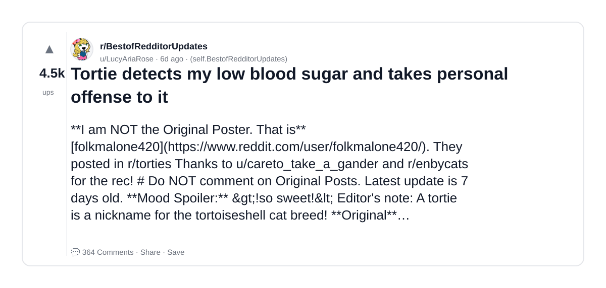
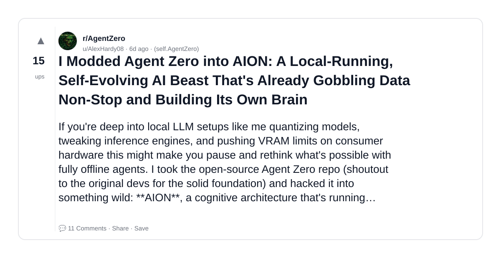
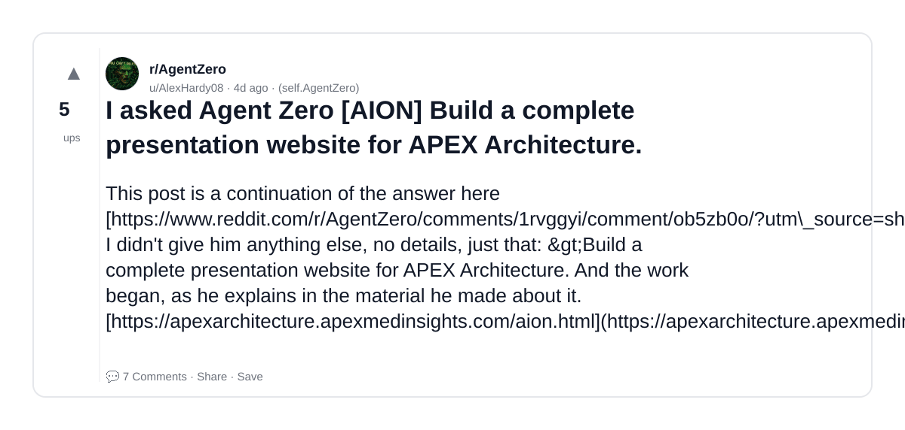
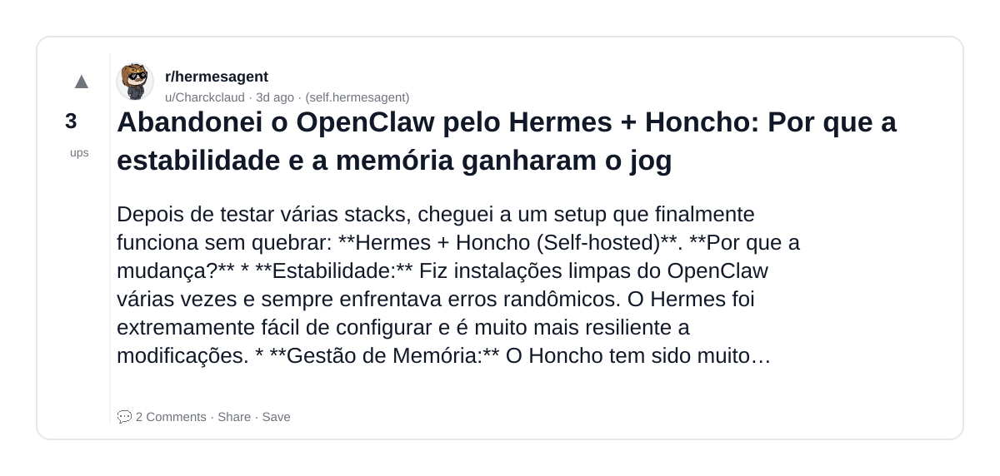
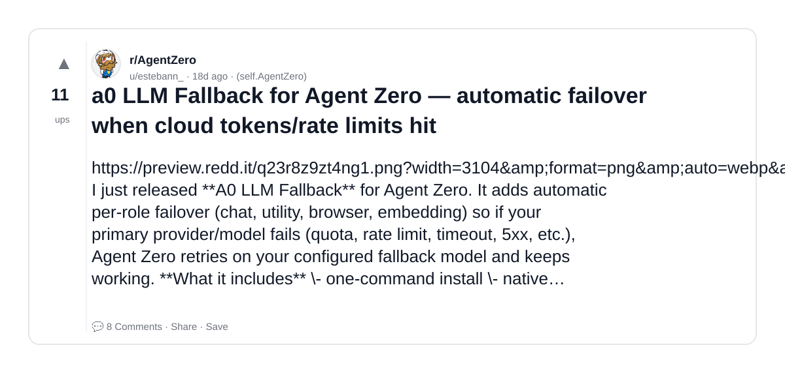
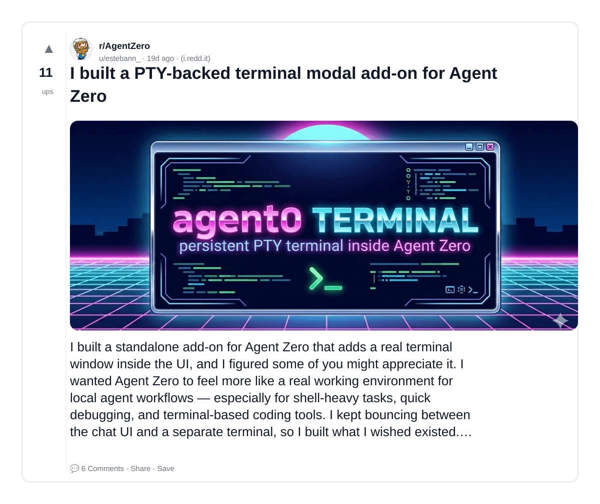
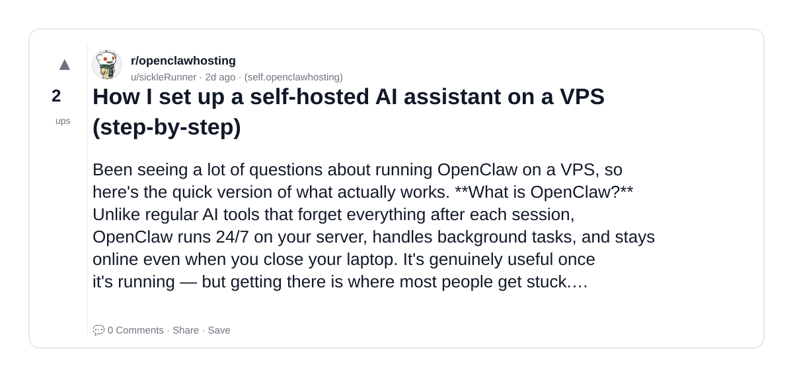
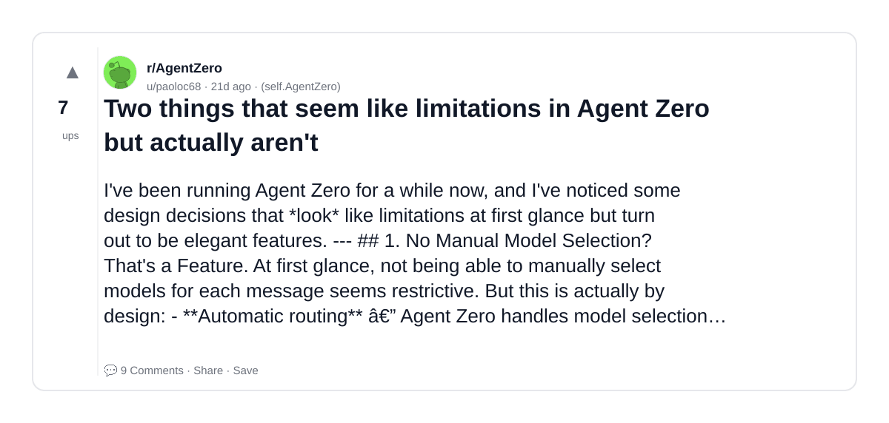
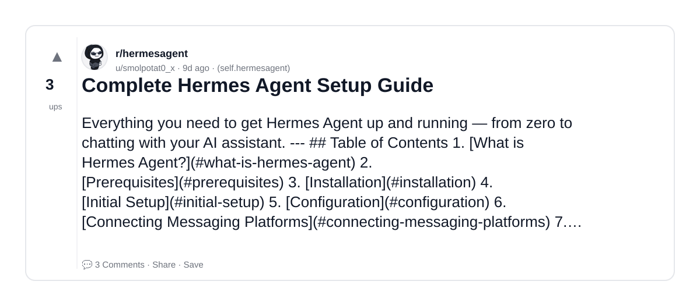
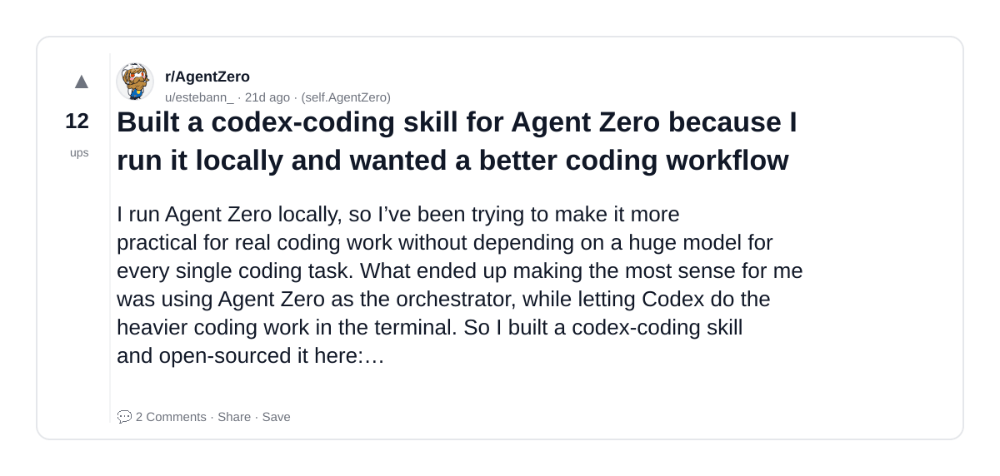

# Reddit Scout — openclaw AI agent personal assistant

Run: 2026-03-22T17-53-30-716Z
Started: 2026-03-22T17:53:30.717Z
Output dir: /home/ubuntu/.openclaw/workspace-ce/users/5554925279/reddit-scout/openclaw-ai-agent-personal-assistant/runs/2026-03-22T17-53-30-716Z

Config: topN=10 | subLimit=10 | kinds=top,hot,rising | time=week | limitPerListing=25
Search: openclaw AI agent personal assistant (sort=top t=auto)

## Top terms (from titles + top comments)

- agent (22)
- zero (11)
- have (10)
- what (10)
- like (9)
- skills (9)
- when (8)
- model (8)
- agents (8)
- will (7)
- something (7)
- project (7)
- running (6)
- good (6)
- hermes (5)
- using (5)
- local (4)
- guide (4)

## Viral content ideas (derived from these posts)

**1. Personal story → timeline + receipts**
- Hook: Hook with 1 line, then a 5-step timeline; end with the lesson and what you would do differently.

**2. My agent got automated: what I automated back (tools + workflow)**
- Hook: Turn it into a before/after workflow post. Include exact tool stack + steps.

**3. Checklist: how to stay valuable when zero hits your team**
- Hook: A numbered checklist (10 items). Make it practical: skills, portfolio, outreach, proof-of-work.

**4. Hot take: have isn't the problem — what is**
- Hook: Contrarian framing. Back it with 2 examples from the top posts and 1 counterexample.

**5. Debunk thread: "AI will replace like" vs what's actually happening**
- Hook: Use 3 claims → 3 rebuttals. Cite specific post patterns: layoffs, hiring freezes, role shifts.

**6. Salary/market reality: skills vs when roles in 2026 (Reddit signals)**
- Hook: Summarize demand signals from comments: who is struggling, who is fine, why.

**7. "What would you do in 30 days?" layoff recovery plan (day-by-day)**
- Hook: 30-day plan: portfolio, interview loops, networking, mental health. Include a downloadable checklist.

**8. Mini-case study: 1 resume bullet → 1 proof project using model**
- Hook: Show how to convert a vague resume claim into a measurable project + writeup.

**9. Community question: which tasks should *never* be delegated to AI?**
- Hook: Ask + give your own top 5. Encourage replies; add a poll if your platform supports it.

**10. Template post: "I used AI to do X, got Y result, here's the exact prompt"**
- Hook: Make it reproducible: prompt, inputs, outputs, gotchas.

**11. Data post: a quick scorecard of the top threads (ups, comments, ratio) + what it signals**
- Hook: Table or bullets; then 3 takeaways.

**12. Meme angle (if relevant): agents vs will — job search edition**
- Hook: If your niche is not memes, skip memes; otherwise caption the pattern you saw in comments.

## Top posts (10) + cards

### 1) Tortie detects my low blood sugar and takes personal offense to it
- Subreddit: r/BestofRedditorUpdates
- Viral score: 93 | Ups: 4518 | Comments: 364 | Upvote ratio: 99%
- Link: https://www.reddit.com/r/BestofRedditorUpdates/comments/1rvwann/tortie_detects_my_low_blood_sugar_and_takes/
- Card (local): ./cards/1rvwann.png

### 2) I Modded Agent Zero into AION: A Local-Running, Self-Evolving AI Beast That's Already Gobbling Data Non-Stop and Building Its Own Brain
- Subreddit: r/AgentZero
- Viral score: 0 | Ups: 15 | Comments: 11 | Upvote ratio: 94%
- Link: https://www.reddit.com/r/AgentZero/comments/1rvggyi/i_modded_agent_zero_into_aion_a_localrunning/
- Card (local): ./cards/1rvggyi.png

### 3) I asked Agent Zero [AION] Build a complete presentation website for APEX Architecture.
- Subreddit: r/AgentZero
- Viral score: 0 | Ups: 5 | Comments: 7 | Upvote ratio: 100%
- Link: https://www.reddit.com/r/AgentZero/comments/1rxctj3/i_asked_agent_zero_aion_build_a_complete/
- Card (local): ./cards/1rxctj3.png

### 4) Abandonei o OpenClaw pelo Hermes + Honcho: Por que a estabilidade e a memória ganharam o jog
- Subreddit: r/hermesagent
- Viral score: 0 | Ups: 3 | Comments: 2 | Upvote ratio: 100%
- Link: https://www.reddit.com/r/hermesagent/comments/1ryhf4r/abandonei_o_openclaw_pelo_hermes_honcho_por_que_a/
- Card (local): ./cards/1ryhf4r.png

### 5) a0 LLM Fallback for Agent Zero — automatic failover when cloud tokens/rate limits hit
- Subreddit: r/AgentZero
- Viral score: 0 | Ups: 11 | Comments: 8 | Upvote ratio: 93%
- Link: https://www.reddit.com/r/AgentZero/comments/1rl4jq4/a0_llm_fallback_for_agent_zero_automatic_failover/
- Card (local): ./cards/1rl4jq4.png

### 6) I built a PTY-backed terminal modal add-on for Agent Zero
- Subreddit: r/AgentZero
- Viral score: 0 | Ups: 11 | Comments: 6 | Upvote ratio: 93%
- Link: https://www.reddit.com/r/AgentZero/comments/1rjj3ol/i_built_a_ptybacked_terminal_modal_addon_for/
- Card (local): ./cards/1rjj3ol.png

### 7) How I set up a self-hosted AI assistant on a VPS (step-by-step)
- Subreddit: r/openclawhosting
- Viral score: 0 | Ups: 2 | Comments: 0 | Upvote ratio: 100%
- Link: https://www.reddit.com/r/openclawhosting/comments/1rz0b29/how_i_set_up_a_selfhosted_ai_assistant_on_a_vps/
- Card (local): ./cards/1rz0b29.png

### 8) Two things that seem like limitations in Agent Zero but actually aren't
- Subreddit: r/AgentZero
- Viral score: 0 | Ups: 7 | Comments: 9 | Upvote ratio: 90%
- Link: https://www.reddit.com/r/AgentZero/comments/1rhs7og/two_things_that_seem_like_limitations_in_agent/
- Card (local): ./cards/1rhs7og.png

### 9) Complete Hermes Agent Setup Guide
- Subreddit: r/hermesagent
- Viral score: 0 | Ups: 3 | Comments: 3 | Upvote ratio: 100%
- Link: https://www.reddit.com/r/hermesagent/comments/1rt5syt/complete_hermes_agent_setup_guide/
- Card (local): ./cards/1rt5syt.png

### 10) Built a codex-coding skill for Agent Zero because I run it locally and wanted a better coding workflow
- Subreddit: r/AgentZero
- Viral score: 0 | Ups: 12 | Comments: 2 | Upvote ratio: 100%
- Link: https://www.reddit.com/r/AgentZero/comments/1rihd03/built_a_codexcoding_skill_for_agent_zero_because/
- Card (local): ./cards/1rihd03.png

