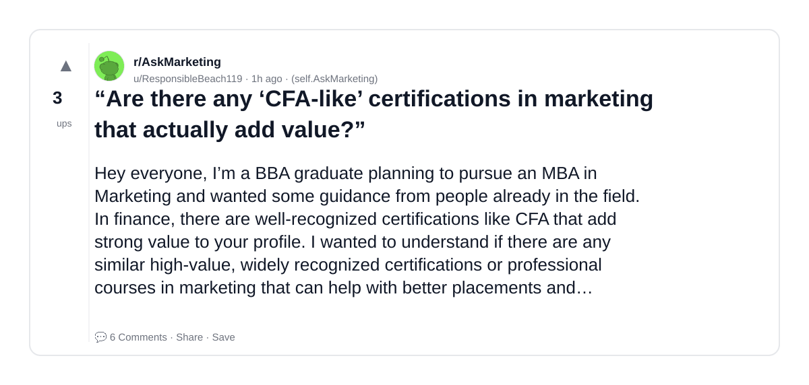
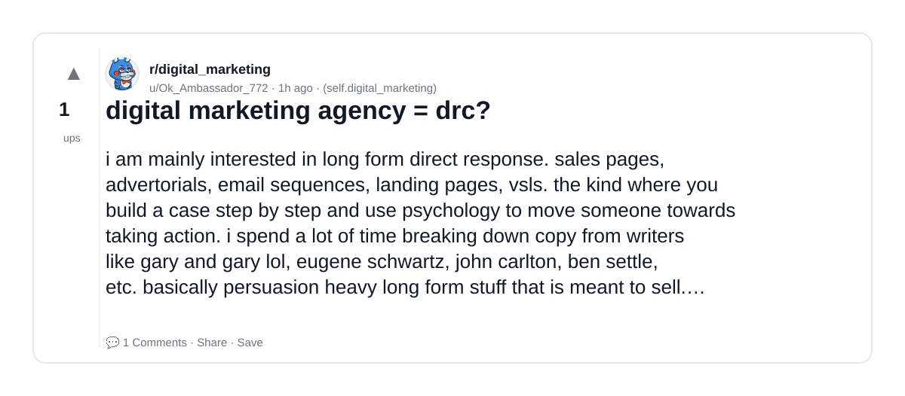
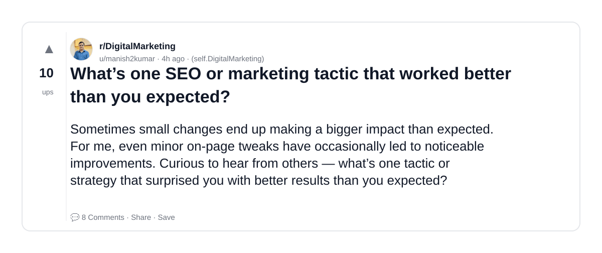
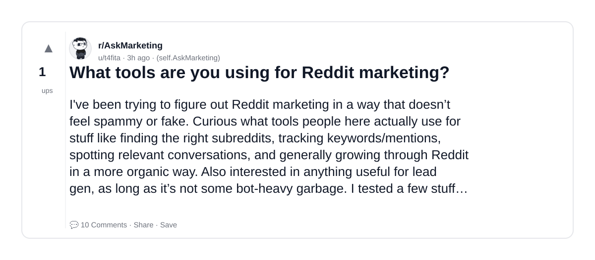
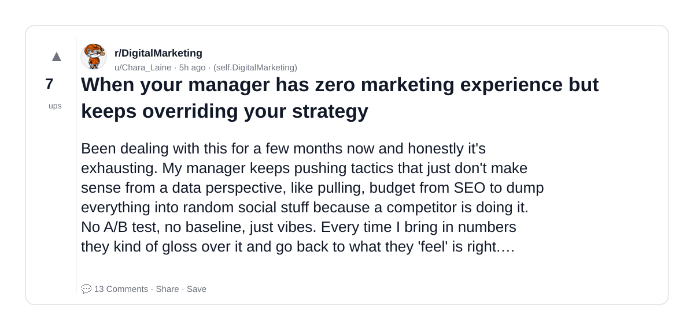
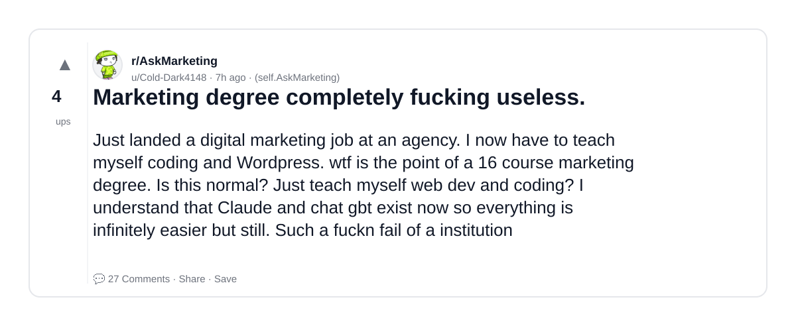
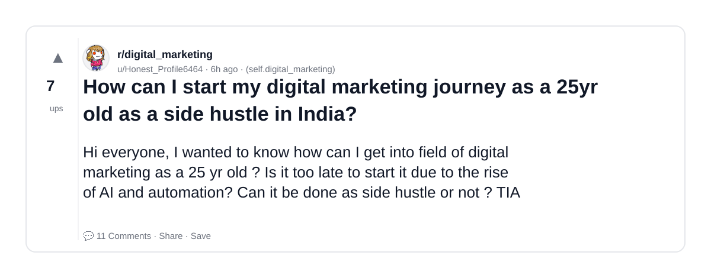
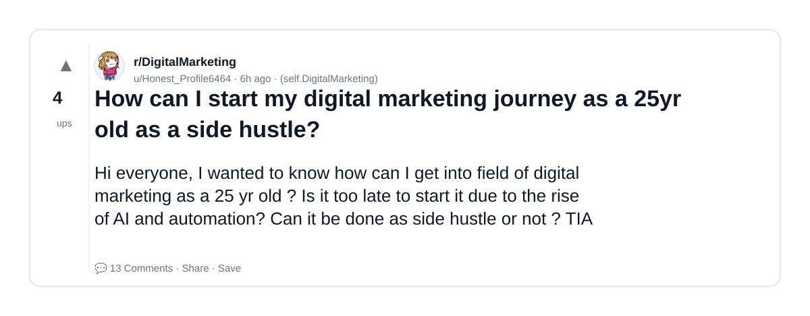
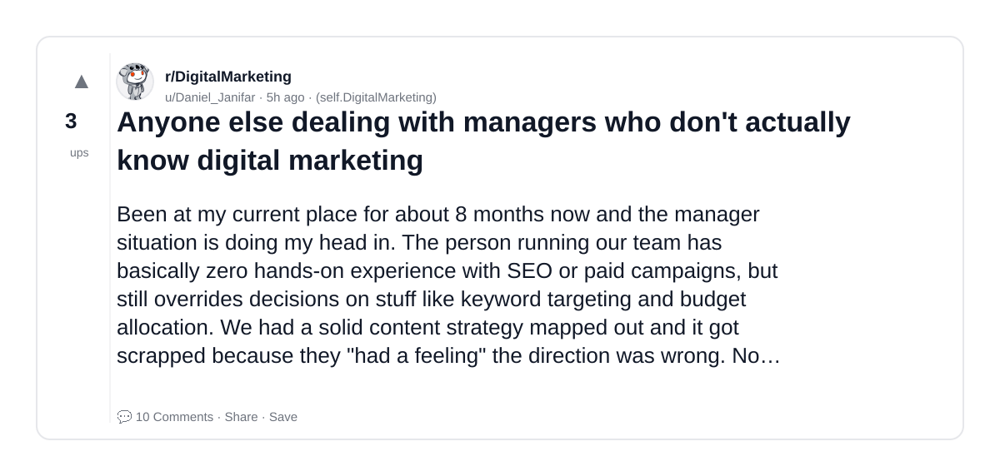

# Reddit Scout — AI for marketing

Run: 2026-03-21T13-11-17-020Z
Started: 2026-03-21T13:11:17.021Z
Output dir: /home/ubuntu/.openclaw/workspace-ce/users/750774193/reddit-scout/ai-for-marketing/runs/2026-03-21T13-11-17-020Z

Config: topN=10 | subLimit=10 | kinds=top,hot,rising | time=week | limitPerListing=25
Search: AI for marketing (sort=top t=auto)

## Top terms (from titles + top comments)

- marketing (41)
- more (16)
- digital (15)
- have (15)
- questions (14)
- https (13)
- rules (12)
- about (12)
- discord (12)
- like (11)
- reddit (11)
- please (10)
- askmarketing (8)
- people (8)
- actually (7)
- question (7)
- doesn (7)
- community (7)

## Viral content ideas (derived from these posts)

**1. Personal story → timeline + receipts**
- Hook: Hook with 1 line, then a 5-step timeline; end with the lesson and what you would do differently.

**2. My marketing got automated: what I automated back (tools + workflow)**
- Hook: Turn it into a before/after workflow post. Include exact tool stack + steps.

**3. Checklist: how to stay valuable when more hits your team**
- Hook: A numbered checklist (10 items). Make it practical: skills, portfolio, outreach, proof-of-work.

**4. Hot take: digital isn't the problem — have is**
- Hook: Contrarian framing. Back it with 2 examples from the top posts and 1 counterexample.

**5. Debunk thread: "AI will replace questions" vs what's actually happening**
- Hook: Use 3 claims → 3 rebuttals. Cite specific post patterns: layoffs, hiring freezes, role shifts.

**6. Salary/market reality: https vs rules roles in 2026 (Reddit signals)**
- Hook: Summarize demand signals from comments: who is struggling, who is fine, why.

**7. "What would you do in 30 days?" layoff recovery plan (day-by-day)**
- Hook: 30-day plan: portfolio, interview loops, networking, mental health. Include a downloadable checklist.

**8. Mini-case study: 1 resume bullet → 1 proof project using about**
- Hook: Show how to convert a vague resume claim into a measurable project + writeup.

**9. Community question: which tasks should *never* be delegated to AI?**
- Hook: Ask + give your own top 5. Encourage replies; add a poll if your platform supports it.

**10. Template post: "I used AI to do X, got Y result, here's the exact prompt"**
- Hook: Make it reproducible: prompt, inputs, outputs, gotchas.

**11. Data post: a quick scorecard of the top threads (ups, comments, ratio) + what it signals**
- Hook: Table or bullets; then 3 takeaways.

**12. Meme angle (if relevant): discord vs like — job search edition**
- Hook: If your niche is not memes, skip memes; otherwise caption the pattern you saw in comments.

## Top posts (10) + cards

### 1) “Are there any ‘CFA-like’ certifications in marketing that actually add value?”
- Subreddit: r/AskMarketing
- Viral score: 52 | Ups: 3 | Comments: 6 | Upvote ratio: 100%
- Link: https://www.reddit.com/r/AskMarketing/comments/1rzqc4l/are_there_any_cfalike_certifications_in_marketing/
- Card (local): ./cards/1rzqc4l.png

### 2) digital marketing agency = drc?
- Subreddit: r/digital_marketing
- Viral score: 50 | Ups: 1 | Comments: 1 | Upvote ratio: 100%
- Link: https://www.reddit.com/r/digital_marketing/comments/1rzqyj9/digital_marketing_agency_drc/
- Card (local): ./cards/1rzqyj9.png

### 3) What’s one SEO or marketing tactic that worked better than you expected?
- Subreddit: r/DigitalMarketing
- Viral score: 14 | Ups: 10 | Comments: 8 | Upvote ratio: 100%
- Link: https://www.reddit.com/r/DigitalMarketing/comments/1rznccj/whats_one_seo_or_marketing_tactic_that_worked/
- Card (local): ./cards/1rznccj.png

### 4) What tools are you using for Reddit marketing?
- Subreddit: r/AskMarketing
- Viral score: 13 | Ups: 1 | Comments: 10 | Upvote ratio: 100%
- Link: https://www.reddit.com/r/AskMarketing/comments/1rzo2dl/what_tools_are_you_using_for_reddit_marketing/
- Card (local): ./cards/1rzo2dl.png

### 5) When your manager has zero marketing experience but keeps overriding your strategy
- Subreddit: r/DigitalMarketing
- Viral score: 11 | Ups: 7 | Comments: 13 | Upvote ratio: 100%
- Link: https://www.reddit.com/r/DigitalMarketing/comments/1rzlmir/when_your_manager_has_zero_marketing_experience/
- Card (local): ./cards/1rzlmir.png

### 6) Marketing degree completely fucking useless.
- Subreddit: r/AskMarketing
- Viral score: 11 | Ups: 4 | Comments: 27 | Upvote ratio: 61%
- Link: https://www.reddit.com/r/AskMarketing/comments/1rzjw1f/marketing_degree_completely_fucking_useless/
- Card (local): ./cards/1rzjw1f.png

### 7) How can I start my digital marketing journey as a 25yr old as a side hustle in India?
- Subreddit: r/digital_marketing
- Viral score: 9 | Ups: 7 | Comments: 11 | Upvote ratio: 100%
- Link: https://www.reddit.com/r/digital_marketing/comments/1rzl7yp/how_can_i_start_my_digital_marketing_journey_as_a/
- Card (local): ./cards/1rzl7yp.png

### 8) Are there any “CFA-like” certifications in marketing that actually add value?
- Subreddit: r/AskMarketing
- Viral score: 9 | Ups: 1 | Comments: 1 | Upvote ratio: 100%
- Link: https://www.reddit.com/r/AskMarketing/comments/1rzqepj/are_there_any_cfalike_certifications_in_marketing/
- Card (local): ./cards/1rzqepj.png

### 9) How can I start my digital marketing journey as a 25yr old as a side hustle?
- Subreddit: r/DigitalMarketing
- Viral score: 8 | Ups: 4 | Comments: 13 | Upvote ratio: 83%
- Link: https://www.reddit.com/r/DigitalMarketing/comments/1rzl6r4/how_can_i_start_my_digital_marketing_journey_as_a/
- Card (local): ./cards/1rzl6r4.png

### 10) Anyone else dealing with managers who don't actually know digital marketing
- Subreddit: r/DigitalMarketing
- Viral score: 7 | Ups: 3 | Comments: 10 | Upvote ratio: 100%
- Link: https://www.reddit.com/r/DigitalMarketing/comments/1rzlvx4/anyone_else_dealing_with_managers_who_dont/
- Card (local): ./cards/1rzlvx4.png

