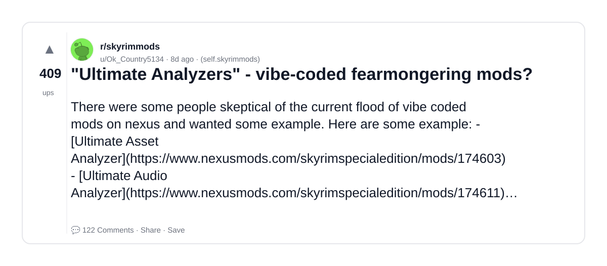
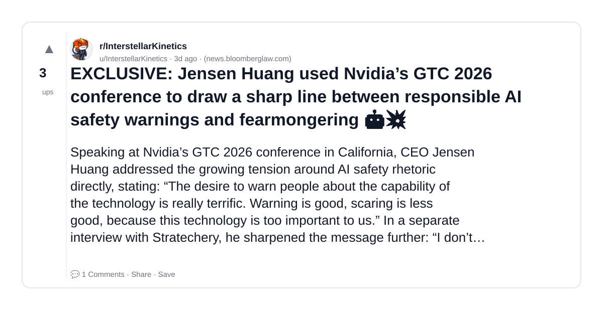

# Reddit Scout — AI fearmongering

Run: 2026-03-23T18-22-29-797Z
Started: 2026-03-23T18:22:29.797Z
Output dir: /home/ubuntu/.openclaw/workspace-ce/users/8176450202/reddit-scout/ai-fearmongering/runs/2026-03-23T18-22-29-797Z

Config: topN=10 | subLimit=10 | kinds=top,hot,rising | time=week | limitPerListing=25
Search: AI fearmongering (sort=top t=auto)

## Top terms (from titles + top comments)

- mods (4)
- line (3)
- safety (3)
- fearmongering (2)
- game (2)
- what (2)
- most (2)
- anthropic (2)
- ultimate (1)
- analyzers (1)
- vibe (1)
- coded (1)
- exclusive (1)
- jensen (1)
- huang (1)
- used (1)
- nvidia (1)
- 2026 (1)

## Viral content ideas (derived from these posts)

**1. Personal story → timeline + receipts**
- Hook: Hook with 1 line, then a 5-step timeline; end with the lesson and what you would do differently.

**2. My mods got automated: what I automated back (tools + workflow)**
- Hook: Turn it into a before/after workflow post. Include exact tool stack + steps.

**3. Checklist: how to stay valuable when line hits your team**
- Hook: A numbered checklist (10 items). Make it practical: skills, portfolio, outreach, proof-of-work.

**4. Hot take: safety isn't the problem — fearmongering is**
- Hook: Contrarian framing. Back it with 2 examples from the top posts and 1 counterexample.

**5. Debunk thread: "AI will replace game" vs what's actually happening**
- Hook: Use 3 claims → 3 rebuttals. Cite specific post patterns: layoffs, hiring freezes, role shifts.

**6. Salary/market reality: what vs most roles in 2026 (Reddit signals)**
- Hook: Summarize demand signals from comments: who is struggling, who is fine, why.

**7. "What would you do in 30 days?" layoff recovery plan (day-by-day)**
- Hook: 30-day plan: portfolio, interview loops, networking, mental health. Include a downloadable checklist.

**8. Mini-case study: 1 resume bullet → 1 proof project using anthropic**
- Hook: Show how to convert a vague resume claim into a measurable project + writeup.

**9. Community question: which tasks should *never* be delegated to AI?**
- Hook: Ask + give your own top 5. Encourage replies; add a poll if your platform supports it.

**10. Template post: "I used AI to do X, got Y result, here's the exact prompt"**
- Hook: Make it reproducible: prompt, inputs, outputs, gotchas.

**11. Data post: a quick scorecard of the top threads (ups, comments, ratio) + what it signals**
- Hook: Table or bullets; then 3 takeaways.

**12. Meme angle (if relevant): ultimate vs analyzers — job search edition**
- Hook: If your niche is not memes, skip memes; otherwise caption the pattern you saw in comments.

## Top posts (2) + cards

### 1) "Ultimate Analyzers" - vibe-coded fearmongering mods?
- Subreddit: r/skyrimmods
- Viral score: 6 | Ups: 409 | Comments: 122 | Upvote ratio: 97%
- Link: https://www.reddit.com/r/skyrimmods/comments/1ruu7vb/ultimate_analyzers_vibecoded_fearmongering_mods/
- Card (local): ./cards/1ruu7vb.png

### 2) EXCLUSIVE: Jensen Huang used Nvidia’s GTC 2026 conference to draw a sharp line between responsible AI safety warnings and fearmongering 🤖💥
- Subreddit: r/InterstellarKinetics
- Viral score: 0 | Ups: 3 | Comments: 1 | Upvote ratio: 81%
- Link: https://www.reddit.com/r/InterstellarKinetics/comments/1ryvb34/exclusive_jensen_huang_used_nvidias_gtc_2026/
- Card (local): ./cards/1ryvb34.png

