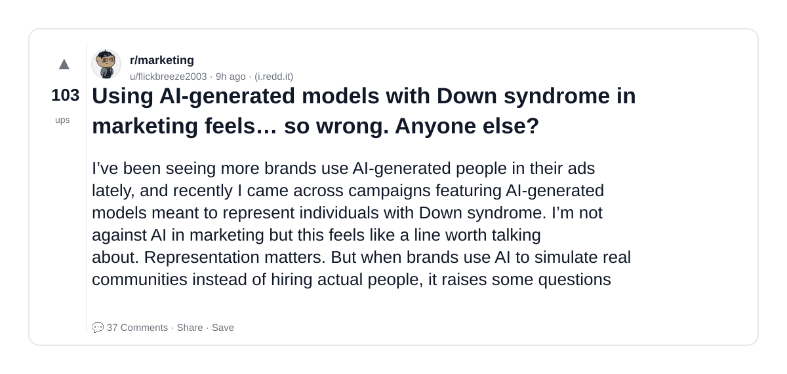
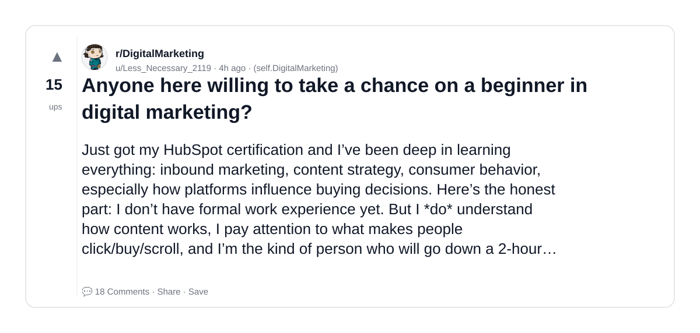
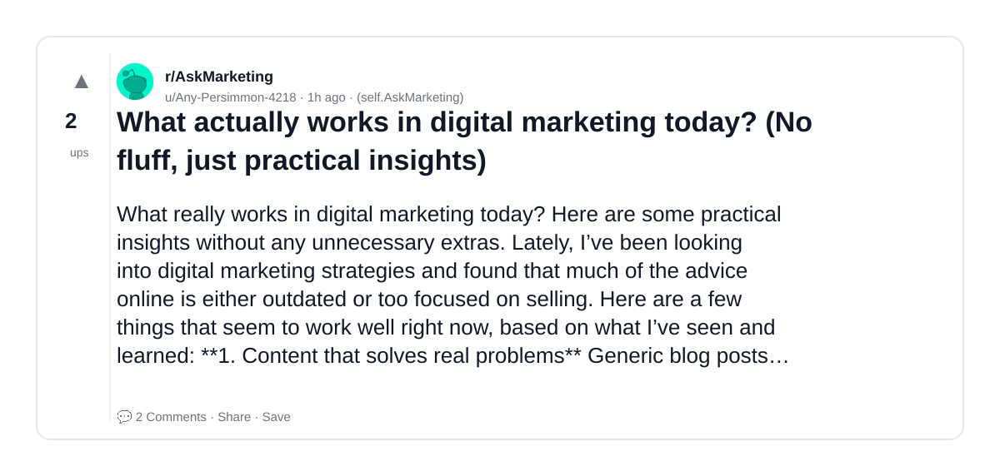
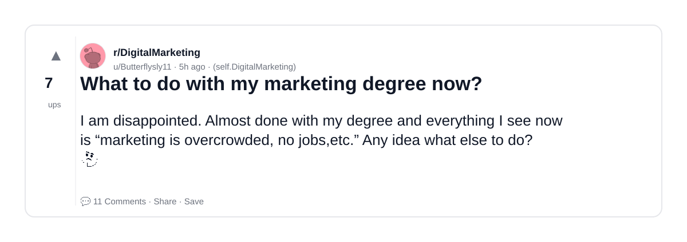
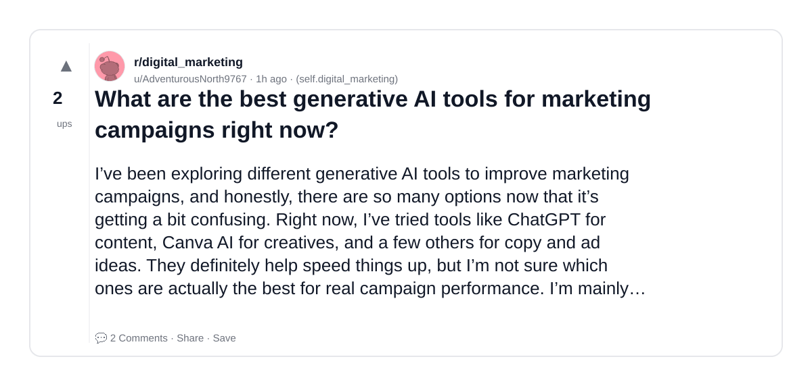
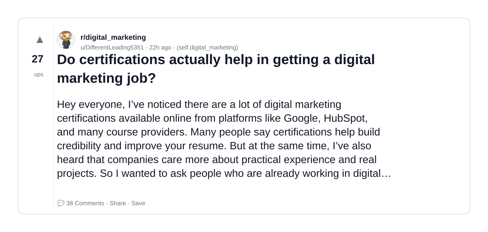
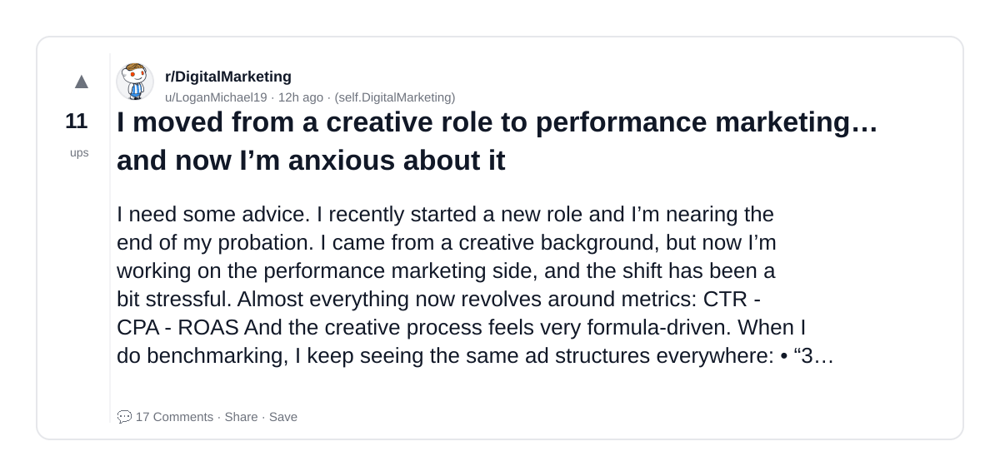
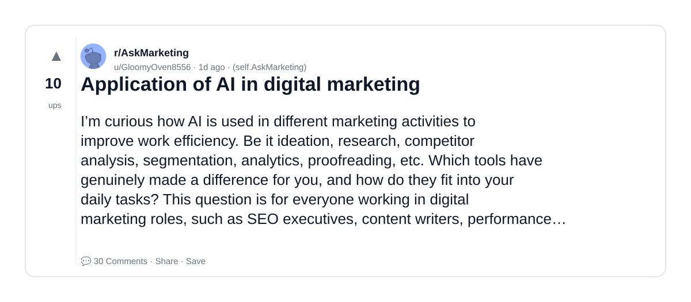
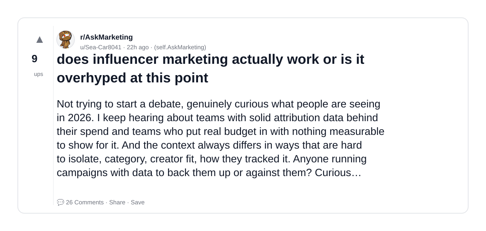
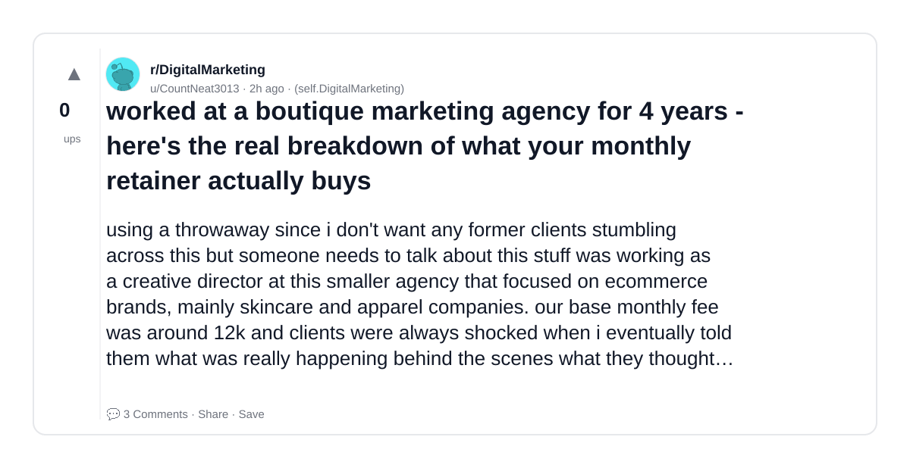

# Reddit Scout — AI Marketing

Run: 2026-03-24T07-26-33-130Z
Started: 2026-03-24T07:26:33.131Z
Output dir: /home/ubuntu/.openclaw/workspace-ce/users/8176450202/reddit-scout/ai-marketing/runs/2026-03-24T07-26-33-130Z

Config: topN=10 | subLimit=10 | kinds=top,hot,rising | time=week | limitPerListing=25
Search: AI Marketing (sort=top t=auto)

## Top terms (from titles + top comments)

- marketing (33)
- have (13)
- actually (12)
- about (12)
- what (11)
- work (11)
- more (9)
- questions (9)
- real (8)
- rules (8)
- https (8)
- discord (8)
- time (8)
- there (7)
- much (7)
- digital (6)
- creative (6)
- like (6)

## Viral content ideas (derived from these posts)

**1. Personal story → timeline + receipts**
- Hook: Hook with 1 line, then a 5-step timeline; end with the lesson and what you would do differently.

**2. My marketing got automated: what I automated back (tools + workflow)**
- Hook: Turn it into a before/after workflow post. Include exact tool stack + steps.

**3. Checklist: how to stay valuable when have hits your team**
- Hook: A numbered checklist (10 items). Make it practical: skills, portfolio, outreach, proof-of-work.

**4. Hot take: actually isn't the problem — about is**
- Hook: Contrarian framing. Back it with 2 examples from the top posts and 1 counterexample.

**5. Debunk thread: "AI will replace what" vs what's actually happening**
- Hook: Use 3 claims → 3 rebuttals. Cite specific post patterns: layoffs, hiring freezes, role shifts.

**6. Salary/market reality: work vs more roles in 2026 (Reddit signals)**
- Hook: Summarize demand signals from comments: who is struggling, who is fine, why.

**7. "What would you do in 30 days?" layoff recovery plan (day-by-day)**
- Hook: 30-day plan: portfolio, interview loops, networking, mental health. Include a downloadable checklist.

**8. Mini-case study: 1 resume bullet → 1 proof project using questions**
- Hook: Show how to convert a vague resume claim into a measurable project + writeup.

**9. Community question: which tasks should *never* be delegated to AI?**
- Hook: Ask + give your own top 5. Encourage replies; add a poll if your platform supports it.

**10. Template post: "I used AI to do X, got Y result, here's the exact prompt"**
- Hook: Make it reproducible: prompt, inputs, outputs, gotchas.

**11. Data post: a quick scorecard of the top threads (ups, comments, ratio) + what it signals**
- Hook: Table or bullets; then 3 takeaways.

**12. Meme angle (if relevant): real vs rules — job search edition**
- Hook: If your niche is not memes, skip memes; otherwise caption the pattern you saw in comments.

## Top posts (10) + cards

### 1) Using AI-generated models with Down syndrome in marketing feels… so wrong. Anyone else?
- Subreddit: r/marketing
- Viral score: 45 | Ups: 103 | Comments: 37 | Upvote ratio: 95%
- Link: https://www.reddit.com/r/marketing/comments/1s1w3tz/using_aigenerated_models_with_down_syndrome_in/
- Card (local): ./cards/1s1w3tz.png

### 2) Anyone here willing to take a chance on a beginner in digital marketing?
- Subreddit: r/DigitalMarketing
- Viral score: 23 | Ups: 15 | Comments: 18 | Upvote ratio: 95%
- Link: https://www.reddit.com/r/DigitalMarketing/comments/1s22dc2/anyone_here_willing_to_take_a_chance_on_a/
- Card (local): ./cards/1s22dc2.png

### 3) What actually works in digital marketing today? (No fluff, just practical insights)
- Subreddit: r/AskMarketing
- Viral score: 21 | Ups: 2 | Comments: 2 | Upvote ratio: 100%
- Link: https://www.reddit.com/r/AskMarketing/comments/1s26kae/what_actually_works_in_digital_marketing_today_no/
- Card (local): ./cards/1s26kae.png

### 4) What to do with my marketing degree now?
- Subreddit: r/DigitalMarketing
- Viral score: 11 | Ups: 7 | Comments: 11 | Upvote ratio: 90%
- Link: https://www.reddit.com/r/DigitalMarketing/comments/1s21qgq/what_to_do_with_my_marketing_degree_now/
- Card (local): ./cards/1s21qgq.png

### 5) What are the best generative AI tools for marketing campaigns right now?
- Subreddit: r/digital_marketing
- Viral score: 10 | Ups: 2 | Comments: 2 | Upvote ratio: 100%
- Link: https://www.reddit.com/r/digital_marketing/comments/1s26aua/what_are_the_best_generative_ai_tools_for/
- Card (local): ./cards/1s26aua.png

### 6) Do certifications actually help in getting a digital marketing job?
- Subreddit: r/digital_marketing
- Viral score: 8 | Ups: 27 | Comments: 38 | Upvote ratio: 100%
- Link: https://www.reddit.com/r/digital_marketing/comments/1s1bqj1/do_certifications_actually_help_in_getting_a/
- Card (local): ./cards/1s1bqj1.png

### 7) I moved from a creative role to performance marketing… and now I’m anxious about it
- Subreddit: r/DigitalMarketing
- Viral score: 5 | Ups: 11 | Comments: 17 | Upvote ratio: 100%
- Link: https://www.reddit.com/r/DigitalMarketing/comments/1s1q4c4/i_moved_from_a_creative_role_to_performance/
- Card (local): ./cards/1s1q4c4.png

### 8) Application of AI in digital marketing
- Subreddit: r/AskMarketing
- Viral score: 4 | Ups: 10 | Comments: 30 | Upvote ratio: 92%
- Link: https://www.reddit.com/r/AskMarketing/comments/1s19a8k/application_of_ai_in_digital_marketing/
- Card (local): ./cards/1s19a8k.png

### 9) does influencer marketing actually work or is it overhyped at this point
- Subreddit: r/AskMarketing
- Viral score: 4 | Ups: 9 | Comments: 26 | Upvote ratio: 85%
- Link: https://www.reddit.com/r/AskMarketing/comments/1s1ck1x/does_influencer_marketing_actually_work_or_is_it/
- Card (local): ./cards/1s1ck1x.png

### 10) worked at a boutique marketing agency for 4 years - here's the real breakdown of what your monthly retainer actually buys
- Subreddit: r/DigitalMarketing
- Viral score: 4 | Ups: 0 | Comments: 3 | Upvote ratio: 50%
- Link: https://www.reddit.com/r/DigitalMarketing/comments/1s25jtu/worked_at_a_boutique_marketing_agency_for_4_years/
- Card (local): ./cards/1s25jtu.png

