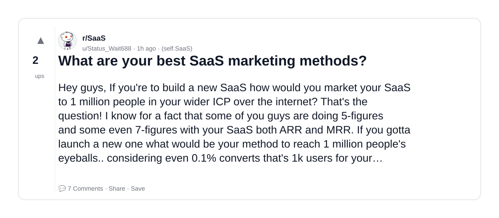
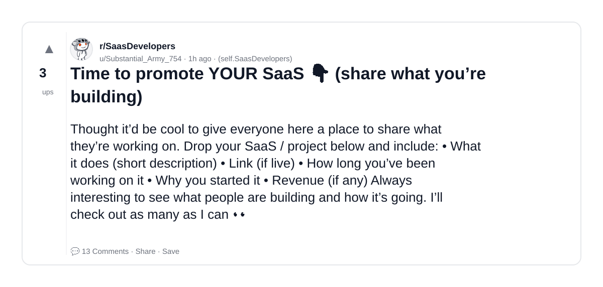
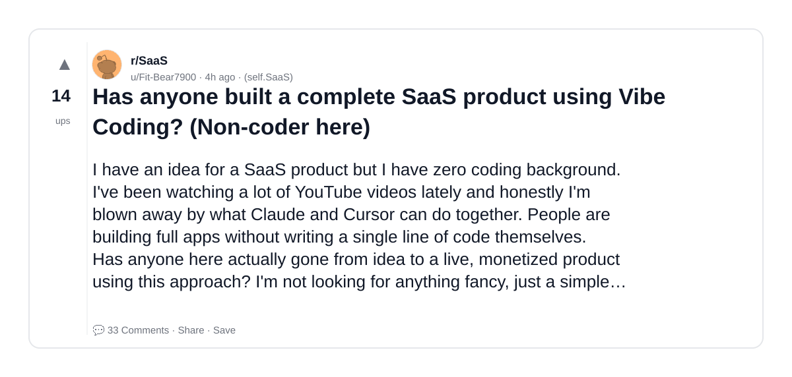
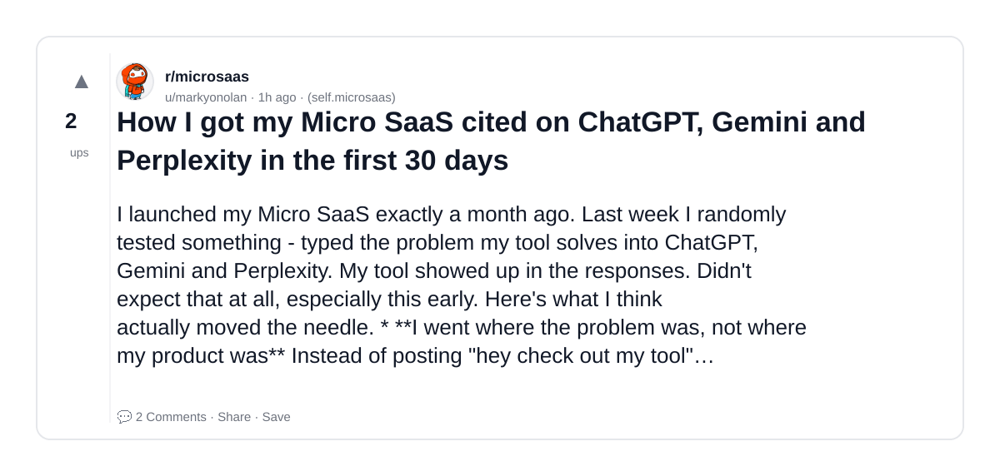
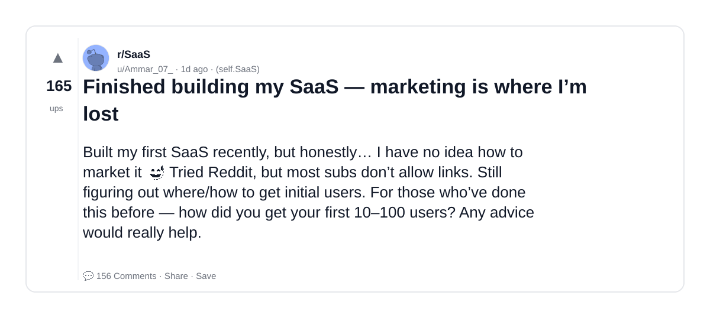
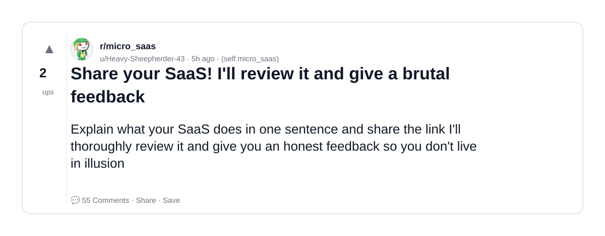
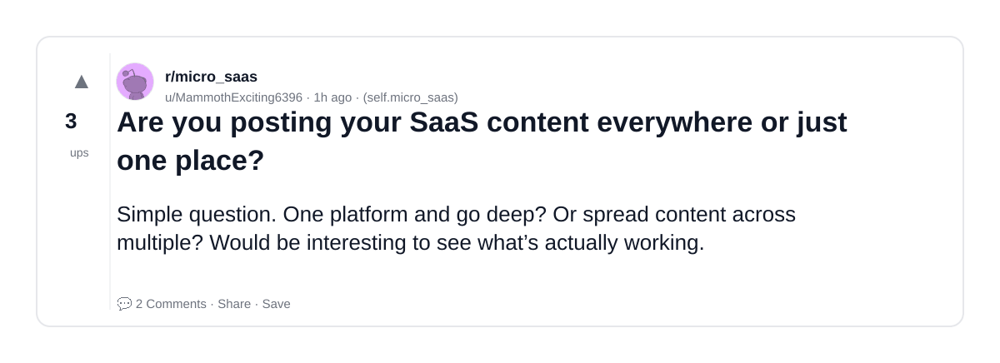
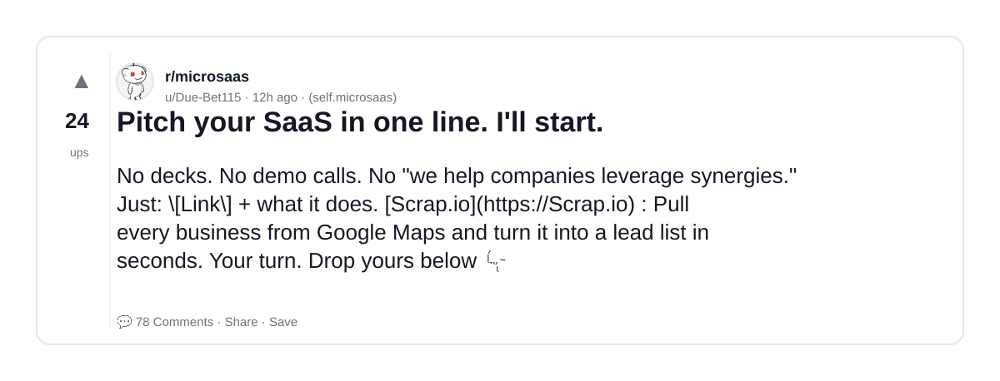
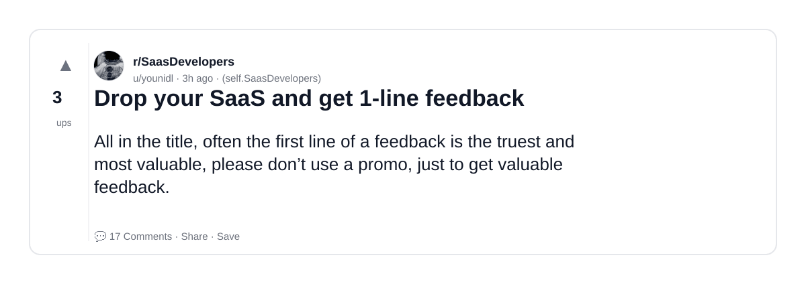
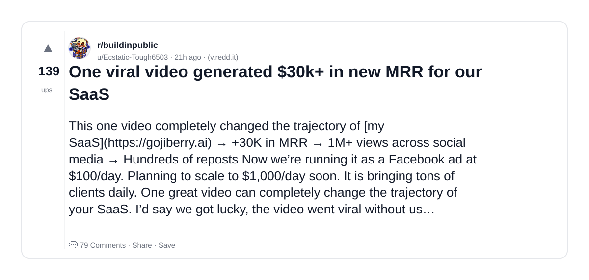

# Reddit Scout — AI SaaS

Run: 2026-03-24T09-45-36-476Z
Started: 2026-03-24T09:45:36.477Z
Output dir: /home/ubuntu/.openclaw/workspace-ce/users/8176450202/reddit-scout/ai-saas/runs/2026-03-24T09-45-36-476Z

Config: topN=10 | subLimit=10 | kinds=top,hot,rising | time=week | limitPerListing=25
Search: AI SaaS (sort=top t=auto)

## Top terms (from titles + top comments)

- what (26)
- real (23)
- saas (20)
- people (17)
- product (15)
- build (15)
- reddit (15)
- building (14)
- first (14)
- https (14)
- users (14)
- when (12)
- actually (12)
- about (12)
- more (11)
- problem (11)
- like (11)
- coding (10)

## Viral content ideas (derived from these posts)

**1. Personal story → timeline + receipts**
- Hook: Hook with 1 line, then a 5-step timeline; end with the lesson and what you would do differently.

**2. My what got automated: what I automated back (tools + workflow)**
- Hook: Turn it into a before/after workflow post. Include exact tool stack + steps.

**3. Checklist: how to stay valuable when real hits your team**
- Hook: A numbered checklist (10 items). Make it practical: skills, portfolio, outreach, proof-of-work.

**4. Hot take: saas isn't the problem — people is**
- Hook: Contrarian framing. Back it with 2 examples from the top posts and 1 counterexample.

**5. Debunk thread: "AI will replace product" vs what's actually happening**
- Hook: Use 3 claims → 3 rebuttals. Cite specific post patterns: layoffs, hiring freezes, role shifts.

**6. Salary/market reality: build vs reddit roles in 2026 (Reddit signals)**
- Hook: Summarize demand signals from comments: who is struggling, who is fine, why.

**7. "What would you do in 30 days?" layoff recovery plan (day-by-day)**
- Hook: 30-day plan: portfolio, interview loops, networking, mental health. Include a downloadable checklist.

**8. Mini-case study: 1 resume bullet → 1 proof project using building**
- Hook: Show how to convert a vague resume claim into a measurable project + writeup.

**9. Community question: which tasks should *never* be delegated to AI?**
- Hook: Ask + give your own top 5. Encourage replies; add a poll if your platform supports it.

**10. Template post: "I used AI to do X, got Y result, here's the exact prompt"**
- Hook: Make it reproducible: prompt, inputs, outputs, gotchas.

**11. Data post: a quick scorecard of the top threads (ups, comments, ratio) + what it signals**
- Hook: Table or bullets; then 3 takeaways.

**12. Meme angle (if relevant): first vs https — job search edition**
- Hook: If your niche is not memes, skip memes; otherwise caption the pattern you saw in comments.

## Top posts (10) + cards

### 1) What are your best SaaS marketing methods?
- Subreddit: r/SaaS
- Viral score: 145 | Ups: 2 | Comments: 7 | Upvote ratio: 100%
- Link: https://www.reddit.com/r/SaaS/comments/1s28zgd/what_are_your_best_saas_marketing_methods/
- Card (local): ./cards/1s28zgd.png

### 2) Time to promote YOUR SaaS 👇 (share what you’re building)
- Subreddit: r/SaasDevelopers
- Viral score: 135 | Ups: 3 | Comments: 13 | Upvote ratio: 100%
- Link: https://www.reddit.com/r/SaasDevelopers/comments/1s28qky/time_to_promote_your_saas_share_what_youre/
- Card (local): ./cards/1s28qky.png

### 3) Has anyone built a complete SaaS product using Vibe Coding? (Non-coder here)
- Subreddit: r/SaaS
- Viral score: 48 | Ups: 14 | Comments: 33 | Upvote ratio: 86%
- Link: https://www.reddit.com/r/SaaS/comments/1s25xx4/has_anyone_built_a_complete_saas_product_using/
- Card (local): ./cards/1s25xx4.png

### 4) How I got my Micro SaaS cited on ChatGPT, Gemini and Perplexity in the first 30 days
- Subreddit: r/microsaas
- Viral score: 42 | Ups: 2 | Comments: 2 | Upvote ratio: 100%
- Link: https://www.reddit.com/r/microsaas/comments/1s28z6q/how_i_got_my_micro_saas_cited_on_chatgpt_gemini/
- Card (local): ./cards/1s28z6q.png

### 5) Finished building my SaaS — marketing is where I’m lost
- Subreddit: r/SaaS
- Viral score: 41 | Ups: 165 | Comments: 156 | Upvote ratio: 99%
- Link: https://www.reddit.com/r/SaaS/comments/1s1b4lb/finished_building_my_saas_marketing_is_where_im/
- Card (local): ./cards/1s1b4lb.png

### 6) Share your SaaS! I'll review it and give a brutal feedback
- Subreddit: r/micro_saas
- Viral score: 38 | Ups: 2 | Comments: 55 | Upvote ratio: 56%
- Link: https://www.reddit.com/r/micro_saas/comments/1s24tax/share_your_saas_ill_review_it_and_give_a_brutal/
- Card (local): ./cards/1s24tax.png

### 7) Are you posting your SaaS content everywhere or just one place?
- Subreddit: r/micro_saas
- Viral score: 30 | Ups: 3 | Comments: 2 | Upvote ratio: 100%
- Link: https://www.reddit.com/r/micro_saas/comments/1s28tt5/are_you_posting_your_saas_content_everywhere_or/
- Card (local): ./cards/1s28tt5.png

### 8) Pitch your SaaS in one line. I'll start.
- Subreddit: r/microsaas
- Viral score: 28 | Ups: 24 | Comments: 78 | Upvote ratio: 88%
- Link: https://www.reddit.com/r/microsaas/comments/1s1uq09/pitch_your_saas_in_one_line_ill_start/
- Card (local): ./cards/1s1uq09.png

### 9) Drop your SaaS and get 1-line feedback
- Subreddit: r/SaasDevelopers
- Viral score: 27 | Ups: 3 | Comments: 17 | Upvote ratio: 81%
- Link: https://www.reddit.com/r/SaasDevelopers/comments/1s26wey/drop_your_saas_and_get_1line_feedback/
- Card (local): ./cards/1s26wey.png

### 10) One viral video generated $30k+ in new MRR for our SaaS
- Subreddit: r/buildinpublic
- Viral score: 26 | Ups: 139 | Comments: 79 | Upvote ratio: 90%
- Link: https://www.reddit.com/r/buildinpublic/comments/1s1fwvl/one_viral_video_generated_30k_in_new_mrr_for_our/
- Card (local): ./cards/1s1fwvl.png

