# Reddit Scout — AI Scams

Run: 2026-03-24T15-42-35-532Z
Started: 2026-03-24T15:42:35.533Z
Output dir: /home/ubuntu/.openclaw/workspace-ce/users/8176450202/reddit-scout/ai-scams/runs/2026-03-24T15-42-35-532Z

Config: topN=15 | subLimit=10 | kinds=top,hot,rising | time=all | limitPerListing=25
Search: AI Scams (sort=top t=auto)

## Top terms (from titles + top comments)

- like (10)
- have (9)
- there (7)
- what (7)
- think (7)
- https (7)
- preview (7)
- redd (7)
- width (7)
- format (7)
- auto (7)
- webp (7)
- real (6)
- chat (6)
- video (5)
- people (5)
- about (5)
- look (5)

## Viral content ideas (derived from these posts)

**1. Personal story → timeline + receipts**
- Hook: Hook with 1 line, then a 5-step timeline; end with the lesson and what you would do differently.

**2. My like got automated: what I automated back (tools + workflow)**
- Hook: Turn it into a before/after workflow post. Include exact tool stack + steps.

**3. Checklist: how to stay valuable when have hits your team**
- Hook: A numbered checklist (10 items). Make it practical: skills, portfolio, outreach, proof-of-work.

**4. Hot take: there isn't the problem — what is**
- Hook: Contrarian framing. Back it with 2 examples from the top posts and 1 counterexample.

**5. Debunk thread: "AI will replace think" vs what's actually happening**
- Hook: Use 3 claims → 3 rebuttals. Cite specific post patterns: layoffs, hiring freezes, role shifts.

**6. Salary/market reality: https vs preview roles in 2026 (Reddit signals)**
- Hook: Summarize demand signals from comments: who is struggling, who is fine, why.

**7. "What would you do in 30 days?" layoff recovery plan (day-by-day)**
- Hook: 30-day plan: portfolio, interview loops, networking, mental health. Include a downloadable checklist.

**8. Mini-case study: 1 resume bullet → 1 proof project using redd**
- Hook: Show how to convert a vague resume claim into a measurable project + writeup.

**9. Community question: which tasks should *never* be delegated to AI?**
- Hook: Ask + give your own top 5. Encourage replies; add a poll if your platform supports it.

**10. Template post: "I used AI to do X, got Y result, here's the exact prompt"**
- Hook: Make it reproducible: prompt, inputs, outputs, gotchas.

**11. Data post: a quick scorecard of the top threads (ups, comments, ratio) + what it signals**
- Hook: Table or bullets; then 3 takeaways.

**12. Meme angle (if relevant): width vs format — job search edition**
- Hook: If your niche is not memes, skip memes; otherwise caption the pattern you saw in comments.

## Top posts (15) + cards

### 1) Is this video of a capybara riding an Armadillo AI-generated? There's a slight fuzziness near the edges, but the shadow seems consistent - so I'm not sure
- Subreddit: r/isthisAI
- Viral score: 846 | Ups: 65 | Comments: 29 | Upvote ratio: 89%
- Link: https://www.reddit.com/r/isthisAI/comments/1s2gofu/is_this_video_of_a_capybara_riding_an_armadillo/
- Card (local): ./cards/1s2gofu.png

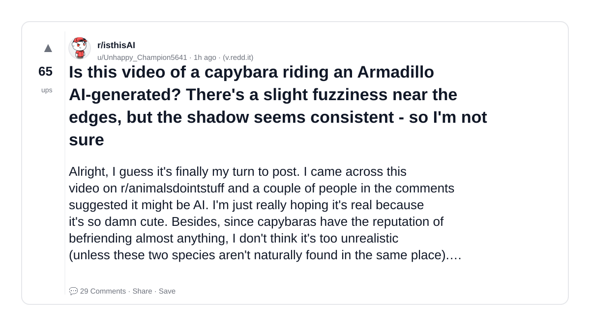

### 2) My Brother sells AI art for thousands and I dont know what to do
- Subreddit: r/antiai
- Viral score: 653 | Ups: 3233 | Comments: 1380 | Upvote ratio: 87%
- Link: https://www.reddit.com/r/antiai/comments/1s1grcp/my_brother_sells_ai_art_for_thousands_and_i_dont/
- Card (local): ./cards/1s1grcp.png

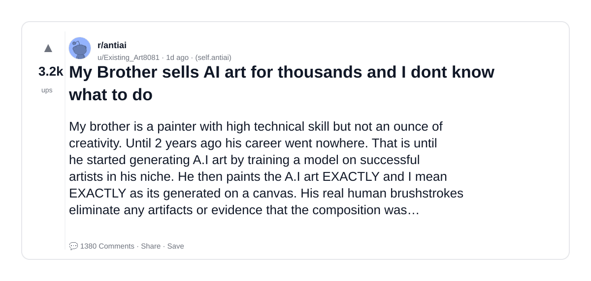

### 3) This Painting at a local art gallery selling for $1200. I’m convinced it’s ai.
- Subreddit: r/isthisAI
- Viral score: 230 | Ups: 6447 | Comments: 546 | Upvote ratio: 98%
- Link: https://www.reddit.com/r/isthisAI/comments/1rzlqkf/this_painting_at_a_local_art_gallery_selling_for/
- Card (local): ./cards/1rzlqkf.png

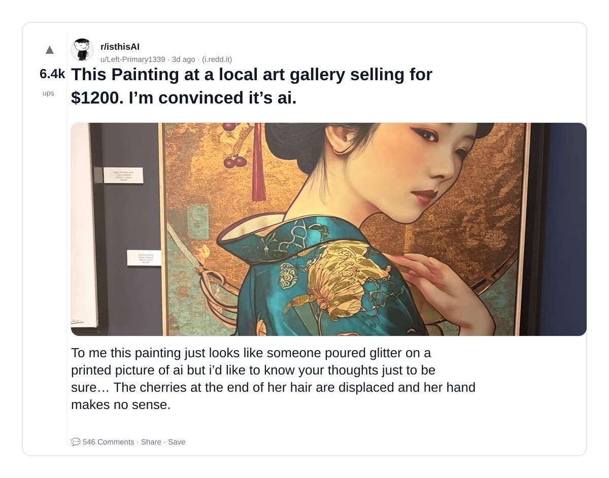

### 4) I don’t think it is Ai but a lot of people think it is. They claim the way he fell, and the way the wheels movie is AI.
- Subreddit: r/isthisAI
- Viral score: 178 | Ups: 49 | Comments: 142 | Upvote ratio: 68%
- Link: https://www.reddit.com/r/isthisAI/comments/1s2bk3w/i_dont_think_it_is_ai_but_a_lot_of_people_think/
- Card (local): ./cards/1s2bk3w.png

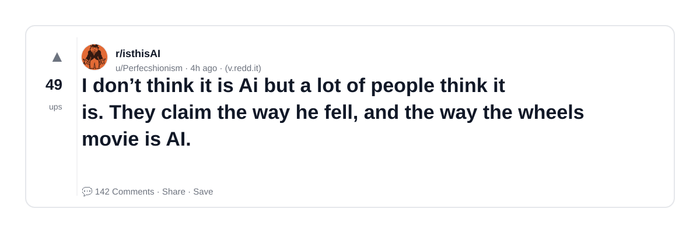

### 5) This looks like AI, which would be ironic. Any ideas? Found this on UpScrolled.
- Subreddit: r/isthisAI
- Viral score: 163 | Ups: 3113 | Comments: 54 | Upvote ratio: 98%
- Link: https://www.reddit.com/r/isthisAI/comments/1s10eh6/this_looks_like_ai_which_would_be_ironic_any/
- Card (local): ./cards/1s10eh6.png

### 6) Is this video of a little girl riding on a carriage being pulled by a Labrador AI?
- Subreddit: r/isthisAI
- Viral score: 159 | Ups: 798 | Comments: 111 | Upvote ratio: 89%
- Link: https://www.reddit.com/r/isthisAI/comments/1s1x4ru/is_this_video_of_a_little_girl_riding_on_a/
- Card (local): ./cards/1s1x4ru.png

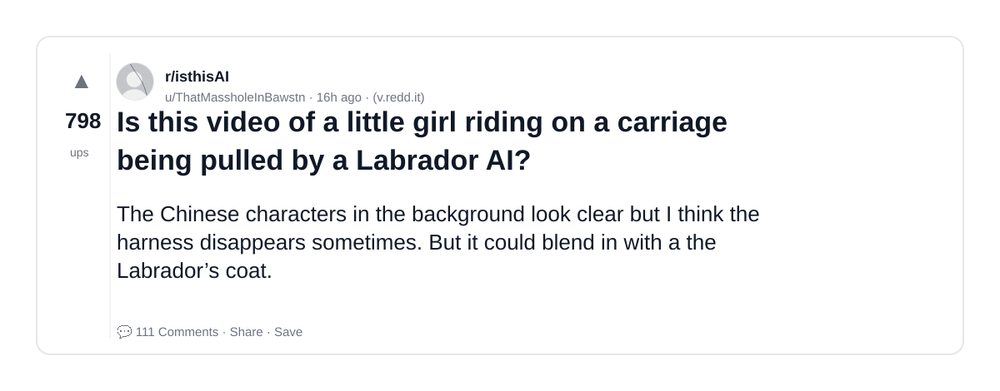

### 7) local restaurant posted this promo picture, but i suspect that they used AI to render this photo.
- Subreddit: r/isthisAI
- Viral score: 143 | Ups: 301 | Comments: 201 | Upvote ratio: 83%
- Link: https://www.reddit.com/r/isthisAI/comments/1s23ndq/local_restaurant_posted_this_promo_picture_but_i/
- Card (local): ./cards/1s23ndq.png

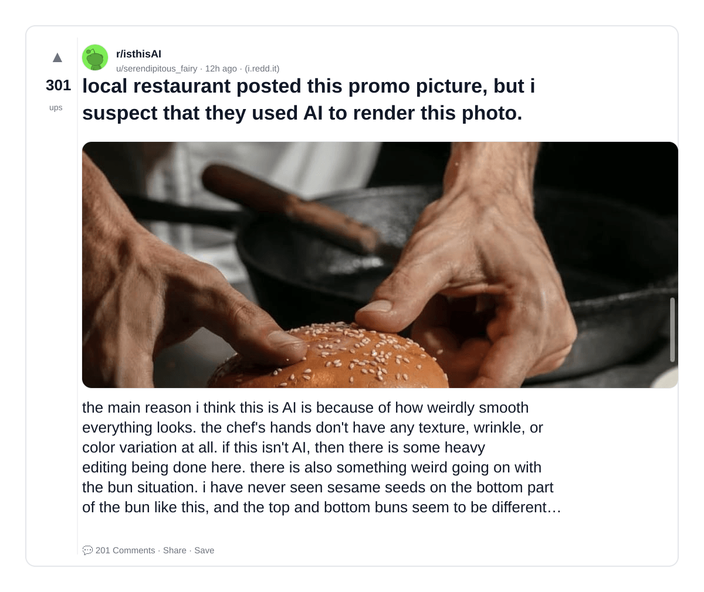

### 8) The ai bubble is slowly popping
- Subreddit: r/antiai
- Viral score: 107 | Ups: 4945 | Comments: 111 | Upvote ratio: 99%
- Link: https://www.reddit.com/r/antiai/comments/1ryun5n/the_ai_bubble_is_slowly_popping/
- Card (local): ./cards/1ryun5n.png

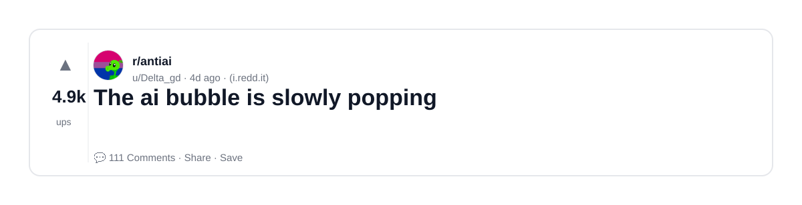

### 9) Is this sandwich AI or just very weirdly food styled? The steak makes so sense nor does the rocket
- Subreddit: r/isthisAI
- Viral score: 103 | Ups: 586 | Comments: 157 | Upvote ratio: 88%
- Link: https://www.reddit.com/r/isthisAI/comments/1s1pgws/is_this_sandwich_ai_or_just_very_weirdly_food/
- Card (local): ./cards/1s1pgws.png

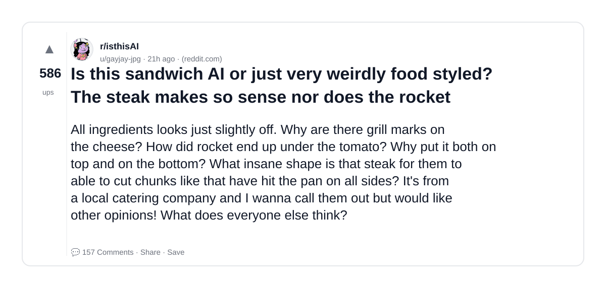

### 10) Anti-AI Art about 'Ragebait'
- Subreddit: r/antiai
- Viral score: 103 | Ups: 14805 | Comments: 985 | Upvote ratio: 96%
- Link: https://www.reddit.com/r/antiai/comments/1rpoktv/antiai_art_about_ragebait/
- Card (local): ./cards/1rpoktv.png

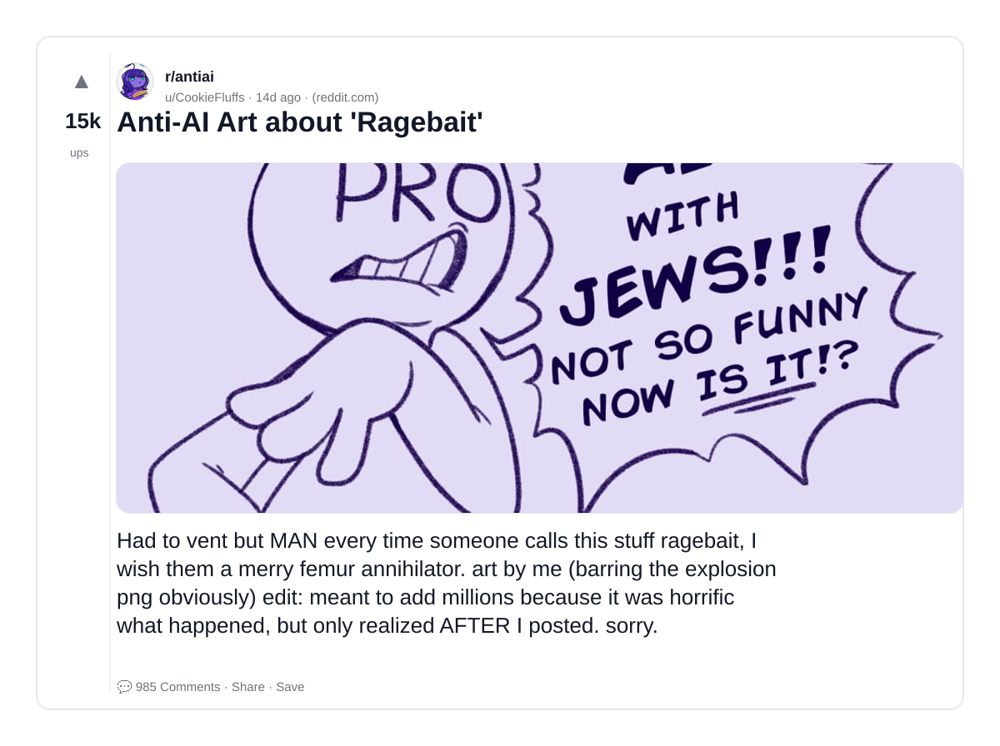

### 11) Strange new genre of AI videos flooding the web.
- Subreddit: r/antiai
- Viral score: 97 | Ups: 20 | Comments: 6 | Upvote ratio: 100%
- Link: https://www.reddit.com/r/antiai/comments/1s2g4l0/strange_new_genre_of_ai_videos_flooding_the_web/
- Card (local): ./cards/1s2g4l0.png

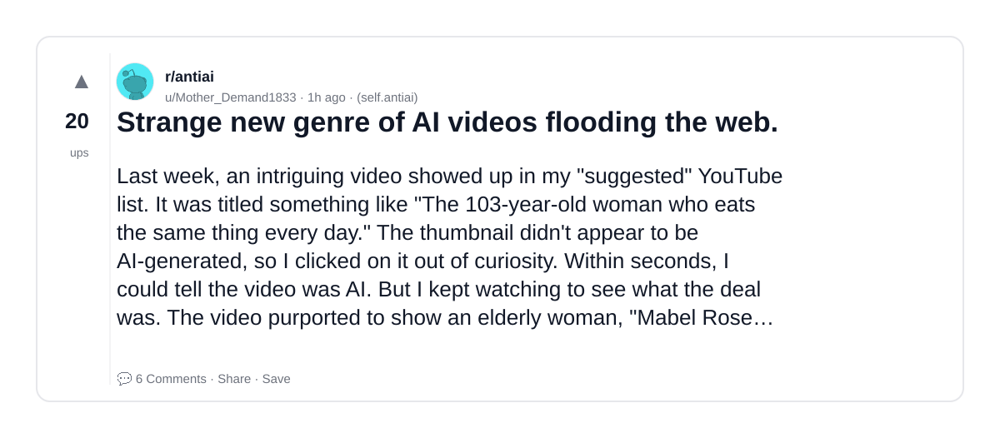

### 12) Help me Prove this is AI - my aunt thinks this is a real person she matched with online
- Subreddit: r/isthisAI
- Viral score: 97 | Ups: 12457 | Comments: 371 | Upvote ratio: 95%
- Link: https://www.reddit.com/r/isthisAI/comments/1rtsnxz/help_me_prove_this_is_ai_my_aunt_thinks_this_is_a/
- Card (local): ./cards/1rtsnxz.png

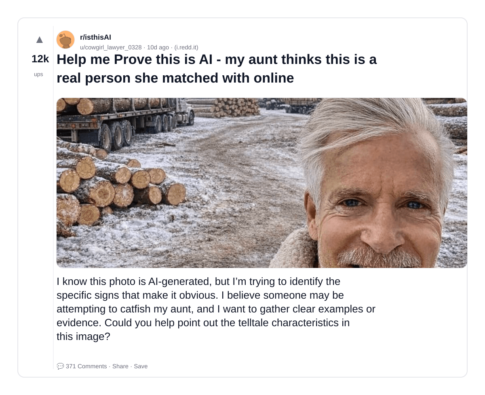

### 13) People who say they "never use AI" referring to chatgpt as "chat"
- Subreddit: r/antiai
- Viral score: 94 | Ups: 854 | Comments: 58 | Upvote ratio: 97%
- Link: https://www.reddit.com/r/antiai/comments/1s1i7di/people_who_say_they_never_use_ai_referring_to/
- Card (local): ./cards/1s1i7di.png

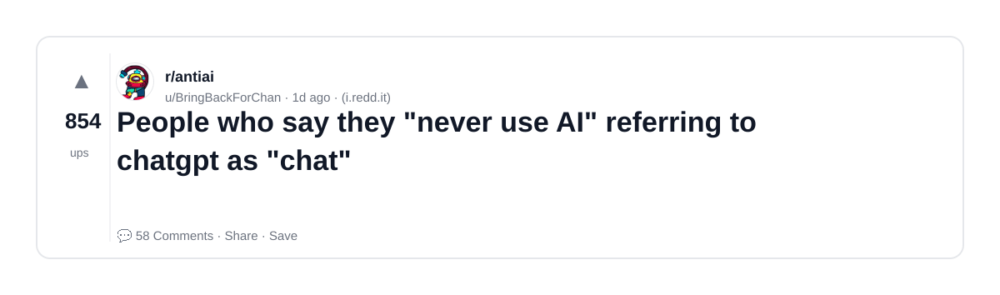

### 14) Loving this trend of AI bros getting a taste of their own medicine!
- Subreddit: r/antiai
- Viral score: 79 | Ups: 19487 | Comments: 532 | Upvote ratio: 97%
- Link: https://www.reddit.com/r/antiai/comments/1rjajcx/loving_this_trend_of_ai_bros_getting_a_taste_of/
- Card (local): ./cards/1rjajcx.png

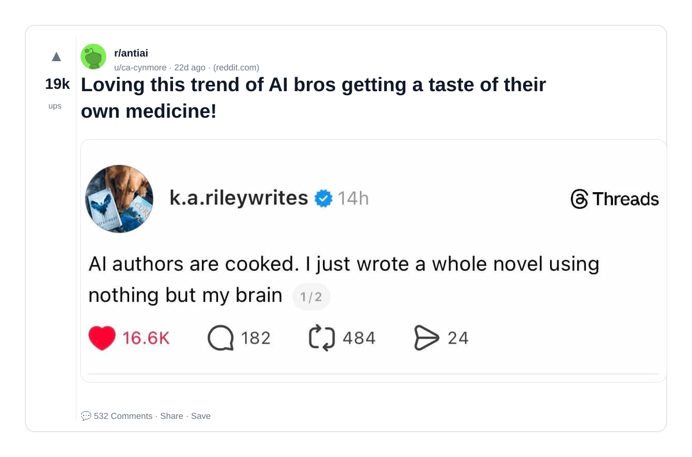

### 15) Is this Ai? I’m having a dollhouse made for my daughter’s birthday but the WIP provided does not look real. The glue bottles are unreadable/gibberish.
- Subreddit: r/isthisAI
- Viral score: 79 | Ups: 8962 | Comments: 1673 | Upvote ratio: 95%
- Link: https://www.reddit.com/r/isthisAI/comments/1rqnupu/is_this_ai_im_having_a_dollhouse_made_for_my/
- Card (local): ./cards/1rqnupu.png

