# Reddit Scout — Apple vs Android iOS development Swift Kotlin mobile architecture

Run: 2026-03-24T21-36-07-467Z
Started: 2026-03-24T21:36:07.468Z
Output dir: /home/ubuntu/.openclaw/workspace-ce/users/8176450202/reddit-scout/apple-vs-android-ios-development-swift-kotlin-mobile-archite/runs/2026-03-24T21-36-07-467Z

Config: topN=15 | subLimit=10 | kinds=top,hot,rising | time=all | limitPerListing=25
Search: Apple vs Android iOS development Swift Kotlin mobile architecture (sort=top t=auto)

## Top terms (from titles + top comments)

- mobile (17)
- have (11)
- game (9)
- what (8)
- android (7)
- mvvm (7)
- apple (6)
- apps (6)
- need (6)
- there (6)
- architecture (5)
- clean (5)
- worth (5)
- also (5)
- using (4)
- battleheart (4)
- still (4)
- when (4)

## Viral content ideas (derived from these posts)

**1. Personal story → timeline + receipts**
- Hook: Hook with 1 line, then a 5-step timeline; end with the lesson and what you would do differently.

**2. My mobile got automated: what I automated back (tools + workflow)**
- Hook: Turn it into a before/after workflow post. Include exact tool stack + steps.

**3. Checklist: how to stay valuable when have hits your team**
- Hook: A numbered checklist (10 items). Make it practical: skills, portfolio, outreach, proof-of-work.

**4. Hot take: game isn't the problem — what is**
- Hook: Contrarian framing. Back it with 2 examples from the top posts and 1 counterexample.

**5. Debunk thread: "AI will replace android" vs what's actually happening**
- Hook: Use 3 claims → 3 rebuttals. Cite specific post patterns: layoffs, hiring freezes, role shifts.

**6. Salary/market reality: mvvm vs apple roles in 2026 (Reddit signals)**
- Hook: Summarize demand signals from comments: who is struggling, who is fine, why.

**7. "What would you do in 30 days?" layoff recovery plan (day-by-day)**
- Hook: 30-day plan: portfolio, interview loops, networking, mental health. Include a downloadable checklist.

**8. Mini-case study: 1 resume bullet → 1 proof project using apps**
- Hook: Show how to convert a vague resume claim into a measurable project + writeup.

**9. Community question: which tasks should *never* be delegated to AI?**
- Hook: Ask + give your own top 5. Encourage replies; add a poll if your platform supports it.

**10. Template post: "I used AI to do X, got Y result, here's the exact prompt"**
- Hook: Make it reproducible: prompt, inputs, outputs, gotchas.

**11. Data post: a quick scorecard of the top threads (ups, comments, ratio) + what it signals**
- Hook: Table or bullets; then 3 takeaways.

**12. Meme angle (if relevant): need vs there — job search edition**
- Hook: If your niche is not memes, skip memes; otherwise caption the pattern you saw in comments.

## Top posts (15) + cards

### 1) Android vs Apple phones
- Subreddit: r/TikTokCringe
- Viral score: 3 | Ups: 34829 | Comments: 5011 | Upvote ratio: 85%
- Link: https://www.reddit.com/r/TikTokCringe/comments/13j14pp/android_vs_apple_phones/
- Card (local): ./cards/13j14pp.png

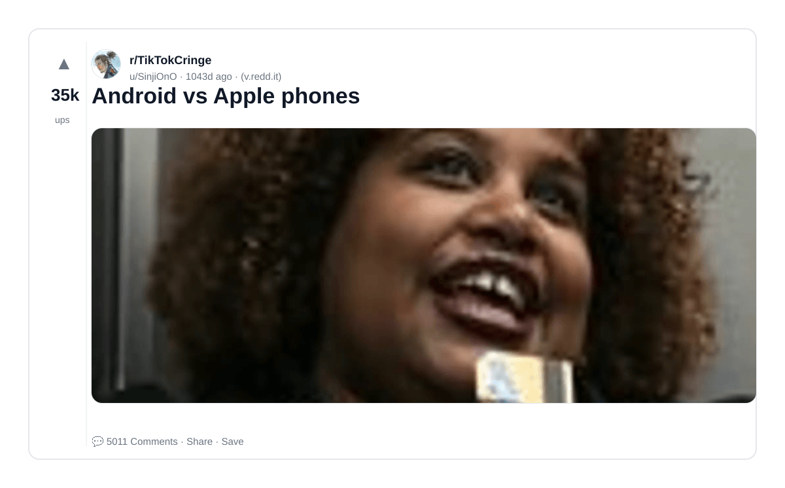

### 2) r/Apple will be joining the blackout to protest Reddit killing 3rd Party Apps such as Apollo
- Subreddit: r/apple
- Viral score: 2 | Ups: 30738 | Comments: 642 | Upvote ratio: 92%
- Link: https://www.reddit.com/r/apple/comments/142kca6/rapple_will_be_joining_the_blackout_to_protest/
- Card (local): ./cards/142kca6.png

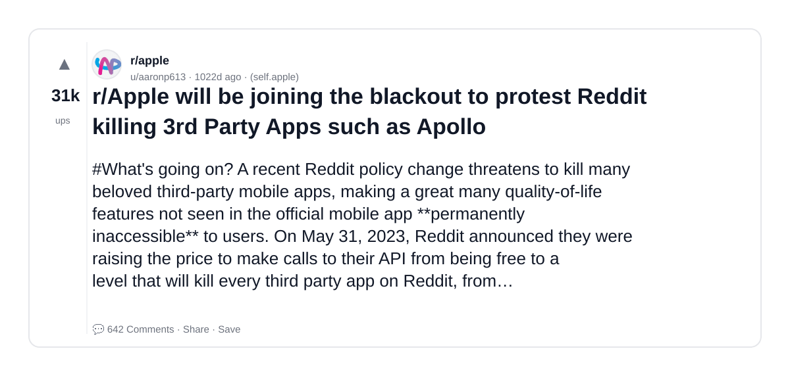

### 3) I’m Apple Co-founder Steve Wozniak, Ask Me Anything!
- Subreddit: r/IAmA
- Viral score: 1 | Ups: 48805 | Comments: 6824 | Upvote ratio: 84%
- Link: https://www.reddit.com/r/IAmA/comments/4apj5f/im_apple_cofounder_steve_wozniak_ask_me_anything/
- Card (local): ./cards/4apj5f.png

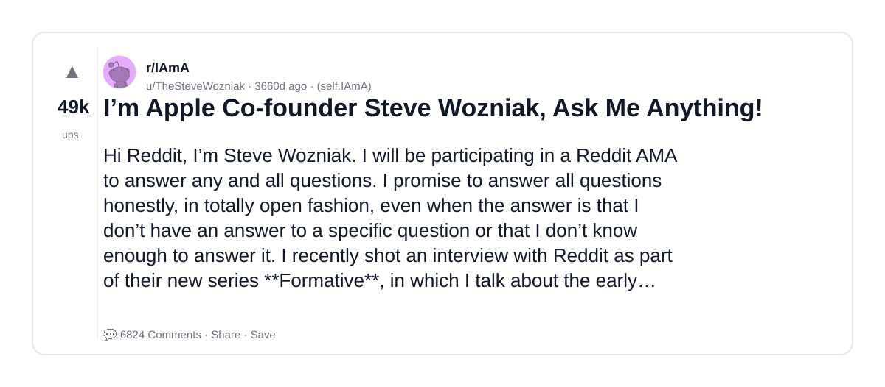

### 4) The biggest word on steve jobs iphone case is Android...🤔
- Subreddit: r/CrappyDesign
- Viral score: 1 | Ups: 31338 | Comments: 371 | Upvote ratio: 91%
- Link: https://www.reddit.com/r/CrappyDesign/comments/79va78/the_biggest_word_on_steve_jobs_iphone_case_is/
- Card (local): ./cards/79va78.png

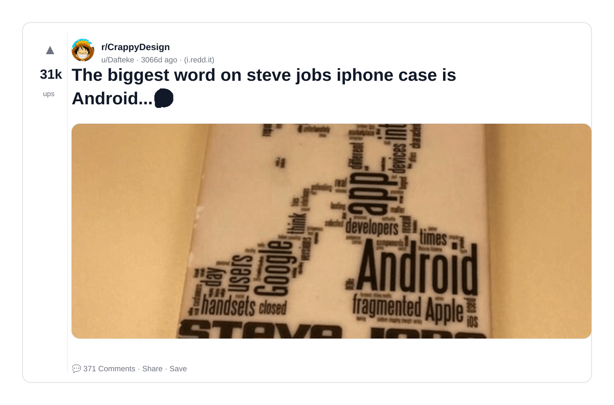

### 5) has anyone built an mobile app for free using vibe coding?
- Subreddit: r/MobileAppDevHQ
- Viral score: 0 | Ups: 11 | Comments: 22 | Upvote ratio: 100%
- Link: https://www.reddit.com/r/MobileAppDevHQ/comments/1rw2lu0/has_anyone_built_an_mobile_app_for_free_using/
- Card (local): ./cards/1rw2lu0.png

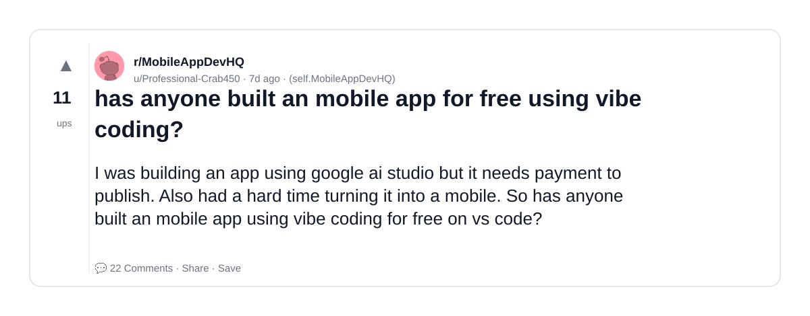

### 6) How Much Does It Really Cost to Build a Mobile App in 2026?
- Subreddit: r/MobileAppDevHQ
- Viral score: 0 | Ups: 12 | Comments: 25 | Upvote ratio: 100%
- Link: https://www.reddit.com/r/MobileAppDevHQ/comments/1ros05o/how_much_does_it_really_cost_to_build_a_mobile/
- Card (local): ./cards/1ros05o.png

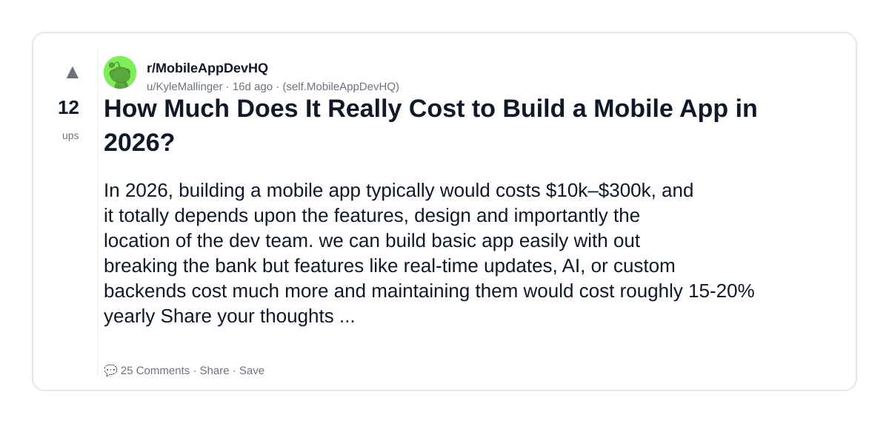

### 7) How can i validate a Mobile App Idea Before Building It?
- Subreddit: r/MobileAppDevHQ
- Viral score: 0 | Ups: 5 | Comments: 4 | Upvote ratio: 86%
- Link: https://www.reddit.com/r/MobileAppDevHQ/comments/1rv0jr4/how_can_i_validate_a_mobile_app_idea_before/
- Card (local): ./cards/1rv0jr4.png

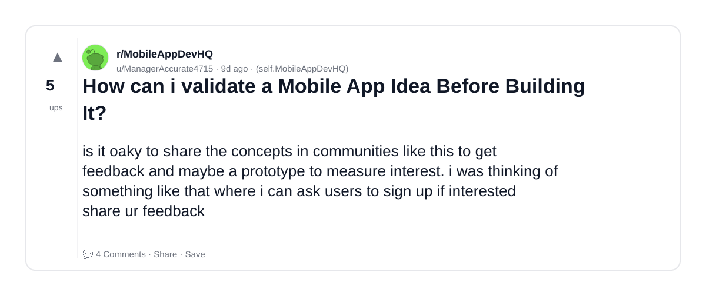

### 8) What Architecture Do You Prefer for Scalable Mobile Apps? (MVVM, Clean Architecture,etc.)
- Subreddit: r/MobileAppDevHQ
- Viral score: 0 | Ups: 3 | Comments: 3 | Upvote ratio: 81%
- Link: https://www.reddit.com/r/MobileAppDevHQ/comments/1rwtucy/what_architecture_do_you_prefer_for_scalable/
- Card (local): ./cards/1rwtucy.png

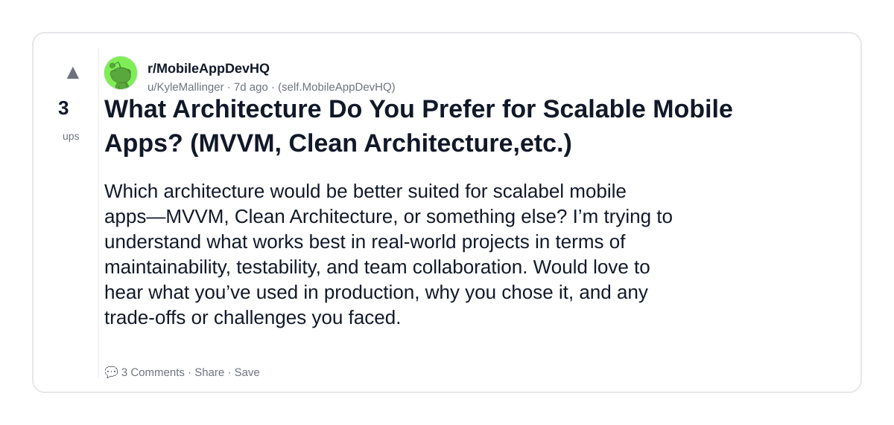

### 9) How to install Battleheart on Android?
- Subreddit: r/battleheart
- Viral score: 0 | Ups: 3 | Comments: 4 | Upvote ratio: 81%
- Link: https://www.reddit.com/r/battleheart/comments/1oi6j2i/how_to_install_battleheart_on_android/
- Card (local): ./cards/1oi6j2i.png

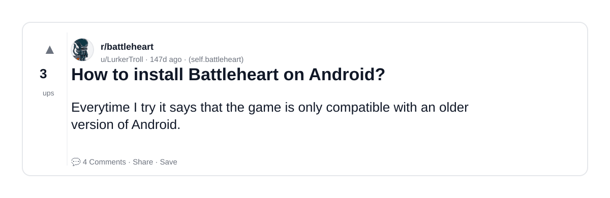

### 10) Welcome to the Mobile App Development Community 👋
- Subreddit: r/MobileAppDevHQ
- Viral score: 0 | Ups: 2 | Comments: 0 | Upvote ratio: 100%
- Link: https://www.reddit.com/r/MobileAppDevHQ/comments/1r6y8jg/welcome_to_the_mobile_app_development_community/
- Card (local): ./cards/1r6y8jg.png

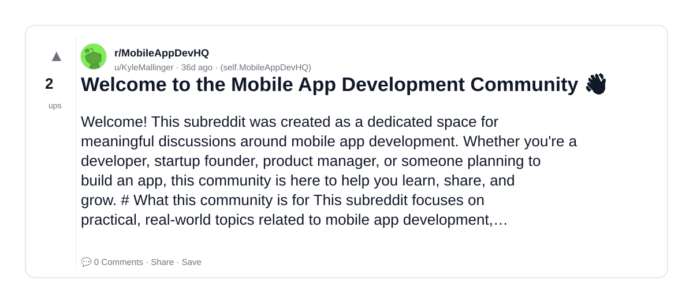

### 11) So just got an iphone after years using an android and planned to buy this game. Is it still worth it?
- Subreddit: r/battleheart
- Viral score: 0 | Ups: 4 | Comments: 1 | Upvote ratio: 84%
- Link: https://www.reddit.com/r/battleheart/comments/1dk5pd8/so_just_got_an_iphone_after_years_using_an/
- Card (local): ./cards/1dk5pd8.png

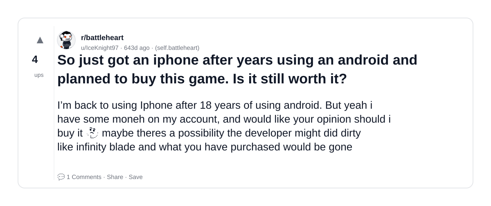

### 12) Naruto Slugfest for Mobile is releasing!
- Subreddit: r/MobileGamingNews
- Viral score: 0 | Ups: 5 | Comments: 6 | Upvote ratio: 100%
- Link: https://www.reddit.com/r/MobileGamingNews/comments/ei7av3/naruto_slugfest_for_mobile_is_releasing/
- Card (local): ./cards/ei7av3.png

### 13) Out Now: ‘Hyper Light Drifter’, ‘Pokemon Rumble Rush’, ‘Super Mecha Champions’, ‘Stick Fight: The Game Mobile’, ‘Always Sunny: The Gang Goes Mobile’, ‘Garena Speed Drifters’, ‘Sticky Bodies’ and More
- Subreddit: r/MobileGamingNews
- Viral score: 0 | Ups: 2 | Comments: 1 | Upvote ratio: 100%
- Link: https://www.reddit.com/r/MobileGamingNews/comments/choizm/out_now_hyper_light_drifter_pokemon_rumble_rush/
- Card (local): ./cards/choizm.png

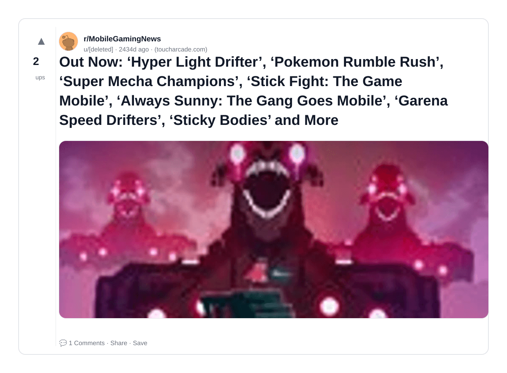

### 14) Out Now: ‘Sky: Children of the Light’, ‘Flashback Mobile’, ‘Beholder 2’, ‘P1 Select’, ‘CrashCrafter’, ‘Project Zero Deaths’, ‘Dark Sword 2′,’Faily RocketMan’, ‘Healer’s Quest: Pocket Wand’ and More
- Subreddit: r/MobileGamingNews
- Viral score: 0 | Ups: 2 | Comments: 0 | Upvote ratio: 100%
- Link: https://www.reddit.com/r/MobileGamingNews/comments/cer52r/out_now_sky_children_of_the_light_flashback/
- Card (local): ./cards/cer52r.png

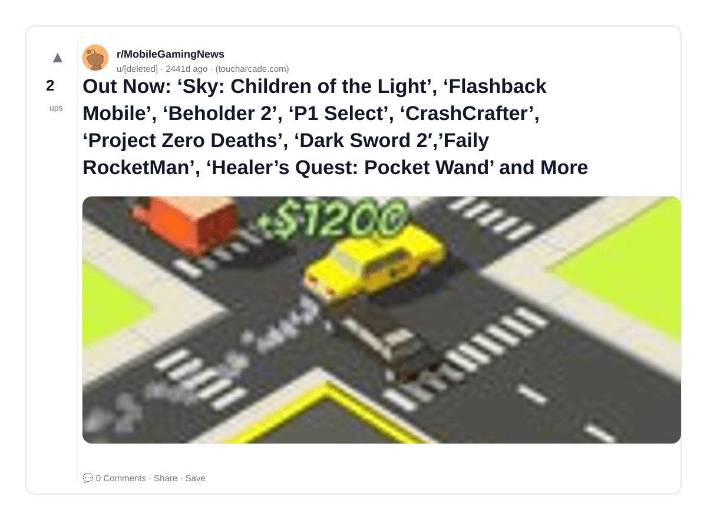

### 15) ‘Playerless’ is a Cute “Game Within a Game” Adventure Heading to PC, Consoles, and Mobile this Year
- Subreddit: r/MobileGamingNews
- Viral score: 0 | Ups: 1 | Comments: 0 | Upvote ratio: 100%
- Link: https://www.reddit.com/r/MobileGamingNews/comments/chojmb/playerless_is_a_cute_game_within_a_game_adventure/
- Card (local): ./cards/chojmb.png

