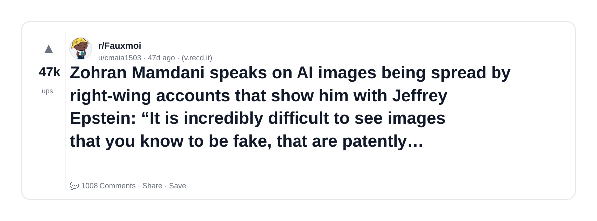
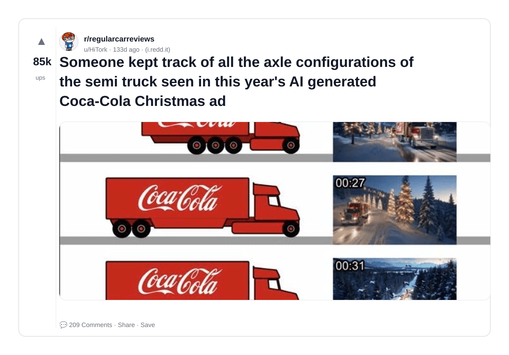
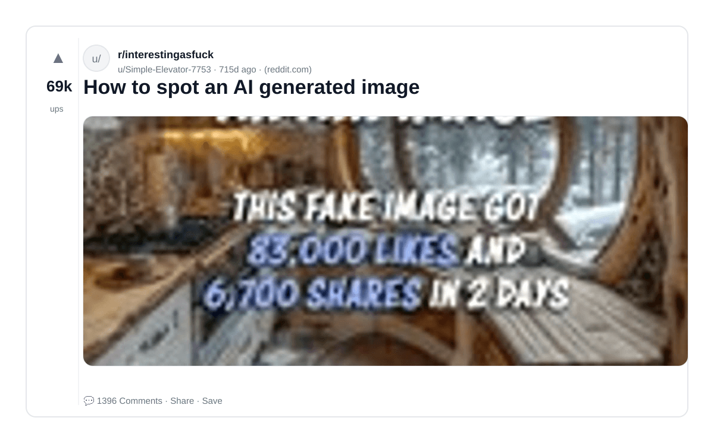
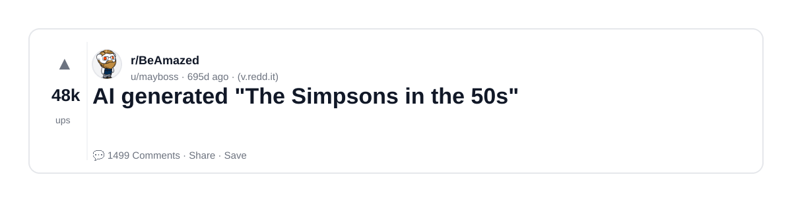
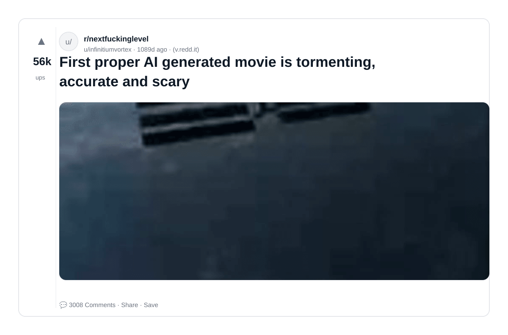
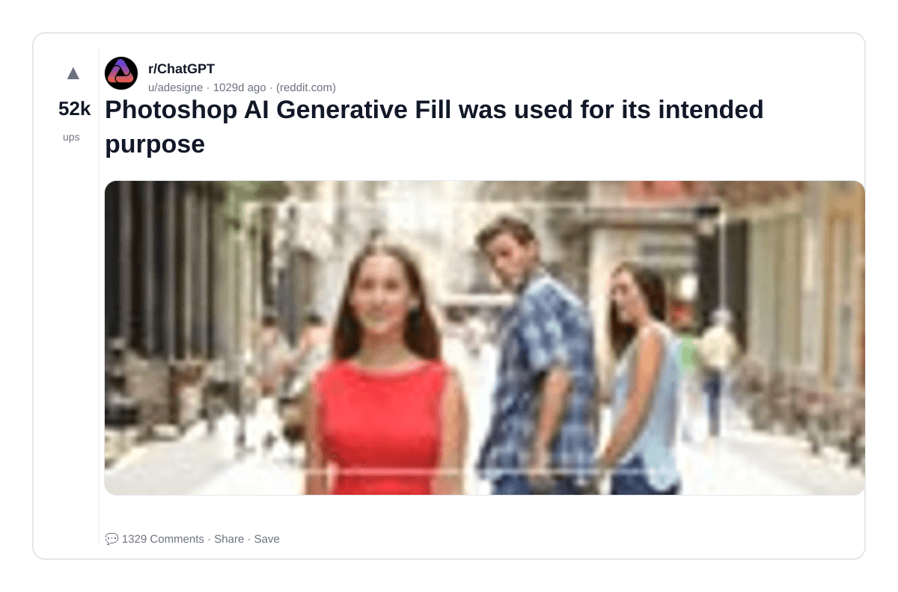
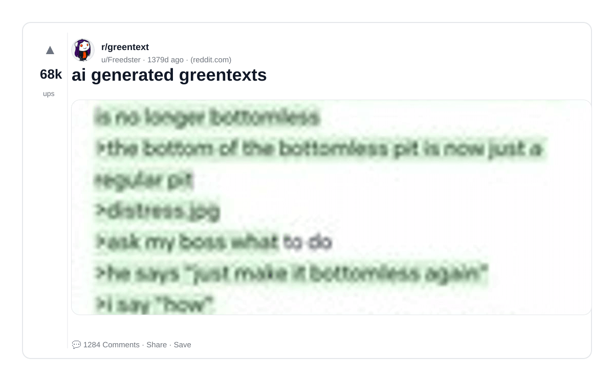
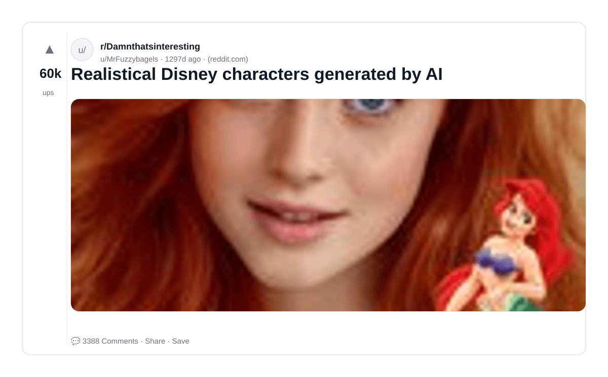
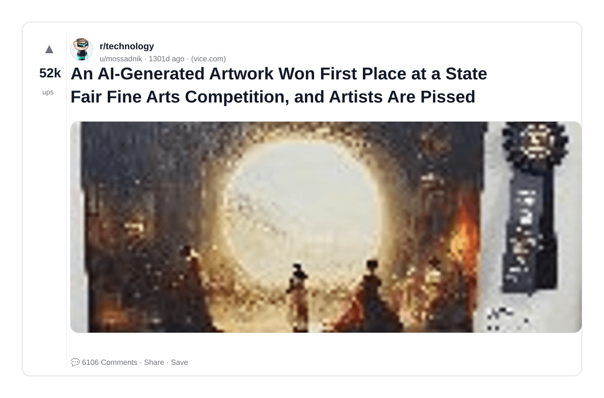
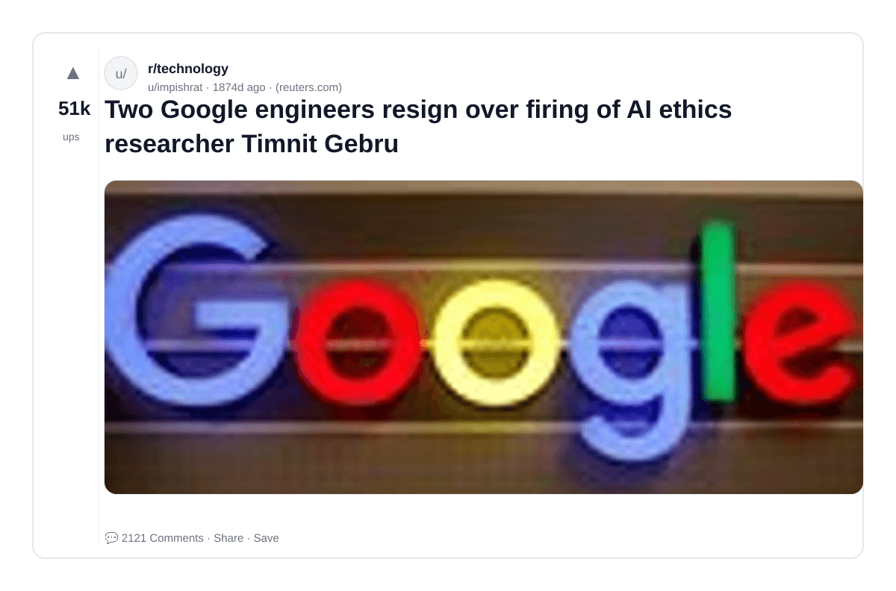

# Reddit Scout — Gen AI, Generative AI, LLM, Large Language Models, AI Safety, Prompt Engineering

Run: 2026-03-24T20-35-56-288Z
Started: 2026-03-24T20:35:56.289Z
Output dir: /home/ubuntu/.openclaw/workspace-ce/users/8176450202/reddit-scout/gen-ai-generative-ai-llm-large-language-models-ai-safety-pro/runs/2026-03-24T20-35-56-288Z

Config: topN=12 | subLimit=10 | kinds=top,hot,rising | time=all | limitPerListing=25
Search: Gen AI, Generative AI, LLM, Large Language Models, AI Safety, Prompt Engineering (sort=top t=auto)

## Top terms (from titles + top comments)

- generated (16)
- have (6)
- video (6)
- like (4)
- what (4)
- images (3)
- seen (3)
- first (3)
- ethics (3)
- maybe (3)
- though (3)
- bryan (3)
- cranston (3)
- flanders (3)
- talented (3)
- hand (3)
- printed (3)
- right (2)

## Viral content ideas (derived from these posts)

**1. Personal story → timeline + receipts**
- Hook: Hook with 1 line, then a 5-step timeline; end with the lesson and what you would do differently.

**2. My generated got automated: what I automated back (tools + workflow)**
- Hook: Turn it into a before/after workflow post. Include exact tool stack + steps.

**3. Checklist: how to stay valuable when have hits your team**
- Hook: A numbered checklist (10 items). Make it practical: skills, portfolio, outreach, proof-of-work.

**4. Hot take: video isn't the problem — like is**
- Hook: Contrarian framing. Back it with 2 examples from the top posts and 1 counterexample.

**5. Debunk thread: "AI will replace what" vs what's actually happening**
- Hook: Use 3 claims → 3 rebuttals. Cite specific post patterns: layoffs, hiring freezes, role shifts.

**6. Salary/market reality: images vs seen roles in 2026 (Reddit signals)**
- Hook: Summarize demand signals from comments: who is struggling, who is fine, why.

**7. "What would you do in 30 days?" layoff recovery plan (day-by-day)**
- Hook: 30-day plan: portfolio, interview loops, networking, mental health. Include a downloadable checklist.

**8. Mini-case study: 1 resume bullet → 1 proof project using first**
- Hook: Show how to convert a vague resume claim into a measurable project + writeup.

**9. Community question: which tasks should *never* be delegated to AI?**
- Hook: Ask + give your own top 5. Encourage replies; add a poll if your platform supports it.

**10. Template post: "I used AI to do X, got Y result, here's the exact prompt"**
- Hook: Make it reproducible: prompt, inputs, outputs, gotchas.

**11. Data post: a quick scorecard of the top threads (ups, comments, ratio) + what it signals**
- Hook: Table or bullets; then 3 takeaways.

**12. Meme angle (if relevant): ethics vs maybe — job search edition**
- Hook: If your niche is not memes, skip memes; otherwise caption the pattern you saw in comments.

## Top posts (10) + cards

### 1) Zohran Mamdani speaks on AI images being spread by right-wing accounts that show him with Jeffrey Epstein: “It is incredibly difficult to see images that you know to be fake, that are patently photoshopped &amp; AI-generated &amp; yet can cross across the entirety of the world. In an era of misinformation.”
- Subreddit: r/Fauxmoi
- Viral score: 96 | Ups: 46957 | Comments: 1008 | Upvote ratio: 96%
- Link: https://www.reddit.com/r/Fauxmoi/comments/1qwp3uk/zohran_mamdani_speaks_on_ai_images_being_spread/
- Card (local): ./cards/1qwp3uk.png

### 2) Someone kept track of all the axle configurations of the semi truck seen in this year's AI generated Coca-Cola Christmas ad
- Subreddit: r/regularcarreviews
- Viral score: 39 | Ups: 85123 | Comments: 209 | Upvote ratio: 97%
- Link: https://www.reddit.com/r/regularcarreviews/comments/1oubl82/someone_kept_track_of_all_the_axle_configurations/
- Card (local): ./cards/1oubl82.png

### 3) How to spot an AI generated image
- Subreddit: r/interestingasfuck
- Viral score: 7 | Ups: 68742 | Comments: 1396 | Upvote ratio: 94%
- Link: https://www.reddit.com/r/interestingasfuck/comments/1byzpzp/how_to_spot_an_ai_generated_image/
- Card (local): ./cards/1byzpzp.png

### 4) AI generated "The Simpsons in the 50s"
- Subreddit: r/BeAmazed
- Viral score: 5 | Ups: 47950 | Comments: 1499 | Upvote ratio: 76%
- Link: https://www.reddit.com/r/BeAmazed/comments/1cfsmzd/ai_generated_the_simpsons_in_the_50s/
- Card (local): ./cards/1cfsmzd.png

### 5) First proper AI generated movie is tormenting, accurate and scary
- Subreddit: r/nextfuckinglevel
- Viral score: 4 | Ups: 55849 | Comments: 3008 | Upvote ratio: 79%
- Link: https://www.reddit.com/r/nextfuckinglevel/comments/127nsra/first_proper_ai_generated_movie_is_tormenting/
- Card (local): ./cards/127nsra.png

### 6) Photoshop AI Generative Fill was used for its intended purpose
- Subreddit: r/ChatGPT
- Viral score: 4 | Ups: 52073 | Comments: 1329 | Upvote ratio: 91%
- Link: https://www.reddit.com/r/ChatGPT/comments/13wfaqg/photoshop_ai_generative_fill_was_used_for_its/
- Card (local): ./cards/13wfaqg.png

### 7) ai generated greentexts
- Subreddit: r/greentext
- Viral score: 3 | Ups: 67653 | Comments: 1284 | Upvote ratio: 96%
- Link: https://www.reddit.com/r/greentext/comments/vc6ow2/ai_generated_greentexts/
- Card (local): ./cards/vc6ow2.png

### 8) Realistical Disney characters generated by AI
- Subreddit: r/Damnthatsinteresting
- Viral score: 3 | Ups: 60328 | Comments: 3388 | Upvote ratio: 83%
- Link: https://www.reddit.com/r/Damnthatsinteresting/comments/x5v22m/realistical_disney_characters_generated_by_ai/
- Card (local): ./cards/x5v22m.png

### 9) An AI-Generated Artwork Won First Place at a State Fair Fine Arts Competition, and Artists Are Pissed
- Subreddit: r/technology
- Viral score: 3 | Ups: 51605 | Comments: 6106 | Upvote ratio: 90%
- Link: https://www.reddit.com/r/technology/comments/x2lh62/an_aigenerated_artwork_won_first_place_at_a_state/
- Card (local): ./cards/x2lh62.png

### 10) Two Google engineers resign over firing of AI ethics researcher Timnit Gebru
- Subreddit: r/technology
- Viral score: 2 | Ups: 50866 | Comments: 2121 | Upvote ratio: 89%
- Link: https://www.reddit.com/r/technology/comments/lcc5dv/two_google_engineers_resign_over_firing_of_ai/
- Card (local): ./cards/lcc5dv.png

