# Reddit Scout — LLM fine-tuning LoRA RLHF language model training

Run: 2026-03-24T10-35-20-769Z
Started: 2026-03-24T10:35:20.770Z
Output dir: users/8176450202/reddit-scout/llm-fine-tuning-lora-rlhf-language-model-training/runs/2026-03-24T10-35-20-769Z

Config: topN=15 | subLimit=12 | kinds=top,hot,rising | time=week | limitPerListing=25
Search: LLM fine-tuning LoRA RLHF language model training (sort=top t=auto)

## Top terms (from titles + top comments)

- model (13)
- like (12)
- qwen3 (9)
- what (9)
- training (9)
- have (8)
- models (8)
- better (7)
- which (6)
- best (6)
- https (6)
- format (6)
- fine (5)
- version (5)
- code (5)
- much (5)
- thinking (4)
- running (4)

## Viral content ideas (derived from these posts)

**1. Personal story → timeline + receipts**
- Hook: Hook with 1 line, then a 5-step timeline; end with the lesson and what you would do differently.

**2. My model got automated: what I automated back (tools + workflow)**
- Hook: Turn it into a before/after workflow post. Include exact tool stack + steps.

**3. Checklist: how to stay valuable when like hits your team**
- Hook: A numbered checklist (10 items). Make it practical: skills, portfolio, outreach, proof-of-work.

**4. Hot take: qwen3 isn't the problem — what is**
- Hook: Contrarian framing. Back it with 2 examples from the top posts and 1 counterexample.

**5. Debunk thread: "AI will replace training" vs what's actually happening**
- Hook: Use 3 claims → 3 rebuttals. Cite specific post patterns: layoffs, hiring freezes, role shifts.

**6. Salary/market reality: have vs models roles in 2026 (Reddit signals)**
- Hook: Summarize demand signals from comments: who is struggling, who is fine, why.

**7. "What would you do in 30 days?" layoff recovery plan (day-by-day)**
- Hook: 30-day plan: portfolio, interview loops, networking, mental health. Include a downloadable checklist.

**8. Mini-case study: 1 resume bullet → 1 proof project using better**
- Hook: Show how to convert a vague resume claim into a measurable project + writeup.

**9. Community question: which tasks should *never* be delegated to AI?**
- Hook: Ask + give your own top 5. Encourage replies; add a poll if your platform supports it.

**10. Template post: "I used AI to do X, got Y result, here's the exact prompt"**
- Hook: Make it reproducible: prompt, inputs, outputs, gotchas.

**11. Data post: a quick scorecard of the top threads (ups, comments, ratio) + what it signals**
- Hook: Table or bullets; then 3 takeaways.

**12. Meme angle (if relevant): which vs best — job search edition**
- Hook: If your niche is not memes, skip memes; otherwise caption the pattern you saw in comments.

## Top posts (15) + cards

### 1) GPT 5.4 thinking model
- Subreddit: r/ChatGPT
- Viral score: 142 | Ups: 1108 | Comments: 59 | Upvote ratio: 99%
- Link: https://www.reddit.com/r/ChatGPT/comments/1s1fsi0/gpt_54_thinking_model/
- Card (local): ./cards/1s1fsi0.png

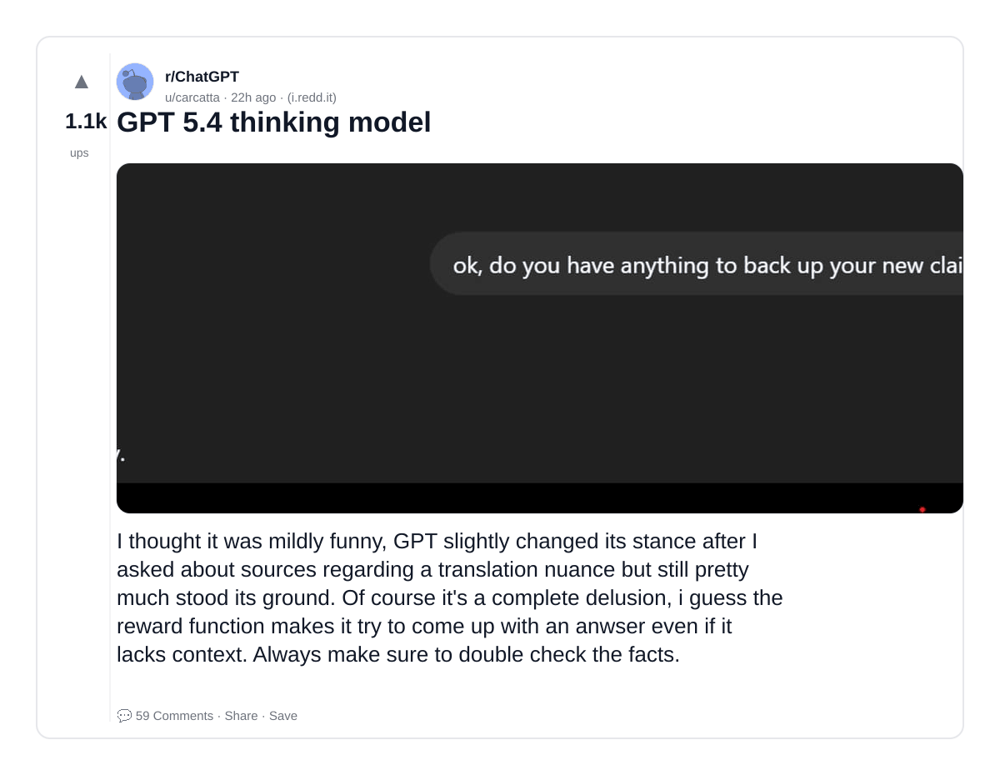

### 2) RYS II - Repeated layers with Qwen3.5 27B and some hints at a 'Universal Language'
- Subreddit: r/LocalLLaMA
- Viral score: 99 | Ups: 399 | Comments: 68 | Upvote ratio: 98%
- Link: https://www.reddit.com/r/LocalLLaMA/comments/1s1t5ot/rys_ii_repeated_layers_with_qwen35_27b_and_some/
- Card (local): ./cards/1s1t5ot.png

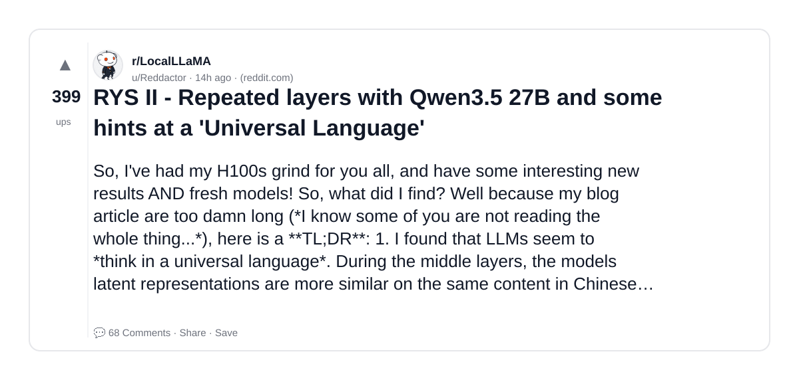

### 3) SamsungCam UltraReal - Qwen2512 LoRA
- Subreddit: r/StableDiffusion
- Viral score: 60 | Ups: 485 | Comments: 58 | Upvote ratio: 96%
- Link: https://www.reddit.com/r/StableDiffusion/comments/1s1fwih/samsungcam_ultrareal_qwen2512_lora/
- Card (local): ./cards/1s1fwih.png

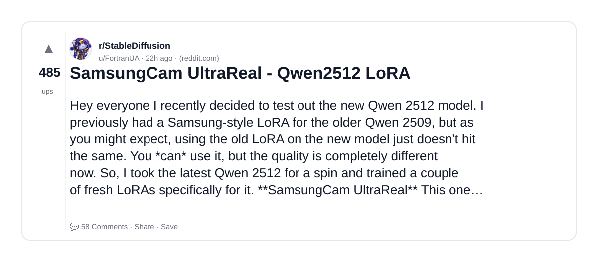

### 4) Which local model we running on the overland Jeep fellas?
- Subreddit: r/LocalLLaMA
- Viral score: 54 | Ups: 237 | Comments: 98 | Upvote ratio: 96%
- Link: https://www.reddit.com/r/LocalLLaMA/comments/1s1kyla/which_local_model_we_running_on_the_overland_jeep/
- Card (local): ./cards/1s1kyla.png

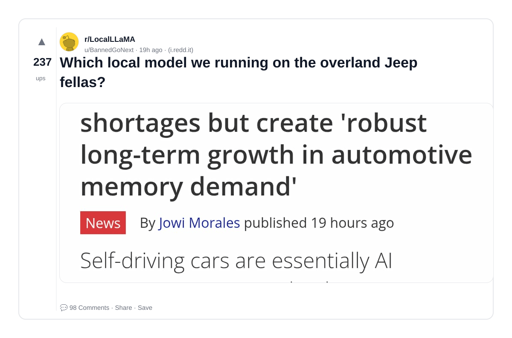

### 5) So cursor admits that Kimi K2.5 is the best open source model
- Subreddit: r/LocalLLaMA
- Viral score: 51 | Ups: 456 | Comments: 78 | Upvote ratio: 95%
- Link: https://www.reddit.com/r/LocalLLaMA/comments/1s19ik2/so_cursor_admits_that_kimi_k25_is_the_best_open/
- Card (local): ./cards/1s19ik2.png

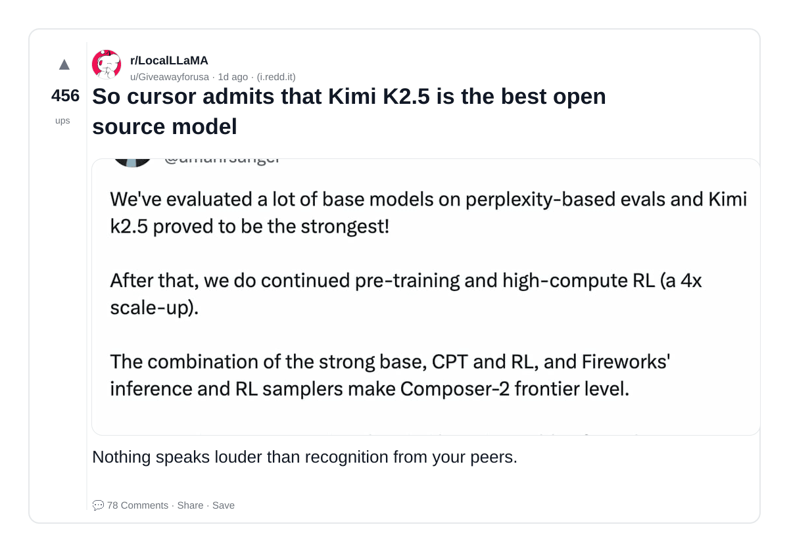

### 6) ChatGPT: "I don't have 7zip installed? Fine, I’ll reverse-engineer the entire 7z specification and write a bitwise parser in Python."
- Subreddit: r/ChatGPT
- Viral score: 49 | Ups: 1127 | Comments: 144 | Upvote ratio: 96%
- Link: https://www.reddit.com/r/ChatGPT/comments/1s06mg7/chatgpt_i_dont_have_7zip_installed_fine_ill/
- Card (local): ./cards/1s06mg7.png

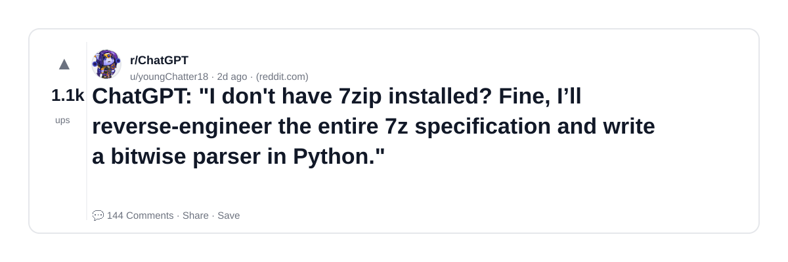

### 7) Another appreciation post for qwen3.5 27b model
- Subreddit: r/LocalLLaMA
- Viral score: 32 | Ups: 117 | Comments: 65 | Upvote ratio: 93%
- Link: https://www.reddit.com/r/LocalLLaMA/comments/1s1p2jo/another_appreciation_post_for_qwen35_27b_model/
- Card (local): ./cards/1s1p2jo.png

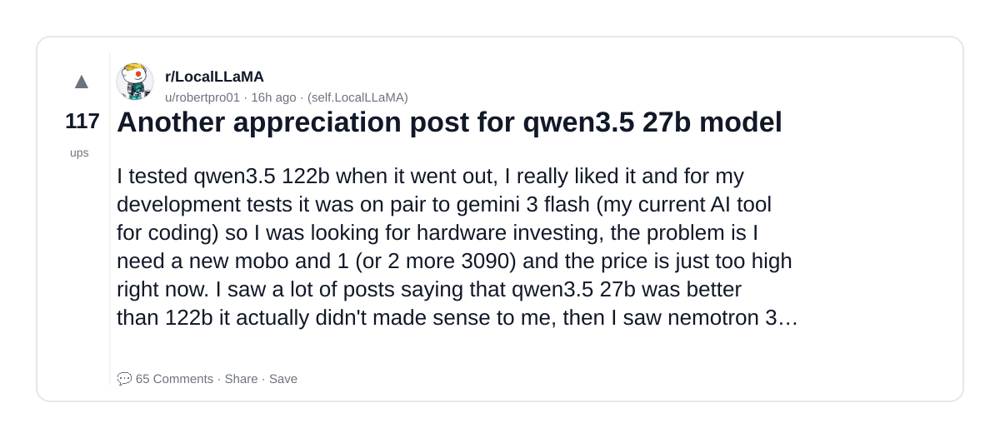

### 8) Impressive thread from /r/ChatGPT, where after ChatGPT finds out no 7Zip, tar, py7zr, apt-get, Internet, it just manually parsed and unzipped from hex data of the .7z file. What model + prompts would be able to do this?
- Subreddit: r/LocalLLaMA
- Viral score: 26 | Ups: 456 | Comments: 89 | Upvote ratio: 91%
- Link: https://www.reddit.com/r/LocalLLaMA/comments/1s0mmsn/impressive_thread_from_rchatgpt_where_after/
- Card (local): ./cards/1s0mmsn.png

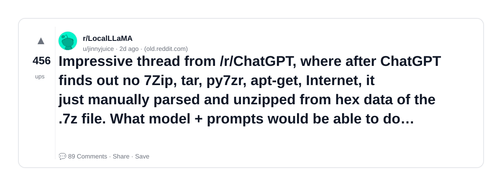

### 9) Run Qwen3.5 flagship model with 397 billion parameters at 5 – 9 tok/s on a $2,100 desktop! Two $500 GPUs, 32GB RAM, one NVMe drive. Uses Q4_K_M quants
- Subreddit: r/LocalLLaMA
- Viral score: 24 | Ups: 70 | Comments: 38 | Upvote ratio: 85%
- Link: https://www.reddit.com/r/LocalLLaMA/comments/1s1wgph/run_qwen35_flagship_model_with_397_billion/
- Card (local): ./cards/1s1wgph.png

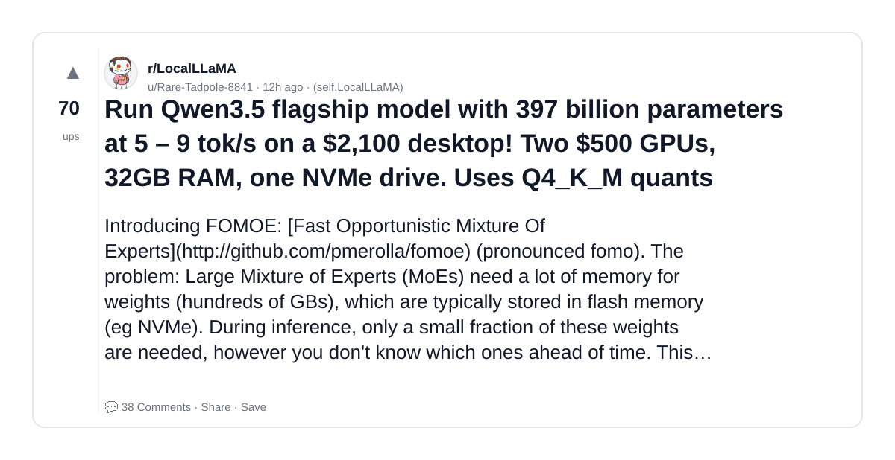

### 10) So nobody's downloading this model huh?
- Subreddit: r/LocalLLaMA
- Viral score: 14 | Ups: 647 | Comments: 250 | Upvote ratio: 93%
- Link: https://www.reddit.com/r/LocalLLaMA/comments/1rxbtyj/so_nobodys_downloading_this_model_huh/
- Card (local): ./cards/1rxbtyj.png

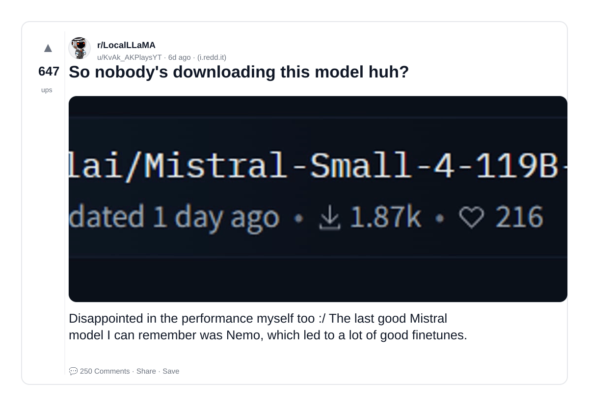

### 11) ID-LoRA with LTX-2.3 and ComfyUI custom node🎉
- Subreddit: r/StableDiffusion
- Viral score: 14 | Ups: 282 | Comments: 54 | Upvote ratio: 99%
- Link: https://www.reddit.com/r/StableDiffusion/comments/1s0dk2b/idlora_with_ltx23_and_comfyui_custom_node/
- Card (local): ./cards/1s0dk2b.png

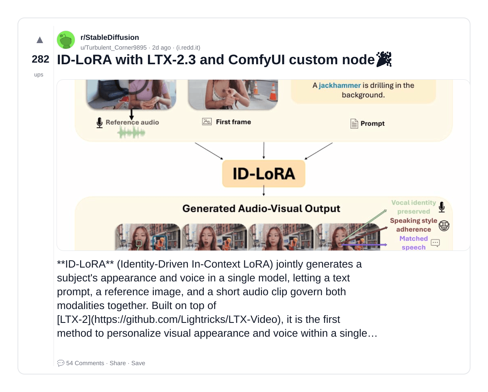

### 12) Two new Qwen3.5 “Neo” fine‑tunes focused on fast, efficient reasoning
- Subreddit: r/LocalLLaMA
- Viral score: 13 | Ups: 20 | Comments: 3 | Upvote ratio: 95%
- Link: https://www.reddit.com/r/LocalLLaMA/comments/1s270px/two_new_qwen35_neo_finetunes_focused_on_fast/
- Card (local): ./cards/1s270px.png

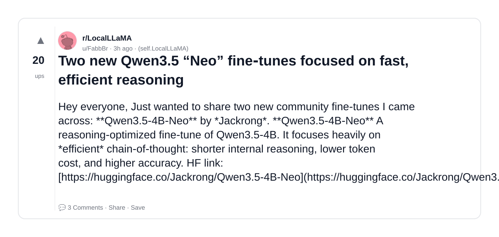

### 13) Request: Training a pretrained, MoE version of Mistral Nemo
- Subreddit: r/LocalLLaMA
- Viral score: 10 | Ups: 7 | Comments: 0 | Upvote ratio: 100%
- Link: https://www.reddit.com/r/LocalLLaMA/comments/1s298y6/request_training_a_pretrained_moe_version_of/
- Card (local): ./cards/1s298y6.png

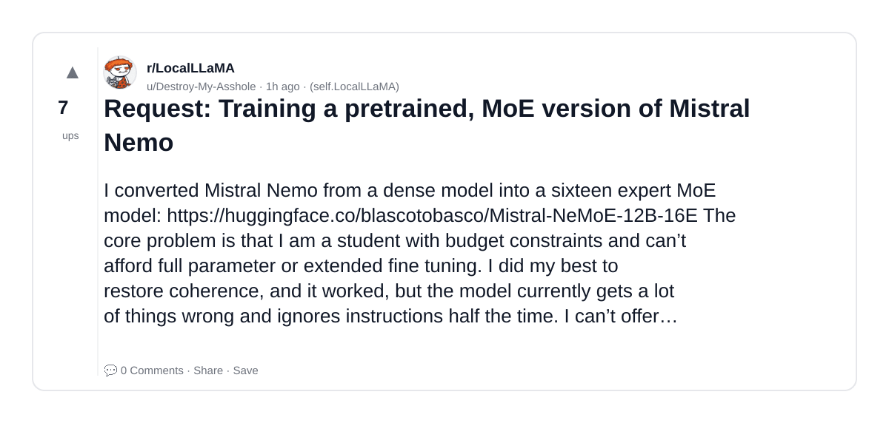

### 14) LinkedIn is training ML models to detect behavior humans literally cannot fake. automation won’t work?
- Subreddit: r/deeplearning
- Viral score: 9 | Ups: 3 | Comments: 9 | Upvote ratio: 61%
- Link: https://www.reddit.com/r/deeplearning/comments/1s27bqf/linkedin_is_training_ml_models_to_detect_behavior/
- Card (local): ./cards/1s27bqf.png

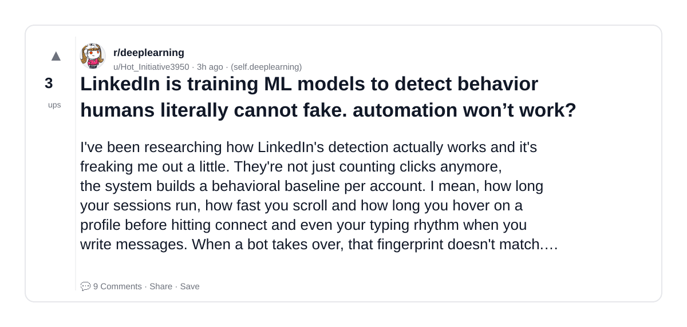

### 15) Hugging Face just released a one-liner that uses 𝚕𝚕𝚖𝚏𝚒𝚝 to detect your hardware and pick the best model and quant, spins up a 𝚕𝚕a𝚖𝚊.𝚌𝚙𝚙 server, and launches Pi (the agent behind OpenClaw 🦞)
- Subreddit: r/LocalLLaMA
- Viral score: 9 | Ups: 646 | Comments: 80 | Upvote ratio: 96%
- Link: https://www.reddit.com/r/LocalLLaMA/comments/1rwgi8x/hugging_face_just_released_a_oneliner_that_uses/
- Card (local): ./cards/1rwgi8x.png

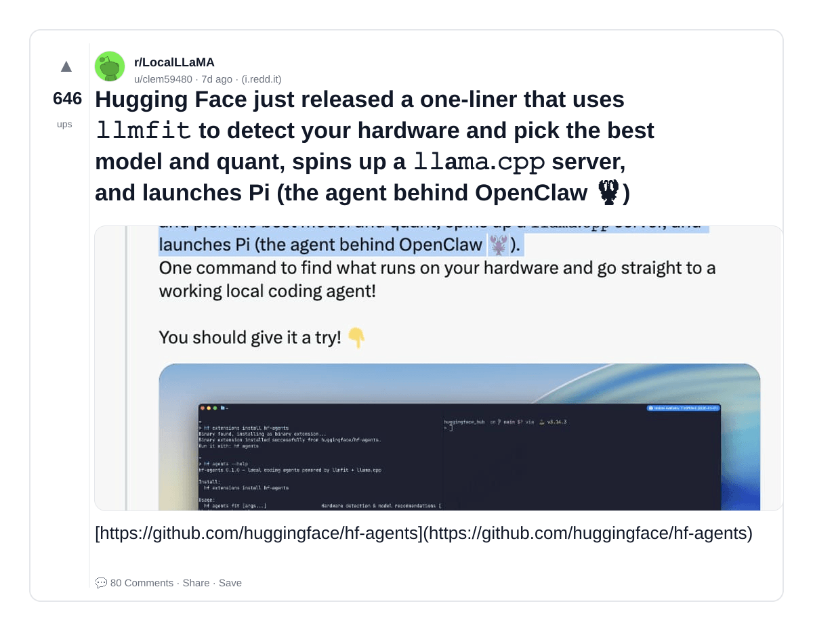
