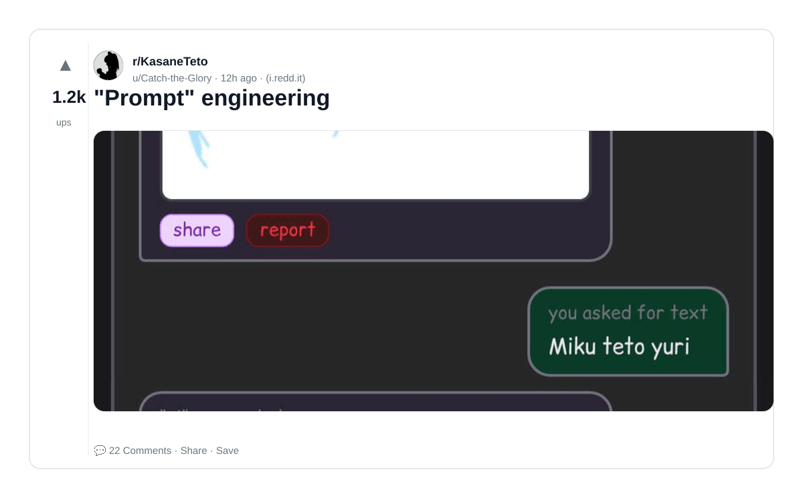
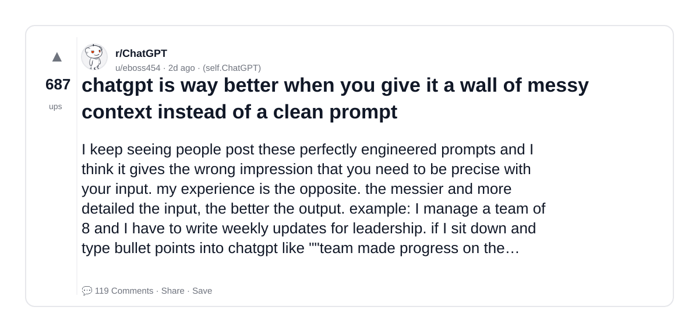
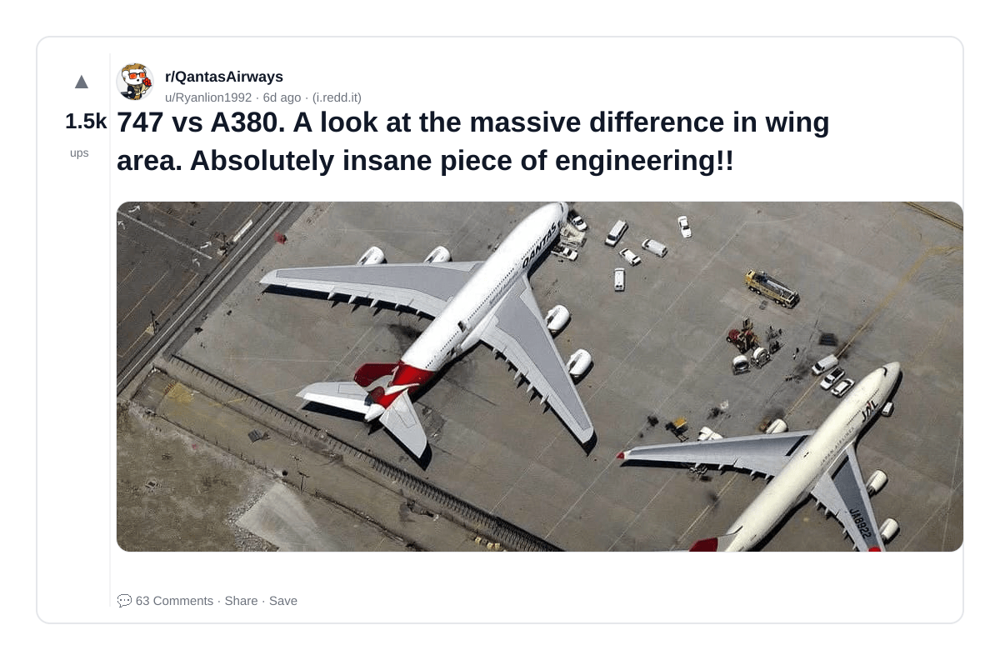

# Reddit Scout — LLM Finetuning vs Prompt Engineering

Run: 2026-03-24T10-52-47-474Z
Started: 2026-03-24T10:52:47.477Z
Output dir: /home/ubuntu/.openclaw/workspace-ce/users/8176450202/reddit-scout/llm-finetuning-vs-prompt-engineering/runs/2026-03-24T10-52-47-474Z

Config: topN=10 | subLimit=10 | kinds=top,hot,rising | time=week | limitPerListing=25
Search: LLM Finetuning vs Prompt Engineering (sort=top t=auto)

## Top terms (from titles + top comments)

- like (4)
- when (3)
- wing (3)
- japanese (3)
- prompt (2)
- engineering (2)
- better (2)
- give (2)
- context (2)
- a380 (2)
- difference (2)
- https (2)
- preview (2)
- redd (2)
- width (2)
- format (2)
- auto (2)
- webp (2)

## Viral content ideas (derived from these posts)

**1. Personal story → timeline + receipts**
- Hook: Hook with 1 line, then a 5-step timeline; end with the lesson and what you would do differently.

**2. My like got automated: what I automated back (tools + workflow)**
- Hook: Turn it into a before/after workflow post. Include exact tool stack + steps.

**3. Checklist: how to stay valuable when when hits your team**
- Hook: A numbered checklist (10 items). Make it practical: skills, portfolio, outreach, proof-of-work.

**4. Hot take: wing isn't the problem — japanese is**
- Hook: Contrarian framing. Back it with 2 examples from the top posts and 1 counterexample.

**5. Debunk thread: "AI will replace prompt" vs what's actually happening**
- Hook: Use 3 claims → 3 rebuttals. Cite specific post patterns: layoffs, hiring freezes, role shifts.

**6. Salary/market reality: engineering vs better roles in 2026 (Reddit signals)**
- Hook: Summarize demand signals from comments: who is struggling, who is fine, why.

**7. "What would you do in 30 days?" layoff recovery plan (day-by-day)**
- Hook: 30-day plan: portfolio, interview loops, networking, mental health. Include a downloadable checklist.

**8. Mini-case study: 1 resume bullet → 1 proof project using give**
- Hook: Show how to convert a vague resume claim into a measurable project + writeup.

**9. Community question: which tasks should *never* be delegated to AI?**
- Hook: Ask + give your own top 5. Encourage replies; add a poll if your platform supports it.

**10. Template post: "I used AI to do X, got Y result, here's the exact prompt"**
- Hook: Make it reproducible: prompt, inputs, outputs, gotchas.

**11. Data post: a quick scorecard of the top threads (ups, comments, ratio) + what it signals**
- Hook: Table or bullets; then 3 takeaways.

**12. Meme angle (if relevant): context vs a380 — job search edition**
- Hook: If your niche is not memes, skip memes; otherwise caption the pattern you saw in comments.

## Top posts (3) + cards

### 1) "Prompt" engineering
- Subreddit: r/KasaneTeto
- Viral score: 213 | Ups: 1162 | Comments: 22 | Upvote ratio: 99%
- Link: https://www.reddit.com/r/KasaneTeto/comments/1s1wczb/prompt_engineering/
- Card (local): ./cards/1s1wczb.png

### 2) chatgpt is way better when you give it a wall of messy context instead of a clean prompt
- Subreddit: r/ChatGPT
- Viral score: 36 | Ups: 687 | Comments: 119 | Upvote ratio: 92%
- Link: https://www.reddit.com/r/ChatGPT/comments/1s0eoqi/chatgpt_is_way_better_when_you_give_it_a_wall_of/
- Card (local): ./cards/1s0eoqi.png

### 3) 747 vs A380. A look at the massive difference in wing area. Absolutely insane piece of engineering!!
- Subreddit: r/QantasAirways
- Viral score: 25 | Ups: 1547 | Comments: 63 | Upvote ratio: 99%
- Link: https://www.reddit.com/r/QantasAirways/comments/1rxju0h/747_vs_a380_a_look_at_the_massive_difference_in/
- Card (local): ./cards/1rxju0h.png

