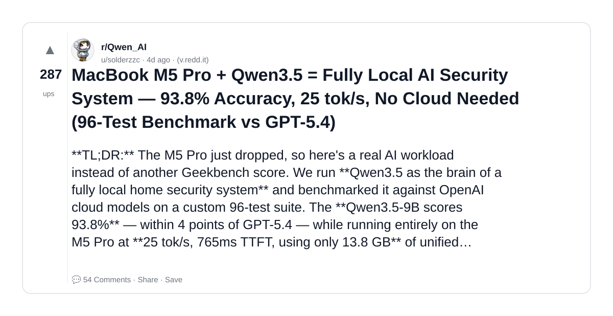
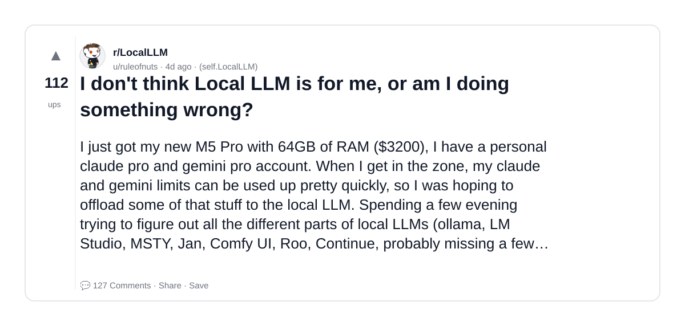
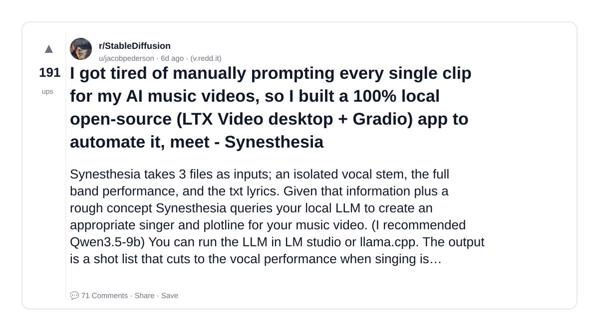
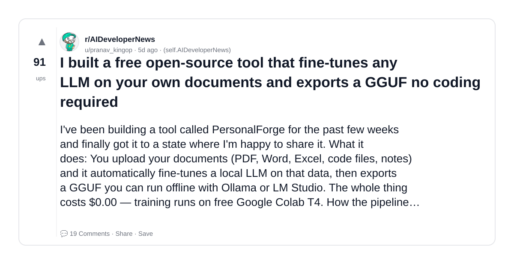
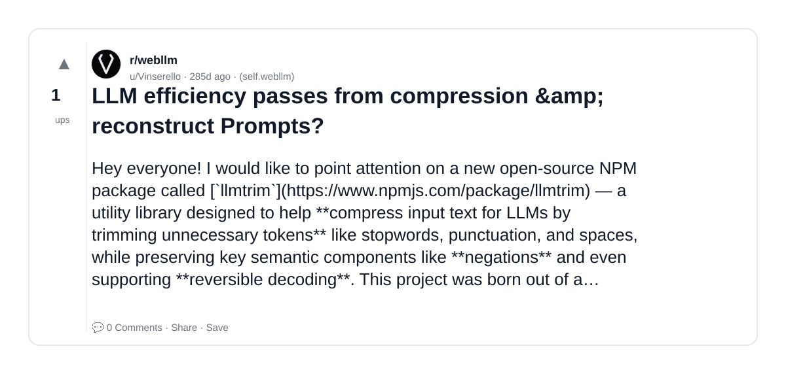
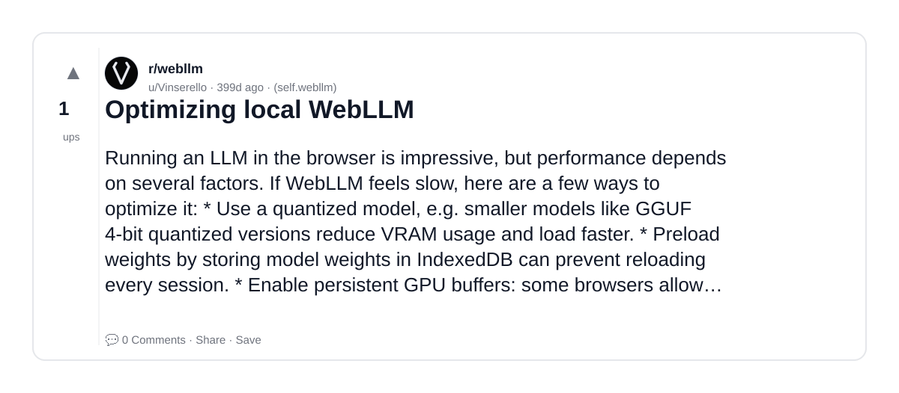

# Reddit Scout — Local LLM

Run: 2026-03-24T12-28-24-725Z
Started: 2026-03-24T12:28:24.726Z
Output dir: /home/ubuntu/.openclaw/workspace-ce/users/8176450202/reddit-scout/local-llm/runs/2026-03-24T12-28-24-725Z

Config: topN=20 | subLimit=12 | kinds=top,hot,rising | time=week | limitPerListing=25
Search: Local LLM (sort=top t=auto)

## Top terms (from titles + top comments)

- models (8)
- local (6)
- like (5)
- prompting (4)
- video (4)
- studio (4)
- code (4)
- model (4)
- will (4)
- qwen3 (3)
- tired (3)
- source (3)
- tool (3)
- work (3)
- chose (3)
- version (3)
- qwen (3)
- other (3)

## Viral content ideas (derived from these posts)

**1. Personal story → timeline + receipts**
- Hook: Hook with 1 line, then a 5-step timeline; end with the lesson and what you would do differently.

**2. My models got automated: what I automated back (tools + workflow)**
- Hook: Turn it into a before/after workflow post. Include exact tool stack + steps.

**3. Checklist: how to stay valuable when local hits your team**
- Hook: A numbered checklist (10 items). Make it practical: skills, portfolio, outreach, proof-of-work.

**4. Hot take: like isn't the problem — prompting is**
- Hook: Contrarian framing. Back it with 2 examples from the top posts and 1 counterexample.

**5. Debunk thread: "AI will replace video" vs what's actually happening**
- Hook: Use 3 claims → 3 rebuttals. Cite specific post patterns: layoffs, hiring freezes, role shifts.

**6. Salary/market reality: studio vs code roles in 2026 (Reddit signals)**
- Hook: Summarize demand signals from comments: who is struggling, who is fine, why.

**7. "What would you do in 30 days?" layoff recovery plan (day-by-day)**
- Hook: 30-day plan: portfolio, interview loops, networking, mental health. Include a downloadable checklist.

**8. Mini-case study: 1 resume bullet → 1 proof project using model**
- Hook: Show how to convert a vague resume claim into a measurable project + writeup.

**9. Community question: which tasks should *never* be delegated to AI?**
- Hook: Ask + give your own top 5. Encourage replies; add a poll if your platform supports it.

**10. Template post: "I used AI to do X, got Y result, here's the exact prompt"**
- Hook: Make it reproducible: prompt, inputs, outputs, gotchas.

**11. Data post: a quick scorecard of the top threads (ups, comments, ratio) + what it signals**
- Hook: Table or bullets; then 3 takeaways.

**12. Meme angle (if relevant): will vs qwen3 — job search edition**
- Hook: If your niche is not memes, skip memes; otherwise caption the pattern you saw in comments.

## Top posts (6) + cards

### 1) MacBook M5 Pro + Qwen3.5 = Fully Local AI Security System — 93.8% Accuracy, 25 tok/s, No Cloud Needed (96-Test Benchmark vs GPT-5.4)
- Subreddit: r/Qwen_AI
- Viral score: 7 | Ups: 287 | Comments: 54 | Upvote ratio: 99%
- Link: https://www.reddit.com/r/Qwen_AI/comments/1ryoaub/macbook_m5_pro_qwen35_fully_local_ai_security/
- Card (local): ./cards/1ryoaub.png

### 2) I don't think Local LLM is for me, or am I doing something wrong?
- Subreddit: r/LocalLLM
- Viral score: 6 | Ups: 112 | Comments: 127 | Upvote ratio: 88%
- Link: https://www.reddit.com/r/LocalLLM/comments/1rz20yj/i_dont_think_local_llm_is_for_me_or_am_i_doing/
- Card (local): ./cards/1rz20yj.png

### 3) I got tired of manually prompting every single clip for my AI music videos, so I built a 100% local open-source (LTX Video desktop + Gradio) app to automate it, meet - Synesthesia
- Subreddit: r/StableDiffusion
- Viral score: 3 | Ups: 191 | Comments: 71 | Upvote ratio: 89%
- Link: https://www.reddit.com/r/StableDiffusion/comments/1rx1w7d/i_got_tired_of_manually_prompting_every_single/
- Card (local): ./cards/1rx1w7d.png

### 4) I built a free open-source tool that fine-tunes any LLM on your own documents and exports a GGUF no coding required
- Subreddit: r/AIDeveloperNews
- Viral score: 1 | Ups: 91 | Comments: 19 | Upvote ratio: 100%
- Link: https://www.reddit.com/r/AIDeveloperNews/comments/1rxo4fp/i_built_a_free_opensource_tool_that_finetunes_any/
- Card (local): ./cards/1rxo4fp.png

### 5) LLM efficiency passes from compression &amp; reconstruct Prompts?
- Subreddit: r/webllm
- Viral score: 0 | Ups: 1 | Comments: 0 | Upvote ratio: 100%
- Link: https://www.reddit.com/r/webllm/comments/1l9oo08/llm_efficiency_passes_from_compression/
- Card (local): ./cards/1l9oo08.png

### 6) Optimizing local WebLLM
- Subreddit: r/webllm
- Viral score: 0 | Ups: 1 | Comments: 0 | Upvote ratio: 100%
- Link: https://www.reddit.com/r/webllm/comments/1is8n67/optimizing_local_webllm/
- Card (local): ./cards/1is8n67.png

